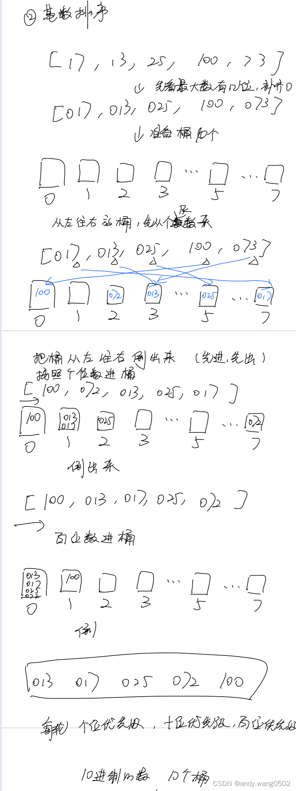

### 9、基数排序

**时间复杂度：** `O(N*K)`

**空间复杂度：** `O(N+K)`

**稳定性：** 稳定

**算法步骤：**

将整数按位数切割成不同的数字，然后按每个位数分别比较。



```js
var counter = [];
function radixSort(arr, maxDigit) {
  var mod = 10;
  var dev = 1;
  for (var i = 0; i < maxDigit; i++, dev *= 10, mod *= 10) {
    for (var j = 0; j < arr.length; j++) {
      var bucket = parseInt((arr[j] % mod) / dev);
      if (counter[bucket] == null) {
        counter[bucket] = [];
      }
      counter[bucket].push(arr[j]);
    }
    var pos = 0;
    for (var j = 0; j < counter.length; j++) {
      var value = null;
      if (counter[j] != null) {
        while ((value = counter[j].shift()) != null) {
          arr[pos++] = value;
        }
      }
    }
  }
  return arr;
}
```
