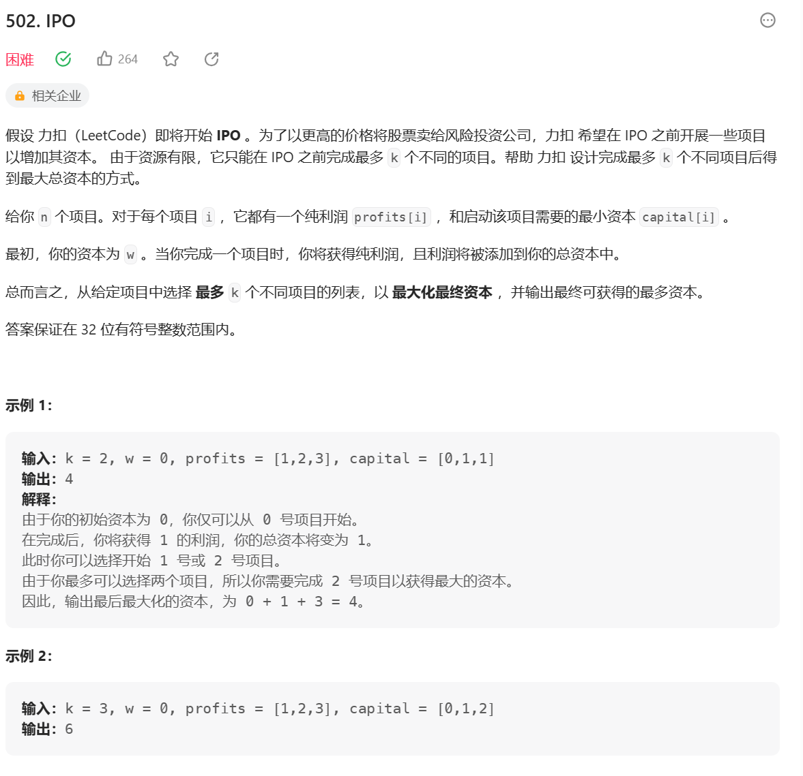

### 前缀树
何为前缀树? 如何生成前缀树?
例子: 一个字符串类型的数组arr1，另一个字符串类型的数组arr2。arr2中有哪些字符，是arr1中
出现的？请打印。arr2中有哪些字符，是作为arr1中某个字符串前缀出现的？请打印。arr2
中有哪些字符，是作为arr1中某个字符串前缀出现的？请打印 arr2中出现次数最大的前缀


**思路：**
1. 将字符放在edge上，用长度为26的数组记录可能出现的字符，根据字符的code值判断在数组中的位置
2. 记录字符路过的数量p和以当前字符为结尾的个数e
```js
/**
 * Initialize your data structure here.
 */
var Trie = function() {
    this.p = 0;
    this.e = 0;
    this.next = Array.from({length: 26});
};

/**
 * Inserts a word into the trie. 
 * @param {string} word
 * @return {void}
 */
Trie.prototype.insert = function(word) {
    if (word === null) return;
    let arr = word.split('')
    let node = this;
    let index = 0;
    node.p++
    for (let i = 0; i < arr.length; i++) {
        index = arr[i].charCodeAt() - 'a'.charCodeAt();
        if (!node.next[index]) {
            node.next[index] = new Trie();
        }
        node = node.next[index]
        node.p++
    }
    node.e++
};

/**
 * Returns if the word is in the trie. 
 * @param {string} word
 * @return {boolean}
 */
Trie.prototype.search = function(word) {
    if (word === null) return true;
    let arr = word.split('');
    let node = this;
    let index = 0;

    for (let i = 0; i < arr.length; i++) {
        index = arr[i].charCodeAt() - 'a'.charCodeAt();
        if (!node.next[index]) {
            return false;
        }
        node = node.next[index];
    }
    if (node.e === 0) return false
    return true
};

/**
 * Returns if there is any word in the trie that starts with the given prefix. 
 * @param {string} prefix
 * @return {boolean}
 */
Trie.prototype.startsWith = function(prefix) {
     if (prefix === null) return true;
    let arr = prefix.split('');
    let node = this;
    let index = 0;

    for (let i = 0; i < arr.length; i++) {
        index = arr[i].charCodeAt() - 'a'.charCodeAt();
        if (!node.next[index]) {
            return false;
        }
        node = node.next[index];
    }
    return true
};

/**
 * Your Trie object will be instantiated and called as such:
 * var obj = new Trie()
 * obj.insert(word)
 * var param_2 = obj.search(word)
 * var param_3 = obj.startsWith(prefix)
 */
```

### 贪心算法
在某一个标准下，优先考虑最满足标准的样本，然后考虑最不满足的样本，最终得到一个答案的算法，叫做贪心算法。
即不从整体最优上加以考虑，所做出的是在某种意义上的**局部最优解**

**解题套路：**

1. 实现一个不依靠贪心策略的解法x，可以用最暴力的尝试

2. 脑补出贪心策略

3. 用解法X和对数器，验证每一个贪心策略，用实验得到正确解

**会议安排**
一些项目要占用一个会议室宣讲，会议室不能同时容纳俩个项目，给出项目的起始时间和截止时间，如何安排最多的项目。

**策略：截止时间早**
以截至时间排序，选择截至时间在前的会议。每当选择一个会议时，以这个会议的end为时间点判断接下来的会议是否满足条件

```ts
function Program(start, end) {
    this.start = start;
    this.end = end;
}

function bestArrange(program: Program[], start = 0) {
    program.sort((a,b) => a.end  - b.end)
    let result = 0;
    for (let i = 0; i < program.length; i++) {
        if (program[i].start >= start) {
            result++
            start = program[i].start
        }
    }
    console.log(program)
    return result
}
```

**IPO**

给定初始资金和最多做几个项目，最大化资本

先给定一个花费组织排序的小根堆，锁住，在给定一个大根堆，以利润组织

```js
class Heap {
    constructor(cmp = (x,y) => x > y) {
        this.heap = []
        this.cmp = cmp
    }
    insert(data) {
        const {heap, cmp, swap} = this
        heap.push(data)
        let index = this.size() - 1
        while (index) {
            let parentIndex = (index-1)>>1
            if (!cmp(heap[index], heap[parentIndex])) return 
            swap(heap, index, parentIndex)
            index = parentIndex
        } 
    }
    pop() {
        const {heap, swap} = this
        if (!this.size()) {
            return null;
        }
        swap(heap, 0, this.size() - 1)
        let res = heap.pop();

        let len = this.size()
        // 有可能没有右孩子但是又左孩子，所以以左孩子进行判断
        let index = 0, left = index * 2 + 1

        while (left < len) {
            let largestIndex = left + 1 < len && heap[left + 1] > heap[left] ? left + 1 : left
            if (this.cmp(heap[index], heap[largestIndex])) {
                break 
            }
            swap(heap, index, largestIndex)
            index = largestIndex
            left = index * 2 + 1
        }


        return res
    }
    swap(arr, i, j) {
        [arr[i], arr[j]] = [arr[j], arr[i]]
    }
    size() {
        return this.heap.length
    }
    peak() {
        return this.heap[0]
    }
    isEmpty() {
        return !this.heap.length
    }
}
var findMaximizedCapital = function(k, w, profits, capital) {
    let n = capital.length
    let minCosts = []
    let maxProfit = new Heap()
    for (let i = 0; i < n; i++) {
        minCosts.push([profits[i], capital[i]])
    }
    minCosts.sort((a, b) => a[1] - b[1])
    let curr = 0
    for (let i = 0; i < k; i++) {
        while (curr <  n && minCosts[curr][1] <= w) {
            maxProfit.insert(minCosts[curr++][0])
        }
        if (!maxProfit.size()) {
            return w
        }
        w += maxProfit.pop()
    }
    return w
};
```

**取中位数**

一个数据流中，随时可以取得中位数

先给一个数字，放入大根堆的堆顶；第二个数字cur是否小于等于大根堆顶，是，cur入大，不是，入小；接着看大根堆和小根堆的size，如果size差距大于等于2，则较大的那个堆顶弹出进另外一个。

```js

```