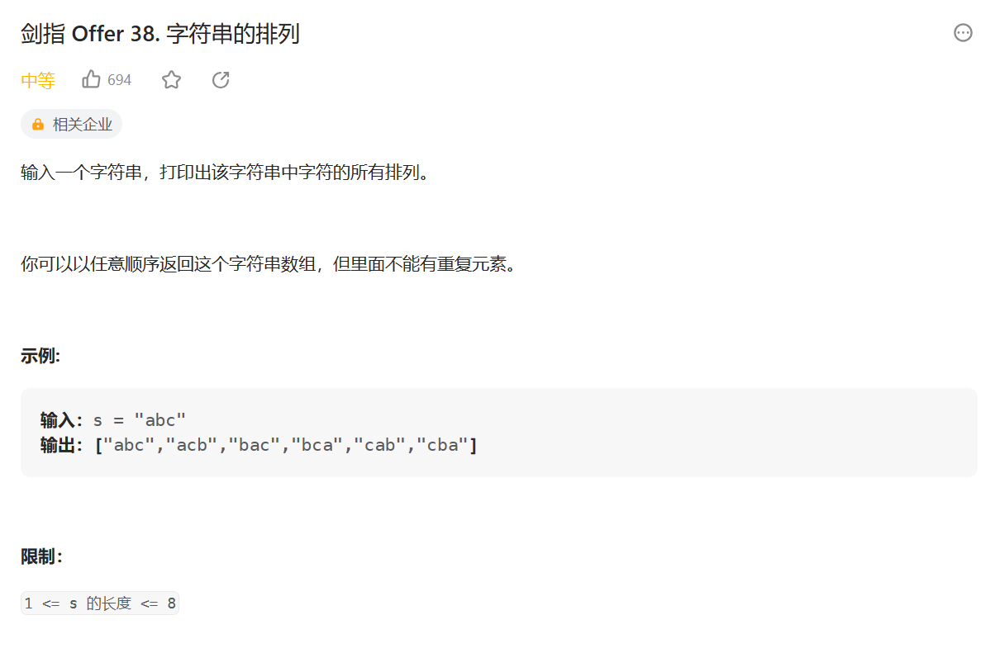

### Dijkstra 算法改进（堆加速）

一个优化 -> 在选择我们没有处理过且值最小的节点的时候是遍历的方式，可以使用堆结构来存储，然后每次就是存还没处理的，最小值的在堆顶，然后处理过的让他别参加堆结构

但是有一个问题，因为我们那些 values 是存从 source 到每个节点最小的 weight, 所以可能哪次遍历中我们会把一个堆结构中一个节点的值改了改成了一个更小的值，我们知道系统提供的堆结构无法接收让我们改变里面已经在的节点 (你要是硬改，系统里面自己做出的操作其实就跟我们直接遍历的复杂度都差不多了 —> 他需要全局扫描), 所以要是想实现，必须我们自己写一个堆

## 暴力递归

### n 层汉诺塔


**思路：**

-   将柱子抽象为 from、同、other 三个栈
-   将 i 个圆盘从 from 移动到 to 上可拆解为三步：
    1. 将 1 到 i-1 个圆盘移动到 other
    2. 将第 i 个圆盘移动到 to
    3. 将 1 到 i-1 个圆盘移动到 to
    4. 其中第一和第三步递归主函数
-   base case 只剩最后一个直接移动

```js
var hanota = function(A, B, C) {
    process(A, C, B, A.length)
    return C
};

function process(from, to, other, i) {
    if (i === 1) {
        // base case 只剩最后一个直接移动
        to.push(from.pop())
        return 
    }
    // 将 1 到 i-1 个圆盘移动到 other
    process(from, other, to, i - 1)
    // 将第 i 个圆盘移动到 to
    to.push(from.pop())
    // 将 1 到 i-1 个圆盘移动到 to
    process(other, to, from, i - 1)
}
```
### 字符串的全部子序列

打印一个字符串全部子序列，包括空字符串

-   记录前 i-1 个字符的全部子序列
-   分第 i 个字符加入子序列和不加入子序列

### 字符串的全排列



**思路：**
- 1到i-1位置已经全排列
- 遍历第i位置后的所有字符，放在第i位置