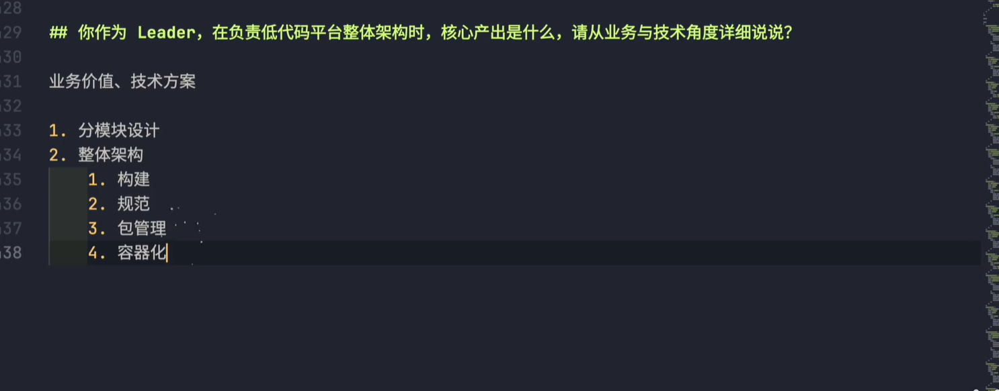
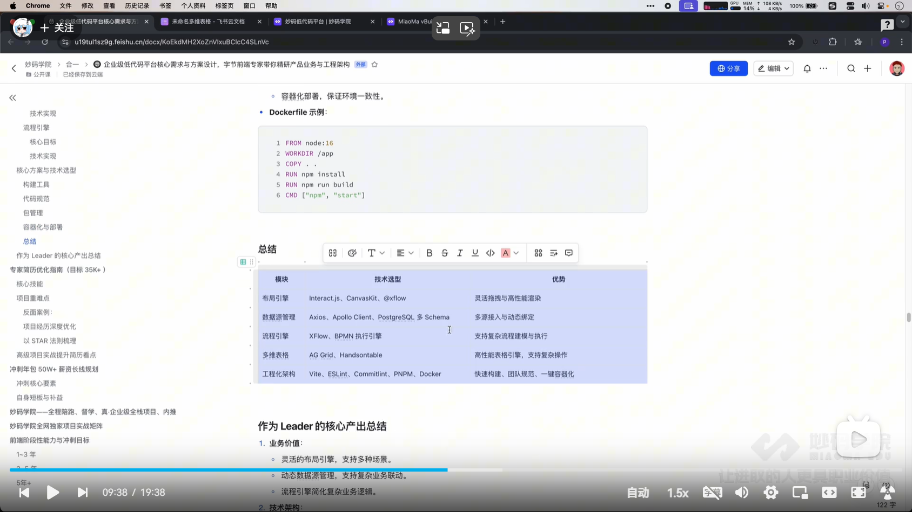

### 项目经历

- 项目经历
- 项目重难点
- 所承担的角色
- 调研方案
- 最后做的怎么样、产出的成果

#### 低代码开发平台


#### layout-engine 布局引擎

1. 分类
   1. grid
   2. flex
   3. canvas
   4. block
2. 应用场景
   1. 管理后台 CRM、ERP
   2. 仪表盘
   3. 表单

#### meterial-renderer

基础功能

1. 渲染方式
2. 组件渲染
3. 事件处理
4. 数据绑定
5. 设备兼容
6. 主题定制
   1. 样式 token
   2. 样式消费

#### online-database-sdk

1. canvans table
2. 类似于飞书多维表格，字段管理、单元格交互（CellEditor、CellRenderer）
3. 表设计
4. 外部数据连接

#### 低代码平台主要业务场景

1. 企业内部系统
1. 报表、运营后台、审批
1. 通过多种模板，快速搭建系统
1. 业务自动化系统
1. 订单处理、通知系统
1. 流程引擎和自动化为核心，减少人员干预
1. C 端产品
1. 活动页、落地页
1. 设计类工具软件
1. figma ai

## 详细说说低代码平台核心模块对应方案的选择以及架构实现， 包含布局引擎、渲染引擎、数据源、流程引擎等

### layout-engine

#### Flex 布局

类似于我们传统写代码 flex 布局的方式，兼顾灵活和易用

- Figma outlayout
- 妙码低代码平台

#### BLock 布局

从上往下布局，相对灵活度比较低
简单的无代码平台

#### Grid 布局

参照格子点来布局

- 仪表盘
- 可视化大屏

#### Canvas 布局

一般在设计类软件居多，100%灵活的布局方式

- 海报类编辑器
- 设计类软件

### material-renderer

平台特定语言设计 DSL （Domain Specific Language），JSONSchema，平台低代码数据存储格式为 JSON

为了性能考虑，拆分为框架结构 json 和内容数据 json

blockTree 框架结构 json 树形结构

```js
[
  {
    id: "block-1",
    type: "container",
    children: [
      {
        id: "text-1",
        type: "text",
        text: "hello world",
      },
    ],
  },
];
```

blockData 内容数据 json Map 对象

#### 数据存储时的优化考虑

1. 增量更新，操作变换 OT，json patch （增、删、改、移动 - update op）
2. 可视区渲染

### online-database-sdk

1. canvans table
2. 数据消费逻辑 （数据源生成接口）
   1. Query 模块进行消费 （在前端实现一个 sql 查询编辑器）
   2. 变量（接口绑定后的数据变量）






作为 Leader 的核心产出总结
1. 产物沉淀
   1. 布局引擎
   2. 渲染引擎
   3. 数据源
   4. 流程引擎
2. 业务价值:
灵活的布局引擎，支持多种场景。
动态数据源管理，支持复杂业务联动。
流程引擎简化复杂业务逻辑。
3. 技术架构:
模块化设计，支持不同功能解耦。
可扩展性强，支持未来新增功能。物料通过插件化体系组织，支持灵活横向拓展。
高性能渲染机制与缓存机制。1

## 你们低代码平台的物料是怎么管理的，远程物料是怎么加载的，请详细说明核心流程与方案
插件化设计
并不陌生，webpack、eslint、vue、babel、vite，都有插件化的身影
## 前置知识:插件化设计
plugins:
vue()
splitChunk()
react

插件化基座
插件化协议
插件生命周期
插件开发plugin
### 具体模块化定义
物料首先要取名，Button、Image、Text、Container
ButtonPlugin
ImagePlugin
TextPlugin
ContainerPlugin

物料最重要的两个东西是什么?
- 数据协议，json 数据
- 物料渲染引擎

```json
{
  "name": "Button",
  "type": "button",
  "props": {
    "text": "按钮",
    "type": "primary",
    "size": "medium",
    "disabled": false,
  },
}
```

##### 渲染引擎
组件，用来将 json 数据渲染成页面内容
Renderer，通过策略模式来负责数据转化加工、数据到组件的传递、组件渲染

### 插件化设计在物料管理中的应用
我现在有一个计算器，科学计算器、四则运算计算器、房贷利率计算器、个人所得税计算器
我们实现之初只设计计算器底座
计算 calculate
运算的规则，抽象出来，加法+【(AddRule)、减法-【(SubRule〗除法(DivRule〗、乘法(MultiRule)