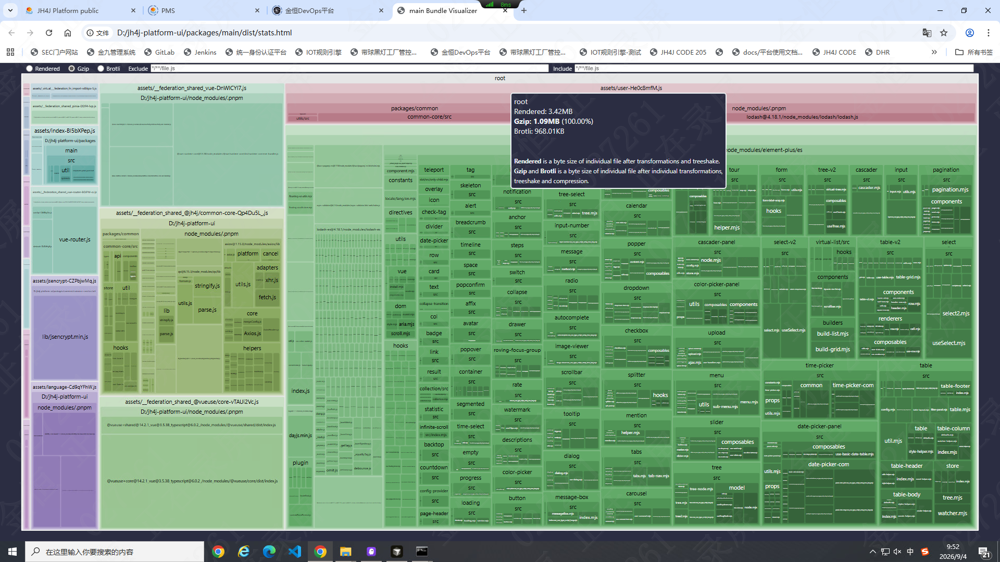
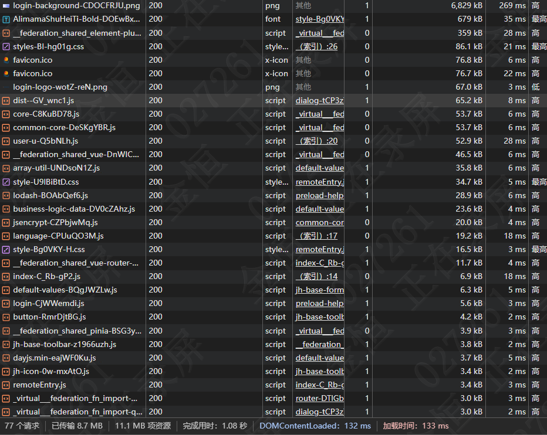

## Vite打包优化分析

安装插件
```bash
pnpm add rollup-plugin-visualizer -D
```





### 优化方案

1. 图片优化 -使用webp格式并压缩图片(tinypng) 8829kb -> 99.8kb
2. 字体优化 - 使用字体子集(fontsubset)拆分首屏使用的字体，剩余fallback字体 prefetch加载
    - 添加prebuild脚本统计首屏需要的汉字，使用subset-font拆分字体包
    - 用js动态添加link prefetch加载剩余字体
3. 优化依赖导入 - 禁止深入包的内部导入，从包的入口文件导入方法 '@jh4j/common-core/src/xxx' 改为 '@jh4j/common-core'。并添加prebuild脚本限制只能导入入口文件