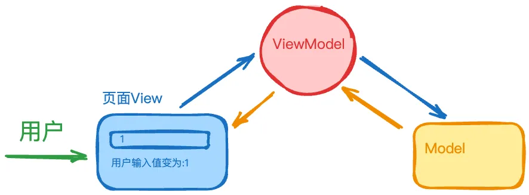
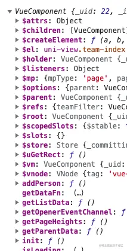
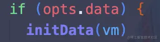
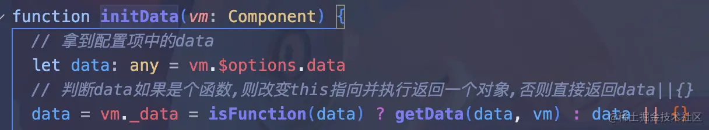

# vue2

## 1、 什么是 MVVM
**MVVM（Model-View-ViewModel）** 是一种用于构建用户界面的架构模式，用于现代的前端开发框架（Vue、Angular）。它通过 **数据绑定** 和 **视图模型** 提供了高效的 UI 更新和数据同步机制。

MVVM 模式主要由 `Model` （模型）、 `View` （视图）、 `ViewModel` （视图模型）三个部分组成。
::: details 详情
- `Model` 表示程序的核心数据和业务逻辑，它不关心用户界面，只负责数据的获取、存储和处理，并提供与外界交互的接口。
- `View` 负责展示数据和用户交互，简单来说他就是我们看到的UI 组件或 HTML 页面。
- `ViewModel` 是连接 `View` 和 `Model` 的桥梁，它不直接操作视图或模型，而是通过数据绑定将两者连接起来。
参考下面的示例代码：
```vue
<template>
  <div id="app">
    <!-- 输入框绑定 message -->
    <input v-model="message" />
    <!-- 显示计算属性 computedValue -->
    <p>{{ computedValue }}</p>
  </div>
</template>

<script>
export default {
  data() {
    return {
      message: 'Hello, MVVM!' // 定义数据模型
    };
  },
  computed: {
    // 定义计算属性
    computedValue() {
      return '用户输入值变为: ' + this.message;
    }
  }
};
</script>
```
上述代码展示了一个输入框，当用户输入内容的时候，输入框下面的计算值会随之变化。在这个示例中， `message` 变量属于 `Model` ，它包含了应用的核心数据。输入框与页面展示就属于 `View`，负责展示数据和用户交互。 `computed` 和 `v-model` 语法糖 作为 `ViewModel` ，用于更新视图和数据。


:::

## 2、 vue 中 v-if 和 v-show 的区别是什么
- v-if 是一个条件渲染指令，当条件为真时，它将渲染元素，否则它将移除元素。
- v-show 是一个条件渲染指令，它将元素通过 `display` 显示或隐藏，而不会移除它。
::: details 详情
|​特性|​v-if|​v-show|
|---|------|------|
|​渲染方式|`惰性渲染`：条件为 true 时渲染元素，条件为 false 时从 DOM 中移除元素。|`始终渲染`：始终将元素渲染到 DOM 中，通过 display 样式控制显示或隐藏。|
|​性能开销|较大：每次条件变化时，都会重新渲染或销毁元素。适用于条件不频繁变化的场景。|较小：元素始终保留在 DOM 中，仅通过 display 属性控制显示状态。适用于条件频繁变化的场景。
|​适用场景|条件判断不频繁变化，或需要完全销毁和重建 DOM 元素的场景。例如，根据条件加载某个组件或列表项。|条件频繁变化的场景，如切换标签、菜单等。不需要频繁销毁和创建 DOM 元素，效率更高。|
|​初始渲染|初始渲染时，如果条件为 false，元素不会被渲染到 DOM 中。|初始渲染时，无论条件如何，元素始终会被渲染到 DOM 中，只是通过 display: none 隐藏。|
|​内存开销|较大：由于频繁销毁和重建 DOM 元素，内存开销较大，特别是在频繁切换的情况下。|较小：仅控制元素的显示状态，不涉及频繁的 DOM 操作，内存开销较小，适合频繁切换的场景。|

- 永远不要把 v-if 和 v-for 同时用在同一个元素上，带来性能方面的浪费（每次渲染都会先循环再进行条件判断）。
- 如果避免出现这种情况，则在外层嵌套template（页面渲染不生成dom节点），在这一层进行v-if判断，然后在内部进行v-for循环或者先使用 computed 进行处理后渲染。
:::

## 3、 vue 中 v-model 是什么
v-model 是一个语法糖，它主要用于表单元素（也可以用于 div 上，但是并没有什么意义）上，实现双向数据绑定。

在内部，v-model 实际上是以下两个操作的简写：
- 使用 v-bind 将数据属性绑定到表单元素的 value 属性上。
- 使用 v-on 监听表单元素的输入事件，并在事件触发时更新数据属性的值。
``` vue
<!-- 原生元素 -->
<input v-model="searchText" />
<!-- 在代码背后，模板编译器会对 v-model 进行更冗长的等价展开。因此上面的代码其实等价于下面这段 -->
<input :value="searchText" @input="searchText = $event.target.value" />
```

## 4、 vue 中 computed 的原理是什么
computed 属性是一个特殊的属性，它允许你定义一个计算属性，该计算属性的值会根据其依赖项的值进行计算。当依赖项的值发生变化时，计算属性的值也会自动更新。computed 属性通过响应式依赖追踪和缓存机制，提供了一种高效且便捷的方式来处理依赖于其他数据的状态。
::: details 详情
要讲清楚，computed 原理，首先得讲vue响应式原理，因为 computed 的实现是基于 `Watcher` 对象的。 那么 vue 的响应式原理是什么，众所周知，vue2 是基于 `Object.defineProperty` 实现监听的。在 vue 初始化数据 data 和 computed 数据过程中。会涉及到以下几个对象：
- Observe 对象
- Dep 对象
- Watch 对象 

Observe 对象是在 data 执行响应式时候调用，因为 computed 属性基于响应式属性，所以其不需要创建 Observe 对象。 Dep 对象主要功能是做依赖收集，有个属性维护多个 Watch 对象，当更新时候循环调用每个 Watch 执行更新。 Watch 对象主要是用于更新，而且是收集的重点对象。

这里谈到 computed 计算属性，首先要知道，其有两种定义方式，一种是方法，另一种是 get，set 属性。而且，其内部监听的对象必须是已经定义响应式的属性。

vue 在创建 computed 属性时候，会循环所有计算属性，每一个计算属性会创建一个 watch，并且在通过 defineProperty 定义监听，在 get 中，计算属性工作是做依赖收集，在 set 中，计算属性重要工作是重新执行计算方法，这里需要多补充一句，因为computed 是懒执行，也就是说第一次初始化之后，就不会执行计算，下一次变更执行重新计算是在 set 中。

另一个补充点是依赖收集的时机，computed 收集时机和 data 一样，是在组件挂载前，但是其收集对象是自己属性对应的 watch，而data 本身所有数据对应一个 watch。
```js
// 这是 computed 源码
function initComputed(vm: Component, computed: Object) {
  // 禁用Flow类型检查的注释（Flow是JavaScript的静态类型检查工具）
  // $flow-disable-line
  const watchers = (vm._computedWatchers = Object.create(null));
  
  // 判断是否在服务器端渲染（SSR）环境中
  const isSSR = isServerRendering();
 
  // 遍历computed对象中的所有属性
  for (const key in computed) {
    const userDef = computed[key];
    
    // 获取getter函数，如果userDef是函数则直接使用，否则尝试获取userDef.get
    const getter = typeof userDef === "function" ? userDef : userDef.get;
    
    // 在非生产环境下，如果getter未定义，则发出警告
    if (process.env.NODE_ENV !== "production" && getter == null) {
      warn(`计算属性 "${key}" 缺少 getter 函数。`, vm);
    }
 
    // 如果不是在服务器端渲染环境中
    if (!isSSR) {
      // 为计算属性创建内部的Watcher实例，用于依赖追踪和缓存更新
      watchers[key] = new Watcher(
        vm,
        getter || noop,          // getter函数，如果不存在则使用空操作函数
        noop,                    // setter函数，计算属性默认没有setter，使用空操作函数
        computedWatcherOptions   // 计算属性专用的Watcher选项
      );
    }
 
    // 如果该计算属性尚未在组件实例上定义
    if (!(key in vm)) {
      // 在组件实例上定义计算属性
      defineComputed(vm, key, userDef);
    } else if (process.env.NODE_ENV !== "production") {
      // 在非生产环境下，如果计算属性与data中的属性同名，则发出警告
      if (key in vm.$data) {
        warn(`计算属性 "${key}" 已经在 data 中定义。`, vm);
      } 
      // 如果计算属性与props中的属性同名，则发出警告
      else if (vm.$options.props && key in vm.$options.props) {
        warn(
          `计算属性 "${key}" 已经被定义为 prop。`,
          vm,
        );
      }
    }
  }
}
```
计算属性默认是`只读`的，只有 `getter`，不过在需要时你也可以提供一个 setter：
```js
computed: {
  fullName: {
    // getter
    get: function () {
      return this.firstName + ' ' + this.lastName
    },
    // setter
    // 修改依赖的数据后，依赖于这些数据的 computed 属性会在需要时自动重新计算（即 getter 会被重新执行），但这是由 Vue 的响应式系统自动处理的，而不是 setter 直接触发的重置。
    // 可以把它看作是一个“临时快照”，每当源状态发生变化时，就会创建一个新的快照。
    set: function (newValue) {
      var names = newValue.split(' ')
      this.firstName = names[0]
      this.lastName = names[names.length - 1]
    }
  }
}
```
:::

## 5、 vue 中 watch 的原理是什么
watch 属性是一个特殊的属性，它允许你定义一个观察器，该观察器会监控一个或多个数据属性的变化，并在数据属性发生变化时执行相应的回调函数。watch 属性通过响应式依赖追踪和回调机制，提供了一种高效且便捷的方式来处理
::: details 详情
watch 的实现原理与 computed 类似，都是基于 Vue 的响应式系统，通过 `Watcher` 对象实现依赖追踪和回调机制。以下是具体原理：
- 依赖响应式系统
  > Vue 的响应式系统是基于 `Object.defineProperty` 实现的。当 data 中的属性被修改时，会触发对应的 setter，从而通知依赖该属性的 Watcher 对象。

- 创建 Watcher
  > 当定义 watch 时，Vue 会为每个 watch 属性创建一个 Watcher 实例。这个 Watcher 会订阅所监控的属性（即依赖），并在属性变化时触发回调函数。

- 依赖收集
  > 在 watch 初始化时，Watcher 会读取所监控的属性值，从而触发该属性的 getter，并将 Watcher 添加到该属性的依赖列表中（由 Dep 管理）。

- 属性变化通知
  > 当监控的属性发生变化时，会触发其 setter，setter 会通知依赖列表中的所有 Watcher，从而执行 watch 的回调函数。
:::

## 6、 vue 中 watch 和 computed 的区别
watch 是 Vue 中用于监听数据变化并执行副作用的机制，而 computed 是基于依赖数据动态计算并缓存结果的响应式属性。
::: details 详情
|​特性|Computed（计算属性）​|​Watch（监听器）​|
|---|--------|--------|
|​用途|根据现有响应式数据计算并返回新的值，常用于派生数据。|监听特定数据的变化，并在变化时执行相应的操作或副作用。|
|​缓存机制|具有缓存功能，只有当依赖的数据变化时才重新计算，否则使用缓存的值。|没有缓存，每次监听的数据变化时都会执行回调函数。|
|​数据流|​只读​（默认情况下）。可以通过定义 setter 来实现可写。|​可读写，通过回调函数可以读取和修改数据。|
|​适用场景|派生数据，如根据 firstName 和 lastName 计算 fullName、需要缓存结果以提高性能的场景。|在数据变化时执行异步操作，如发送请求、执行复杂的逻辑或副作用，如手动 DOM 操作、监听特定数据变化并执行特定操作。|
|​声明方式|在 computed 对象中定义计算属性，通常是一个返回值的函数，可以有 getter 和可选的 setter。|在 watch 对象中定义监听器，可以是一个回调函数或配置对象（包含 handler、immediate、deep 等选项）。|
|自动 vs 手动|​自动计算并响应依赖的变化，开发者无需手动触发。​|​手动执行回调函数，开发者需要定义在数据变化时需要执行的逻辑。​|
|​性能|由于缓存机制，适用于频繁访问但不常变化的数据，性能较好。|每次数据变化都会触发回调，如果回调函数复杂或频繁触发，可能影响性能。需谨慎使用，尤其是在大型应用中。|
:::

## 7、 vue 中 computed 和 方法 的区别
- computed 计算属性值会基于其响应式依赖被缓存。一个计算属性仅会在其响应式依赖更新时才重新计算。
- 方法调用总是会在重渲染发生时再次执行函数。
  > 为什么需要缓存呢？想象一下我们有一个非常耗性能的计算属性 list，需要循环一个巨大的数组并做许多计算逻辑，并且可能也有其他计算属性依赖于 list。没有缓存的话，我们会重复执行非常多次 list 的 getter，然而这实际上没有必要！如果你确定不需要缓存，那么也可以使用方法调用。

## 8、 vue 中生命周期钩子函数
生命周期钩子函数是 Vue 组件的几个重要阶段，它们在组件的创建、更新和销毁时触发，允许开发者在特定的阶段执行特定的代码逻辑。以下是 Vue的生命周期钩子函数及其触发时机：
|​钩子函数|触发时机|
|---|---|
|`beforeCreate`|组件实例创建之前，在数据观测(data observer) 和 event/watcher 事件配置之前。|
|`created`|组件实例已经创建完成，数据观测(data observer) 和 event/watcher 事件配置已经完成。|
|`beforeMount`|组件挂载开始之前，在 render 函数中，对组件的 template 进行编译，但是还没有挂载到 DOM 上。|
|`mounted`|组件挂载结束之后，模板编译完成，挂载到 DOM 上。|
|`beforeUpdate`|组件更新之前，在 render 函数中，对组件的 template 进行编译，但是还没有挂载到 DOM 上。|
|`updated`|组件更新完成，模板编译完成，挂载到 DOM 上。|
|`beforeDestroy`|组件销毁之前，在调用 unmounted 之前。|
|`destroyed`|组件销毁完成，调用 unmounted 之后。|
|`activated`|keep-alive 组件激活时调用。|
|`deactivated`|keep-alive 组件停用时调用。|
|`errorCaptured`（2.5.0+ 新增）|在捕获一个来自后代组件的错误时被调用。|

## 9、 vue 中父子组件生命周期调用顺序
父 beforeCreate → 父 created → 子 beforeCreate → 子 created → 子 beforeMount → 子 mounted → 父 mounted → 父 beforeUpdate → 子 beforeUpdate → 子 updated → 父 updated → 父 beforeDestroy → 子 beforeDestroy → 子 destroyed → 父 destroyed
::: details 详情
1️⃣ 创建阶段

- 父组件：beforeCreate ➡️ created
- 子组件：beforeCreate ➡️ created
- 顺序： 父组件的 beforeCreate 和 created 先执行 ，子组件的 beforeCreate 和 created 后执行。
- 原因：父组件需要先完成自身的初始化（如 data、computed 等），才能解析模板中的子组件并触发子组件的初始化。

2️⃣ 挂载阶段

- 父组件：beforeMount
- 子组件：beforeMount ➡️ mounted
- 父组件：mounted
- 顺序： 父 beforeMount → 子 beforeCreate→ 子 created→ 子 beforeMount→ 子 mounted → 父 mounted
- 原因：父组件在挂载前（beforeMount）需要先完成子组件的渲染和挂载，因为子组件是父组件模板的一部分。只有当所有子组件挂载完成后，父组件才会触发自身的 mounted。

3️⃣ 更新阶段

- 父组件：beforeUpdate
- 子组件：beforeUpdate ➡️ updated
- 父组件：updated
- 顺序： 父 beforeUpdate → 子 beforeUpdate → 子 updated → 父 updated
- 原因：父组件的数据变化会触发自身更新流程，但子组件的更新必须在父组件更新前完成（因为子组件可能依赖父组件的数据），最终父组件的视图更新完成。

4️⃣ 销毁阶段

- 父组件：beforeDestroy
- 子组件：beforeDestroy ➡️ destroyed
- 父组件：destroyed
- 顺序： 父 beforeDestroy → 子 beforeDestroy → 子 destroyed → 父 destroyed
- 原因：父组件销毁前需要先销毁所有子组件，确保子组件的资源释放和事件解绑，避免内存泄漏。
::: tip 注
vue3 中，`setup()` 替代了 `beforeCreate` 和 `created`，但父子组件的生命周期顺序不变。
:::

## 10、 vue 中为什么data属性是一个函数而不是一个对象
vue 实例的时候定义 data 属性既可以是一个对象，也可以是一个函数。vue 组件可能会有很多个实例，为了防止多个组件实例对象之间共用一个data，产生数据污染，采用函数形式可以返回一个全新 data 对象，使每个实例对象的数据不会受到其他实例对象数据的污染。

## 11、vue 中组件之间的通信方式都有哪些
- 父子组件通信：父组件向子组件传递数据，子组件通过 props 接收。子组件向父组件传递数据，父组件通过 $emit() 方法触发事件，子组件通过v-on 监听事件。
- 兄弟组件通信：通过事件总线（EventBus），父组件中转 或者 Vuex 来实现。
- 祖孙与后代组件之间通信：通过事件总线（EventBus）或者 Vuex 来实现,通过 provide 和 inject：Vue 提供的依赖注入机制，允许祖先组件向后代组件传递数据。。
- 非关系组件通信：通过事件总线（EventBus）或者 Vuex 来实现。
::: details 详情
|​通信方式|描述|优点|缺点|
|---|------|--------|--------|
|​props/$emit|父子组件通过props和$emit传递数据|简单直观，明确的数据流|不适用于兄弟组件或深层嵌套组件|
|$refs|父组件通过ref直接访问子组件实例|直接操作子组件，方便特定场景|破坏封装性，增加耦合度|
|​provide/inject|父组件provide数据，子组件inject注入|适用于深层嵌套组件，减少props传递|数据流不明确，可能导致隐式依赖|
|​Event Bus|使用全局事件总线进行组件间通信|灵活，适用于任意组件通信|事件管理复杂，调试困难|
|​Vuex|集中式状态管理工具，集中存储和管理应用状态|适合大型应用，集中管理状态，易于维护|学习曲线陡峭，增加项目复杂度|
:::

## 12、谈谈你对 vue2 双向绑定的理解
vue 实现双向数据绑定的核心是通过`响应式系统`的 `数据劫持`和 `观察者模式`来实现的。
> vue2 使用 `Object.defineProperty` 对数据对象的每个属性递归添加 `getter/setter`，当数据的属性被访问时，触发 `getter`，当属性被修改时，触发 `setter` 通知视图进行更新。通过这种方式，vue 可以监控数据的变化，并在数据变化时通知视图更新。
::: details 详情
- 数据劫持
  > vue 使用 Object.defineProperty 对数据对象的每个属性进行拦截，添加 getter 和 setter，从而实现对数据的监听：

  > getter：当属性被访问时触发，用于依赖收集。

  > setter：当属性被修改时触发，用于通知视图更新。
- 观察者模式
  > vue 通过 Dep（依赖管理器）和 Watcher（观察者）实现观察者模式：

  > Dep 用于收集依赖（即需要监听的属性）。
  
  > Watcher 订阅数据的变化，当数据变化时，Watcher 会触发更新逻辑。
- 实现流程
  > vue 初始化时，会递归遍历 data 对象的每个属性，并通过 Object.defineProperty 为每个属性添加 getter 和 setter。
当视图中使用到某个属性时，会触发 getter，将依赖（Watcher）添加到 Dep 中。
当属性发生变化时，会触发 setter，通知 Dep 通知所有依赖更新视图。
```js
// 模拟 Vue 的响应式系统
function defineReactive(obj, key) {
  let value = obj[key];
  const dep = []; // 用于存储依赖的数组
  Object.defineProperty(obj, key, {
    get() {
      console.log(`获取属性 ${key} 的值：${value}`);
      if (Dep.target) {
        dep.push(Dep.target); // 收集依赖
      }
      return value;
    },
    set(newValue) {
      if (newValue !== value) {
        console.log(`设置属性 ${key} 的值：${newValue}`);
        value = newValue;
        dep.forEach(watcher => watcher()); // 通知依赖更新
      }
    }
  });
}
// 模拟依赖管理器
const Dep = {
  target: null // 当前的依赖
};
// 模拟 Watcher
function watchEffect(effect) {
  Dep.target = effect; // 将当前依赖存储到 Dep.target
  effect(); // 执行依赖函数，触发 getter 收集依赖
  Dep.target = null; // 清空依赖
}
// 测试代码
const data = { message: 'Hello Vue' };
defineReactive(data, 'message');
// 创建一个 Watcher
watchEffect(() => {
  console.log(`视图更新：${data.message}`);
});
// 修改数据，触发 setter
data.message = 'Hello Vue 2';
// 输出：
// 获取属性 message 的值：Hello Vue
// 视图更新：Hello Vue
// 设置属性 message 的值：Hello Vue 2
// 获取属性 message 的值：Hello Vue 2
// 视图更新：Hello Vue 2
```
:::

## 13、vue 中什么是动态组件
动态组件是 Vue 提供的一种机制，允许我们根据条件动态切换渲染的组件，而不需要手动修改模板。 在Vue中，我们可以通过 `<component>` 标签的 `:is` 属性指定需要渲染的组件。
::: details 详情
```vue
<template>
  <div>
    <button @click="currentComponent = 'ComponentA'">显示组件 A</button>
    <button @click="currentComponent = 'ComponentB'">显示组件 B</button>
    
    <component :is="currentComponent"></component>
  </div>
</template>

<script>
import ComponentA from './ComponentA.vue';
import ComponentB from './ComponentB.vue';

export default {
  components: { ComponentA, ComponentB },
  data() {
    return {
      currentComponent: 'ComponentA'
    };
  }
};
</script>
```
`<component>` 标签的 :is 属性值可以是：

- 被注册的组件名
- 导入的组件对象
- 一般的 HTML 元素
当使用 `<component :is="...">` 来在多个组件间作切换时，被切换掉的组件会被卸载。如果需要保留动态组件状态，使用 `<KeepAlive>` 组件即可。
:::

## 14、vue 中什么是 slot ，有什么应用场景
slot 是 Vue 中的一种用于 组件内容分发 的机制。它允许父组件向子组件插入内容，从而使组件更加灵活和可复用。
::: details 详情
vue 中插槽的使用方式可以分为四种：**默认插槽**、**具名插槽**、**条件插槽**和**作用域插槽**。

- 默认插槽：默认插槽用于向子组件插入内容，当父组件没有传递内容时，子组件会显示默认内容。

子组件 MyComponent.vue
```vue
<template>
  <div>
    <p>我是子组件的标题</p>
    <slot></slot>
  </div>
</template>
```
父组件
```vue
<template>
  <MyComponent>
    <p>这是插槽内容，由父组件传入</p>
  </MyComponent>
</template>
```
输出结果：
```html
<div>
  <p>我是子组件的标题</p>
  <p>这是插槽内容，由父组件传入</p>
</div>
```
- 具名插槽：具名插槽用于向子组件插入内容，并指定插槽的名称。当父组件没有传递内容时，子组件会显示默认内容。
子组件 MyComponent.vue
```vue
<template>
  <slot name="header">默认标题</slot>
  <slot>默认内容</slot>
  <slot name="footer">默认页脚</slot>
</template>
```
父组件
```vue
<template>
  <MyComponent>
    <template v-slot:header>
      <h1>我来组成头部</h1>
    </template>
    <!-- 隐式的默认插槽 -->
    <p>我来组成身体</p>
    <template v-slot:footer>
      <p>我来组成尾部</p>
    </template>
  </MyComponent>
</template>
```
输出结果：
```html
<div>
  <h1>我来组成头部</h1>
  <p>我来组成身体</p>
  <p>我来组成尾部</p>
</div>
```
> `v-slot` 有对应的简写 `#`，因此 `<template v-slot:header>` 可以简写为 `<template #header>`
- 条件插槽：条件插槽用于向子组件插入内容，并指定插槽的条件。当条件满足时，子组件会显示对应的内容。
子组件 MyComponent.vue
```vue
<template>
  <div class="card">
    <div v-if="$slots.header" class="card-header">
      <slot name="header" />
    </div>

    <div v-if="$slots.default" class="card-content">
      <slot />
    </div>

    <div v-if="$slots.footer" class="card-footer">
      <slot name="footer" />
    </div>
  </div>
</template>
```
- 作用域插槽：作用域插槽用于向子组件插入内容，并传递数据给子组件。当父组件没有传递内容时，子组件会显示默认内容。
子组件 MyComponent.vue
```vue
<template>
  <ul>
    <!-- 定义作用域插槽，并将 items 数据传递给父组件 -->
    <slot :items="items"></slot>
  </ul>
</template>

<script>
import { ref } from 'vue'
export default {
  data() {
    return {
      items: ['华为', '小米', '苹果']
    }
  }
}
</script>
```
父组件
```vue
<template>
  <MyComponent>
    <!-- 使用作用域插槽，接收子组件传递的 items 数据 -->
    <template #default="{ items }">
      <li v-for="(item, index) in items" :key="index">
        {{ item }}
      </li>
    </template>
  </MyComponent>
</template>

<script>
import MyComponent from './MyComponent.vue'
export default {}
</script>
```
输出结果：
```html
<ul>
  <li>华为</li>
  <li>小米</li>
  <li>苹果</li>
</ul>
```
::: tip 应用场景
💡灵活的组件内容插入： 插槽允许我我们将内容插入组件中，而无需修改子组件内部逻辑，极大提高了组件的灵活性。

💡构建通用组件： 比如开发卡片、模态框、列表等组件，使用插槽可以轻松实现内容的自定义。模态框组件可通过插槽自定义标题、正文和按钮。

💡减少重复代码： 通过插槽，将公共逻辑封装到子组件中，而在父组件中只需插入变化的内容。
:::

## 15、vue 中什么是 nextTick
在 vue 中， `nextTick` 是一个核心工具方法，用于处理 DOM 更新时机问题。它的核心作用是：**在下次 DOM 更新循环结束后执行回调，确保我们能操作到最新的 DOM 状态**。
::: details 详情
vue 在处理数据变化时是异步的。当你修改 vue 实例的数据时，vue 并不会立即更新 DOM，而是将这些数据变化放入一个队列中，并在下一个事件循环周期中批量更新 DOM。这种机制提高了性能，避免了不必要的重复渲染。然而，有时你可能需要在数据变化后立即访问或操作更新后的 DOM。由于 DOM 更新是异步的，直接在数据变化后访问 DOM 可能无法得到预期的结果。这时，nextTick 就派上了用场，它允许你在 DOM 更新完成后执行代码。

nextTick 的使用方式有两种：
- 函数调用： `nextTick(callback)`，传入一个回调函数，该回调函数将在 DOM 更新后执行。
```js
this.someData = '新数据';

this.$nextTick(function () {
  // DOM 已经更新
  console.log('DOM 已更新');
});
```
- Promise 形式： `nextTick()`，返回一个 Promise 对象，这个 Promise 对象在 DOM 更新后被 resolve。
```js
this.someData = '新数据';

this.$nextTick().then(() => {
  // DOM 已经更新
  console.log('DOM 已更新');
});
// 或者
await this.$nextTick()
// DOM 已经更新
console.log('DOM 已更新');
```
:::

## 16、谈谈你对 vue 中自定义指令的理解
自定义指令是 vue 提供的一种机制，允许开发者注册自己的指令，通过指令来封装和复用 DOM 操作逻辑。指令可以绑定到模板中的元素上，通过指令的生命周期钩子函数来执行特定的操作。
::: details 详情
```js
//会实例化一个指令，但这个指令没有参数 
`v-xxx`

// -- 将值传到指令中
`v-xxx="value"`  

// -- 将字符串传入到指令中，如`v-html="'<p>内容</p>'"`
`v-xxx="'string'"` 

// -- 传参数（`arg`），如`v-bind:class="className"`
`v-xxx:arg="value"` 

// -- 使用修饰符（`modifier`）
`v-xxx:arg.modifier="value"` 
```
注册一个自定义指令有全局注册与局部注册

全局注册主要是通过 `Vue.directive` 方法进行注册
```js
// Vue.directive第一个参数是指令的名字（不需要写上v-前缀），第二个参数可以是对象数据，也可以是一个指令函数
// 注册一个全局自定义指令 `v-focus`
Vue.directive('focus', {
  // 当被绑定的元素插入到 DOM 中时……
  inserted: function (el) {
    // 聚焦元素
    el.focus()  // 页面加载完成之后自动让输入框获取到焦点的小功能
  }
})
```
局部注册通过在组件 `options` 选项中设置 `directive` 属性
```js
directives: {
  focus: {
    // 指令的定义
    inserted: function (el) {
      el.focus() // 页面加载完成之后自动让输入框获取到焦点的小功能
    }
  }
}
```
使用
```js
<input v-focus />
```
自定义指令也像组件那样存在钩子函数：
- bind：只调用一次，指令第一次绑定到元素时调用，在这里可以进行一次性的初始化设置。
- inserted：被绑定元素插入父节点时调用 (仅保证父节点存在，但不一定已被插入文档中)。
- update：所在元素更新时调用，但是可能发生在其子元素更新之前。
- componentUpdated：指令所在元素被更新时调用。
- unbind：指令与元素解绑时调用。
所有的钩子函数的参数都有以下：
- el：指令所绑定的元素，可以用来直接操作 DOM。
- binding：一个对象，包含以下属性：
  - name：指令名，不包括 v- 前缀。
  - value：指令的绑定值，例如：`v-my-directive="1 + 1"` 中，绑定值为 `2`。
  - oldValue：指令绑定的前一个值，仅在 update 和 componentUpdated 钩子中可用。
  - expression：字符串形式的指令表达式。例如：`v-my-directive="1 + 1"` 中，表达式为 `"1 + 1"`。
  - arg：传给指令的参数，可选。例如：`v-my-directive:foo` 中，参数为 `"foo"`。
  - modifiers：一个包含修饰符的对象。例如：`v-my-directive.foo.bar` 中，修饰符对象为 `{ foo: true, bar: true }`。
- vnode：Vue 编译生成的虚拟节点。
- oldVnode：上一个虚拟节点，仅在 update 和 componentUpdated 钩子中可用。  
> 除了 el 之外，其它参数都应该是只读的，切勿进行修改。如果需要在钩子之间共享数据，建议通过元素的 dataset 来进行。  
示例：
```js
Vue.directive('color', {
  bind(el, binding) {
    el.style.color = binding.value;
  },
  update(el, binding) {
    if (binding.oldValue !== binding.value) {
      el.style.color = binding.value;
    }
  }
});
```
```vue
<template>
  <p v-color="textColor">这段文字的颜色会动态改变。</p>
  <button @click="changeColor">改变颜色</button>
</template>

<script>
export default {
  data() {
    return {
      textColor: 'red'
    };
  },
  methods: {
    changeColor() {
      this.textColor = this.textColor === 'red' ? 'blue' : 'red';
    }
  }
};
</script>
```
::: tip 应用场景
- DOM 操作：如自动聚焦输入框、滚动到特定位置、调整元素尺寸等。
- ​样式控制：动态添加或移除 CSS 类、修改内联样式等。
- 事件监听：在元素上添加自定义的事件监听器，如拖拽事件、点击外部关闭等。
- 第三方库集成：封装第三方库的初始化逻辑，如初始化富文本编辑器、图表库等。
- 权限控制：根据用户权限动态显示或隐藏元素。
:::

## 17、谈谈你对 vue 中过滤器的理解
在 vue 中​过滤器是一种用于对数据进行格式化或处理后再显示的工具。它们允许你在模板中对数据进行简单的转换，而无需在 js 逻辑中进行这些操作。过滤器主要用于文本格式化，比如货币格式、日期格式、文本截断等。
> ps: `vue3 中已废弃 filter`，官方建议使用 **计算属性** 或 **方法** 来替代过滤器。
::: details 详情
在 vue2 中，过滤器可以在模板中使用 | 符号（管道符）来应用，还可以传递参数给过滤器，以实现更灵活的格式化。
```vue
{{ message | capitalize }}
<!-- 第一个参数就是 message , 第二个参数就是自定义的参数 -->
{{ message | truncate(10, '...') }}
```
全局注册
```js
// main.js
import Vue from 'vue';

// 定义一个全局过滤器，将文本首字母大写
Vue.filter('capitalize', function(value) {
  if (!value) return '';
  value = value.toString();
  return value.charAt(0).toUpperCase() + value.slice(1);
});
```
```vue
<!-- App.vue -->
<template>
  <div>
    <p>{{ message | capitalize }}</p>
  </div>
</template>

<script>
export default {
  data() {
    return {
      message: 'hello world'
    };
  }
};
</script>
```
渲染结果：
```text
Hello world
```
局部过滤器
> 局部过滤器仅在定义它们的组件内部可用。通过在组件的 filters 选项中定义。
```vue
// MyComponent.vue
<template>
  <div>
    <p>{{ message | truncate(10, '...') }}</p>
  </div>
</template>

<script>
export default {
  data() {
    return {
      message: '这是一个用于演示 Vue 过滤器的示例文本。'
    };
  },
  filters: {
    truncate(value, length, suffix) {
      if (!value) return '';
      value = value.toString();
      if (value.length <= length) return value;
      return value.slice(0, length) + suffix;
    }
  }
};
</script>
```
渲染结果：
```text
这是一个用于...
```
::: 

## 18、谈谈你对 vue 中 keep-alive 的理解
在 vue 中，`keep-alive` 是一个内置组件，用于缓存和复用组件实例，以避免重复渲染和销毁组件。它通常用于优化大型应用中组件的加载和渲染速度。
::: details 详情
属性：
- `include`：一个字符串、正则表达式或数组，用于指定要缓存的组件。
- `exclude`：一个字符串、正则表达式或数组，用于指定不要缓存的组件。
- `max`：用于限制缓存的组件实例的最大数量。当超过这个数量时，最早被缓存的组件实例会被销毁。

生命周期钩子：
- 当组件被缓存时，会触发 `deactivated` 钩子。
- 当组件从缓存中恢复时，会触发 `activated` 钩子。
```vue
<template>
  <div>
    <keep-alive>
      <router-view></router-view>
    </keep-alive>
  </div>
</template>
```
一个简易的实现：
```js
const KeepAlive = {
  name: 'KeepAlive',
  abstract: true, // 表示这是一个抽象组件，不会在 DOM 中渲染自身
  props: {
    include: [String, RegExp, Array],
    exclude: [String, RegExp, Array],
    max: [String, Number]
  },
  data() {
    return {
      cache: new Map(),
      keys: [],
      current: null
    };
  },
  created() {
    this.cache = new Map();
    this.keys = [];
    this.current = null;
  },
  render() {
    const vnode = this.$slots.default && this.$slots.default[0];
    if (!vnode) return null;

    const key = vnode.key || vnode.componentOptions.Ctor.cid + (vnode.componentOptions.propsData || {});
    
    if (this.cache.has(key)) {
      const cached = this.cache.get(key);
      // 更新缓存的 VNode 的父节点为当前 KeepAlive 实例
      cached.data.keepAlive = true;
      return cached;
    } else {
      // 创建新的 VNode 并缓存
      const clone = this._cloneVNode(vnode);
      this.cache.set(key, clone);
      this.keys.push(key);

      // 处理缓存淘汰策略（如 max）
      if (this.max && this.keys.length > parseInt(this.max)) {
        const oldestKey = this.keys.shift();
        this.cache.delete(oldestKey);
      }

      return clone;
    }
  },
  methods: {
    _cloneVNode(vnode) {
      // 克隆 VNode 以确保响应性
      return new vnode.constructor({
        ...vnode,
        data: { ...vnode.data, keepAlive: true }
      }, vnode.children);
    }
  },
  mounted() {
    // 触活缓存的组件的 activated 钩子
    if (this.current) {
      this.current.componentInstance.$emit('activated');
    }
  },
  updated() {
    // 可以在这里处理激活状态的更新
  },
  beforeDestroy() {
    // 不应该销毁缓存，因为 KeepAlive 的目的是保持组件存活
    // 清理逻辑可以根据需要调整
    this.cache.clear();
  }
};
```
:::

## 19、new Vue 时发生了什么
::: details 详情
1️⃣ 合并选项：
  - Vue 会将用户传入的选项（如 `data`、`methods`、`computed` 等）与 Vue 的默认选项进行合并。
  - 合并规则：优先使用用户定义的选项，默认选项作为兜底。

2️⃣ 数据响应式化：
  - Vue 会通过 `Object.defineProperty` 将 `data` 对象的每个属性转换为响应式数据。
  - 当数据发生变化时，Vue 会触发依赖更新机制，通知视图重新渲染。

3️⃣ 编译模板：
  - 如果提供了 `template` 或 `el` 选项，Vue 会将模板编译为渲染函数（render）。
  - 如果没有提供模板，Vue 会将 el 的 DOM 内容作为模板。

4️⃣ 初始化方法和计算属性：
  - Vue 会将 `methods` 中的方法绑定到实例上。
  - Vue 会为 `computed` 属性创建对应的 `Watcher`，实现依赖追踪和懒执行。

5️⃣ 生命周期钩子 `created`：
  - 在实例创建完成后，调用 `created` 钩子函数。
  - 此时，数据已经响应式化，但 DOM 尚未挂载。

6️⃣ 挂载组件：
  - 如果提供了 `el` 选项，Vue 会调用 `$mount` 方法，将组件挂载到指定的 DOM 元素上。
  - 挂载完成后，触发 `mounted` 钩子。

7️⃣ 响应式系统和依赖追踪：
  - Vue 设置依赖收集和派发更新机制，确保数据变化时视图同步更新。

8️⃣ 其他初始化：
  - 包括事件系统、指令系统、全局混入和插件等。
:::

## 20、为什么 vue2 this 可以直接获取到 data 和 methods
在 Vue 2 中，this 能够直接访问 data 和 methods 是因为 Vue 在实例化过程中进行了以下操作：

- ​数据响应式化：将 `data` 转换为响应式对象，并通过属性代理将其挂载到 `Vue` 实例上。
- ​方法绑定：将 `methods` 中的方法绑定到 `Vue` 实例，确保方法内部的 `this` 指向正确。
- ​属性代理：通过 `Object.defineProperty` 将 `data` 中的属性代理到 `Vue` 实例，使得可以通过 `this.property` 直接访问。

::: details 详情
我们就拿 `data` 进行举例：

首先我们先弄清一个问题，vue2里面的 `this` 是什么？打印出来会发现是一个 `VueComponent` 的对象，这就是vue的实例对象，所以vue2里面的 `this` 就是当前组件的实例对象。



你说，访问 `this` 访问 `data` 里面的数据时，我们直接 `this.xxx` 就可以访问，可是 `data` 不是一个函数吗（？ data 直接是对象，那么这个对象会被复制到每个组件实例中，每个组件实例都可以访问和修改这个对象，造成污染），返回的不是一个新的对象吗？那我们不应该 this.返回的对象.xxx 这样吗？
```js
// 自定义
const MyComponent = {
  data() {
    return {
      message: "我是胖虎"
    };
  },
  mounted() {
    console.log(this.data().message); 
  }
};
MyComponent.mounted(); // 输出: 我是胖虎
```


先看这几个值，然后再看 `VueComponent` 里面


你会发现除了 `VueComponent` 包含了 `data` 里面声明的对象，还有一个 `_data` 里面也包含了 `data` 的数据，那 `_data` 又是什么呢？
去 `github` 上面拉取 `vue2` 的源码（这边拉的是2.7.14），文件路径 `src/core/instance/state.ts` ，里面有一个叫 `initState` 的函数，没错，这就是vue项目初始化的函数，



这个 `opts` 就是传入 `vue` 的配置项，进入这个 `initData` 的函数



能看见这里如果 `data` 是个函数，则执行 `getData` 这个函数，否则直接返回 `data` ，并赋值给 `vm._data` ，进入 `getData`


改变 `data` 的指向为 `vm` 并将 `vm` 当做参数传入，回到 `initData` 函数


除去一系列的判断，进入 `proxy` 的函数，里面正是利用 `Object.defineProperty` 来实现响应式，


`sharedPropertyDefinition`


因此，当我们通过 `this.xxx` `访问数据时，Vue` 会自动处理数据访问，实际上我们访问的是 `this._data.xxx`，但通过代理机制，我们可以直接使用 `this.xxx` 来访问数据。
:::

## 21、动态给 vue2 的 data 添加一个新的属性时丢失了数据响应，什么原因
Vue 2 使用 `Object.defineProperty` 来实现响应式系统，这意味着只有 `data` 对象在**初始化时声明的属性**才会被 `Vue` 转换为响应式属性。如果你在组件实例创建后动态添加属性，Vue 不会自动将其转换为响应式属性。
::: details 详情
```js
const obj = {};
// 动态添加响应式属性
Object.defineProperty(obj, 'name', {
  get() {
    console.log(`get name`);
    return obj._name; // 使用内部存储的值
  },
  set(newVal) {
    if (newVal !== obj._name) {
      console.log(`set name: ${newVal}`);
      obj._name = newVal; // 更新内部存储的值
    }
  },
  enumerable: true,
  configurable: true
});
// 测试 getter 和 setter
obj.name = 'Vue'; // 输出: set name: Vue
console.log(obj.name); // 输出: get name \n Vue
obj.name = 'Vue'; // 不会重复触发 setter，因为值未改变
```
解决方案：
- `Vue.set() / vm.$set()`：用于向响应式对象添加新属性，并确保这个属性是响应式的。
  ```js
  // Vue.set
  Vue.set(obj, 'name', 'Vue');

  // 或者在 Vue 实例中使用 vm.$set
  this.$set(obj, 'name', 'Vue');
  ```
- vm.$forceUpdate()：用于强制组件重新渲染，但不适用于添加响应式属性，如果你实在不知道怎么操作时，可采取 $forceUpdate() 进行强制刷新 (`不建议`)。
:::

## 22、vue 模板编译的过程
::: details 详情
Vue 的模板编译过程是将开发者编写的模板语法转换为 js 代码的过程。它主要分为三个阶段：`模板解析`、`AST优化` 和 `代码生成`：

1️⃣ 模板解析

Vue 使用其解析器将 HTML 模板转换为 抽象语法树（AST）。在这个阶段，Vue 会分析模板中的标签、属性和指令，生成一颗树形结构。每个节点表示模板中的一个元素或属性。

如：
```html
<div>
  <p>{{ message }}</p>
  <button @click="handleClick">点击</button>
</div>
```
被解析成的 AST 类似于下面的结构：
```js
{
    type: 1, // 节点类型：1 表示元素节点
    tag: 'div', // 元素的标签名
    children: [ // 子节点（嵌套的 HTML 元素）
        {
            type: 1, // 子节点是一个元素节点
            tag: 'p',
            children: [{
                type: 2, // 2 表示插值表达式节点
                expression: 'message' // 表达式 'message'
            }]
        },
        {
            type: 1, // 另一个元素节点
            tag: 'button',
            events: { // 事件监听
                click: 'handleClick' // 绑定 click 事件，执行 handleClick 方法
            },
            children: [{
                type: 3, // 文本节点
                text: '点击' // 按钮文本
            }]
        }
    ]
}
```

2️⃣ AST优化

Vue 在生成渲染函数前，会对 AST 进行优化。优化的核心目标是标记 静态节点，在渲染时，Vue 可以跳过这些静态节点，提升性能。
- 静态节点：
  - 指所有的渲染过程中都不变化的内容，比如 某个div标签内的静态文本。
- 优化过程：
  - Vue 会遍历 AST 树，为每个节点添加 `static` 和 `staticRoot` 标记。
  - 如果一个节点及其子节点都是静态的，则标记为 `static`。
  - 如果一个节点是静态根节点（即其子节点中有动态节点），则标记为 `staticRoot`。

3️⃣ 代码生成

生成渲染函数是编译的最终阶段，这个阶段会将优化后的 AST 转换成 js 渲染函数。

最终会生成类似这样的渲染函数：
```js
function render(h) {
  return h('div', {}, [
    h('p', {}, this.message),
    h('button', {
      onClick: this.handleClick
    }, '点击')
  ]);
}
```
渲染过程：
- 渲染函数返回`虚拟 DOM 树`。
- Vue 根据`虚拟 DOM 树`更新实际的 `DOM`。
- 当数据变化时，渲染函数会重新执行，生成新的`虚拟 DOM 树`。
- Vue 使用 `Diff 算法` 比较新旧虚拟 DOM 树，最小化 DOM 更新。
:::

## 23、谈谈 vue 的 diff 算法的理解
Vue 的 `diff` 算法是虚拟 DOM 的核心，用于高效地比较新旧虚拟 DOM 树的差异，并生成最小的 DOM 更新操作。它的目标是通过**最小化 DOM 操作**来提升性能。
::: details 详情
Vue 的 `diff` 算法执行，依赖数据的的响应式系统：当数据发生改变时， `setter` 方法会让调用 `Dep.notify` 通知所有订阅者 `Watcher` ，订阅者会重新执行渲染函数，渲染函数内部通过 `diff` 算法用于比较新旧虚拟 DOM 树的差异，并计算出最小的更新操作，最终更新相应的视图。


diff 算法的核心算法流程如下：
- 节点对比： 
  - 如果新旧节点类型相同，则继续比较它们的属性。
  - 如果节点类型不同（如元素和文本节点不同），则直接替换整个节点。
- 属性更新： 
  - 如果节点类型相同，接下来检查节点的属性。对于不同的属性值进行更新，移除旧属性，添加新属性。
- 子节点比对： 
  - 对于有子节点的元素（如 div），Vue 会使用不同的策略来优化子节点更新。 
  - 文本节点的更新：如果新旧子节点都是文本节点，直接更新文本内容。 
  - 数组类型子节点的比对：如果新旧子节点都是数组，Vue 会通过 `LIS 算法` 来优化节点的重新排列，避免过多的 DOM 操作。


:::

## 24、vue2 中 何统一监听组件报错
::: details 详情
在 vue3 中，可以通过 全局错误处理器 （`errorHandler`） 和 生命周期钩子（例如 `onErrorCaptured` ）来统一监听和处理组件中的错误。

而在 vue2 中可以通过以下方式来统一监听组件报错：
- 通过全局错误处理器 `Vue.config.errorHandler`
```js
import Vue from 'vue';

// 设置全局错误处理器
Vue.config.errorHandler = (err, vm, info) => {
  console.error('捕获到组件错误: ', err);
  console.log('发生错误的组件实例: ', vm);
  console.log('错误信息: ', info);
};
```
- 通过生命周期钩子 `errorCaptured` 局部捕获错误
```vue
<template>
  <div>
    <h2>局部错误捕获示例</h2>
    <ErrorProneComponent />
  </div>
</template>

<script>
export default {
  errorCaptured(err, vm, info) {
    console.error('局部捕获到错误: ', err);
    console.log('错误来源组件: ', vm);
    console.log('错误信息: ', info);

    // 返回 false 可以阻止错误继续向上传递
    return false; // 如果需要让错误冒泡到全局，省略或返回 true
  },
};
</script>
```
:::