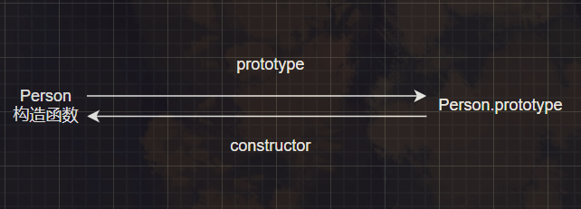
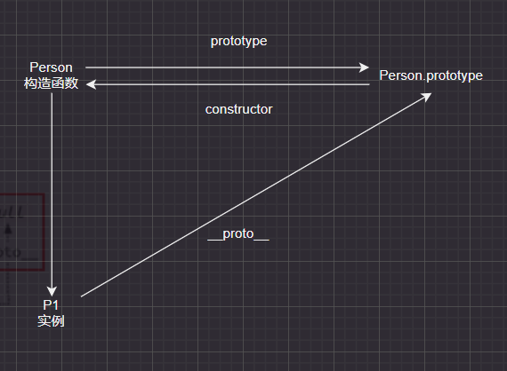
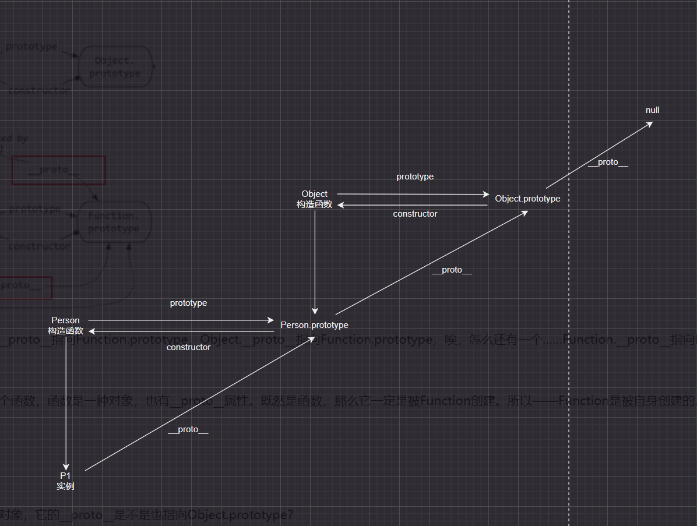
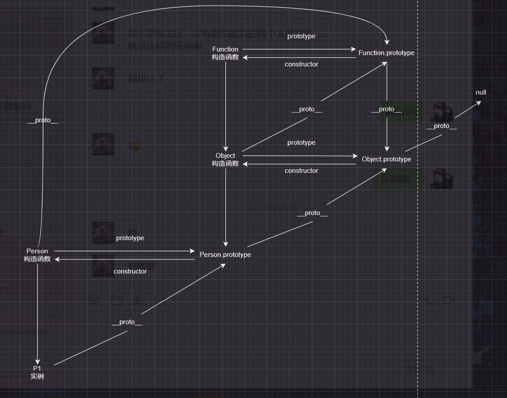
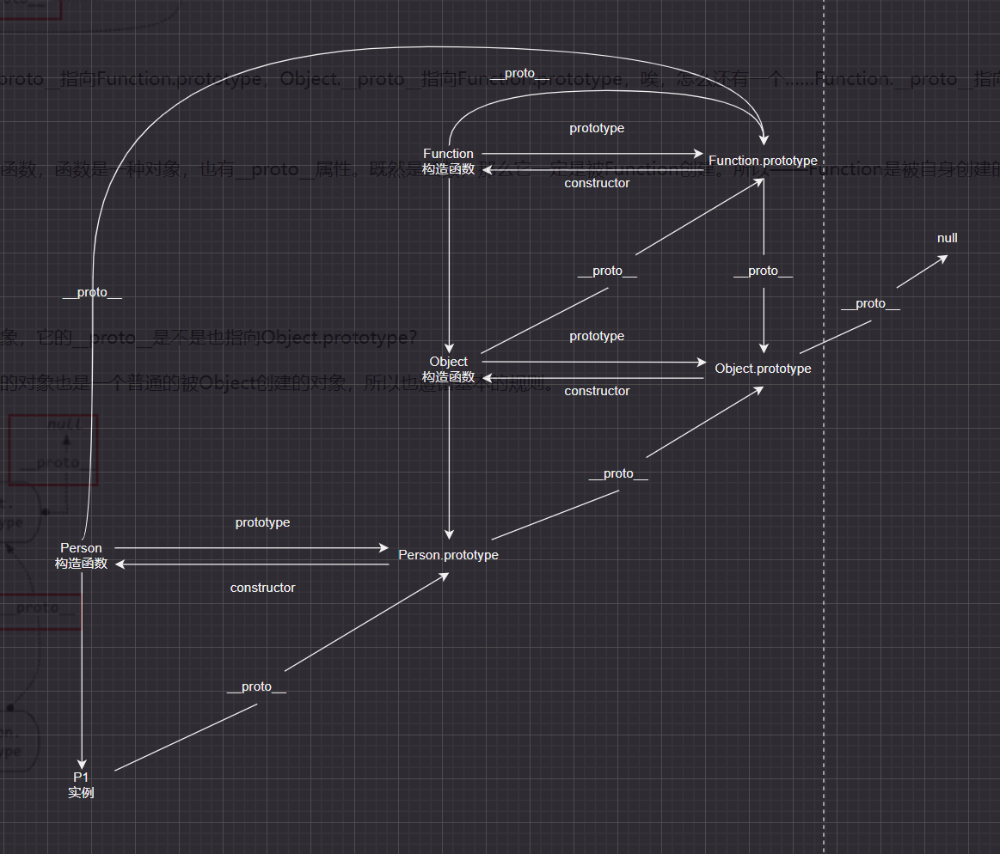

### 一、一切皆对象

js中数据类型分为简单类型（number、string、boolean、undefined、BigInt、symbol）和引用类型（array、function、object、set、map...），而一切（引用类型）都是对象，对象是**属性的集合**。

用typeof可以判断出简单类型值的类型，需要注意`typeof null`为`Object`，null表示为空的对象；

而在引用类型使用typeof函数类型返回function，其余typeof会返回Object。

引用类型一般使用instanceof来进行判断，`fn instanceof Object`返回的是true，表明函数也是一个对象。
```js
const arr =[1,2,3,4];
const obj = {a:1,b:2};
const fun = function() {};
const set = new Set();
const map = new Map();
console.log(typeof arr); // object
console.log(typeof obj); // object
console.log(typeof fun); // function
console.log(typeof set); // object
console.log(typeof map); // object
console.log(fun instanceof Object); // true
```

### 二、函数和对象的关系

**对象都是通过函数创建**，对象可以通过以下三种最基础的方式进行创建：
1. 构造函数
2. new Object()
3. 字面量

但实质上都是都过构造函数构建的对象，`new Object()`中Object是一个内置的构造函数，而字面量构建则是一个语法糖

```js
var obj = {a: 1, b: 2}

// 本质为
var obj = new Object();
obj.a = 1;
obj.b = 2;
```

### 三、原型prototype

函数是一个对象，所以函数也会包含属性。每个函数function都会包含一个类型为object的属性prototype（原型），而prototype有一个constructor属性指向其对应的函数。



### 四、隐式原型__proto__

每个对象都有一个__proto__属性（隐式原型），指向创造该对象的函数的prototype。



Person.prototype也是一个对象，所以也有一个__proto__，指向创造这个对象的函数的prototype，既Object.prototype。

而Object.prototype的__proto__的指向为null。



函数也是一种对象，所以函数也有__proto__，函数的创建函数为构造函数Function，所以构造函数Object的__proto__和Person的__proto__都指向Function.prototype。Function.prototype的__proto__则指向Object.prototype。



最后构造函数Function也是一个函数，那么一定是被Function创建，故Function的__proto__指向为自身的prototype（Function.prototype）。



### 五、instanceof

用typeof判断引用类型只会返回object/function，无法知道到底是对象、数组还是new Number()。所以需要用instanceof来进行判断。

```js
console.log(P1 instanceof Person) // true
console.log(P1 instanceof Object) // true
```

Instanceof运算符的第一个变量是一个对象，暂时称为A；第二个变量一般是一个函数，暂时称为B。

Instanceof的判断规则是：沿着A的__proto__这条链路来找，如果在链路中找到B.prototype，那么就返回true。如果找到终点还未找到，则返回false。

```js
console.log(Function instanceof Object) // true
console.log(Object instanceof Function) // true
console.log(Function instanceof Function) // true
```

### 六、原型链

访问一个对象的属性时，先在自身属性中查找，如果没有，再沿着__proto__这条链向上找，这就是原型链。

```js
let obj = {a: "a"};
console.log(obj.valueOf()); // {a: "a"}
```

如上例，访问obj.valueof时，obj的自身属性中没有valueof，于是沿着__proto__找到了Object.prototype.valueof。

Object.prototype上有hasOwnProperty可以判断一个属性到底时自身的还是从原型链中到的。

```js
console.log(obj.hasOwnProperty("a")) // true
console.log(obj.hasOwnProperty("hasOwnProperty")) // false  obj上的hasOwnProperty是来自原型链上Object.prototype.hasOwnProperty
console.log(obj.hasOwnProperty === Object.prototype.hasOwnProperty) // true
console.log(obj.hasOwnProperty("valueOf")) // false
```