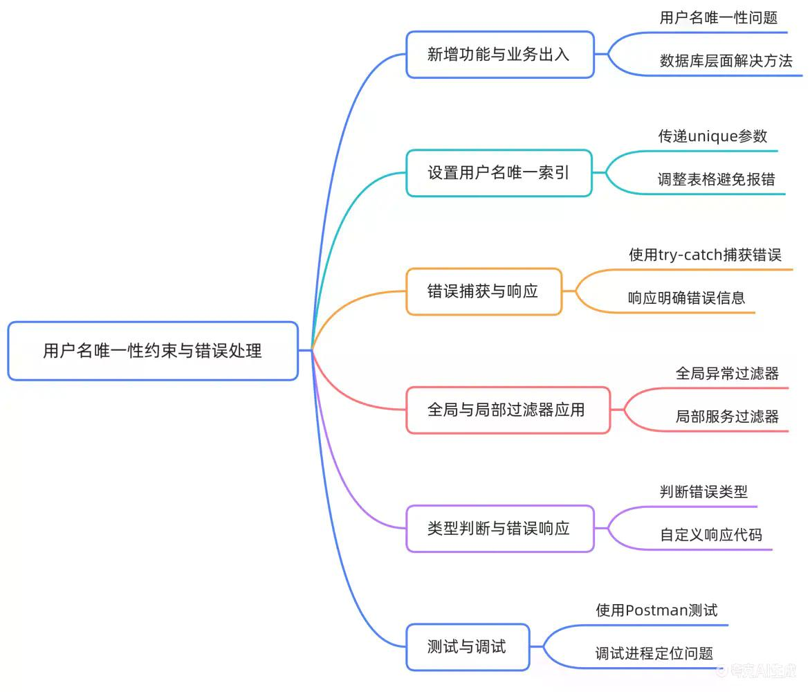

# 10-13 创建用户：创建及异常处理逻辑（TypeORM Filter）

## 课程概述
本课程讲解在NestJS用户管理系统中实现用户名唯一性约束及异常处理的完整技术方案，包括：
- 数据库唯一索引设置
- 重复数据清理策略
- 服务端错误捕获与响应优化
- 全局Filter与局部Filter（TypeORM Filter）两种错误处理方式



---

## 一、数据库唯一性约束设置

### 1. 需求分析
用户名必须全局唯一，重复用户名会导致业务逻辑混乱和数据不一致。

### 2. 技术实现
在Entity定义中为`username`字段添加`unique: true`参数：
```typescript
@Column({ unique: true })
username: string;
```

### 3. 常见问题与解决方案

#### 索引创建失败
**原因**：数据库中存在重复的`username`脏数据，导致迁移时违反唯一性约束。

**解决方法**：
1. 识别重复记录（如ID=1和ID=2的用户都使用`timemark`用户名）
2. 删除重复数据，仅保留一条有效记录
3. 重新运行数据库迁移

#### 验证索引生效
重启项目后，通过数据库管理工具查看`user`表：
- 确认`username`字段已建立`UNIQUE`索引
- 验证索引名称通常为`IDX_<table>_<column>`格式

---

## 二、重复用户名创建的错误处理

### 1. 问题复现
使用Postman发起POST `/user`请求，提交已存在的`username`（如`timemark`），默认返回HTTP 500状态码。

### 2. 错误分析
控制台输出错误信息：
```
ER_DUP_ENTRY: Duplicate entry 'timemark' for key 'user.username'
```
- 错误码：`1062`
- 错误类型：`QueryFailedError`（TypeORM抛出的数据库查询失败异常）

### 3. 基础Try-Catch处理
在Service层添加异常捕获：
```typescript
try {
  return await this.userRepository.save(userDto);
} catch (err) {
  if (err.code === 'ER_DUP_ENTRY' || err.errno === 1062) {
    throw new HttpException('用户名已存在', HttpStatus.CONFLICT);
  }
  throw err;
}
```

> **注意**：应使用`HttpStatus.CONFLICT`（409）而非`INTERNAL_SERVER_ERROR`（500），更符合RESTful API规范。
> 
> **修正说明**：原视频中使用`HttpStatus.INTERNAL_SERVER_ERROR`（500）是不正确的，因为唯一键冲突属于客户端错误而非服务器内部错误。HTTP 409 Conflict状态码专门用于表示请求与服务器当前状态冲突，更适合描述唯一键冲突场景。

---

## 三、全局Exception Filter统一处理

### 1. 环境准备
1. 拷贝`all-exception.filter.ts`到`src/filters/`目录
2. 安装依赖：`pnpm install request-ip`（用于记录请求IP）

### 2. 全局注册
在`main.ts`中注册全局过滤器：
```typescript
import { AllExceptionsFilter } from './filters/all-exception.filter';

async function bootstrap() {
  const app = await NestFactory.create(AppModule);
  const logger = new Logger();
  app.useGlobalFilters(new AllExceptionsFilter(logger));
  await app.listen(3000);
}
```

### 3. 核心实现
```typescript
@Catch()
export class AllExceptionsFilter implements ExceptionFilter {
  constructor(private logger: Logger) {}

  catch(exception: unknown, host: ArgumentsHost) {
    const ctx = host.switchToHttp();
    const response = ctx.getResponse<Response>();
    const request = ctx.getRequest<Request>();

    let status: number;
    let message: string;

    if (exception instanceof QueryFailedError) {
      status = HttpStatus.CONFLICT;
      message = exception.errno === 1062 ? '唯一索引冲突' : exception.message;
    } else if (exception instanceof HttpException) {
      status = exception.getStatus();
      message = exception.getResponse() as string;
    } else {
      status = HttpStatus.INTERNAL_SERVER_ERROR;
      message = '服务器内部错误';
    }

    const responseBody = {
      statusCode: status,
      message: message,
      timestamp: new Date().toISOString(),
      path: request.url,
      ip: request.ip
    };

    this.logger.error(`[${request.method}] ${request.url}`, exception);
    response.status(status).json(responseBody);
  }
}
```

---

## 四、局部TypeORM Filter开发

### 1. 生成Filter
使用Nest CLI生成Filter脚手架：
```bash
npx nx g @nrwl/node:filter typeorm --flat --no-spec
```

### 2. 局部注册
在`user.controller.ts`中为控制器绑定局部Filter：
```typescript
@Controller('user')
@UseFilters(new TypeOrmFilter())
export class UserController {
  // ...
}
```

### 3. 核心逻辑
```typescript
@Catch(QueryFailedError)
export class TypeOrmFilter implements ExceptionFilter {
  catch(exception: QueryFailedError, host: ArgumentsHost) {
    const ctx = host.switchToHttp();
    const response = ctx.getResponse<Response>();

    if (exception.errno === 1062) {
      response.status(HttpStatus.CONFLICT).json({
        code: exception.errno,
        message: '用户名已存在'
      });
    } else {
      response.status(HttpStatus.INTERNAL_SERVER_ERROR).json({
        code: exception.errno,
        message: exception.message
      });
    }
  }
}
```

### 4. 作用域验证
- 注释全局Filter配置
- 使用Postman测试重复用户名创建
- 验证响应包含`code: 1062`和自定义错误信息

---

## 五、MySQL错误码1062深度解析

### 1. 官方定义
`MySQL Error 1062`对应`ER_DUP_ENTRY`，表示违反唯一约束（UNIQUE KEY或PRIMARY KEY）。

### 2. 业务映射
在用户创建场景中，该错误明确指向`username`字段重复，可直接映射为"用户名已存在"提示。

### 3. 多级错误处理策略

#### 执行顺序
NestJS中异常处理的执行顺序为：
1. **局部Filter**（控制器或方法级）→ 2. **全局Filter** → 3. **默认异常处理**

#### 职责划分
1. **局部Filter**：处理特定模块的高频业务错误（如用户模块的唯一键冲突），可以针对不同业务场景定制错误响应
2. **全局Filter**：作为兜底方案，统一处理所有未被局部Filter捕获的异常，确保返回标准化响应格式
3. **Service层Try-Catch**：处理业务逻辑相关的特定异常，进行业务回滚或转换为业务异常

#### 最佳实践
- 局部Filter：针对特定业务场景，提供更友好的错误提示
- 全局Filter：确保所有异常都能被捕获并返回标准化响应
- Service层：专注于业务逻辑，将技术异常转换为业务异常

---

## 六、调试与最佳实践

### 1. 调试技巧
- 在Filter的`catch`块首行设置断点
- 使用VS Code调试器查看`exception`变量的实际类型和属性
- 验证`QueryFailedError`包含`errno`、`sqlMessage`、`code`等关键属性

### 2. 防御性编程
- **可选链操作符**：`exception?.errno` - 避免空值访问导致的运行时错误
- **类型断言**：`exception as QueryFailedError` - 确保TypeScript类型安全
- **精确类型判断**：使用`instanceof`而非`typeof`进行类型检查，避免笼统的异常处理
- **错误信息脱敏**：避免在响应中暴露敏感信息（如数据库表名、字段名）

### 3. 提交规范
```bash
# 清理调试代码
git add .
# 提交信息遵循Conventional Commits规范
git commit -m "feat(user): add typeorm filter for duplicate username handling"
```

---

## 课程总结

### 核心知识点
1. 数据库唯一约束的设置与维护
2. NestJS异常过滤器的两种实现方式
3. MySQL错误码1062的业务映射
4. RESTful API错误响应规范

### 关键收获
- 掌握从数据库到服务端的完整异常处理流程
- 理解全局Filter与局部Filter的适用场景
- 学会将技术错误转化为用户友好的提示信息
- 建立多级错误处理的工程化思维

### 课后思考
1. 如何扩展Filter支持更多类型的数据库错误？
   - 提示：可以通过维护错误码映射表，将不同数据库错误码转换为业务错误信息
2. 局部Filter与全局Filter的执行顺序是什么？
   - 提示：NestJS中局部Filter优先于全局Filter执行
3. 如何在Filter中实现错误日志的持久化存储？
   - 提示：可以集成日志库（如winston、pino）将错误日志写入文件或数据库

### 知识拓展

#### 与前端的协作
前端可以根据返回的错误码（如1062）展示不同的错误提示，提升用户体验：
```javascript
if (error.response.status === 409 && error.response.data.code === 1062) {
  showError('用户名已存在，请使用其他用户名');
}
```

#### 性能考虑
- 唯一索引查询是O(1)操作，不会对性能造成显著影响
- 异常处理的性能开销可以忽略不计，因为只有在发生错误时才会执行

#### 安全注意事项
- 避免在错误响应中暴露敏感信息（如数据库连接字符串、表结构）
- 对错误信息进行脱敏处理，只返回必要的错误提示
