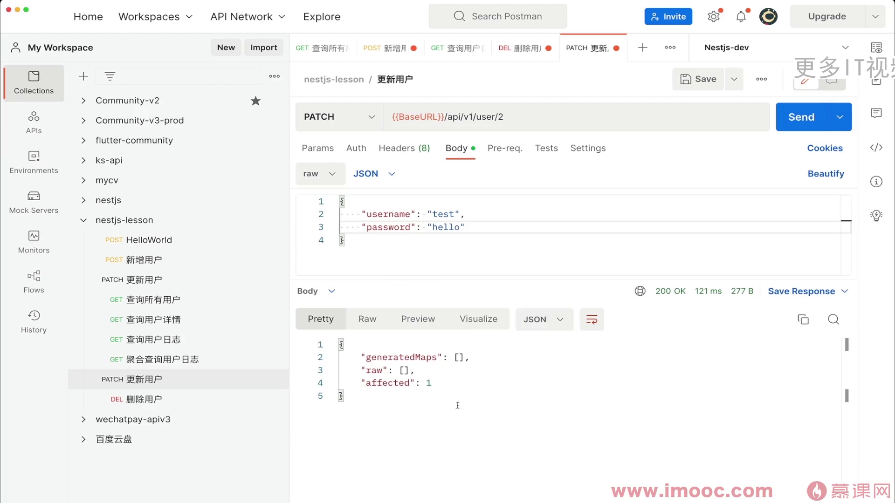
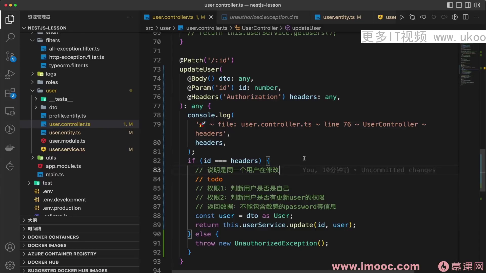

# 10-15更新：操作&amp_数据库更新对接

1. 更新关联模型数据时，需确保级联属性设置正确，即在UserEntity中将cascade设置为true，以便子属性自动插入数据库，这是成功更新的关键。
2. 使用UserRepository的merge方法合并新旧数据，创建新的实体实例，随后通过save方法保存更新，这是处理关联模型更新的有效策略。
3. 在用户权限验证中，通过解析headers中的authorization信息，与请求的ID进行比对，确保操作用户与目标用户一致，从而实现安全的权限控制。
4. NestJS框架提供了丰富的HTTP异常类，如UnauthorizedException，便于开发者快速响应未授权访问等场景，提升应用安全性与用户体验。
5. 后续将介绍JWT技术，通过加密传输token，确保前端传递的用户信息与服务端验证证书匹配，增强API的安全性，防止非法访问。

1. 完成后端接口开发后，将完善前端页面逻辑，熟练掌握的同学可直接跳过后端部分。
2. 学习JWT技术，为后续健全用户登录和权限控制打下基础。
3. 感兴趣的小伙伴可提前了解JWT，为课程内容做预习。
4. 接下来将深入学习用户登录机制，确保系统安全性。
5. 权限控制的学习将帮助理解如何管理不同用户的角色和访问权限。
