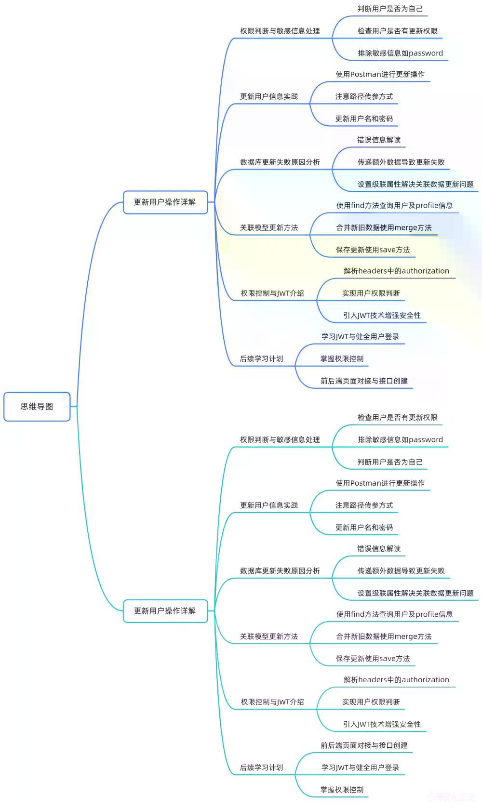

# 10-15更新：操作&amp_数据库更新对接_AI总结.docx

本视频讲述了用户信息更新功能的实现细节，重点解析了关联模型级联更新失败的原因及解决方案，并通过设置cascade和使用merge与save方法完成复杂更新；同时介绍了基于headers的权限校验机制，演示了如何通过authorization头判断操作权限并抛出HTTP异常，最后引出JWT用于安全身份认证的后续学习内容。




回顾与问题引入

前面已完成茬针和3的操作。

最后未完成的是 `update user` 功能。

`update user` 涉及多个关键点：判断用户是否在更新自己、判断是否有权限更新、返回数据不能包含敏感信息（如 password）。

类似的权限控制也适用于 `delete` 操作，将在后续权限控制章节详细讲解。

Update User 核心逻辑分析

需要在更新后删除返回数据中的敏感信息（如 password）。

判断传入的 ID 与 DTO 用户是否为同一用户，防止他人越权修改。

若非本人尝试修改密码，则禁止操作。

在代码中打印 ID 和 DTO 内容以进行调试验证。

Postman 测试与路径参数说明

使用 Postman 发送 PATCH 请求进行用户更新。

请求方式为路径传参，需在 URL 中指定数据库中存在的用户 ID。

示例：将用户名更新为 test password，密码设为 123456。

数据库初始状态核验

查看 ID 为 2 的用户当前信息：

用户名：toy mark

密码：123456

传递非核心字段导致更新失败的问题

尝试更新 email、gender 字段。

同时尝试更新 profile 中的 address、photo 字段。

发送请求后出现错误提示：

> "property address was not found in user, make sure query is correct"

即使调整字段顺序或仅传递部分字段，仍报错。

只有传递 username 和 password 才能成功更新。

失败原因定位：级联更新配置缺失

问题根源在于 `user.entity.ts` 中的 profile 是一个对象类型的关联关系（OneToOne）。

默认情况下 TypeORM 不会自动更新关联实体。

必须显式设置 `cascade: true` 才能实现级联保存。

TypeORM 级联更新机制详解

在 `@OneToOne` 装饰器的 relation options 中存在 `cascade` 配置项。

可设置为 `true` 或指定操作类型（如 insert、update 等）。

官方文档示例说明：若 `cascade: true`，则子实体可随主实体一同插入数据库。

示例中通过一次 `save` 操作即可保存包含多个 category 的 question 实例。

解决方案一：启用级联更新

修改 `user.entity.ts` 文件，在 `@OneToOne` 的第三个参数中添加：

```ts
    { cascade: true }
    ```

解决方案二：使用 merge + save 进行联合模型更新

代码实现细节

测试验证更新成功

补充知识：TypeORM Repository API

增删改查功能总结

权限校验初步实现

解析 Authorization Header

权限比对逻辑

抛出 HTTP 异常

实际测试权限拦截

安全性问题讨论

引入 JWT 认证机制

后续学习规划

原有的 `update` 方法仅适用于单模型更新，不支持关联模型。

正确做法如下：

调用 `findProfile(id)` 方法异步查询用户及其 profile 信息。

使用 `repository.merge(userTemp, dto)` 创建合并后的全新实例。

使用 `await repository.save(newUser)` 保存整个实体树。

`userTemp = await this.findProfile(id);`

`newUser = this.userRepository.merge(userTemp, dto);`

`return await this.userRepository.save(newUser);`

在 Postman 中设置：

address: 2

photo: "!!"

gender: 2

发送请求后获得正常响应。

查询所有用户确认 gender、photo、address 均已更新。

再次测试修改 gender 为 1、address 为 3、password 为 hello123，响应正常。

查询结果符合预期，表明更新成功。

`merge` 方法可用于将多个实体合并成新实体。

`preload` 方法可通过普通 JS 对象创建实体，先从数据库加载再替换值。

但经测试发现 `preload` 不自动加载关联数据（如 profile），除非手动指定 relations。

因此推荐做法仍是：

显式查询主实体并设置 `{ relations: ['profile'] }`

使用 `merge` 合并数据

使用 `save` 持久化

至此，用户模块的 CRUD（增删改查）功能全部介绍完毕。

回到 `user.controller.ts`，需增加权限判断逻辑。

使用 `@Headers()` 注解从请求头中提取信息。

从 `@nestjs/common` 导入 `Headers`。

关键 header 为 `authorization`。

在 Postman 中设置 header：

Key: `authorization`

Value: `1` （表示用户 ID）

控制台打印出 headers 值为 `1`，表示 ID 为 1 的用户正在访问。

获取请求路径中的用户 ID。

与 header 中的 authorization 值比较。

若两者相等，则允许修改。

否则拒绝请求。

当权限不足时，抛出 `HttpException`。

NestJS 内置多种常见异常类，如：

`UnauthorizedException`

`ForbiddenException`

`ConflictException`

`GatewayTimeoutException`

可通过 Ctrl/Command + 点击查看源码，左侧列出所有可用异常。

官方文档提供了完整的内置 HTTP 异常列表，覆盖绝大多数使用场景。

请求路径传入 ID 为 2。

authorization header 设置为 `1`。

发送请求后立即返回 `401 Unauthorized` 错误。

表明权限校验生效。

学生提问：前端可随意修改 authorization 值，是否存在安全隐患？

回答：确实如此，当前仅为演示逻辑。

实际应用中需结合加密技术确保 token 不可伪造。

提出解决方案：使用 JSON Web Token (JWT)。

JWT 可实现安全的身份透传。

服务端签发 token，前端携带，服务端验证签名。

若 token 签名无效或过期，请求将被拒绝（仍返回 401）。

下一章节将展开讲解 JWT 技术。

接着学习用户登录认证流程。

然后深入权限控制机制。

鼓励感兴趣的同学提前了解 JWT 相关知识。

本节内容结束。
