# 8-11 高级查询：使用 QueryBuilder 进行联合查询

## 为什么需要 QueryBuilder

前面学的 `find` / `findOne` + `relations` 能应对大部分简单查询，但复杂生产场景下需要：
- 多表联合查询（JOIN）
- 聚合统计（COUNT、SUM、AVG）
- 分组（GROUP BY）
- 排序（ORDER BY）
- 分页（LIMIT / OFFSET）

TypeORM 的 `QueryBuilder` 允许你以链式调用的方式构建 SQL，兼顾类型安全和灵活性。

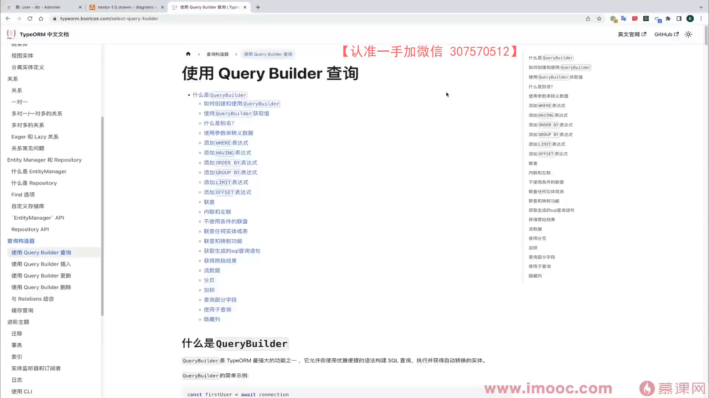

---

## QueryBuilder 基础用法

### 创建 QueryBuilder

```typescript
// 通过 Repository 创建，'user' 是表的别名
const qb = this.userRepository.createQueryBuilder('user');
```

### 基本查询

```typescript
// SELECT user.id, user.username FROM user WHERE user.id = :id
const user = await this.userRepository
  .createQueryBuilder('user')
  .select(['user.id', 'user.username'])  // 选择特定字段
  .where('user.id = :id', { id: 1 })    // 参数化查询，防止 SQL 注入
  .getOne();                              // 获取单条结果
```

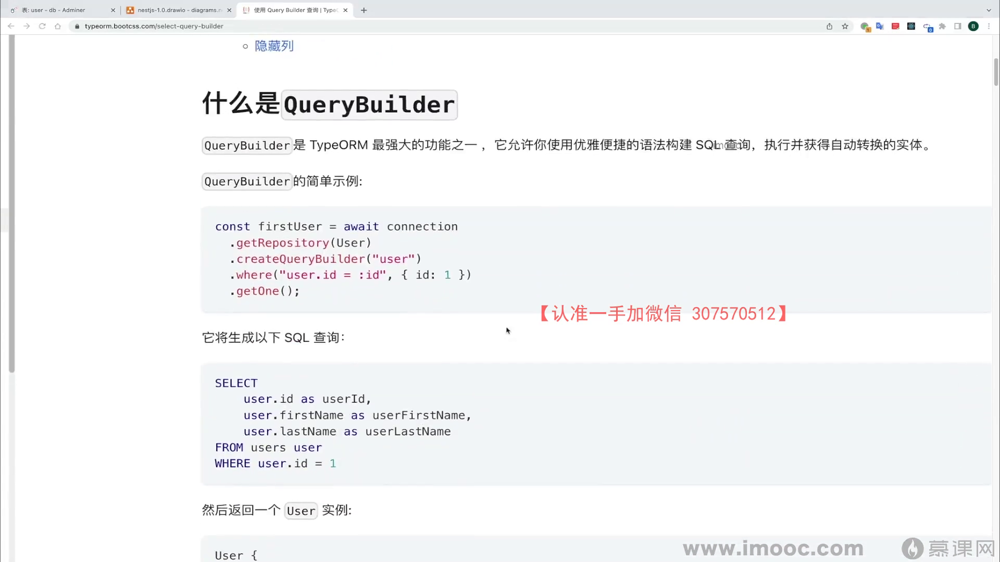

### getOne vs getMany

| 方法 | 返回值 | 说明 |
|------|--------|------|
| `getOne()` | `Entity \| null` | 返回单条记录 |
| `getMany()` | `Entity[]` | 返回多条记录 |
| `getRawOne()` | `any` | 返回原始 SQL 结果（单条） |
| `getRawMany()` | `any[]` | 返回原始 SQL 结果（多条） |

> 聚合查询（COUNT、SUM 等）通常用 `getRawMany()`，因为返回的不是 Entity 结构。

### 参数化查询（防 SQL 注入）

```typescript
// ✅ 正确：使用参数化查询
.where('user.id = :id', { id: userId })

// ❌ 错误：字符串拼接，有 SQL 注入风险
.where(`user.id = ${userId}`)
```

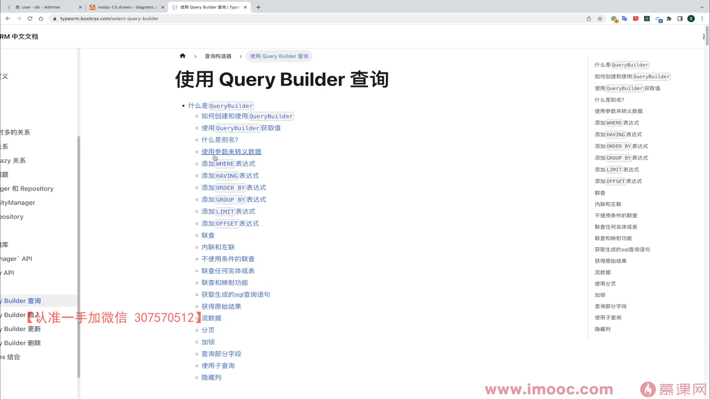

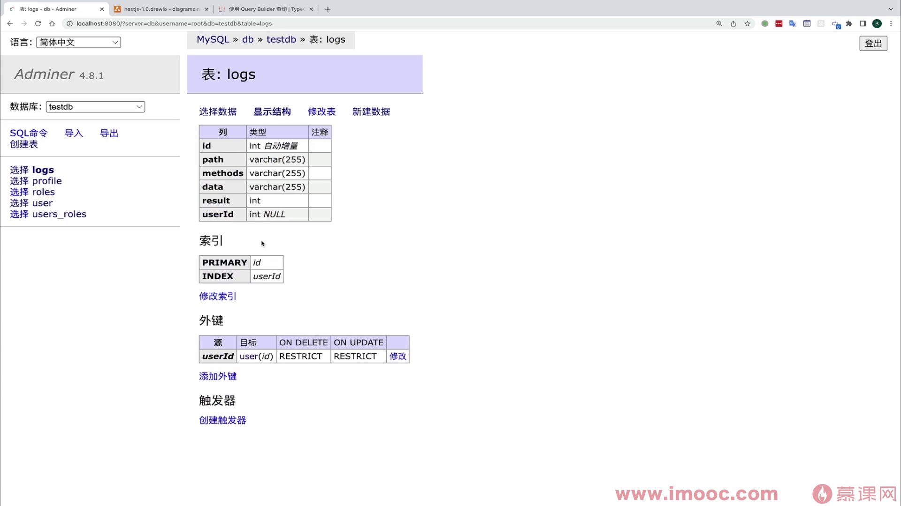

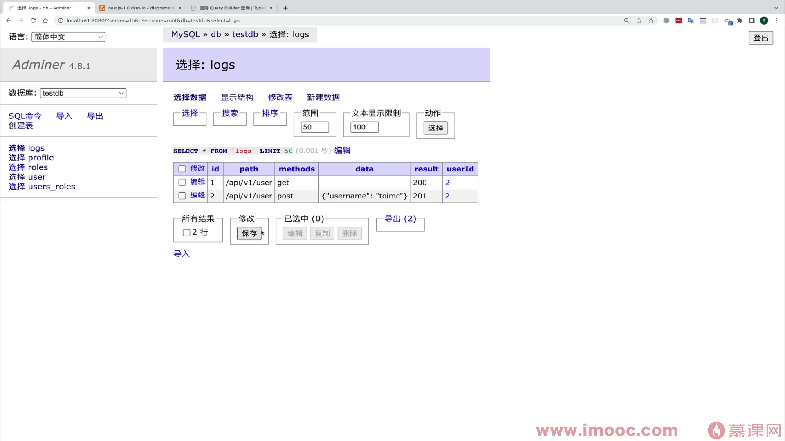

---

## 实战：聚合查询用户日志

### 需求

统计某个用户不同 HTTP 状态码的日志数量，等价 SQL：

```sql
SELECT logs.result AS result, COUNT(logs.result) AS count
FROM logs
LEFT JOIN users ON users.id = logs.userId
WHERE users.id = :id
GROUP BY logs.result
```

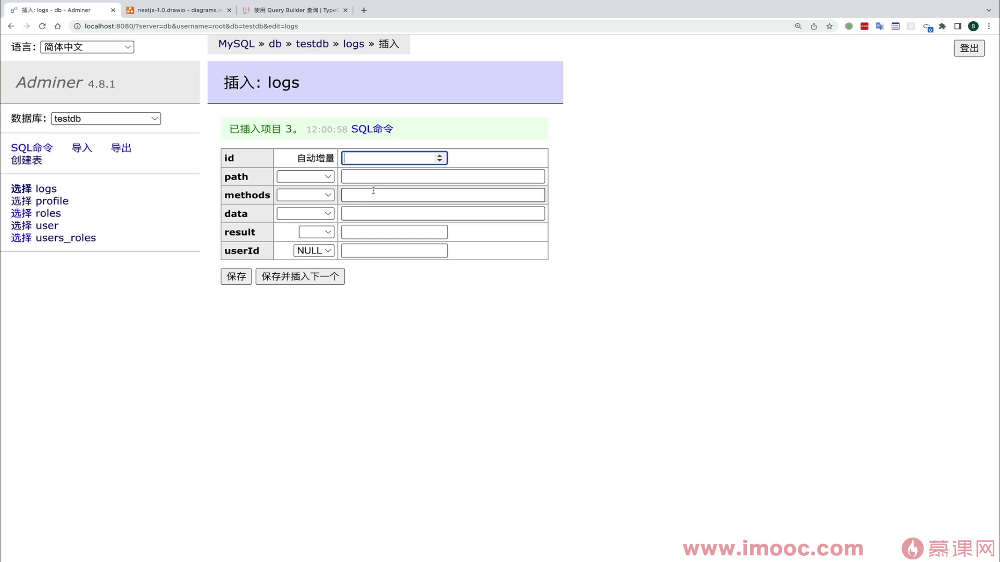

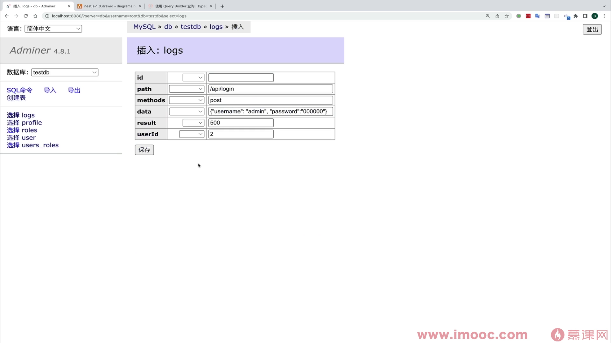

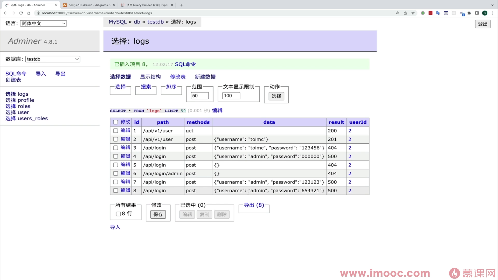

### Service 实现

```typescript
// user.service.ts
async findLogsByGroup(id: number) {
  const res = await this.logRepository
    .createQueryBuilder('logs')                          // 1. 创建 QueryBuilder，别名 logs
    .select('logs.result', 'result')                     // 2. SELECT logs.result AS result
    .addSelect('COUNT(logs.result)', 'count')            // 3. COUNT(logs.result) AS count
    .leftJoinAndSelect('logs.user', 'user')              // 4. LEFT JOIN user 表
    .where('user.id = :id', { id })                      // 5. WHERE user.id = :id
    .groupBy('logs.result')                              // 6. GROUP BY logs.result
    .orderBy('count', 'DESC')                            // 7. 按数量倒序
    .limit(3)                                            // 8. 只取前 3 条
    .getRawMany();                                       // 9. 获取原始结果

  // 映射返回数据，去除敏感信息
  return res.map((item) => ({
    result: item.result,
    count: item.count,
  }));
}
```

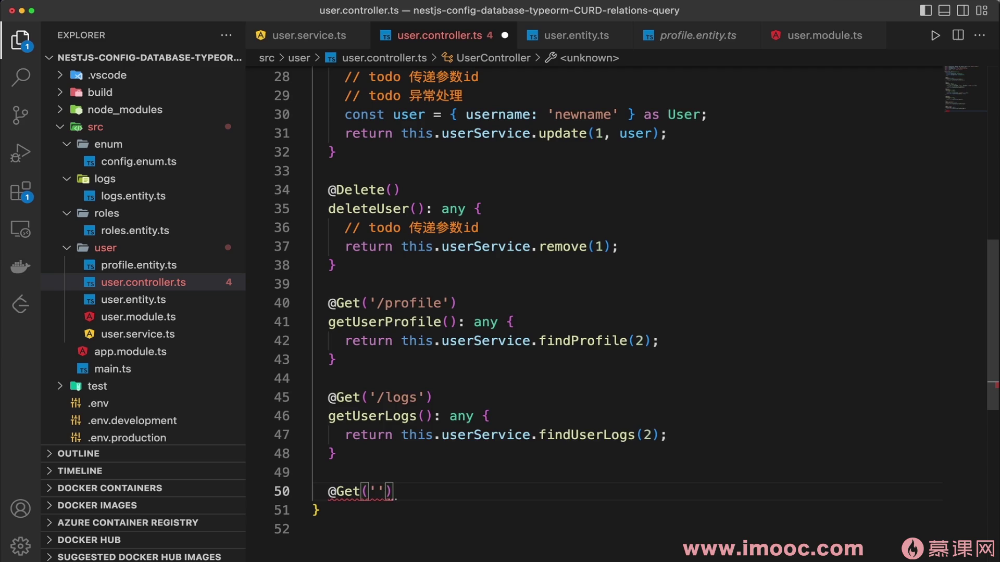

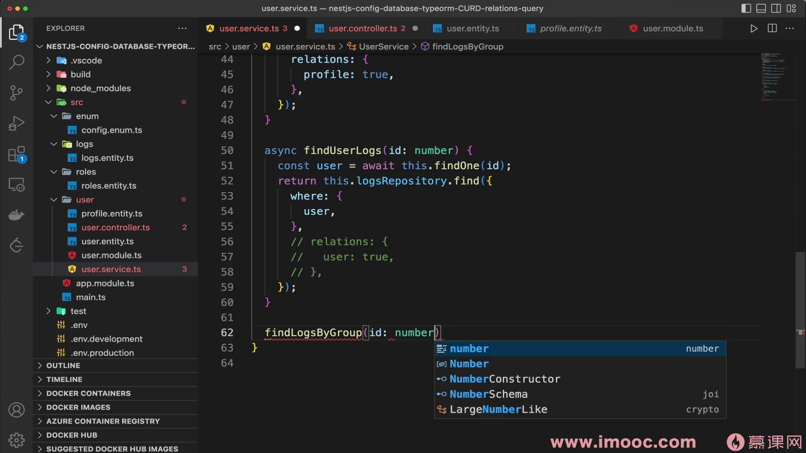

### 链式调用逐步解析

| 步骤 | 方法 | 对应 SQL |
|------|------|----------|
| 1 | `createQueryBuilder('logs')` | `FROM logs` |
| 2 | `.select('logs.result', 'result')` | `SELECT logs.result AS result` |
| 3 | `.addSelect('COUNT(logs.result)', 'count')` | `, COUNT(logs.result) AS count` |
| 4 | `.leftJoinAndSelect('logs.user', 'user')` | `LEFT JOIN users user ON ...` |
| 5 | `.where('user.id = :id', { id })` | `WHERE user.id = ?` |
| 6 | `.groupBy('logs.result')` | `GROUP BY logs.result` |
| 7 | `.orderBy('count', 'DESC')` | `ORDER BY count DESC` |
| 8 | `.limit(3)` | `LIMIT 3` |
| 9 | `.getRawMany()` | 执行查询，返回原始结果 |

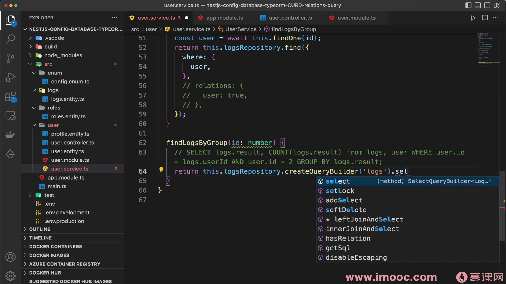

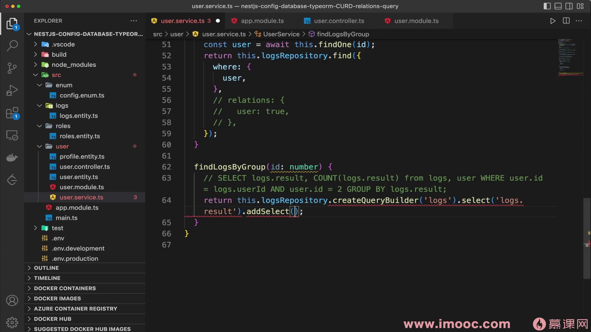

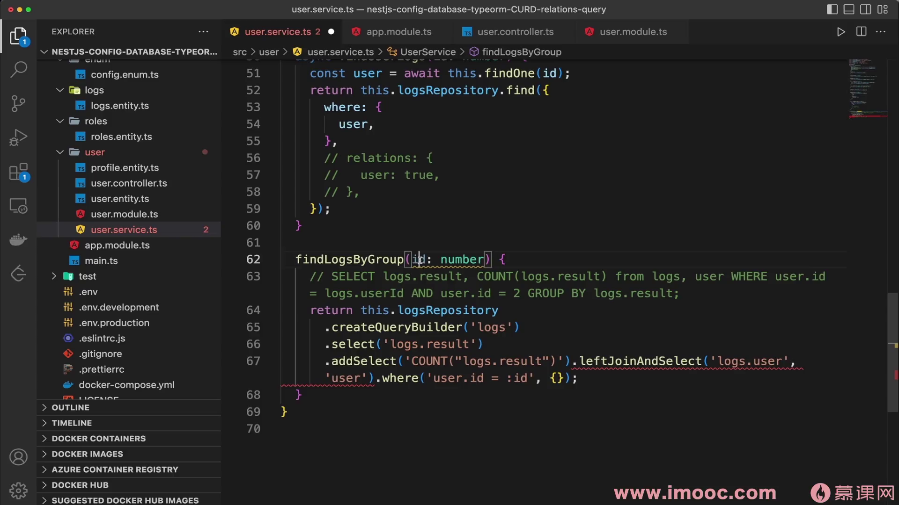

### Controller 路由

```typescript
@Get('logs-by-group/:id')
getLogsByGroup(@Param('id') id: number) {
  return this.userService.findLogsByGroup(id);
}
```

### 返回结果示例

```json
[
  { "result": 500, "count": "3" },
  { "result": 404, "count": "3" },
  { "result": 200, "count": "1" }
]
```

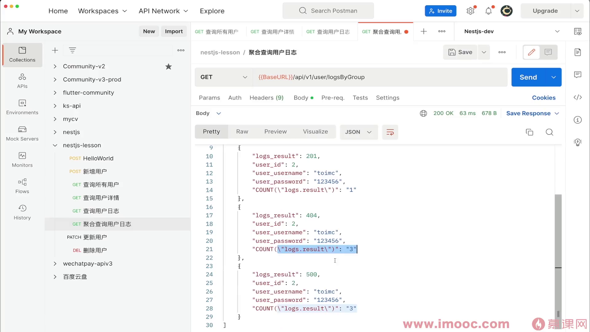

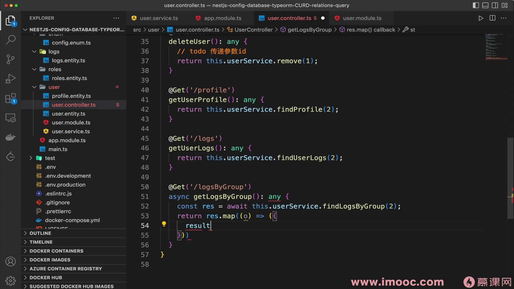

---

## 数据安全注意事项

使用 `leftJoinAndSelect` 时会加载关联实体的所有字段，可能暴露敏感信息（如密码）。解决方案：

```typescript
// 方案一：在 Service 层 map 过滤敏感字段
return res.map((item) => ({
  result: item.result,
  count: item.count,
  // 不返回 user.password 等敏感字段
}));

// 方案二：使用 leftJoin 代替 leftJoinAndSelect（不加载关联实体字段）
.leftJoin('logs.user', 'user')  // 只 JOIN 不 SELECT

// 方案三：在 Entity 中使用 @Exclude() 装饰器（配合 class-transformer）
@Column()
@Exclude()
password: string;
```

---

## 排序与分页

```typescript
// 多字段排序：先按 count 倒序，再按 result 倒序
.orderBy('count', 'DESC')
.addOrderBy('logs.result', 'DESC')

// 分页
.skip(0)    // 偏移量（OFFSET）
.take(10)   // 每页条数（LIMIT）

// 或者直接用 limit + offset
.limit(10)
.offset(0)
```

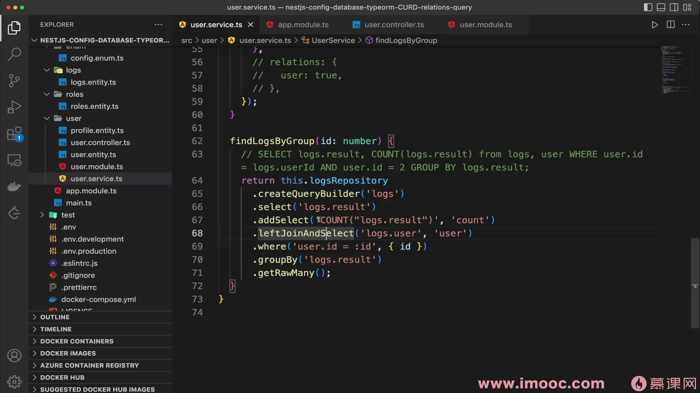

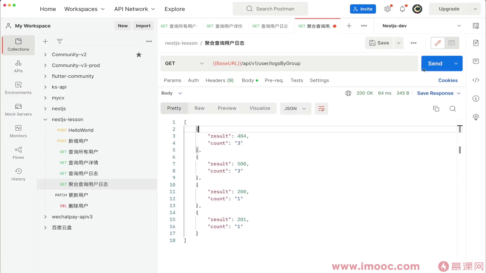

---

## 总结

| 功能 | QueryBuilder 方法 | 说明 |
|------|-------------------|------|
| 选择字段 | `.select()` / `.addSelect()` | 支持别名 AS |
| 条件过滤 | `.where()` / `.andWhere()` / `.orWhere()` | 参数化防注入 |
| 联合查询 | `.leftJoin()` / `.leftJoinAndSelect()` | JOIN 不加载 / JOIN 并加载 |
| 分组 | `.groupBy()` / `.addGroupBy()` | 聚合统计必备 |
| 排序 | `.orderBy()` / `.addOrderBy()` | ASC / DESC |
| 分页 | `.skip()` + `.take()` 或 `.limit()` + `.offset()` | 分页查询 |
| 执行 | `.getOne()` / `.getMany()` / `.getRawMany()` | 根据需求选择 |

> QueryBuilder 适合复杂查询场景；简单 CRUD 用 Repository 的 `find` / `findOne` 更简洁。
