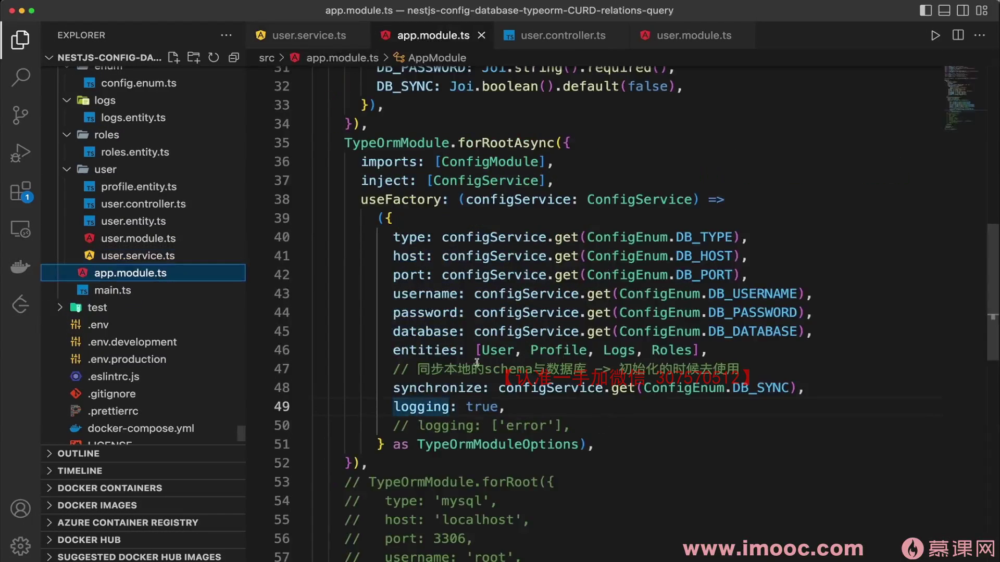
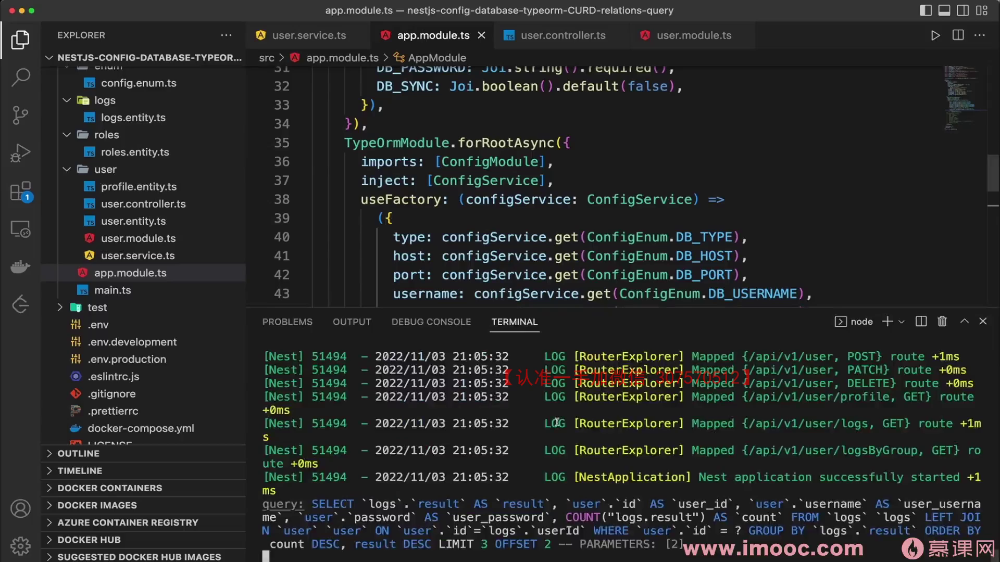
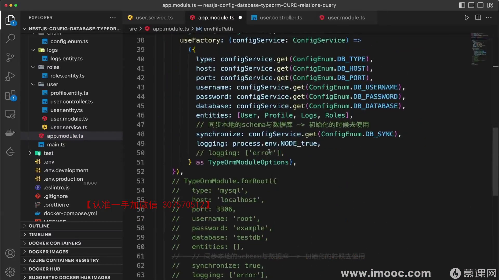
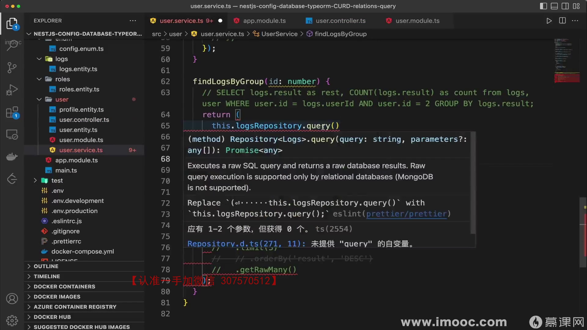
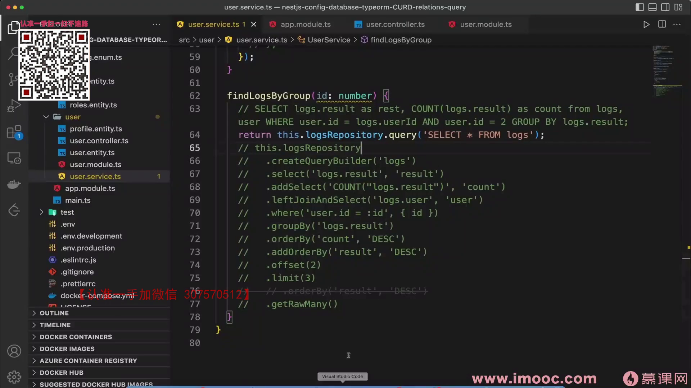
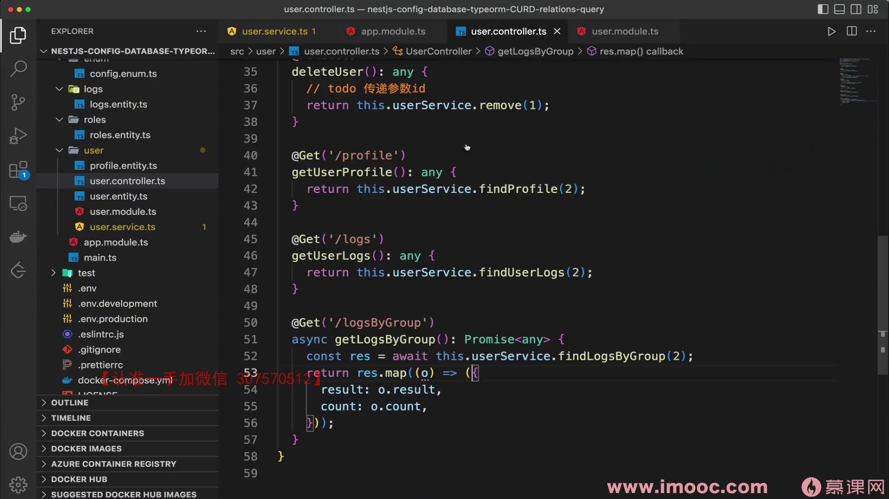
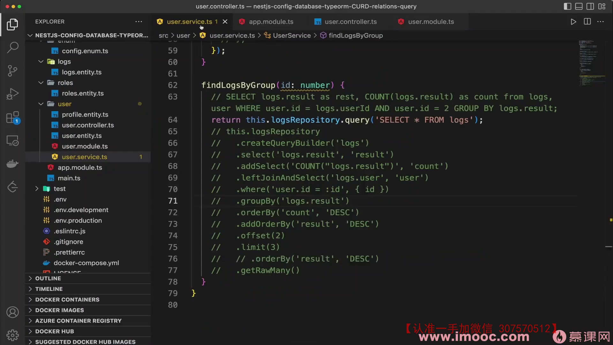
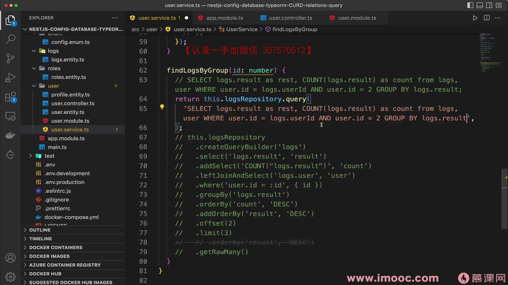

# 8-12 TypeORM SQL 语句调试 & 原生 SQL 能力

## SQL 日志调试

### 开启 SQL 日志

在 `TypeOrmModule.forRoot()` 配置中设置 `logging: true`，TypeORM 会在控制台打印所有执行的 SQL 语句及错误日志。

```typescript
// app.module.ts
TypeOrmModule.forRoot({
  type: 'mysql',
  host: '127.0.0.1',
  port: 3306,
  username: 'root',
  password: 'your_password',
  database: 'your_database',
  entities: [User, Profile, Log, Role],
  // 仅开发环境开启 SQL 日志
  logging: process.env.NODE_ENV === 'development',
})
```





### 通过配置文件控制

推荐将 `logging` 配置为环境变量，避免在生产环境输出 SQL 日志：

```typescript
logging: process.env.NODE_ENV === 'development',
```

这样只有 `NODE_ENV=development` 时才会打印 SQL，生产环境自动关闭。



### logging 的更多选项

```typescript
// 布尔值：全部开启或关闭
logging: true

// 数组：只记录特定类型
logging: ['query', 'error']  // 只记录查询语句和错误

// 可选值：
// 'query'       - 记录所有查询
// 'error'       - 记录错误
// 'schema'      - 记录 schema 构建
// 'warn'        - 记录警告
// 'info'        - 记录信息
// 'log'         - 记录日志
// 'migration'   - 记录迁移
```

### 控制台输出示例

开启 logging 后，每次数据库操作都会打印类似：

```
query: SELECT `user`.`id`, `user`.`username` FROM `user` WHERE `user`.`id` = ? -- PARAMETERS: [1]
query: SELECT `log`.`id`, `log`.`result` FROM `log` LEFT JOIN `user` ON `user`.`id` = `log`.`userId` WHERE `user`.`id` = ? GROUP BY `log`.`result` -- PARAMETERS: [2]
```

这对调试 QueryBuilder 生成的 SQL 非常有用，可以直接复制到数据库客户端验证。

---

## 原生 SQL 查询

如果你更习惯写原生 SQL，或者遇到 QueryBuilder 难以表达的复杂查询，可以直接使用 `query()` 方法。

### 基本用法

```typescript
// 通过 Repository 执行原生 SQL
const result = await this.userRepository.query(
  'SELECT * FROM user WHERE id = ?',
  [userId],  // 参数数组，防止 SQL 注入
);
```





### 聚合查询示例

```typescript
// 原生 SQL 实现日志分组统计
async findLogsByGroupRaw(id: number) {
  return this.logRepository.query(
    `SELECT logs.result AS result, COUNT(logs.result) AS count
     FROM log logs
     LEFT JOIN user ON user.id = logs.userId
     WHERE user.id = ?
     GROUP BY logs.result
     ORDER BY count DESC`,
    [id],
  );
}
```

### 使用 DataSource 执行原生 SQL

除了 Repository，也可以通过注入 `DataSource` 来执行：

```typescript
import { DataSource } from 'typeorm';

@Injectable()
export class UserService {
  constructor(private dataSource: DataSource) {}

  async rawQuery() {
    return this.dataSource.query('SELECT NOW()');
  }
}
```







---

## 三种查询方式对比

| 方式 | 适用场景 | 类型安全 | 灵活性 |
|------|----------|----------|--------|
| Repository API（`find`/`findOne`） | 简单 CRUD | ✅ 高 | 一般 |
| QueryBuilder | 复杂联合查询、聚合 | ✅ 较高 | 高 |
| 原生 SQL（`query`） | 极复杂查询、性能优化 | ❌ 无 | 最高 |

> 优先使用 Repository API → 不够用时用 QueryBuilder → 实在搞不定再用原生 SQL。

---

## 总结

| 功能 | 配置/方法 | 说明 |
|------|-----------|------|
| 开启 SQL 日志 | `logging: true` | 建议仅开发环境开启 |
| 环境判断 | `process.env.NODE_ENV === 'development'` | 控制日志输出 |
| 原生 SQL | `repository.query(sql, params)` | 参数数组防注入 |
| DataSource | `dataSource.query(sql)` | 不依赖特定 Repository |
| 日志类型 | `logging: ['query', 'error']` | 精细控制日志级别 |
