# 8-9 面向切面编程：TypeORM 实现用户的 CRUD 操作

## 课程目标

使用 TypeORM 完成数据库的增删改查（CRUD）操作，理解 NestJS 中的依赖注入（DI）机制和面向切面编程（AOP）思想。

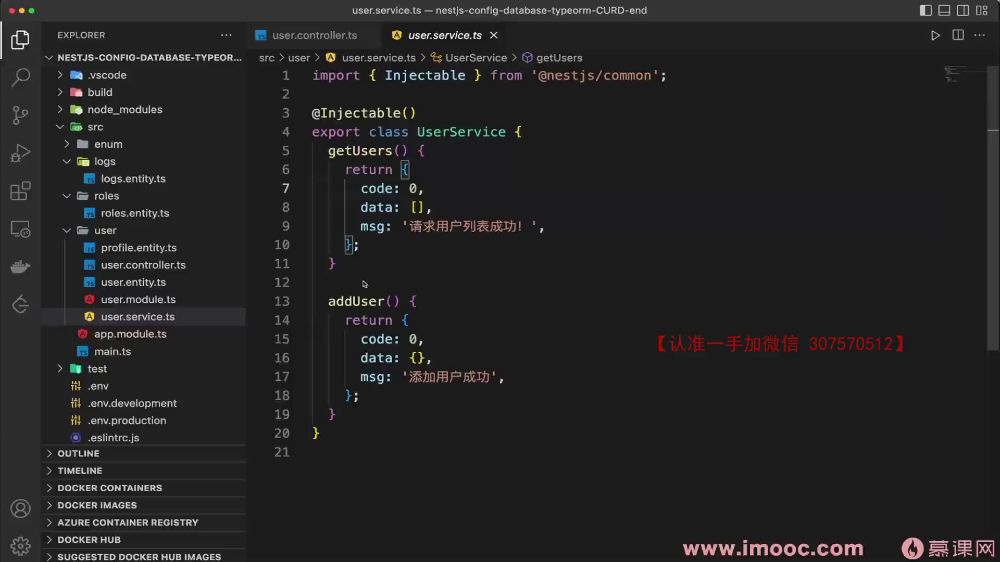

---

## Controller vs Service：代码该写在哪？

| 层级 | 职责 | 示例 |
|------|------|------|
| Controller | 处理 HTTP 请求/响应，路由分发 | 接收参数、返回结果、设置状态码 |
| Service | 核心业务逻辑，数据库操作 | CRUD 操作、数据校验、业务规则 |

> 核心原则：Controller 只做请求转发，所有业务逻辑都放在 Service 层。

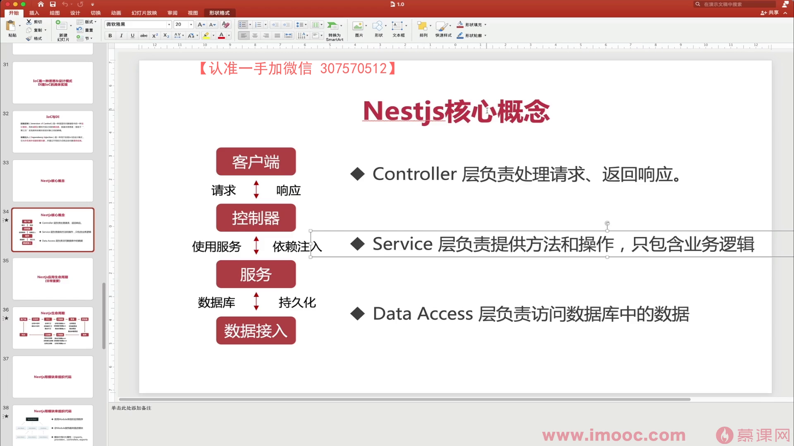

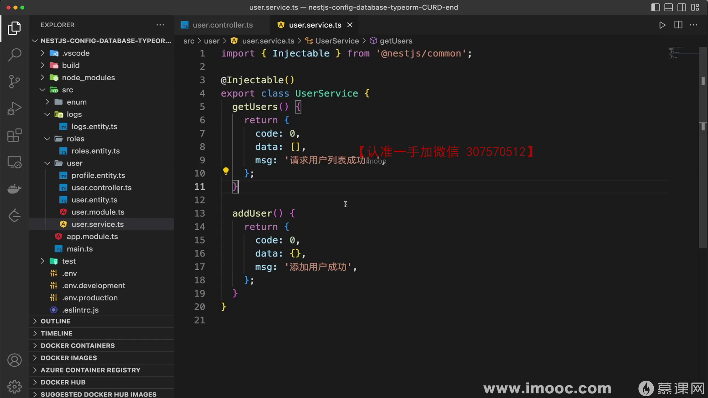

---

## NestJS 依赖注入（DI）原理

NestJS 的核心思想是**面向切面编程（AOP）**，而 DI 是实现 AOP 的关键机制。

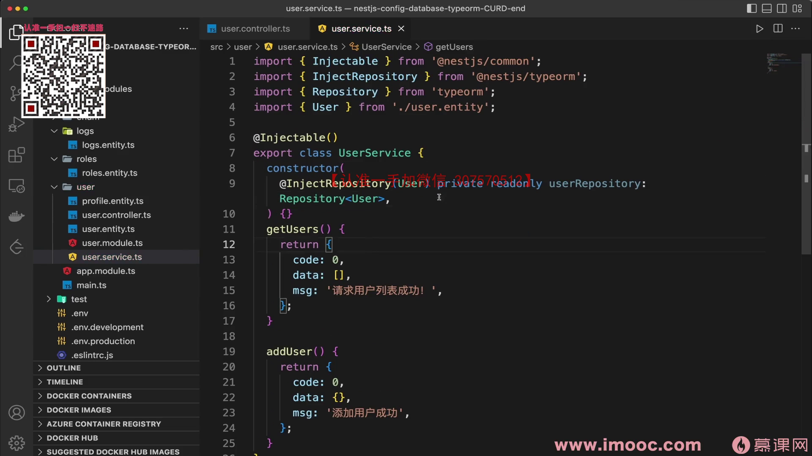

### DI 容器工作流程

```
1. 扫描注册 → 扫描所有 @Injectable() 标记的类，注册到 DI 容器
2. 依赖分析 → 分析每个类构造函数的参数，理解类之间的依赖关系
3. 实例创建 → 自动创建类的实例及其依赖实例
4. 实例缓存 → 将实例存储在容器中，避免重复实例化
5. 按需注入 → 需要时直接从容器获取实例，无需手动 new
```

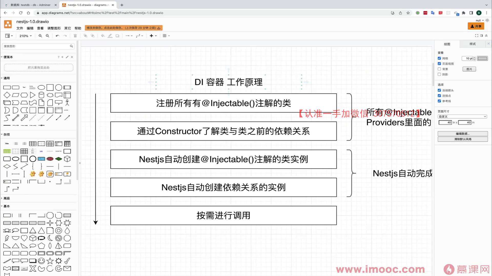

### 具体到 TypeORM 的 DI 流程

```typescript
// 1. UserModule 中通过 providers 注册 UserService
@Module({
  imports: [TypeOrmModule.forFeature([User])], // 注册 User Repository
  providers: [UserService],                     // 注册 UserService
  controllers: [UserController],
})
export class UserModule {}

// 2. DI 容器分析 UserService 构造函数，发现依赖 UserRepository
@Injectable()
export class UserService {
  constructor(
    @InjectRepository(User)
    private userRepository: Repository<User>,  // DI 自动注入
  ) {}
}

// 3. DI 容器自动创建 UserRepository 实例并注入到 UserService
```

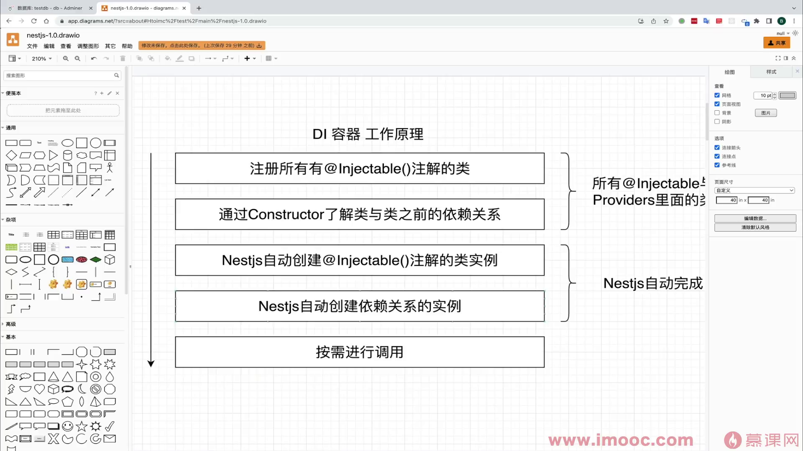

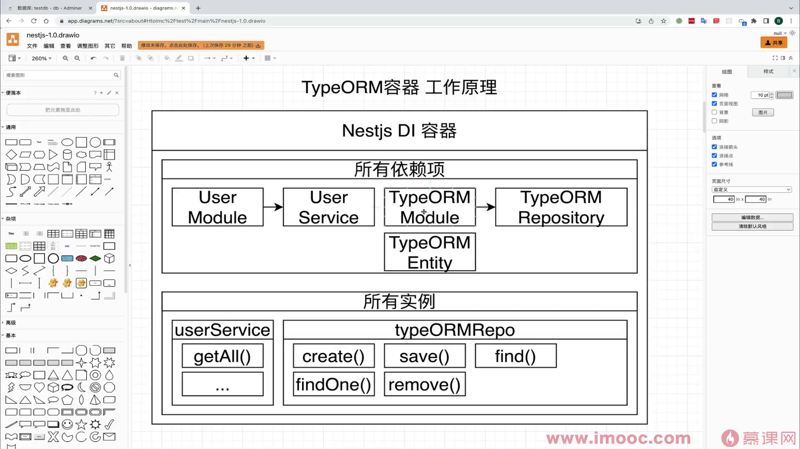

### 关键点：TypeOrmModule.forFeature()

`TypeOrmModule.forFeature([User])` 的作用是让 DI 系统认识 `UserRepository`，这样才能在 Service 中注入使用。

> ⚠️ 跨模块使用 Service 时，必须先在目标模块中 `imports` 对应模块，否则会报实例化失败的错误。

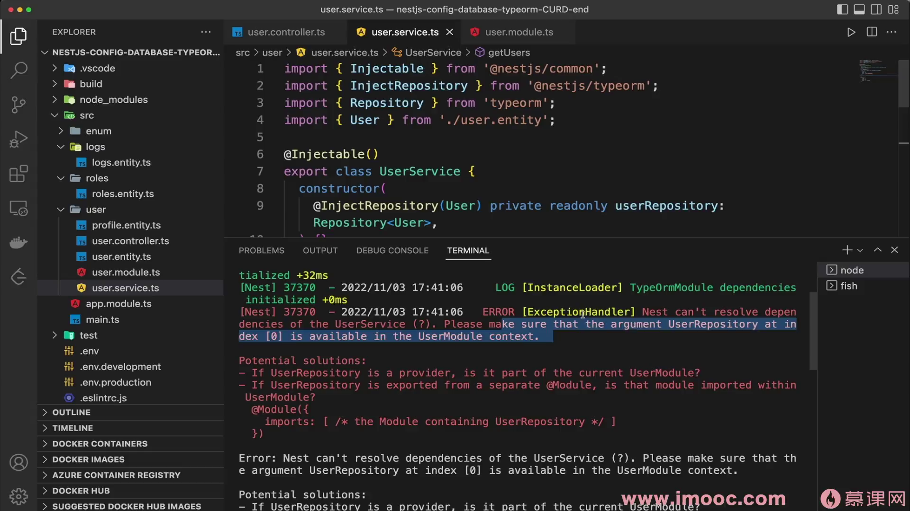

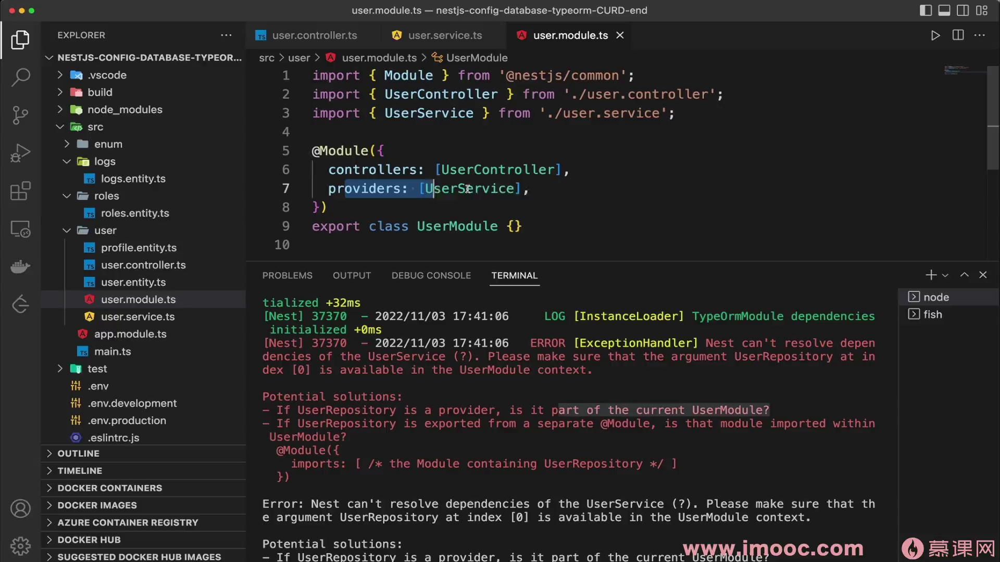

---

## 实现 CRUD 操作

### Repository 常用方法

| 方法 | 说明 | 返回值 |
|------|------|--------|
| `find()` | 查询多条记录 | `Promise<Entity[]>` |
| `findOne()` | 查询单条记录 | `Promise<Entity \| null>` |
| `create()` | 创建实体实例（不保存到数据库） | `Entity` |
| `save()` | 保存实体到数据库 | `Promise<Entity>` |
| `update()` | 更新记录 | `Promise<UpdateResult>` |
| `delete()` | 删除记录 | `Promise<DeleteResult>` |
| `count()` | 统计记录数 | `Promise<number>` |

### UserService 完整实现

```typescript
import { Injectable } from '@nestjs/common';
import { InjectRepository } from '@nestjs/typeorm';
import { Repository } from 'typeorm';
import { User } from './user.entity';

@Injectable()
export class UserService {
  constructor(
    @InjectRepository(User)
    private userRepository: Repository<User>,
  ) {}

  // 查询所有用户
  findAll(): Promise<User[]> {
    return this.userRepository.find();
  }

  // 根据用户名查询单个用户
  find(username: string): Promise<User> {
    return this.userRepository.findOne({
      where: { username },
    });
  }

  // 创建用户
  async create(user: Partial<User>): Promise<User> {
    const newUser = this.userRepository.create(user);
    return this.userRepository.save(newUser);
  }

  // 更新用户（Partial<User> 表示只需传部分字段）
  async update(id: number, user: Partial<User>): Promise<User> {
    await this.userRepository.update(id, user);
    return this.userRepository.findOne({ where: { id } });
  }

  // 删除用户
  async delete(id: number): Promise<void> {
    await this.userRepository.delete(id);
  }
}
```

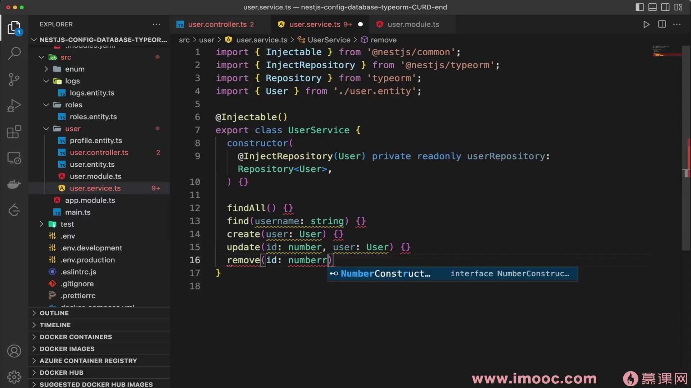

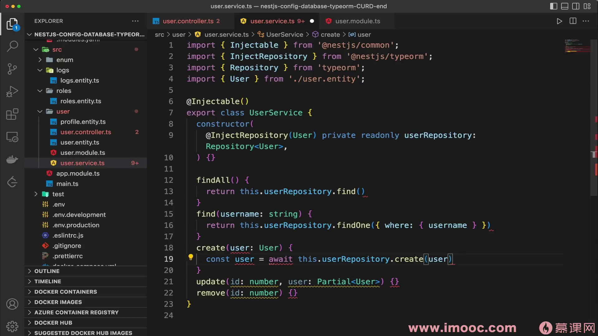

### 关于 Partial\<T\>

`Partial<User>` 是 TypeScript 内置工具类型，将 User 的所有属性变为可选。适用于 `update` 场景——只传需要更新的字段：

```typescript
// User 原始类型
interface User {
  id: number;
  username: string;
  password: string;
}

// Partial<User> 等价于
interface PartialUser {
  id?: number;
  username?: string;
  password?: string;
}
```

---

## Controller 层调用

```typescript
import { Controller, Get, Post, Put, Delete, Body, Param } from '@nestjs/common';
import { UserService } from './user.service';
import { User } from './user.entity';

@Controller('user')
export class UserController {
  constructor(private userService: UserService) {}

  @Get()
  getUsers(): Promise<User[]> {
    return this.userService.findAll();
  }

  @Post()
  addUser(@Body() user: Partial<User>): Promise<User> {
    return this.userService.create(user);
  }

  @Put(':id')
  updateUser(
    @Param('id') id: number,
    @Body() user: Partial<User>,
  ): Promise<User> {
    return this.userService.update(id, user);
  }

  @Delete(':id')
  deleteUser(@Param('id') id: number): Promise<void> {
    return this.userService.delete(id);
  }
}
```

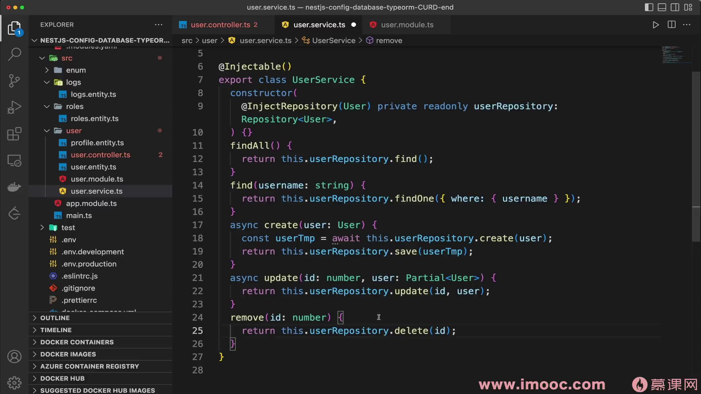

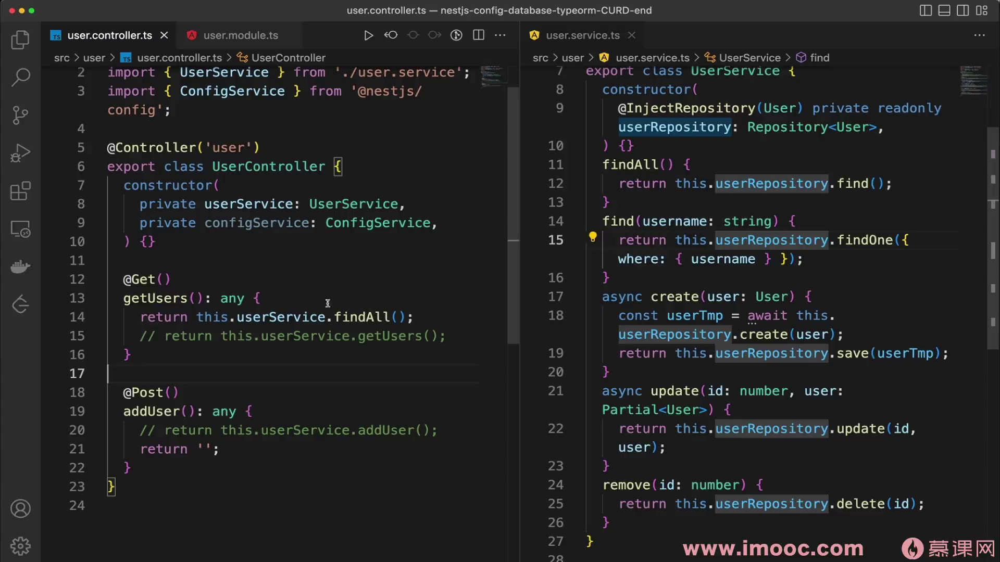

---

## Postman 测试

| 操作 | 方法 | URL | Body |
|------|------|-----|------|
| 查询所有 | GET | `http://localhost:3000/user` | - |
| 创建用户 | POST | `http://localhost:3000/user` | `{"username":"test","password":"123456"}` |
| 更新用户 | PUT | `http://localhost:3000/user/1` | `{"username":"updated"}` |
| 删除用户 | DELETE | `http://localhost:3000/user/1` | - |

测试流程：
1. 先 GET 查询，返回空数组 `[]`
2. POST 创建用户，返回带自增 ID 的用户对象
3. 再次 GET 查询，确认用户已创建
4. PUT 更新，DELETE 删除同理验证

> `@PrimaryGeneratedColumn()` 装饰器实现了 ID 自增，无需手动指定。

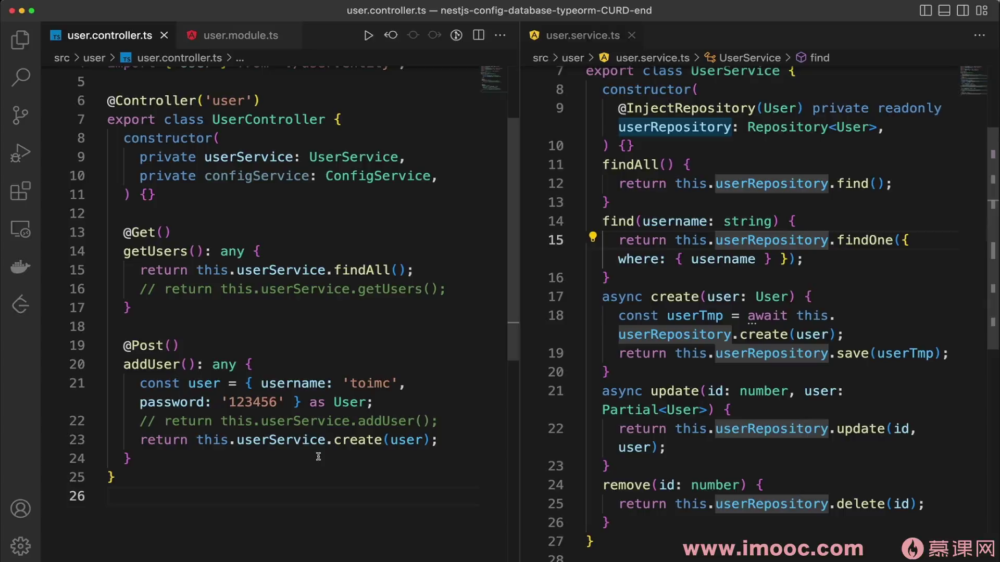

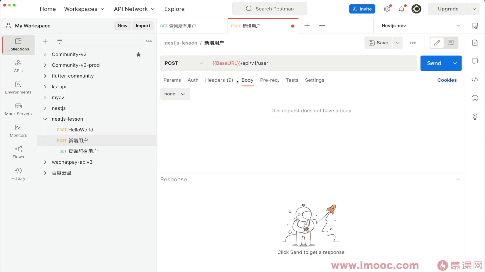

---

## 总结

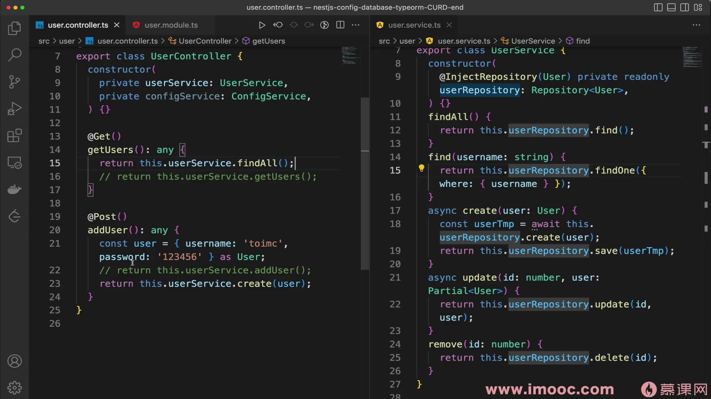

| 知识点 | 要点 |
|--------|------|
| 分层架构 | Controller 处理请求，Service 处理业务逻辑 |
| DI 原理 | 容器注册 → 依赖分析 → 实例创建 → 缓存 → 按需注入 |
| TypeORM 注册 | `TypeOrmModule.forFeature([Entity])` 让 DI 认识 Repository |
| Repository 方法 | `find` / `findOne` / `create` / `save` / `update` / `delete` |
| Partial\<T\> | 更新操作时只传部分字段 |
| 跨模块使用 | 必须先 `imports` 对应模块，否则注入失败 |
