# 8.7 TypeORM 关系映射：一对多与多对一

## 一、概念总览

在 TypeORM 中，实体之间的关系通过装饰器来定义。本节以 `User`（用户）和 `Logs`（操作日志）为例，讲解一对多（OneToMany）与多对一（ManyToOne）的关系映射。

核心关系：**一个用户可以拥有多条操作日志，每条日志只属于一个用户。**

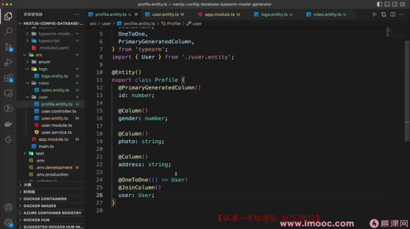

---

## 二、User 实体：定义一对多关系

在 `User` 实体中，使用 `@OneToMany` 装饰器声明与 `Logs` 的一对多关联：

```typescript
import { Entity, PrimaryGeneratedColumn, Column, OneToMany } from 'typeorm';
import { Logs } from './logs.entity';

@Entity()
export class User {
  @PrimaryGeneratedColumn()
  id: number;

  @Column()
  username: string;

  // 一对多：一个用户拥有多条日志
  // 第一个参数：返回关联实体的类型
  // 第二个参数：指定 Logs 实体中反向关联的属性名
  @OneToMany(() => Logs, (logs) => logs.user)
  logs: Logs[];
}
```

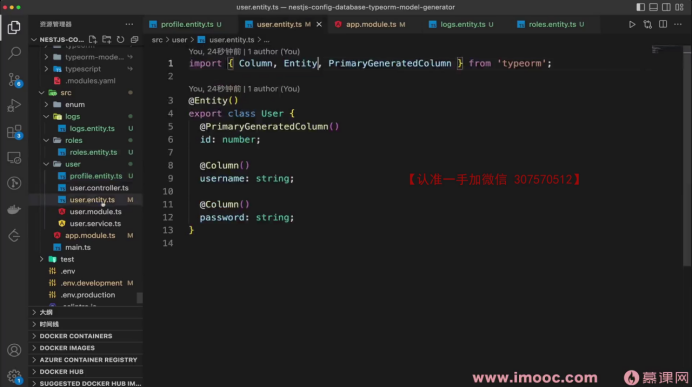

要点：
- `@OneToMany` 的第一个参数是一个返回关联实体类型的函数：`() => Logs`
- 第二个参数指明 `Logs` 实体中指向 `User` 的属性名：`(logs) => logs.user`
- `logs` 属性的类型为 `Logs[]`，表示一个用户对应多条日志

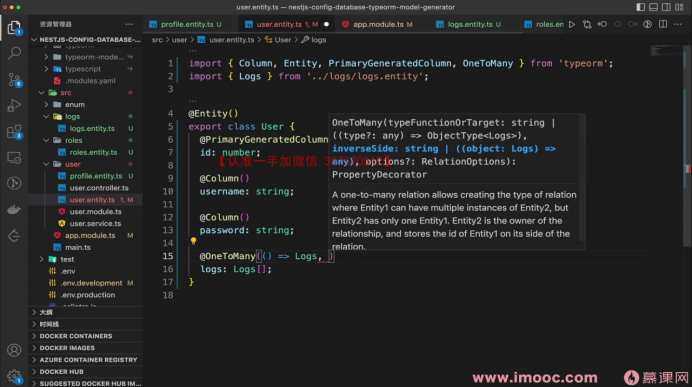
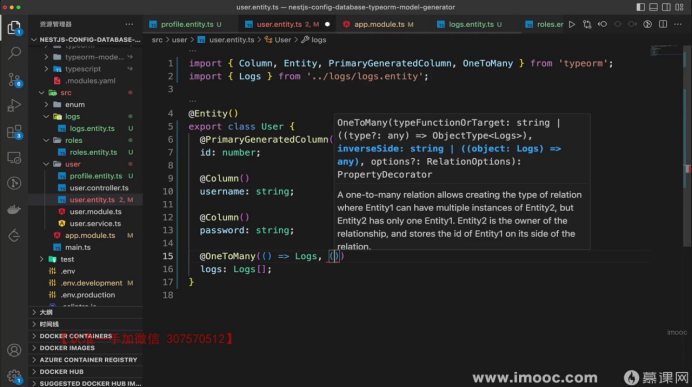

---

## 三、Logs 实体：定义多对一关系

在 `Logs` 实体中，使用 `@ManyToOne` 装饰器声明与 `User` 的多对一关联：

```typescript
import { Entity, PrimaryGeneratedColumn, Column, ManyToOne } from 'typeorm';
import { User } from './user.entity';

@Entity()
export class Logs {
  @PrimaryGeneratedColumn()
  id: number;

  @Column()
  result: string;

  // 多对一：多条日志属于同一个用户
  @ManyToOne(() => User, (user) => user.logs)
  user: User;
}
```

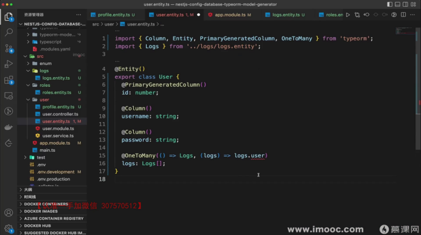
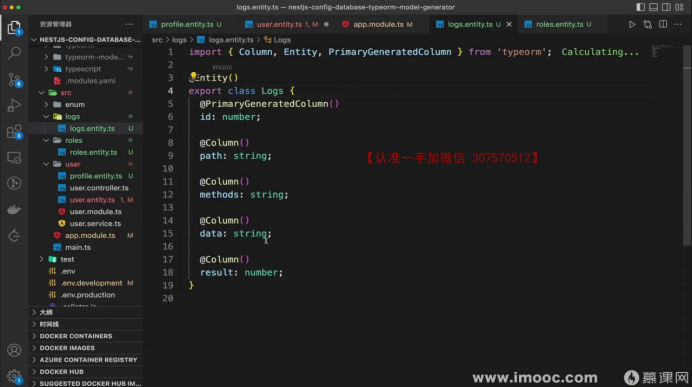
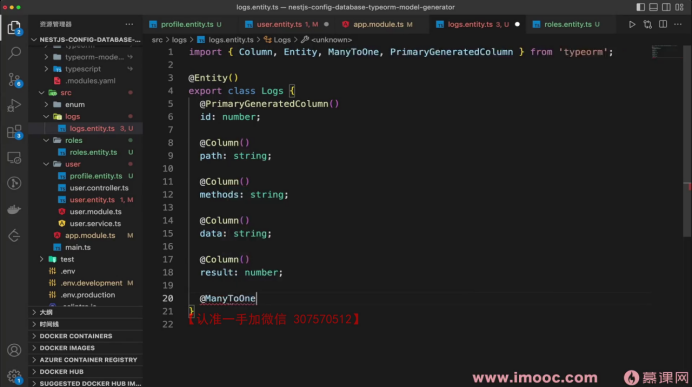

要点：
- `@ManyToOne` 的第二个参数指明 `User` 实体中反向关联的属性名：`(user) => user.logs`
- TypeORM 会自动在 `Logs` 表中创建 `userId` 外键字段，无需手动定义

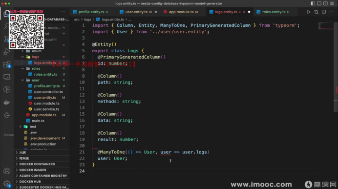

---

## 四、双向关联的工作原理

`@OneToMany` 和 `@ManyToOne` 成对使用，构成双向关联：

| 实体 | 装饰器 | 属性 | 含义 |
|------|--------|------|------|
| User | `@OneToMany` | `logs: Logs[]` | 一个用户拥有多条日志 |
| Logs | `@ManyToOne` | `user: User` | 每条日志属于一个用户 |

TypeORM 在底层生成的 SQL 查询类似于：

```sql
SELECT * FROM user
LEFT JOIN logs ON logs.userId = user.id
```

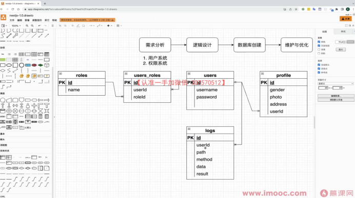

关键理解：
- `logs.userId = user.id` 是关联查询的核心条件
- `@ManyToOne` 一侧（Logs）是外键的持有方，TypeORM 会自动在该表创建 `userId` 列
- 理解 LEFT JOIN 的查询条件比记忆具体 SQL 语句更重要

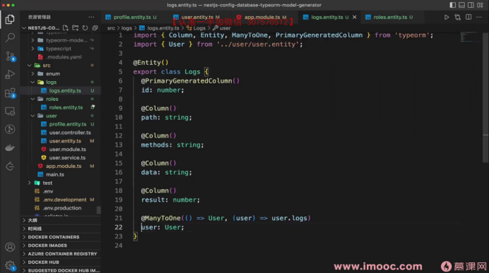

---

## 五、查询关联数据

查询用户时，如果需要同时获取其日志记录，需要在查询时指定 `relations`：

```typescript
// 在 Service 中查询用户及其日志
const user = await this.userRepository.find({
  relations: ['logs'],
});
```

返回的数据结构中，每个 `user` 对象会包含一个 `logs` 数组属性，存储该用户的所有日志记录。

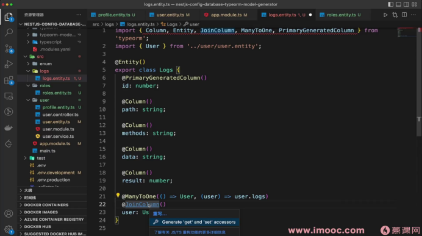
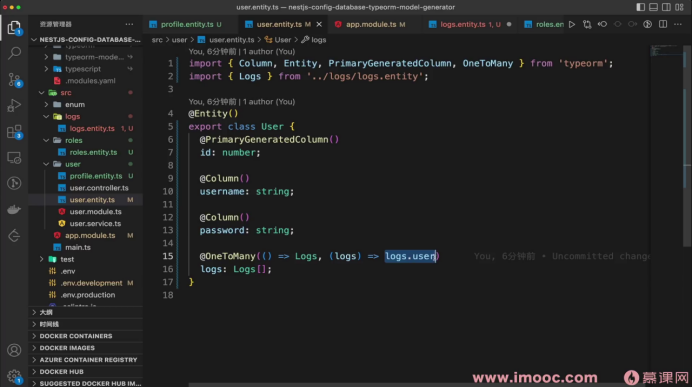

---

## 六、深入理解第二个参数（inverseSide）

`@OneToMany` 和 `@ManyToOne` 的第二个参数是理解 TypeORM 关系映射的关键，值得单独展开。

### 6.1 第二个参数到底是什么？

第二个参数是一个回调函数，称为 **inverseSide**（反向关系），它告诉 TypeORM：**对方实体中，哪个属性指向了我？**

```typescript
// User 实体
@OneToMany(() => Logs, (logs) => logs.user)
//                      ^^^^^^^^^^^^^^^^
//                      "Logs 实体中的 user 属性指向了我（User）"
logs: Logs[];

// Logs 实体
@ManyToOne(() => User, (user) => user.logs)
//                      ^^^^^^^^^^^^^^^^
//                      "User 实体中的 logs 属性指向了我（Logs）"
user: User;
```

可以看到，两个装饰器的第二个参数形成了**互相指向**的关系：
- `@OneToMany` 的第二个参数 → 指向 Logs 实体的 `user` 属性
- `@ManyToOne` 的第二个参数 → 指向 User 实体的 `logs` 属性

### 6.2 为什么需要这个参数？

TypeORM 需要通过这个参数来：

1. **建立双向关联**：知道两个实体的哪两个属性是"一对"关系，从而在查询任意一侧时都能正确 JOIN
2. **生成正确的 SQL**：TypeORM 根据 inverseSide 确定 JOIN 条件。例如查询 User 时加载 logs，它需要知道 Logs 实体中哪个字段持有外键（即 `logs.user` → 对应数据库中的 `logs.userId`）
3. **同步双向数据**：当你设置 `log.user = someUser` 时，TypeORM 能自动理解 `someUser.logs` 也应该包含这条 log

### 6.3 `@ManyToOne` 的第二个参数可以省略

`@ManyToOne` 是外键持有方，即使不写第二个参数，TypeORM 也能正确创建外键列和执行查询：

```typescript
// 这样写也能正常工作（单向关联）
@ManyToOne(() => User)
user: User;
```

但省略后就变成了**单向关联**——只能从 Logs 查到 User，无法从 User 反查 Logs。如果需要双向查询，两侧的第二个参数都不能省。

### 6.4 与 SQL JOIN 的对应关系

第二个参数最终决定了 TypeORM 生成的 JOIN 条件：

```
@OneToMany(() => Logs, (logs) => logs.user)
                                 ↓
                        logs.userId = user.id
                                 ↓
              LEFT JOIN logs ON logs.userId = user.id
```

`logs.user` 这个属性在数据库层面对应的就是 `logs` 表中的 `userId` 外键列。TypeORM 通过第二个参数找到这个外键列，从而拼出正确的 JOIN 语句。

### 6.5 外键列的默认命名规则

TypeORM 自动生成外键列名的规则是：**属性名 + 关联实体的主键字段名**（驼峰拼接）。

| 实体属性 | 关联实体主键 | 生成的外键列名 |
|---------|------------|--------------|
| `user` | `id` | `userId` |
| `dept` | `id` | `deptId` |
| `category` | `id` | `categoryId` |
| `createdBy` | `id` | `createdById` |

如果不想使用默认命名，可以通过 `@JoinColumn` 自定义外键列名：

```typescript
@ManyToOne(() => Dept, (dept) => dept.logs)
@JoinColumn({ name: 'department_id' }) // 覆盖默认的 deptId
dept: Dept;
```

---

## 七、`@JoinColumn` 的作用

`@JoinColumn` 用于指定外键列的详细配置，放在 `@ManyToOne` 一侧：

```typescript
@ManyToOne(() => User, (user) => user.logs)
@JoinColumn({ name: 'user_id' }) // 自定义外键列名
user: User;
```

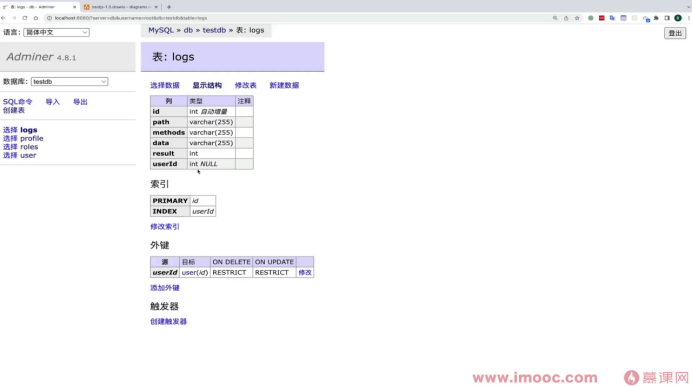
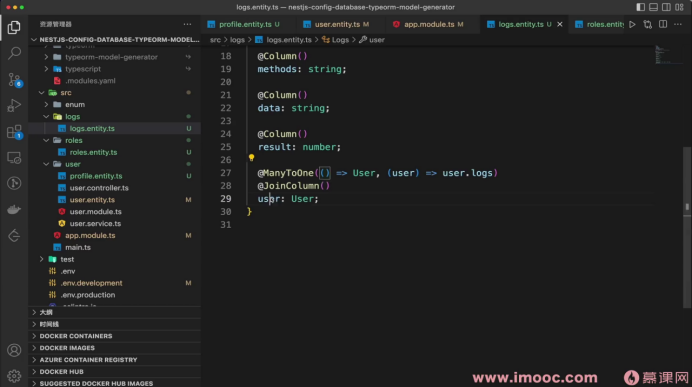

说明：
- 在 `@ManyToOne` 场景中，`@JoinColumn` 可以省略，TypeORM 会自动生成外键列（默认列名为 `属性名 + Id`，如 `userId`）
- 显式添加 `@JoinColumn` 可以自定义外键列名，使表结构更清晰
- `@JoinColumn` 只能放在 `@ManyToOne` 一侧（外键持有方），不能放在 `@OneToMany` 一侧

---

## 八、扩展：多对多关系简介（`@ManyToMany` + `@JoinTable`）

当两个实体之间存在多对多关系时（如 User 和 Role），需要使用 `@ManyToMany` 装饰器，并通过 `@JoinTable` 创建中间表：

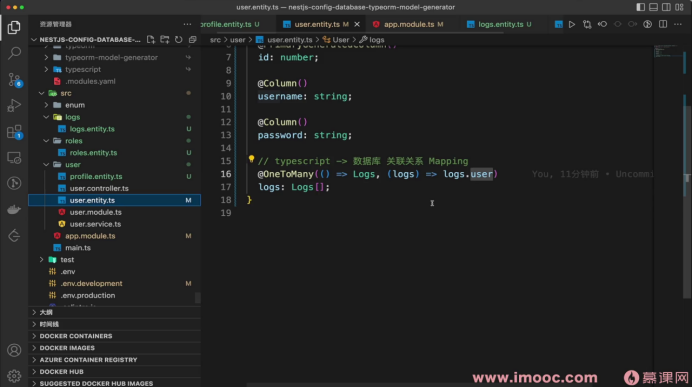
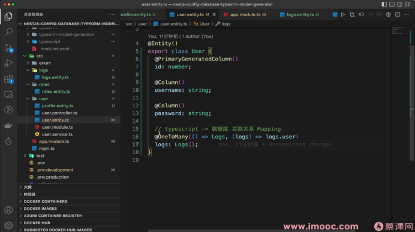
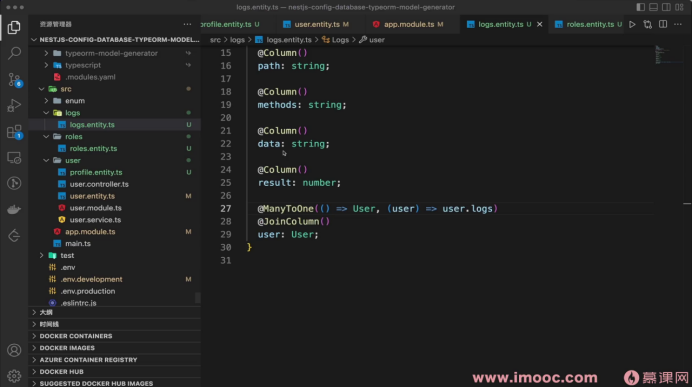
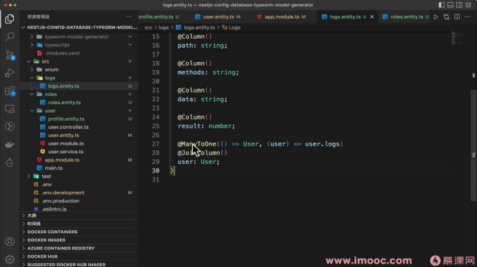

```typescript
// User 实体
@ManyToMany(() => Role, (role) => role.users)
@JoinTable({ name: 'user_role' }) // 指定中间表名称
roles: Role[];

// Role 实体
@ManyToMany(() => User, (user) => user.roles)
users: User[];
```

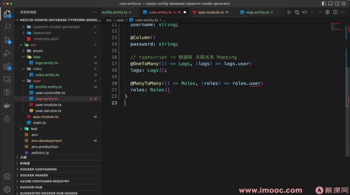
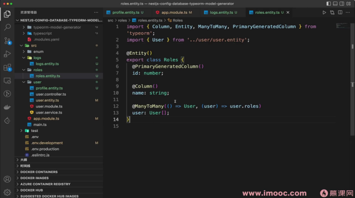

要点：
- `@JoinTable` 只需在关系的一侧添加（通常是"拥有方"），TypeORM 会自动创建中间表
- 中间表包含两个外键列（如 `userId` 和 `roleId`），并建立联合索引
- 区别于一对多中的 `@JoinColumn`，多对多关系使用 `@JoinTable` 来管理中间表

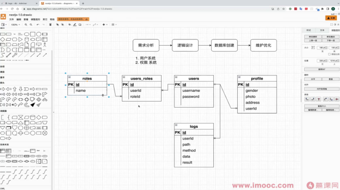
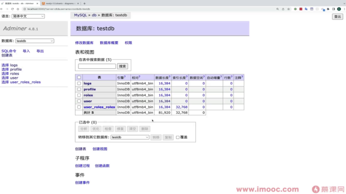

保存多对多关系后，中间表会自动维护两个实体之间的关联记录。

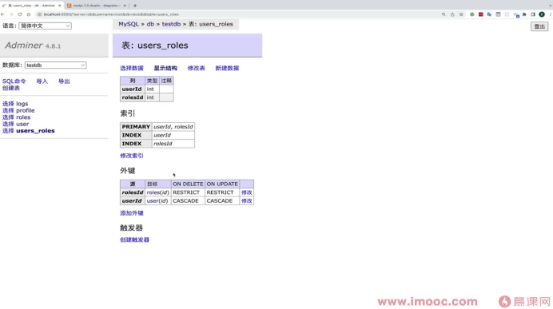
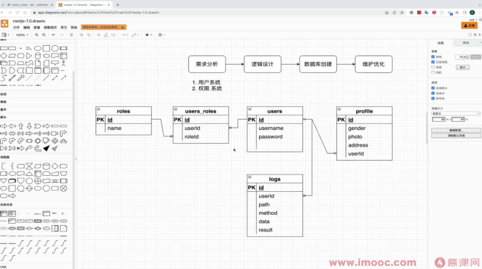

---

## 九、总结

| 关系类型 | 装饰器 | 外键位置 | 额外装饰器 |
|---------|--------|---------|-----------|
| 一对多 | `@OneToMany` | 多的一侧（不持有外键） | 无 |
| 多对一 | `@ManyToOne` | 当前实体（持有外键） | `@JoinColumn`（可选） |
| 多对多 | `@ManyToMany` | 中间表 | `@JoinTable`（一侧必须） |

核心要点：
1. `@OneToMany` 和 `@ManyToOne` 成对使用，第二个参数互相指向对方的关联属性，形成双向关联
2. 第二个参数（inverseSide）的本质是告诉 TypeORM "对方实体中哪个属性指向了我"，从而生成正确的 JOIN 条件
3. `@ManyToOne` 的第二个参数可以省略（变为单向关联），但 `@OneToMany` 必须写第二个参数才能工作
4. 外键始终由 `@ManyToOne` 一侧持有，`@JoinColumn` 也只能放在这一侧
5. 查询关联数据时需要通过 `relations` 选项或 `QueryBuilder` 的 `leftJoinAndSelect` 显式加载
6. 多对多关系需要 `@JoinTable` 创建中间表，只在一侧添加即可
