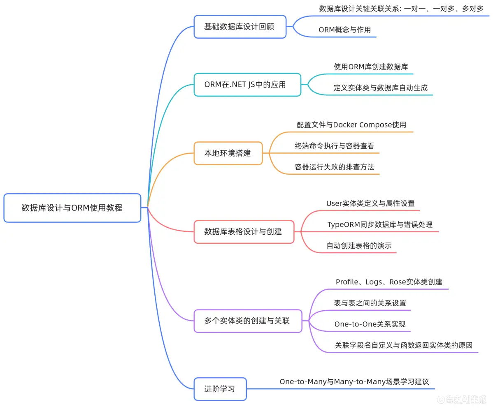

# 一对一关系表创建

本视频讲述了使用TypeORM在NestJS中通过实体类设计数据库表结构，并实现一对一、一对多、多对多关联关系的自动化建表与配置方法，重点演示了实体定义、注解使用及关联字段生成机制。



## 课程回顾与ORM概念引入

### 上节课内容回顾

- 回顾数据库设计基础环节，包括表格设计及一对一、一对多、多对多等关键关联关系。

### 开发实践中的简化方案

- 实际系统开发中并非所有步骤（需求分析、逻辑设计、数据库创建）都需手动完成。

### ORM（对象关系映射）介绍

- ORM代表对象关系映射，在NestJS中可通过TypeORM库自动根据实体类创建数据库。

### Entity（实体类）定义

- 在TypeORM中，实体类用于描述数据表结构，只需定义好实体类，框架会自动创建对应数据库表。

## 本地数据库环境搭建

### Docker Compose配置文件使用

- 项目中存在docker-compose.yml文件，用于配置本地数据库服务、用户密码及Adminer监控页面。

### 启动命令执行方式

- 在终端中执行docker-compose up -d命令以启动服务，需确保当前目录为docker-compose.yml所在根目录。

### 容器运行状态查看

- 使用docker ps命令查看正在运行的容器及其端口映射情况。

### 容器运行失败排查

- 若运行失败，可使用docker logs <容器名称>命令查看日志以定位问题。

## User实体类定义与数据库同步

### User实体文件路径

- src/user/user.entity.ts 文件用于定义用户表结构。

### 基本字段定义

- id: number：主键字段，类型为number。
- username: string：用户名字段，类型为string。
- password: string：密码字段，类型为string。

### 注解使用说明

- @Entity()：标识该类为TypeORM实体类。
- @PrimaryGeneratedColumn()：标识主键字段并启用自增。
- @Column()：标识普通字段。

### AppModule中注册实体

- 需在app.module.ts中将User实体添加至TypeORM模块的entities数组中，并进行头部导入。

### 项目启动与数据库同步

- 执行npm run start:dev命令启动项目，若未提前创建testdb数据库，TypeORM将报错"Unknown database testdb"。

### 数据库手动创建流程

- 在Adminer界面手动创建名为testdb的数据库，字符集选择UTF8MB4，保存后重新运行项目即可成功同步。

## TypeORM自动建表结果验证

### 浏览器验证表结构生成

- 启动成功后访问localhost:8080，刷新Adminer界面可见自动生成user表。

### 字段类型与约束确认

- 自动生成的表包含id、username、password字段，类型正确，且id字段设置为自动增量（AUTO_INCREMENT）。

## Profile实体类创建

### 文件创建与类定义

- 在user目录下新建profile.entity.ts文件，导出Profile类。

### Entity注解添加

- 类上方添加@Entity()注解。

### 字段定义

- id: number：主键，使用@PrimaryGeneratedColumn()。
- gender: number：性别字段，使用@Column()。
- photo: string：照片字段，使用@Column()。
- address: string：地址字段，使用@Column()。

### AppModule注册

- 将Profile实体导入并在app.module.ts中注册。

## Logs与Role实体类创建

### 目录结构创建

- 新建logs和role两个目录用于存放对应实体。

### Role实体定义

- 文件名：role.entity.ts。
- 字段仅保留name: string，删除其他冗余字段。
- 添加@Entity()、@PrimaryGeneratedColumn()、@Column()注解。

### Logs实体定义

- 文件名：logs.entity.ts。
- 字段包括：
  - id: number
  - path: string
  - method: string
  - date: Date
  - result: number（用于存储status code）
- 各字段均添加@Column()注解。

### AppModule注册

- 将Logs和Role实体导入并注册至app.module.ts中的entities数组。

## 一对一关联关系设置（User ↔ Profile）

### 关联关系类型

- User与Profile之间为一对一关系（One-to-One）。

### 关联字段生成机制

- user_id字段由TypeORM自动添加，无需手动定义。

### OneToOne注解使用

- 在Profile类中定义字段user: User，使用@OneToOne(() => User)注解。

### JoinColumn注解作用

- 使用@JoinColumn()指定外键字段在当前表（Profile）中生成。

### 字段命名自定义

- 可通过@JoinColumn({ name: 'user_id' })或{ name: 'uid' }自定义外键字段名。

### 函数返回类的原因

- 避免循环依赖问题。
- 实现按需加载，确保实体类在使用时已初始化。

### TypeORM关联注解核心要点总结

- 注解第一个参数传入目标实体类类型。
- @JoinColumn指定在哪张表中创建关联字段。

## 后续学习引导

### 进阶关联关系学习建议

- 建议学员查阅官方TypeORM文档，自主学习一对多（One-to-Many）和多对多（Many-to-Many）关系的实现方式。

## 代码示例

### User实体类

```typescript
// src/user/user.entity.ts
import { Entity, PrimaryGeneratedColumn, Column } from "typeorm";

@Entity()
export class User {
  @PrimaryGeneratedColumn()
  id: number;

  @Column()
  username: string;

  @Column()
  password: string;
}
```

### Profile实体类

```typescript
// src/user/profile.entity.ts
import {
  Entity,
  PrimaryGeneratedColumn,
  Column,
  OneToOne,
  JoinColumn,
} from "typeorm";
import { User } from "./user.entity";

@Entity()
export class Profile {
  @PrimaryGeneratedColumn()
  id: number;

  @Column()
  gender: number;

  @Column()
  photo: string;

  @Column()
  address: string;

  @OneToOne(() => User)
  @JoinColumn()
  user: User;
}
```

### Role实体类

```typescript
// src/role/role.entity.ts
import { Entity, PrimaryGeneratedColumn, Column } from "typeorm";

@Entity()
export class Role {
  @PrimaryGeneratedColumn()
  id: number;

  @Column()
  name: string;
}
```

### Logs实体类

```typescript
// src/logs/logs.entity.ts
import { Entity, PrimaryGeneratedColumn, Column } from "typeorm";

@Entity()
export class Logs {
  @PrimaryGeneratedColumn()
  id: number;

  @Column()
  path: string;

  @Column()
  method: string;

  @Column()
  date: Date;

  @Column()
  result: number;
}
```

### AppModule配置

```typescript
// src/app.module.ts
import { Module } from "@nestjs/common";
import { TypeOrmModule } from "@nestjs/typeorm";
import { User } from "./user/user.entity";
import { Profile } from "./user/profile.entity";
import { Role } from "./role/role.entity";
import { Logs } from "./logs/logs.entity";

@Module({
  imports: [
    TypeOrmModule.forRoot({
      type: "mysql",
      host: "localhost",
      port: 3306,
      username: "root",
      password: "123456",
      database: "testdb",
      entities: [User, Profile, Role, Logs],
      synchronize: true,
    }),
  ],
  controllers: [],
  providers: [],
})
export class AppModule {}
```
