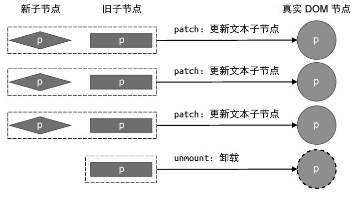

### 简单 diff 算法

操作 DOM 的开销是很大的，所以当新旧 VNode 都是一组节点的时候，我们需要尽可能的复用已经存在的节点，而不是频繁的创建新的节点。所以以最小的性能开销完成更
新操作，需要比较两组子节点，用于比较的算法就叫作 Diff 算法。

#### 未使用 key 的情况

未使用 key 的时候，会按照新旧 VNode 数组的索引位置进行逐位对比(patch)更新真实 DOM。


如果新旧 VNode 数组长度不一致：

- 新的 VNode 数组的长度大于旧的 VNode 数组的长度，那么就会在末尾挂在对应节点。
- 新的 VNode 数组的长度小于旧的 VNode 数组的长度，那么就会卸载多余的节点。

```js
/**
 * 处理未使用key的情况
 * @param c1 旧子节点数组
 * @param c2 新子节点数组
 * @param container 容器
 */
 const patchUnkeyedChildren = (
  c1: VNode[],
  c2: VNodeArrayChildren,
  container: RendererElement
) => {
  // 标准化新旧子节点数组（处理空值情况）
  c1 = c1 || EMPTY_ARR
  c2 = c2 || EMPTY_ARR
  const oldLength = c1.length  // 旧子节点数量
  const newLength = c2.length  // 新子节点数量
  const commonLength = Math.min(oldLength, newLength) // 公共区间长度

  // 遍历公共区间进行就地更新
  let i
  for (i = 0; i < commonLength; i++) {
    // 克隆或标准化新子节点（处理SSR hydration情况）
    const nextChild = (c2[i] = optimized
      ? cloneIfMounted(c2[i] as VNode)
      : normalizeVNode(c2[i]))
    // 递归patch相同位置的子节点
    patch(
      c1[i],
      nextChild,
      container
    )
  }

  if (oldLength > newLength) {
    // 卸载多余的旧子节点（从公共区间结束位置开始）
    unmountChildren(
      c1,
      // ...,
      commonLength, // 从公共区间后开始移除
    )
  } else {
    // 挂载新增的子节点（从公共区间结束位置开始）
    mountChildren(
      c2,
      container,
      // ...,
      commonLength, // 挂载起始位置
    )
  }
}
```

#### DOM 复用与 key 的作用

上述的操作中是逐位比对新旧 VNode 数组的索引位置，无法复用移动后的节点。所以需要确定新的子节点是否出现在旧的一组子节点中，因此需要为每个 VNode 都指定
一个唯一的 key。

**如何寻找需要移动的节点：**

- 当新旧两组子节点的节点顺序不变时，就不需要额外的移动操作，新节点在旧节点中的索引位置按顺序分别为[0,1,2]，具有递增性

- 当顺序变化时
  
  新节点在旧节点中的索引位置按顺序分别为[2,0,1]，不具有递增性，所以需要移动节点。

1. 初始化基准索引

- 设置 lastIndex = 0，记录遍历过程中遇到的最大旧节点索引

2. 新节点遍历阶段

```javascript
for (新节点数组) {
   在旧节点数组中查找相同key的节点
   if (找到可复用节点) {
      更新节点内容(patch)
      if (旧索引 < lastIndex) {
         移动DOM到正确位置
      } else {
         更新lastIndex = 当前旧索引
      }
   } else {
      挂载新节点到正确位置
   }
}
```

3. DOM 移动规则

移动条件：当旧节点索引 j < lastIndex
锚点选择：前驱节点的下一个兄弟节点
插入方式：insertBefore DOM API

4. 新增节点挂载

首节点：插入到容器第一个位置
后续节点：插入到前驱节点之后

5. 旧节点清理阶段

```javascript
for (旧节点数组) {
   if (不在新节点数组中) {
      卸载该节点
   }
```

1. 递增序列优化
   当旧索引序列保持递增时（如[0,1,2]），算法无需移动任何节点，仅更新内容

1. 移动最少化原则
   通过 lastIndex 基准值，确保仅当节点顺序发生逆序时才执行 DOM 移动

1. 双端锚点定位
   挂载新节点时：

- 首节点使用 container.firstChild 作为锚点
- 后续节点使用前驱节点的 nextSibling 作为锚点

1. 全量清理机制
   最后遍历旧节点数组时，会全量检查所有需要删除的废弃节点

```js
function patchKeyedChildren() {
  // ...

  // 用来存储寻找过程中遇到的最大索引值
  let lastIndex = 0;
  for (let i = 0; i < newChildren.length; i++) {
    const newVNode = newChildren[i];
    // 在第一层循环中定义变量 find，代表是否在旧的一组子节点中找到可复用的节点，
    // 初始值为 false，代表没找到
    let find = false;
    for (let j = 0; j < oldChildren.length; j++) {
      const oldVNode = oldChildren[j];
      if (newVNode.key === oldVNode.key) {
        // 一旦找到可复用的节点，则将变量 find 的值设为 true
        find = true;
        // 调用 patch 函数进行更新
        patch(oldVNode, newVNode, container);
        if (j < lastIndex) {
          // 如果当前找到的节点在旧 children 中的索引小于最大索引值lastIndex,
          // 说明该节点对应的真实 DOM 需要移动
          const prevVNode = newChildren[i - 1];
          if (prevVNode) {
            // 由于我们要将 newVNode 对应的真实 DOM 移动到prevVNode 所对应真实 DOM 后面，
            // 所以我们需要获取 prevVNode 所对应真实 DOM 的下一个兄弟节点，并将其作为锚点
            const anchor = prevVNode.el.nextSibling;
            // 调用 insert 方法将 newVNode 对应的真实 DOM 插入到锚点元素前面，
            // 也就是 prevVNode 对应真实 DOM 的后面
            insert(newVNode.el, container, anchor);
          }
        } else {
          // 如果当前找到的节点在旧 children 中的索引不小于最大索引值，
          // 则更新 lastIndex 的值
          lastIndex = j;
        }
        break; // 这里需要 break
      }
    }

    // 如果代码运行到这里，find 仍然为 false， 说明在旧的一组子节点中没有找到可复用的节点
    // 也就是说，当前 newVNode 是新增节点，需要挂载
    if (!find) {
      // 为了将节点挂载到正确位置，我们需要先获取锚点元素
      // 首先获取当前 newVNode 的前一个 vnode 节点
      const prevVNode = newChildren[i - 1];
      let anchor = null;
      if (prevVNode) {
        // 如果有前一个 vnode 节点，则使用它的下一个兄弟节点作为锚点元素
        anchor = prevVNode.el.nextSibling;
      } else {
        // 如果没有前一个 vnode 节点，说明即将挂载的新节点是第一个子节点
        // 这时我们使用容器元素的 firstChild 作为锚点
        anchor = container.firstChild;
      }
      // 挂载 newVNode
      patch(null, newVNode, container, anchor);
    }
  }

  // 上一步的更新操作完成后
  // 遍历旧的一组子节点
  for (let i = 0; i < oldChildren.length; i++) {
    const oldVNode = oldChildren[i];
    // 拿旧子节点 oldVNode 去新的一组子节点中寻找具有相同 key 值的节点
    const has = newChildren.find((vnode) => vnode.key === oldVNode.key);
    if (!has) {
      // 如果没有找到具有相同 key 值的节点，则说明需要删除该节点
      // 调用 unmount 函数将其卸载
      unmount(oldVNode);
    }
  }

  // ...
}
```

**diff 算法入口：**

```js
// 比较两组子节点的函数
const patchChildren: PatchChildrenFn = (
  n1,
  n2,
  container,
  anchor,
  parentComponent,
  parentSuspense,
  namespace: ElementNamespace,
  slotScopeIds,
  optimized = false,
) => {
  const c1 = n1 && n1.children // 旧子节点
  const prevShapeFlag = n1 ? n1.shapeFlag : 0 // 旧VNode的形状标志
  const c2 = n2.children // 新子节点

  const { patchFlag, shapeFlag } = n2
  // 快速路径处理
  if (patchFlag > 0) {
    // 处理带有key的Fragment（可能包含混合key的情况）
    if (patchFlag & PatchFlags.KEYED_FRAGMENT) {
      patchKeyedChildren(
        c1 as VNode[],
        c2 as VNodeArrayChildren,
        container,
        anchor,
        parentComponent,
        parentSuspense,
        namespace,
        slotScopeIds,
        optimized,
      )
      return
    }
    // 处理不带key的Fragment
    else if (patchFlag & PatchFlags.UNKEYED_FRAGMENT) {
      patchUnkeyedChildren(
        c1 as VNode[],
        c2 as VNodeArrayChildren,
        container,
        anchor,
        parentComponent,
        parentSuspense,
        namespace,
        slotScopeIds,
        optimized,
      )
      return
    }
  }

  // 处理子节点的三种情况：文本节点、数组子节点或无子节点
  if (shapeFlag & ShapeFlags.TEXT_CHILDREN) {
    // 文本子节点快速路径
    if (prevShapeFlag & ShapeFlags.ARRAY_CHILDREN) {
      // 如果旧节点是数组，先卸载所有旧子节点
      unmountChildren(c1 as VNode[], parentComponent, parentSuspense)
    }
    // 更新文本内容（当新旧文本不同时）
    if (c2 !== c1) {
      hostSetElementText(container, c2 as string)
    }
  } else {
    // 处理数组子节点的情况
    if (prevShapeFlag & ShapeFlags.ARRAY_CHILDREN) {
      // 旧子节点是数组的情况
      if (shapeFlag & ShapeFlags.ARRAY_CHILDREN) {
        // 新旧都是数组，进行全量diff
        patchKeyedChildren(
          c1 as VNode[],
          c2 as VNodeArrayChildren,
          container,
          anchor,
          parentComponent,
          parentSuspense,
          namespace,
          slotScopeIds,
          optimized,
        )
      } else {
        // 新子节点不是数组，卸载所有旧子节点
        unmountChildren(c1 as VNode[], parentComponent, parentSuspense, true)
      }
    } else {
      // 旧子节点是文本或空的情况
      if (prevShapeFlag & ShapeFlags.TEXT_CHILDREN) {
        // 清除旧文本内容
        hostSetElementText(container, '')
      }
      // 挂载新的数组子节点
      if (shapeFlag & ShapeFlags.ARRAY_CHILDREN) {
        mountChildren(
          c2 as VNodeArrayChildren,
          container,
          anchor,
          parentComponent,
          parentSuspense,
          namespace,
          slotScopeIds,
          optimized,
        )
      }
    }
  }
}
```
