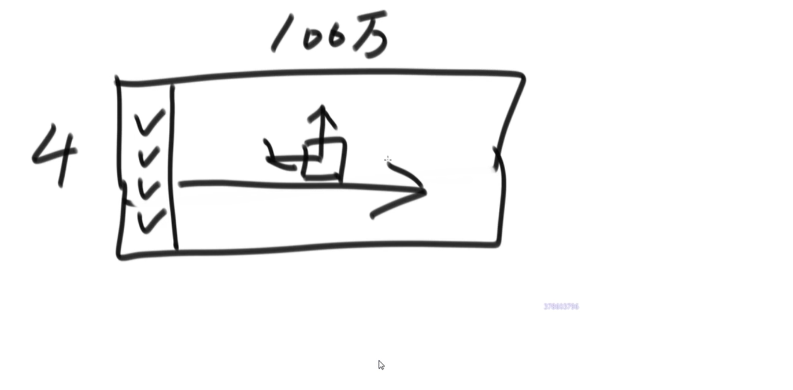
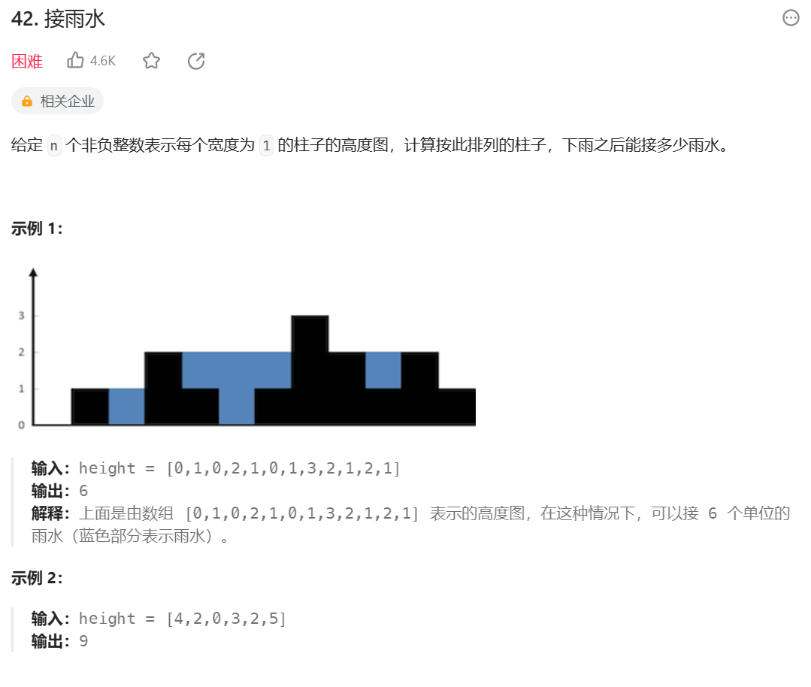

### 题目一

宠物、狗和猫的类如下:

```java
public static class Pet {
    private String type;
    public Pet(String type) {
        this.type = type;
    }
    public String getPetType() {
        return this.type;
    }
}
public static class Dog extends Pet {
    public Dog() {
    super("dog");
    }
}
public static class Cat extends Pet {
    public Cat() {
    super("cat");
    }
}
```

实现一种狗猫队列的结构，要求如下:
- 用户可以调用add方法将cat类或dog类的 实例放入队列中;
- 用户可以调用pollAll方法，将队列中所有的实例按照进队列 的先后顺序依次弹出;
- 用户可以调用pollDog方法，将队列中dog类的实例按照 进队列的先后顺序依次弹出;
- 用户可以调用pollCat方法，将队列中cat类的实 例按照进队列的先后顺序依次弹出;
- 用户可以调用isEmpty方法，检查队列中是 否还有dog或cat的实例;
- 用户可以调用isDogEmpty方法，检查队列中是否有dog 类的实例;
- 用户可以调用isCatEmpty方法，检查队列中是否有cat类的实例。
- 要求以上所有方法时间复杂度都是O(1)的

### 题目二

实现一个特殊的栈，在实现栈的基本功能的基础上，再实现返回栈中最小元素
的操作。
要求：1.pop、push、getMin操作的时间复杂度都是O(1)；2.设计的栈类型可以
使用现成的栈结构

**思路：**

1. 建立两个栈，一个栈正常的pop和push操作，另一个为最小值栈；
2. push一个值时，如果最小值栈为空直接push，如果不为空，值小于等于最小值栈栈顶时压入，否则最小值栈不操作；
3. pop一个值时，如果这个值等于最小值栈栈顶，则最小值栈pop栈顶；

### 题目三

如何仅用队列结构实现栈结构?

**思路：**

1. 用两个队列进行实现，分别为队列a和队列b；
2. 一开始用户push数据时加入队列a中，当用户开始pop时，将队列a中数据只剩下一个，其他从队尾出加入队列b中，将队列a中最后一个值最为pop的数据；
3. 接下来如果push数据则在队列b中操作，如果pop则按照2进行操作；

如何仅用栈结构实现队列结构?

**思路：**

1. 用两个栈来实现，一个push栈，一个pop栈；
2. 当用户push后，如果pop栈为空，将push栈所有数据弹出压入pop栈；如果pop栈不为空则不操作；
3. 当用回pop时，如果pop栈为空，则将push栈中的所有数据弹出压入pop栈再弹出；如果不为空直接弹出；

### 题目四

动态规划的空间压缩技巧


如果一个动态规划表中任意一个位置的值只依赖左边和上边的值，则可以只申请数组来进行求解；

第一行只依赖自己左边的值，第一列只依赖自己上边的值。申请一个数组，一开始表示第一行。根据第一行第一列的数a可以推导出第一行的所有值。此外根据第一行第一列的数a可以推出第二行第一列的数f，将a更新为f。根据f和b可以推出第二行第二列的数，依次下去可以将数组更新为动态规划表中第二行、第三行。。。的值；



除了可以申请数据代表行的值，也可以申请数组代表列向右更新；


如果依赖关系不止在相邻行列，可以申请多个数组更新操作

**如果依赖关系跨越行列数过大，则不能空间压缩，否则可能回开销更大**

三维动态规划也可以压缩：临近的层依赖，则可以只申请两个层不断更新；

**题目：**

给你一个二维数组matrix，其中每个数都是正数，要求从左上角走到右下角。每
一步只能向右或者向下，沿途经过的数字要累加起来。最后请返回最小的路径和。


**题目五（leetcode42）**

给定一个数组arr，已知其中所有的值都是非负的，将这个数组看作一个容器，请返回容器能装多少水

比如，arr = {3，1，2，5，2，4}，根据值画出的直方图就是容器形状，该容器可以装下5格水

再比如，arr = {4，5，1，3，2}，该容器可以装下2格水



**思路1：**

1. 遍历整个数组，用两个辅助数组leftMax、rightMax分别记录当前下标左侧最大值和右侧最大值。
2. 再次遍历整个数组，假设当前下标i、值为cur。此时下标i处可以接的水量为Max(Min(leftMax, rightMax) - cur, 0)，左右两侧最大值限制了下标i处的接水量，如果cur大于两者的最小值则接不了水。
3. 总水量为所有下标可接水量和；
4. 时间复杂度O(n)、空间复杂度O(n);

**思路2（双指针，优化流程结算过程，减少空间复杂度）：**

1. 用变量all表示可接的水量；
2. 用两个指针left和right分别指向下标1和arr.length-2（开头和结尾处一定接不住水，所以跳过）；
3. 用两个变量leftMax和rightMax分别表示left指针左侧最大值和right指针右侧最大值；
4. 从leftMax和rightMax中较小一侧的指针开始移动（假设leftMax较小，此时left指针所指向的下标左侧最大值已经确定，而右侧最大值不会小于rightMax，且leftMax < rightMax，所以此时下标left的瓶颈为leftMax）。比较left(right)和leftMax(rightMax)确定此时可接的水量，更新all、leftMax、left；
5. 重复操作4，直到left > right;
6. 时间复杂度O(n)，空间复杂度O(1)

### 题目六

给定一个数组arr长度为N，你可以把任意长度大于0且小于N的前缀作为左部分，剩下的作为右部分。但是每种划分下都有左部分的最大值和右部分的最大值，请返回最大的，左部分最大值减去右部分最大值的绝对值。


**思路1（预处理）：**

1. 用两个辅助数组leftMax和rightMax，分别记录当前index左边最大值和右边最大值；
2. 遍历数组，求出每个下标的|leftMax - rightMax|，返回最大值；
3. 时间复杂度O(n)，空间复杂度O(n)

**思路2（根据标准优化）**

1. 遍历数组得出全局最大值Max；
2. 结果中一定是Max减去一个数，接下来分成两种情况：
   1. Max被划分到左边，要想返回值最大，就需要右边的rightMax尽量的小。因为右边部分一定会包含N-1位置的值（任意长度大于0且小于N的前缀作为左部分，剩下的作为右部分，表明左边和右边都一定要有值），所以右边部分的最大值rightMax >= arr[N-1]，所以此时右边部分只包含N-1位置返回值会最大；
   2. Max被划分到右边，与划分到左边一致，左边部分只包含0位置时返回值会最大；
3. 判断上述两种情况返回最大值；
4. 时间复杂度O(n)，空间复杂度O(1)


### 题目七（leetcode）

如果一个字符串为str，把字符串str前面任意的部分挪到后面形成的字符串叫作str的旋转词。

比如str="12345"，str的旋转词有"12345"、"23451"、"34512"、"45123"和"51234"。

给定两个字符串a和b，请判断a和b是否互为旋转词。

比如：

a="cdab"，b="abcd"，返回true。

a="1ab2"，b="ab12"，返回false。

a="2ab1"，b="ab12"，返回true。

**思路（KMP）：**

1. 如果a和b长度不一致返回false；
2. 将a变成两倍的长度（a+a），判断b是否是2a的子串（KMP算法）。如果是a和b互为旋转词。例如a="cdab"，2a="cdabcdab"，b="abcd"，其实2a中任意长度为a.length的子串都互为旋转词；

### 题目八

给定数组arr、N、a、b

arr: arr中每一项代表一台咖啡机冲出一杯咖啡的时间，店里面一共有arr.length台咖啡机，咖啡机只能串行不能并行。

N：N代表有N个顾客，每人需要一杯咖啡，假设顾客喝咖啡的时间为0。

a：店里只有一台洗杯机，洗一个杯子需要的时间为a；

b：如果不洗杯子过了时间b后杯子也自动挥发变成干净的；

求从所有人开始排咖啡到最后一个杯子干净需要多长时间

**思路：**

将整个过程拆分为两步：1. 顾客排队拿到咖啡； 2. 洗杯器洗杯子；

1. 顾客排队拿到咖啡（小根堆）；
    - 生成一个小根堆，存的是一个咖啡机冲咖啡所要用的时间单位以及在什么时间可用，以两个数相加组织排序，所以堆顶为所有机器中冲完咖啡结束时间最小的；
    - 每个人都选择堆顶的咖啡机弹出，更新可用时间（prev可用时间+这台咖啡机所需的时间单位）后在重新加入小根堆中，并记录每个顾客拿到咖啡的时间；
   
2. 洗杯器洗杯子（从左至右递归，可改动态规划）；
    - 每个杯子都有两种策略： 1. 用洗杯器洗需要时间a； 2. 自然挥发需要时间b；
    - 经过第一步会得到每个顾客拿到咖啡时刻的数组getTimeArr，数组中下标为i的项代表第i个杯子能过被洗的最早时刻；
    - 从第i个杯子开始洗（getTimeArr的第i项）最早结束时刻的计算有如下两种可能：
    - 1. 选择用洗杯器洗；需要等待洗杯器空闲(washLine)并且杯子可洗(getTimeArr[i])，所以洗杯子i的最早结束时刻为wash = Max(washLine, getTimeArr[i]) + a。剩下从i+1个杯子开始洗的最早结束时刻调用递归（next = process(i+1, wash)）。可能1的所有流程的结束时间为Max(wash, next)（需要第i个杯子洗完，剩余的i+1个杯子也要洗完，因为存在可能2，所以next有可能比wash要小，所以需要返回两者间较大的）；
    - 2. 自然挥发；洗第i个杯子的最早结束时间为dry = getTimeArr[i]+b。剩下从i+1个杯子开始洗的最早结束时刻调用递归（next1 = process(i+1, washLine)）。可能2的所有流程的结束时间为Max(dry, next1)；
    - 返回两种可能中结束时间较早的；
### 题目九

给定一个数组，通过调整可以做到arr中任意两个相邻的数字相乘是4的倍数，返回true，否则返回false。

**思路：**

1. 统计arr中的奇数个数a、只包含一个2因子数个数b、包含4为因子数的个数c，满足题目条件a、b、c需要满足如下限制。
2. 如果b == 0（不存在2因子数）
   1. 如果a == 0，c无限制；
   2. 如果a == 1，c >= 1；
   3. 如果a > 1，满足条件需要最少4因子数的排列方式为：奇数 4因子 奇数 4因子 奇数 4因子。。。，所以c >= a - 1;
3. 如果b == 1
   1. 如果a == 0，2因子必须要有一个4因子配对，c >= 1;
   2. 如果a == 1，满足条件需要最少4因子数的排列方式为：2因子 4因子 奇数 4因子。。。，c >= 1;
   3. 如果a > 1，满足条件需要最少4因子数的排列方式为：2因子 4因子 奇数 4因子 奇数。。。 c >= a
4. 如果b > 1
   1. 如果a == 0，所有的2因子可以自己满足条件，c >= 0;
   2. 如果a == 1，满足条件需要最少4因子数的排列方式为：2因子 。。。2因子 4因子 奇数 4因子。。。，c >= 1;
   3. 如果a > 1，满足条件需要最少4因子数的排列方式为：2因子 4因子 奇数 4因子 奇数。。。 c >= a 