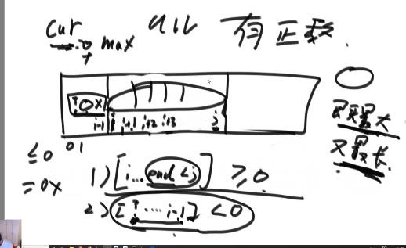
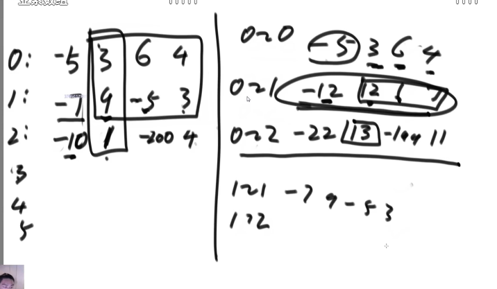

### 题目1

给你一个字符串类型的数组arr，譬如：String[] arr = { "b\\cst", "d\\", "a\\d\\e", "a\\b\\c" };

你把这些路径中蕴含的目录结构给画出来，子目录直接列在父目录下面，并比父目录
向右进两格，就像这样:
```
a
  b
    c
  d
    e
b
  cst
d
```
同一级的需要按字母顺序排列，不能乱。

**思路（前缀树+深度优先遍历）：**

1. 组织成一个前缀树 (先建立一个空节点，然后遍历字符创建前缀树)
   ```ts
    interface Trie {
        name: string;
        nextNode: TreeMap; // 有序表，需手动实现。保证同级目录的顺序从小到大；
    }
   ```
2. 深度优先遍历解决
   1. 第一层的直接打印
   2. 第二层的打印两个空格然后打印那个字符
   3. 第四层的打印四个空格然后打印那个字符


### 题目2

双向链表节点结构和二叉树节点结构是一样的，如果你把last认为是left，next认为是right的话。

给定一个搜索二叉树的头节点head，请转化成一条有序的双向链表，并返回链
表的头节点。要求不能创建任何新的节点，只能调整树中节点指针的指向。

```ts
interface TreeNode {
    left: TreeNode | null;
    right: TreeNode | null;
}

interface LinkList {
    last: LinkList | null;
    next: LinkList | null;
}
```

**思路（二叉树的递归套路）：**

1. 以X为头节点的二叉树，对左子树和右子树分别调用process，返回的Info包括左子树和右子树组织好的双向链表的头节点和尾节点（leftLinkHead、leftLinkTail、rightLinkHead、rightLinkTail），将X与leftLinkTail和rightLinkHead链接，返回leftLinkHead和rightLinkTail（需要注意边界条件，判断leftLinkHead、leftLinkTail、rightLinkHead、rightLinkTail是否为空）；

```js
var treeToDoublyList = function(root) {
    if (root === null) {
        return null;
    }
    function Info(start, end) {
        this.start = start;
        this.end = end;
    }
    function process(root) {
        if (root === null) {
            return new Info(null, null);
        }
        let leftInfo = process(root.left);
        let rightInfo = process(root.right);
        if (leftInfo.end) {
            leftInfo.end.right = root;
            root.left = leftInfo.end;
        }
        if (rightInfo.start) {
            rightInfo.start.left = root;
            root.right = rightInfo.start
        }

        return new Info(leftInfo.start ? leftInfo.start : root, rightInfo.end ? rightInfo.end : root)
    }
    let result = process(root)
    result.start.left = result.end;
    result.end.right = result.start;
    return result.start;
};
```

### 题目3

找到一棵二叉树中，最大的搜索二叉子树，返回最大搜索二叉子树的节点个数（扩展：返回最大搜索二叉子树的头节点）。

**思路：**

以X为头的二叉树的最大搜索二叉树有如下可能：
1. 可能1：X参与最大搜索二叉树的构成；此时需要左树是BST，右树是BST，且X.value大于左树最大值，X.value小于右树最小值；
2. 可能2、3：X不参与最大搜索二叉树的构成；此时最大搜索二叉子树可能来源于左树和右树，需要判断左树和右树最大搜索二叉子树的MaxBSTsize；
3. 如果有可能1返回可能1，否则返回可能2、3中MaxBSTsize较大的；
4. 所以递归需要返回的信息结构：
    ```ts
    interface Info {
        MaxBSTHead: Node;
        min: number;
        max: number;
        isBST: boolean;
        MaxBSTSize: number;
    }
    ```

```ts
 class Node {
        val: number;
        left: Node | null;
        right: Node | null;
        constructor(val: number, left?: Node, right?: Node) {
            this.val = val;
            this.left = left ? left : null;
            this.right = right ? right : null;
        }
    }

    class MaxBSTNumInfo {
        max: number;
        min: number;
        maxBSTNum: number;
        maxBSTHead: Node | null;
        constructor(max: number, min: number, maxBSTNum: number, maxBSTHead: Node | null) {
            this.max = max;
            this.min = min;
            this.maxBSTNum = maxBSTNum;
            this.maxBSTHead = maxBSTHead;
        }
    }
    function getMaxBSTNum(head: Node): number {
        if (head === null) {
            return 0;
        }
        function process(head: Node | null): MaxBSTNumInfo {
            if (head === null) {
                return new MaxBSTNumInfo(-Infinity, Infinity, 0, null)
            }
            const leftInfo = process(head.left);
            const rightInfo = process(head.right);
            let min = Math.min(head.val, Math.min(leftInfo.min, rightInfo.min));
            let max = Math.max(head.val, Math.max(leftInfo.max, rightInfo.max));
            let maxBSTNum = Math.max(leftInfo.maxBSTNum, rightInfo.maxBSTNum);
            let maxBSTHead = leftInfo.maxBSTNum > rightInfo.maxBSTNum ? leftInfo.maxBSTHead : rightInfo.maxBSTHead;

            if (leftInfo.maxBSTHead === head.left && rightInfo.maxBSTHead === head.right && head.val > leftInfo.max && head.val < rightInfo.min) {
                maxBSTNum = leftInfo.maxBSTNum + 1 + rightInfo.maxBSTNum;
                maxBSTHead = head;
            }
            return new MaxBSTNumInfo(max, min, maxBSTNum,maxBSTHead)
        }

        return process(head).maxBSTNum;
    }
```

### 题目4 子数组的最大连续之和（假设答案法）

为了保证招聘信息的质量问题，公司为每个职位设计了打分系统，打分可以为正数，也可以为负数，正数表示用户认可帖子质量，负数表示用户不认可帖子质量。

打分的分数根据评价用户的等级大小不定，比如可以为 -1分，10分，30分，-10分等。

假设数组A记录了一条帖子所有打分记录，现在需要找出帖子曾经得到过最高的分数是多少，用于后续根据最高分数来确认需要对发帖用户做相应的惩罚或奖励．

其中，最高分的定义为：用户所有打分记录中，连续打分数据之和的最大值即认为是帖子曾经获得的最高分。

例如：帖子10001010近期的打分记录为[1,1,-1,-10,11,4,-6,9,20,-10,-2],那么该条帖子曾经到达过的最高分数为11+4+(-6)+9+20=38。

请实现一段代码，输入为帖子近期的打分记录，输出为当前帖子得到的最高分数。

**思路（假设答案法）：**

1. 设定两个变量cur和max，cur记录当前的分数和，max为最大的分数和；
2. 遍历arr，当前数累加到cur，如果cur变得比之前更大了，max更新。如果cur < 0, cur = 0；

**证明：**

1. 当arr中的数全部小于等于0时，流程满足返回的分数最大；
2. 当arr中有正数时，假设数组中分数累加最大且最长的区域范围为`i~j`，具有如下特性：
   1. 任意范围`i~m(m<j)`的累加和大于等于0；如果累加和小于0则分数累加和最大的区域中肯定不包括`i~m`，如果包含这会使整体累加和下降；
   2. 任意范围`n~i-1(n<i-1)`的累加和小于0；如果`n~i-1`的累加和大于0，则最长的区域范围就不是`i~j`而是`n~j`;
   
   所以当遍历数组时累加到i-1时cur小于0，被重置为0，所以当`i~j`中累加时可以返回正确的累加和，且`i~j`的累加和最大，所以流程正确；




```ts
    function maxSum(arr: number[]): number {
        let max = -Infinity;
        let cur = 0;
        for (let score of arr) {
            cur += score;
            max = Math.max(max, cur);
            cur = Math.max(cur, 0);
        }

        return max;
    }
```

### 题目5 （子数组最大累加和+压缩数组）

给定一个整型矩阵，返回子矩阵的最大累计和。

**思路：**

1. 假设矩阵为0~2行，求出如下信息返回最大；
    - 在 0 到 0 行上，哪个子矩阵累加和是最大的
    - 在 0 到 1 行上，哪个子矩阵累加和是最大的
    - 在 0 到 2 行上，哪个子矩阵累加和是最大的
    - 在 1 到 1 行上，哪个子矩阵累加和是最大的
    - 在 1 到 2 行上，哪个子矩阵累加和是最大的
    - 在 2 到 2 行上，哪个子矩阵累加和是最大的
  
  如果矩阵还有其他行依次求出；

2. 求第i~j行上，哪个子矩阵累加和最大；
   1. 如果i等于j；假设i=0，问题变成求第0行的子数组最大累加和，直接调用**题目4**；
   2. 如果i不等于j；将i~j行对应列累加，压缩成一行，求子数组最大累加和；




```ts
    function getSubMatrixMaxSum(matrix: number[][]): number {
        let max = -Infinity;
        let cur = 0;

        for (let i = 0; i < matrix.length; i++) {
            let arr = new Array(matrix.length).fill(0);
            for (let j = i; j < matrix.length; j++) {
                cur = 0;
                for (let index = 0; index < arr.length; index++) {
                    arr[index] += matrix[j][index];
                    cur += arr[index];
                    max =  Math.max(max, cur);
                    cur = Math.max(0, cur)
                }
            }
        }

        return max;
    }
```