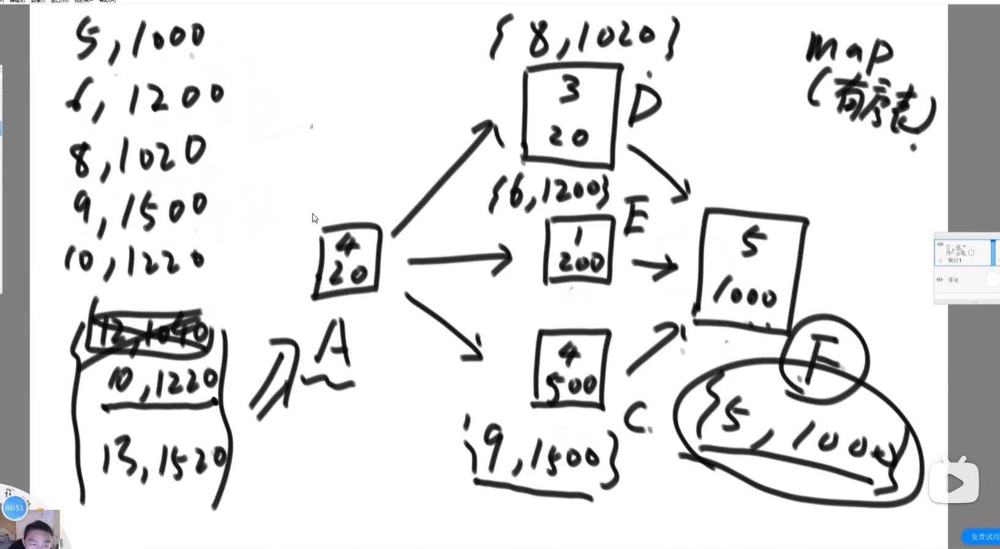

### 题目一

给定一个整数数组 A，长度为 n，有 1 <= A[i] <= n，且对于[1,n]的整数，其中部分整数会重复出现而部分不会出现。实现算法找到[1,n]中所有未出现在 A 中的整数。

提示：尝试实现 O(n)的时间复杂度和 O(1)的空间复杂度（返回值不计入空间复杂度）。

输入描述：

一行数字，全部为整数，空格分隔

A0 A1 A2 A3...

输出描述：

一行数字，全部为整数，空格分隔 R0 R1 R2 R3... 示例 1:

输入

1 3 4 3

输出

2

**思路一（hash 表）：**

1. 用 hash 表记录词频表。
2. 时间复杂度 O(n)、空间复杂度 O(n)

```js
/**
 * @description 获取A中未出现的整数
 * @param {number[]} A
 * @returns {number[]}
 */
function findAbsenceNum(A) {
  const ans = [];
  const len = A.length;
  const map = new Map();
  for (let i = 1; i <= len; i++) {
    map.set(i, 0);
  }
  for (let i of A) {
    map.set(i, map.get(i) + 1);
  }
  for (let key of map.keys()) {
    if (!map.get(key)) {
      ans.push(key);
    }
  }
  return ans;
}
```

**思路二（in-place 算法）：**
arr = [3,2,1,6,2,7,5]

1. 强制规定将数组中值 i+1 放在下标 i 处。
2. 从头开始遍历数组 start= 0，将 arr[0](3)放到下标 2 处，arr[2](1)放到下标 0 处。结束第一轮的替换；
3. 接着从下标 1 开始替换，start = 1。直到 arr[i]对应的下标处已经有重复的值占位了，或者有交换到 start，结束替换
4. 这样当 start 到达数组末尾时，数组中空缺的值就是结果。

```js
/**
 * @description 获取A中未出现的整数
 * @param {number[]} A
 * @returns {number[]}
 */
function findAbsenceNum2(A) {
  const ans = [];
  const len = A.length;

  const swap = (i, j) => {
    let temp = A[i];
    A[i] = A[j];
    A[j] = temp;
  };

  for (let i = 0; i < len; i++) {
    let index = i;
    let next = A[index] - 1;
    // 不断交换位置，将数组中值i+1放在下标i处
    while (next !== i) {
      // 已经有重复的值占位，此时index位置置空
      if (A[next] == A[index]) {
        A[index] = undefined;
        break;
      }
      swap(index, next);
      next = A[index] - 1;
    }
  }

  // 数组中空缺的值就是结果
  for (let i = 0; i < len; i++) {
    if (A[i] == undefined) ans.push(i + 1);
  }
  return ans;
}
```

### 题目二

CC 里面有一个土豪很喜欢一位女直播 Kiki 唱歌，平时就经常给她点赞、送礼、私聊。最近 CC 直播平台在举行
中秋之星主播唱歌比赛，假设一开始该女主播的初始人气值为 start， 能够晋升下一轮人气需要刚好达到 end，
土豪给主播增加人气的可以采取的方法有：
a. 点赞 花费 x C 币，人气 + 2
b. 送礼 花费 y C 币，人气 \* 2
c. 私聊 花费 z C 币，人气 - 2
其中 end 远大于 start 且 end 为偶数， 请写一个程序帮助土豪计算一下，最少花费多少 C 币就能帮助该主播
Kiki 将人气刚好达到 end，从而能够晋级下一轮？
输入描述：
第一行输入 5 个数据，分别为：x y z start end，每项数据以空格分开。
其中：0 ＜ x, y, z ＜＝ 10000， 0 ＜ start, end ＜＝ 1000000
输出描述：
需要花费的最少 C 币。
示例 1:
输入
3 100 1 2 6
输出
6

start 和 end 都是偶数
**思路（用平凡解(一个可能的解)做递归的限制条件）：**

1. 设定递归 process(x, y, z, end, cur)， 当 end === cur 返回 0，分别计算三种方式的可能钱数。
2. 递归缺少 base case 无法执行完毕。
3. 设定全部用人气+2 的方式作为平凡解，如果递归的硬币数大于平凡解的硬币数就越界；（平凡解）
4. 设定当前人气小于目标的 2 倍，否则越界。人气超过两倍再往下减没道理。（业务中找到约束）

### 题目 3

每个活动需要花费一定的时间参与，参与活动可以从任意活动开始，但一旦开始，就需要将后续活动参加完毕，活动之间存在依赖，计算在有限时间内能获得的最大奖励和需要的最少时长

思路：图的宽度优先遍历。 建表 map（有序表）key 总天数，value 钱

每个节点里的表天数变大，收益也变大，最后合成一个大表



### 题目四

给定一个只由 0(假)、1(真)、&(逻辑与)、|(逻辑或)和^(异或)五种字符组成
的字符串 express，再给定一个布尔值 desired。返回 express 能有多少种组合
方式，可以达到 desired 的结果。
【举例】
express="1^0|0|1"，desired=false
只有 1^((0|0)|1)和 1^(0|(0|1))的组合可以得到 false，返回 2。
express="1"，desired=false
无组合则可以得到 false，返回 0

**思路：**

1. 判断字符是否合法。 长度要为奇数，0 2 4 6...偶数位上要为数字 奇数位上要为运算符。
2. 调用 process(exp,L,R,desire)在 L 和 R 范围上能得到 desire 的划分数。L 和 R 不会压中逻辑符号。
3. 循环 exp，计算假设以遇到的逻辑符合为最后运算时需要的方法数，尝试所有可能的结果。

**思路：（动态规划）**

1. 建立两张表 True 和 false。
2. 利用循环跳过不需要填的位置。

### 题目五

在一个字符串中找到没有重复字符子串中最长的长度。
例如：
abcabcbb 没有重复字符的最长子串是 abc，长度为 3
bbbbb，答案是 b，长度为 1
pwwkew，答案是 wke，长度是 3
要求：答案必须是子串，"pwke" 是一个子字符序列但不是一个子字符串

**思路：**

1. 计算以下标 i 为结尾的子串中没有重复子串的最长长度：
   1. 下标 i 字符上一次出现的位置 p；
   2. 以下标 i-1 为结尾的子串的没有重复子串的最长长度 l；
2. 以上两种情况判断得出最长长度 min(i-p, l+1)。

### 题目六

给定两个字符串 str1 和 str2，再给定三个整数 ic、dc 和 rc，分别代表插入、删
除和替换一个字符的代价，返回将 str1 编辑成 str2 的最小代价。
【举例】
str1="abc"，str2="adc"，ic=5，dc=3，rc=2
从"abc"编辑成"adc"，把'b'替换成'd'是代价最小的，所以返回 2
str1="abc"，str2="adc"，ic=5，dc=3，rc=100
从"abc"编辑成"adc"，先删除'b'，然后插入'd'是代价最小的，所以返回 8
str1="abc"，str2="abc"，ic=5，dc=3，rc=2
不用编辑了，本来就是一样的字符串，所以返回 0

**思路：动态规划**

1. 建立 dp 表 i\*j（str1 长度 i，str2 长度 j）；
2. dp[i][j]表示将 str1 0~i 位置变为 str2 0~j 位置的最小代价；
3. 当 i=0 和 j=0 时可以得出 base case
4. dp[i][j]有以下四种可能：
   1. 将 str1 0~i-1 变成 str2 0 ~j（dp[i-1][j]）,之后再将 i 位置删除；
   2. 将 str1 0~i 变成 str2 0~j-1（dp[i][j-1]），之后再加入 str2 j 位置；
   3. 将 str1 0~i-1 变成 str2 0~j-1 (dp[i-1][j-1])，之后再将 str1 i 位置替换成 str2 j 位置；
   4. 将 str1 0~i-1 变成 str2 0~j-1 (dp[i-1][j-1])，str1 i 位置与 str2 j 位置相等，不需要操作；

### 题目七

给定一个全是小写字母的字符串 str，删除多余字符，使得每种字符只保留一个，并让
最终结果字符串的字典序最小
【举例】
str = "acbc"，删掉第一个'c'，得到"abc"，是所有结果字符串中字典序最小的。
str = "dbcacbca"，删掉第一个'b'、第一个'c'、第二个'c'、第二个'a'，得到"dabc"，
是所有结 果字符串中字典序最小的

**思路：**

1. 首先记录字符串的词频表，遍历字符串，每遍历一个字符对应词频减一，并记录遍历过程中最小 ASCll 码的位置；
2. 当有字符的词频减为 0，此时最小 Ascii 位置的字符为最终结果中的字符；
3. 从此时最小 Ascii 位置到最后的字符串中去掉最小 ascii 字符，递归调用函数。

### 题目八

在 K 数 MP 据算加法密扩和展数据题压目缩二中常需要对特殊的字符串进行编码。给定的字母表 A 由 26 个小写英文字母组成，即
A={a, b...z}。该字母表产生的长序字符串是指定字符串中字母从左到右出现的次序与字母在字母表中出现
的次序相同，且每个字符最多出现 1 次。例如，a，b，ab，bc，xyz 等字符串是升序字符串。对字母表 A 产生
的所有长度不超过 6 的升序字符串按照字典排列编码如下：a(1)，b(2)，c(3)……，z(26)，ab(27)，
ac(28)……对于任意长度不超过 16 的升序字符串，迅速计算出它在上述字典中的编码。
输入描述：
第 1 行是一个正整数 N，表示接下来共有 N 行，在接下来的 N 行中，每行给出一个字符串。输出描述：
输出 N 行，每行对应于一个字符串编码。
示例 1:
输入
3
a
b
ab
输出
1
2
27

**思路：**

1. g(chr, len): 以 chr 字符开头，长度为 len 的符合条件的字符串编码个数。遍历 chr 字符之后的字符，以这些字符开头，长度为 len-1 的符合条件的编码个数累加。
2. F(N): 长度为 N 的子序列多少个。累加 a~z 的 g(chr, N)的结果。
3. 假设现在要求{d, v, f}的编码
   1. 用 F(2)计算长度为 2 的子序列个数，这些子序列都在{d, j, v}前面；
   2. 再计算 a~c（d 字符之前的字符）长度为 3 的子序列个数 g(a~c, 3)，这些子序列都在 d \_ \_前面；
   3. 再计算 e~i（d 到 j 之间的字符）长度为 2 的子序列个数 g(e~i, 2)，这些子序列都在 d j \_ 前面;
   4. 在计算 k~u（j 到 v 之间的字符）长度为 1 的子序列个数 g(k~u, 1)，这些子序列都在 d j v 前面;
   5. 累加即得到编码；

在一个 N\*N 的正方形区域，每个小格可能有三种状态
值为 0，正常可通过
值为 1，奥特曼可通过，同时还可以消灭怪兽，消灭后值变为 0，消灭怪兽数量+1
值为-1，有大石头，奥特曼无法通过

奥特曼需要先从上往下走，这个过程只能向下或者向右，到达右下角后，再从下往上走，这个过程只能向左或向上。需要找到奥特曼可以消灭怪兽的最大数量

输入：
第一行一个 N，表示 N 的正方形区域的大小，N 不超过 50
第二行到 N+1 行，每一行 N 个数，表示正方形区域的情况

输出：
奥特曼可以消灭怪兽的最大数量
————————————————
版权声明：本文为 CSDN 博主「jaywangpku」的原创文章，遵循 CC 4.0 BY-SA 版权协议，转载请附上原文出处链接及本声明。
原文链接：https://blog.csdn.net/u013095333/article/details/91902270
