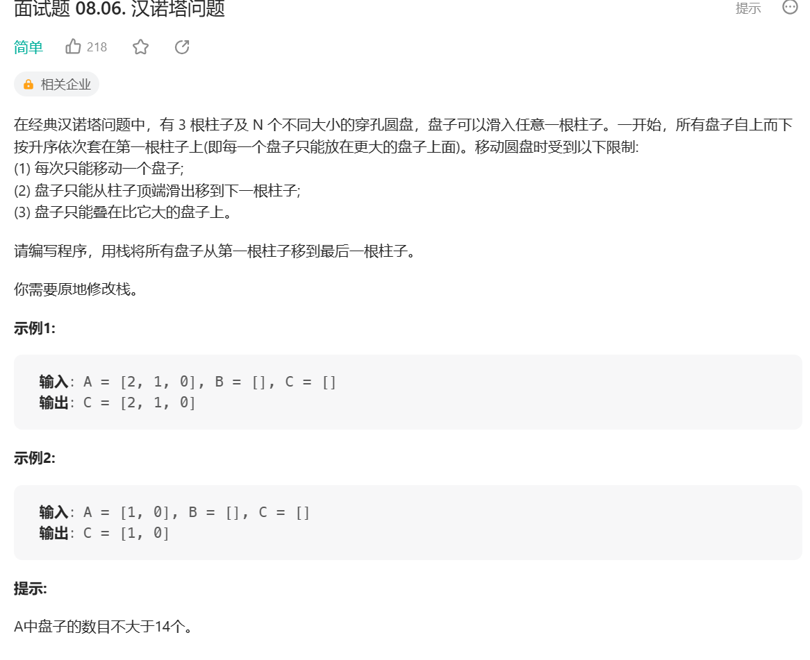
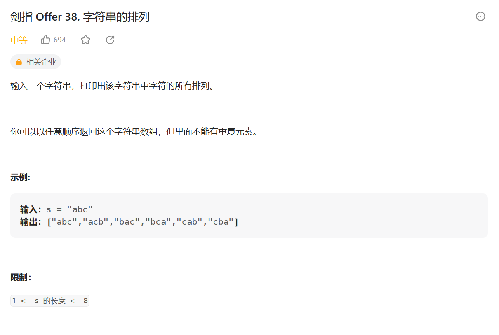
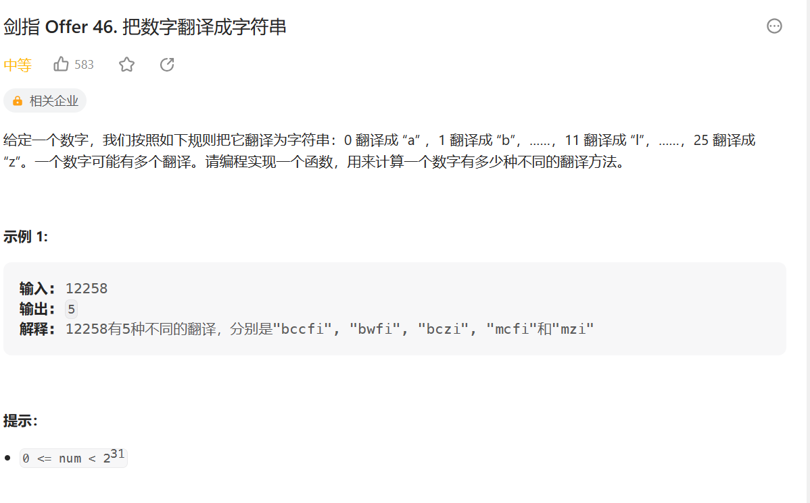

### **N 皇后**


**思路：暴力递归**

1. 用 record 记录皇后位置，下标 i 代表行，record[i]代表列
2. 递归函数 process(i, record, n)，递归每一行，并传递 record
3. 递归中循环判断第 i 行的所有 j 是否满足条件，满足就将 j 记录到 record 中并递归下一行
4. 当递归到第 n 行后，表明此时 record 中记录的位置信息满足所有条件，添加到返回结果中

```js
/**
 * @param {number} n
 * @return {string[][]}
 */
var solveNQueens = function (n) {
  if (n === 1) {
    return [["Q"]];
  }
  let res = [];
  let record = new Array(n); // 记录第i行皇后放在第几列上，下标i代表行，record[i]代表列
  process(0, record, n);
  function process(i, record, n) {
    if (i === n) {
      res.push(toString(record, n));
      return;
    }
    for (let j = 0; j < n; j++) {
      if (isValid(record, i, j)) {
        record[i] = j;
        process(i + 1, record, n);
      }
    }
  }
  function isValid(record, i, j) {
    for (let k = 0; k < i; k++) {
      if (record[k] === j || Math.abs(i - k) === Math.abs(record[k] - j)) {
        return false;
      }
    }
    return true;
  }
  function toString(record, n) {
    let res = [];
    for (let i = 0; i < n; i++) {
      let strArr = new Array(n).fill(".");
      let j = record[i];
      strArr[j] = "Q";
      res.push(strArr.join(""));
    }
    return res;
  }

  return res;
  // console.log(res)
};
```

**优化：位运算加速**

```js
/**
 * @param {number} n
 * @return {string[][]}
 */
var solveNQueens = function (n) {
    const ans = [];
    const result = new Array(n);

    let limit = (1 << n) - 1; // 限制递归的位数
    process(limit, 0, 0, 0, result, ans, 0, n);
    return ans;
};

const process = (limit, columnLim, leftDiaLim, rightDiaLim, result, ans, row, n) => {
    if (row === n) {
        ans.push(toString(result, n));
    } else {
        let possible = limit & ~(columnLim | leftDiaLim | rightDiaLim); // 可选择的位置
        while (possible != 0) {
            let rightOne = possible & (~possible + 1); // 选取最右侧的1
            possible -= rightOne; // 剩余可选择的位置
            result[row] = Math.log2(rightOne);
            process(limit, columnLim | rightOne, (leftDiaLim | rightOne) << 1, (rightDiaLim | rightOne) >> 1, result, ans, row + 1, n);
        }
    }
}

const toString = (result, n) => {
    const res = [];
    for (let i = 0; i < n; i++) {
        const row = new Array(n).fill('.');
        row[result[i]] = "Q"
        res.push(row.join(''));
    }
    return res;
}
```

### [n 层汉诺塔](https://leetcode.cn/problems/hanota-lcci/description/)



**思路：**

- 将柱子抽象为 from、to、other 三个栈
- 将 i 个圆盘从 from 移动到 to 上可拆解为三步：
  1. 将 1 到 i-1 个圆盘移动到 other
  2. 将第 i 个圆盘移动到 to
  3. 将 1 到 i-1 个圆盘移动到 to
  4. 其中第一和第三步递归主函数
- base case 只剩最后一个直接移动

```js
var hanota = function (A, B, C) {
  process(A, C, B, A.length);
  return C;
};

function process(from, to, other, i) {
  if (i === 1) {
    // base case 只剩最后一个直接移动
    to.push(from.pop());
    return;
  }
  // 将 1 到 i-1 个圆盘移动到 other
  process(from, other, to, i - 1);
  // 将第 i 个圆盘移动到 to
  to.push(from.pop());
  // 将 1 到 i-1 个圆盘移动到 to
  process(other, to, from, i - 1);
}
```

### 字符串的全部子序列

打印一个字符串全部子序列，包括空字符串

- 记录前 i-1 个字符的全部子序列
- 分第 i 个字符加入子序列和不加入子序列

```js
function printAllSubsequence(str) {
  function process(subsequence, i) {
    if (i === str.length) {
      return result.push(subsequence);
    }
    // 前1-i子序列不加上第i个字符
    process(subsequence, i + 1);
    subsequence += str[i];
    // 前1-i子序列加上第i个字符
    process(subsequence, i + 1);
  }
  let result = [];
  subsequence = "";
  process(subsequence, 0);
  return result;
}
```

### 字符串的全排列



**思路：**

- 因为 js 的字符串不可以交换元素，因此需要先转化为数组。
- 这里的 dfs 非常抽象，大概的作用是，就是获取 arr 数组从 start 下标到结尾开始的交换排列，排列的做法是让从 start 开始的第一个值与之后的每一个值（需要包括自己，因为不换也算一种排列）进行交换，以 abcd 为例，让 a 与后面每个值交换可以得到[abcd,bacd,cbad,dbca]，你会想说，这也不是全排列啊？这时候就需要 dfs 进行递归了，当 a 得到第一种排列 abcd 时，我们固定 a，让 start+1，start+1 意味着我们可以得到 bcd 的所有交换排列，当 a 得到 bacd 这种排列时同理，固定 b，得到 acd 的所有交换排列，是不是有点理解了？
- 条件!arr.slice(start, i).includes(arr[i])用于剪枝，arr.slice(start, i)是 arr[i]之前的每一个值，假如之前已经存在 arr[i]了，说明 arr[i]的交换排列已经取过了，同一个字母的交换排列是一样的，等效，剪枝即可。

```js
var permutation = function (s) {
  // 固定0~i-1范围，从i开始至arr.length-1范围内字符排列的所有可能
  function dfs(arr, i) {
    if (i === arr.length) {
      return result.push(arr.join(""));
    }
    // 从i开始至arr.length-1范围内字符排列的所有可能
    for (let j = i; j < arr.length; j++) {
      if (!arr.slice(i, j).includes(arr[j])) {
        swap(arr, i, j);
        dfs(arr, i + 1);
        swap(arr, i, j);
      }
    }
  }
  let result = [];
  let arr = s.split("");
  // 0~i-1位置上已经全排，添加第i个位置上的字符
  dfs(arr, 0);
  return result;
};

function swap(arr, i, j) {
  let temp = arr[i];
  arr[i] = arr[j];
  arr[j] = temp;
}
```

### 拿纸牌

给定一个整型数组 arr，代表数值不同的纸牌排成一条线。玩家 A 和玩家 B 依次拿走每张纸牌，规定玩家 A 先拿，玩家 B 后拿，但是每个玩家每次只能拿走最左或最右的纸牌，玩家 A 和玩家 B 都绝顶聪明。请返回最后获胜者的分数。

【举例】
arr=[1,2,100,4]。
开始时，玩家 A 只能拿走 1 或 4。

如果开始时玩家 A 拿走 1，则排列变为[2,100,4]，接下来玩家 B 可以拿走 2 或 4，然后继续轮到玩家 A...

如果开始时玩家 A 拿走 4，则排列变为[1,2,100]，接下来玩家 B 可以拿走 1 或 100，然后继续轮到玩家 A...

玩家 A 作为绝顶聪明的人不会先拿 4，因为拿 4 之后，玩家 B 将拿走 100。所以玩家 A 会先拿 1，让排列变为[2,100,4]，接下来玩家 B 不管怎么选，100 都会被玩家 A 拿走。玩家 A 会获胜，分数为 101。所以返回 101。

arr=[1,100,2]。

开始时，玩家 A 不管拿 1 还是 2，玩家 B 作为绝顶聪明的人，都会把 100 拿走。玩家 B 会获胜，分数为 100。所以返回 100

```js
function win(arr) {
  // 先手函数
  // 在L到R范围上先手可以获得的最大分数
  function f(arr, L, R) {
    if (L === R) {
      // base case 只有一个数，先手直接拿走
      return arr[L];
    }
    // 先手拿L获得的最大分为 arr[L]加上后手在L+1到R上的最大值
    let LMax = arr[L] + s(arr, L + 1, R);
    // 先手拿R获得的最大分为 arr[R]加上后手在L到R-1上的最大值
    let RMax = arr[R] + s(arr, L, R - 1);
    return Math.max(LMax, RMax);
  }
  // 在L到R范围上后手可以获得的最大分数
  function s(arr, L, R) {
    if (L === R) {
      // base case 如果只剩一个数，后手没有数可拿，返回0
      return 0;
    }
    // 后手的情况下，对手先手拿到最优的值，自己则会拿到最小的值
    return Math.min(f(arr, L + 1, R), f(arr, L, R - 1));
  }

  return Math.max(f(arr, 0, arr.length - 1), s(arr, 0, arr.length - 1));
}
```

### 逆序栈

给你一个栈，请你逆序这个栈，不能申请额外的数据结构，只能使用递归函数。
如何实现？

```js
function reverseStack(stack) {
  function reverse(stack) {
    if (stack.length === 0) {
      return;
    }
    // 弹出栈底元素
    let result = f(stack);
    // 将剩下的元素逆序
    reverse(stack);
    // 将栈底元素压栈
    stack.unshift(result);
  }
  // 只弹出栈底元素 stack= [1,2,3] f(stack) 返回3，stack变为[1,2]
  function f(stack) {
    let result = stack.shift();
    if (stack.length === 0) {
      return result;
    } else {
      let last = f(stack);
      stack.unshift(result);
      return last;
    }
  }
  reverse(stack);
}
```

### 把数字翻译成字符串



```js
var translateNum = function (num) {
  // 已经知道前i-1个怎么翻，i后面有多少种翻译
  function process(num, i) {
    if (i === num.length) {
      return 1;
    }
    if (num[i] === "1") {
      let res = process(num, i + 1);
      if (i + 1 < num.length) {
        res += process(num, i + 2);
      }
      return res;
    }
    if (num[i] === "2") {
      let res = process(num, i + 1);
      if (i + 1 < num.length && parseInt(num[i + 1]) <= 5) {
        res += process(num, i + 2);
      }
      return res;
    }
    return process(num, i + 1);
  }
  return process(String(num), 0);
};
```

### 装价值最多的物品

给定两个长度都为 N 的数组 weights 和 values，weights[i]和 values[i]分别代表
i 号物品的重量和价值。给定一个正数 bag，表示一个载重 bag 的袋子，你装的物
品不能超过这个重量。返回你能装下最多的价值是多少

```js
function maxValue(weights, values, n) {
  // 从第i个物品往后选择，包括i，所能装下的最多价值
  function process(weights, values, n, i, alreadyWight) {
    if (alreadyWight + weights[i] > n) {
      return 0;
    }
    if (i === weights.length) {
      return 0;
    }
    return Math.max(
      values[i] + process(weights, values, n, i + 1, alreadyWight + weights[i]),
      process(weights, values, n, i + 1, alreadyWight)
    );
  }
  return process(weights, values, n, 0, 0);
}
```
