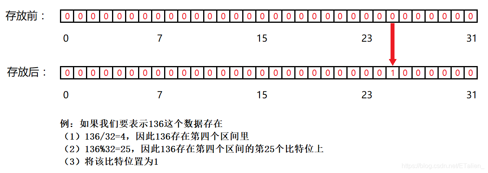
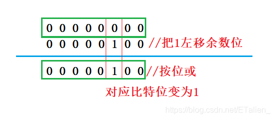
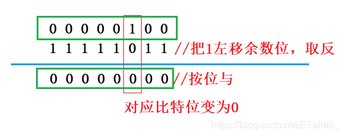
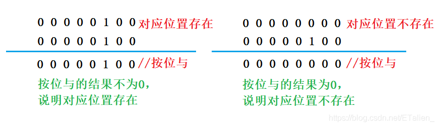
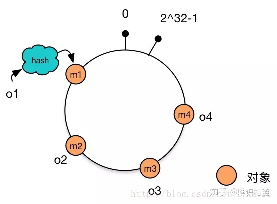
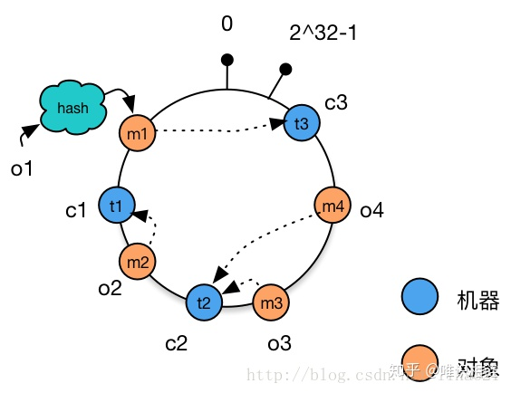
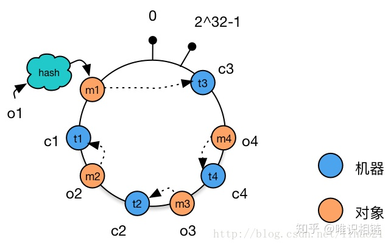
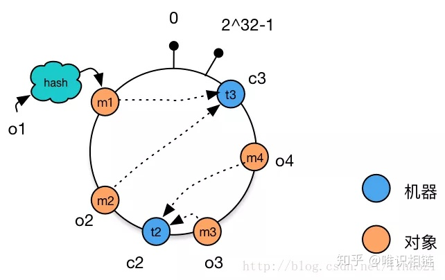
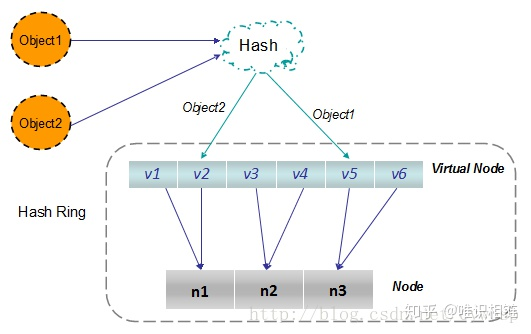

### 哈希函数
Hash，一般翻译做"散列"，也有直接音译为"哈希"的，就是把任意长度的输入（又叫做预映射， pre-image），通过散列算法，变换成固定长度的输出，该输出就是散列值。

**性质：**
- 输入可以是无穷大，输出是有限范围内
- 同样的输入，同样的输出
- 不同输入可能会有同样的输出(哈希碰撞)
- 输出均匀的，离散的，分散在哈希表
- 将输出取模m，得到的数据均匀的分布在0~m-1

**问题：** 给一个范围`0~2^32-1`的无符号整数，一共有40亿个，给定1G内存，返回出现次数最多的数。

**思路：**
- 对所有整数通过哈希函数(f)进行映射，并对100取模；
- 此时所有数将均匀分布在0~99上，将所有整数按照取模后的结果分发到0~99号小文件中；
- 用100个哈希表分别记录小文件中整数和出现的次数(key,count)；
- 在所有的哈希表中返回count最大的key；


### 哈希表

哈希表在使用层面上可以理解为一种集合结构

哈希表的时间复杂度是**常数级别**的，能实现增删改查功能

**哈希表的基础实现原理：**

- 假设初始哈希表中只有16(size)个内存地址，对插入哈希表的key采用哈希函数进行映射并对16取模；
- 此时，取模后的结果将均匀分布在0~15上，将key按照取模后的结果放置在对应的内存中，同个内存中的记录用链表串联；
- 查询和删除时，将key按照size取模的结果找到对应内存地址，然后对链表遍历寻找；
- 所以当链表长度过长时影响效率，需要进行扩容操作；
- 假设当链表长度大于8时进行扩容。先申请32个内存地址，并对之前所有的记录重新用32进行哈希函数映射和取模并放入对应的新内存中，此时链表长度将会近似等于4；

时间复杂度：

- 单个值采用哈希函数进行映射并对16取模  O(1)
- 遍历小长度链表 O(1)
- 插入N个值需要扩容logN次，每次扩容代价为N O(N*logN)
- 单次插入的平均时间复杂度 O(logN)
- 查找和删除 O(1)

### JS中哈希表的实现
HashSet `<key>`: 只有key，没有伴随数据value。

```js
const HashSet = new Set();
// 增
HashSet.add(1)
// 删
HashSet.delete(1)
// 查
HashSet.has(1)
// 清空
HashSet.clear()
```

HashMap `<key,value>`: 既有key，又有伴随数据value，以key来排序组织。key可以是基础类型也可以是**引用类型**。

```js
const HashMap = new Map();
// 增
HashMap.set('1', 1)
// 删
HashMap.delete('1')
// 查
HashMap.has("1")
// 改
HashMap.get("1")
// 清空
HashMap.clear()
```

### 设计RandomPool结构
**【题目】**

设计一种结构，在该结构中有如下三个功能:

insert(key):将某个key加入到该结构，做到不重复加入

delete(key):将原本在结构中的某个key移除

getRandom(): 等概率随机返回结构中的任何一个key。

**【要求】**

Insert、delete和getRandom方法的时间复杂度都是O(1)

**思路：**

- 结构中包含KeyMap<{key:index}>、IndexMap<{index:key}>、size。其中index是key的插入顺序，size是Map的长度；
- 插入时，分别在KeyMap和IndexMap中插入对应记录，size加1；
- 删除key1时，将index 等于 size - 1的key在KeyMap和IndexMap中更改index为要删除key1的index，然后删除key1；
- 返回随机key，随机生成0~size-1的整数，返回对应index的key；

```js
class RandomPool {
  constructor() {
    this.keyMap = new Map();
    this.indexMap = new Map();
    this.size = 0;
  }
  insert(key) {
    if (!this.keyMap.has(key)) {
      this.keyMap.set(key, this.size);
      this.indexMap.set(this.size++, key);
    }
  }
  delete(key) {
    if (this.keyMap.has(key)) {
      // 获取key对应的index
      const index = this.keyMap.get(key);
      // 获取最后的index
      const lastIndex = --this.size;
      // 获取最后一个key
      const keyLast = this.indexMap.get(lastIndex);
      // 将keyLast的index设置成key的index
      this.keyMap.set(keyLast, index);
      // 将index对应的key换成keyLast
      this.indexMap.set(index, keyLast);
      // 删除key
      this.keyMap.delete(key);
      // 删除最后的index
      this.indexMap.delete(lastIndex);
    }
  }
  getRandom() {
    if (this.size === 0) {
      return null;
    }
    const index = parseInt(Math.random() * this.size);
    return this.indexMap.get(index);
  }
}

```

### 布隆过滤器

布隆过滤器就是一个大的**位图** 设m个bit 范围是0 ~ m-1，实际占用m/8字节。

### [位图](https://blog.csdn.net/ETalien_/article/details/90752420)

位图是用数组实现的，数组的每一个元素的每一个二进制位都可以表示一个数据在或者不在，0表示数据存在，1表示数据不存在。所以位图其实就是一种直接定址法的哈希，只不过位图只能表示这个值在或者不在。



**将对应的比特位置变成1**



```js
const set = (i) => {
  const index = i / 32 // 计算是数组的第几段
  const num = i % 32 // 计算在段中的第几位

  this.bit[index] = this.bit[index] | (1 << num)
}
```

**将对应的比特位置变成0**



```js
const reset = (i) => {
  const index = i / 32 // 计算是数组的第几段
  const num = i % 32 // 计算在段中的第几位

  this.bit[index] = this.bit[index] & (~(1 << num))
}
```

**判断对应的比特位是0（不存在）还是1（存在）**



```js
const test = (i) => {
  const index = i / 32 // 计算是数组的第几段
  const num = i % 32 // 计算在段中的第几位

  this.bit[index] = this.bit[index] & (~(1 << num))
}
```

### 使用场景

布隆过滤器使用场景：
- 如黑名单系统
- 无删除行为
- 允许有失误率

例如：公司有长度为40亿的黑名单URL且**无删除行为**，当用户访问网址时需要校验是否在黑名单中，**允许有失误率**。问该如何查找当前URL是否在黑名单中？

使用布隆过滤器来进行查找：

1. 将40亿URL依次经过`k`个不同的哈希函数映射并模上`m`，在长度为`m`的位图上将得到的结果位置设置为1；
2. 查询时，将要查询的URL同样经过`k`个哈希函数映射并模上`m`，如过得到的`k`个位置在位图上都为1，则URL在黑名单中，如果有任意一个位置为0，则不在；

### 性质

- 会将白名单URL误判为黑名单(模上`m`时，可能会导致两个不同的URL落在一起)，但不会将黑名单误判为白名单(同一个输入哈希函数得出的结果一致，因此如果已经被加入黑名单中一定不会误判)。
- 失误率与`m`成反比
- 当给定`m`时，失误率随`k`先减后增
  
**`m`和`k`的计算公式**

$m = -(n * lnp) / (ln2)^2$

$k = ln2 * m / n ≈ 0.7 * m / n$ 向上取整

$p_{real} = (1 - e^{-\frac{n*k_{real}}{m_{real}}})^{k_{real}}$ 


$m = 预期位图的大小 \qquad k = 预期哈希函数的个数\qquad n = 样本量\qquad p = 预期失误率\qquad p_{real} = 真实失误率\qquad k_{real} = 真实k值\qquad m_{real} = 真实m值$


### 一致性哈希

https://zhuanlan.zhihu.com/p/129049724

对于分布式存储，不同机器上存储不同对象的数据，我们使用哈希函数建立从数据到服务器之间的映射关系。

#### 一、使用简单的哈希函数
`m = hash(o) mod n`

其中，o为对象名称，n为机器的数量，m为机器编号。

考虑以下例子：

3个机器节点，10个数据 的哈希值分别为1,2,3,4,…,10。使用的哈希函数为：(`m=hash(o) mod 3`)

机器0 上保存的数据有：3，6，9

机器1 上保存的数据有：1，4，7，10

机器2 上保存的数据有：2，5，8

当增加一台机器后，此时n = 4，各个机器上存储的数据分别为：

机器0 上保存的数据有：4，8

机器1 上保存的数据有：1，5，9

机器2 上保存的数据有：2，6，10

机器3 上保存的数据有：3，7

只有数据1和数据2没有移动，所以当集群中数据量很大时，采用一般的哈希函数，在节点数量动态变化的情况下会造成大量的数据迁移，导致网络通信压力的剧增，严重情况，还可能导致数据库宕机。

#### 二、一致性哈希

一致性hash算法正是为了解决此类问题的方法，它可以保证当机器增加或者减少时，节点之间的数据迁移只限于两个节点之间，不会造成全局的网络问题。

##### 1. 环形Hash空间

按照常用的hash算法来将对应的key哈希到一个具有2^32次方个桶的空间中，即0~(2^32)-1的数字空间中。现在我们可以将这些数字头尾相连，想象成一个闭合的环形。如下图：


##### 2. 将数据通过hash算法映射到环上

将object1、object2、object3、object4四个对象通过特定的Hash函数计算出对应的key值，然后散列到Hash环上。如下图：

Hash(object1) = key1；

Hash(object2) = key2；

Hash(object3) = key3；

Hash(object4) = key4；



##### 3. 将机器通过hash算法映射到环上

假设现在有NODE1，NODE2，NODE3三台机器，通过Hash算法（机器IP或机器的唯一的名称作为输入）得到对应的KEY值，映射到环中，其示意图如下：

Hash(NODE1) = KEY1;

Hash(NODE2) = KEY2;

Hash(NODE3) = KEY3;


##### 4. 将数据存储到机器上

通过上图可以看出对象与机器处于同一哈希空间中，这样按顺时针转动object1存储到了NODE1中，object3存储到了NODE2中，object2、object4存储到了NODE3中。



##### 5. 机器的添加与删除

1. 向集群中添加一台新机器
   
    向集群中增加机器c4，c4经过hash函数后映射到机器c2和c3之间。这时根据顺时针存储的规则，数据m4从机器c2迁移到机器c4。数据的移动仅发生在c2和c4之间，其他机器上的数据并未受到影响。

    

2. 从集群中删除一台机器
    
    从集群中删除机器c1，这时只有c1原有的数据需要迁移到机器c3，其他数据并未受到影响。

    

- 相比于之前的简单取模方法中动态增删集群中机器的数量时，造成全局的数据迁移，使用一致性哈希算法将大大改善这种情况，减轻了网络通信的压力。

**存在的问题：**
当集群中的节点数量较少时，可能会出现节点在哈希空间中分布不平衡的问题。如下图所示，图中节点A、B、C分布较为集中，造成hash环的倾斜。数据1、2、3、4、6全部被存储到了节点A上，节点B上只存储了数据5，而节点C上什么数据都没有存储。**A、B、C三台机器的负载极其不均衡。**


在极端情况下，假如A节点出现故障，存储在A上的数据要全部转移到B上，大量的数据导可能会导致节点B的崩溃，之后A和B上所有的数据向节点C迁移，导致节点C也崩溃，由此导致整个集群宕机。这种情况被称为**雪崩效应**。

**解决方法——虚拟节点**

解决哈希环偏斜问题的方法就是，让集群中的节点尽可能的多，从而让各个节点均匀的分布在哈希空间中。在现实情境下，机器的数量一般都是固定的，所以我们只能将现有的物理节通过虚拟的方法复制多个出来，这些由实际节点虚拟复制而来的节点被称为**虚拟节点**。加入虚拟节点后的情况如下图所示：


从上图可得：加入虚拟节点后，节点A存储数据1、3；节点B存储5、4；节点C存储2、6。节点的负载很均衡。




