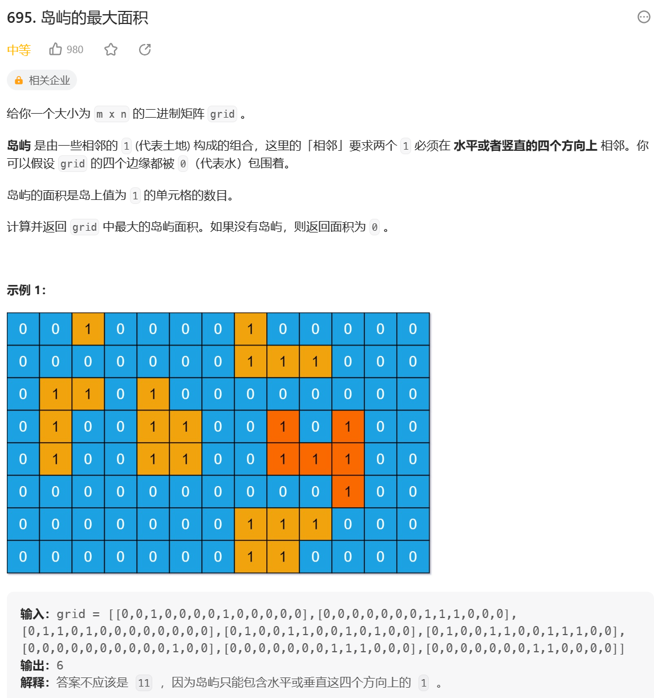

## 岛屿问题

**【题目】**

一个矩阵中只有 0 和 1 两种值，每个位置都可以和自己的上、下、左、右 四个位置相连，如果有一片 1 连在一起，这个部分叫做一个岛，求一个矩阵中有多少个岛?

**【举例】**

001010

111010

100100

000000

这个矩阵中有三个岛

**【进阶】**

如何设计一个并行算法解决这个问题

**思路：**

1. 从左上角依次遍历矩阵，如果是 0 则直接跳过，如果为 1 则进行 infect(感染)操作，岛屿数量加一；
2. infect 操作：
    - base case: 当前位置越过边界或当前位置不为 1；
    - 将当前位置修改为 2，并对其上下左右进行 infect 操作；

```js
function countIslands(matrix) {
    if (matrix === null || matrix[0] === null) {
        return 0;
    }
    const n = matrix.length;
    const m = matrix[0].length;
    let res = 0;

    for (let i = 0; i < n; i++) {
        for (let j = 0; j < m; j++) {
            if (matrix[i][j] === 1) {
                infect(matrix, i, j, n, m);
                res++;
            }
        }
    }
    return res;
}

function infect(matrix, i, j, n, m) {
    if (i < 0 || i >= n || j < 0 || j >= m || matrix[i][j] !== 1) {
        return;
    }
    matrix[i][j] = 2;
    infect(matrix, i - 1, j, n, m);
    infect(matrix, i + 1, j, n, m);
    infect(matrix, i, j - 1, n, m);
    infect(matrix, i, j + 1, n, m);
}
```



```js
var maxAreaOfIsland = function (grid) {
    if (grid === null || grid[0] === null) {
        return 0;
    }
    const N = grid.length;
    const M = grid[0].length;
    let maxArea = 0;

    var infect = function (grid, i, j, N, M, area) {
        if (i < 0 || i >= N || j < 0 || j >= M || grid[i][j] !== 1) {
            return area
        }
        grid[i][j] = 2;
        area += 1;
        area = infect(grid, i - 1, j, N, M, area)
        area = infect(grid, i + 1, j, N, M, area)
        area = infect(grid, i, j - 1, N, M, area)
        area = infect(grid, i, j + 1, N, M, area)

        return area

    }

    for (let i = 0; i < N; i++) {
        for (let j = 0; j < M; j++) {
            if (grid[i][j] === 1) {
                let area = 0;
                area = infect(grid, i, j, N, M, area)
                maxArea = maxArea > area ? maxArea : area
            }
        }
    }
    return maxArea
};
```

## 并查集

初始有 n 个元素，每个元素在一个独立的集合中，需要实现以下功能：

1. 判断两个元素是否在同一个集合；
2. 合并两个元素所在的集合；
3. 判断和合并功能时间复杂度需要为 O(1);

**分析：**

-   实现功能 1 可以使用哈希表时间复杂度为 O(1)，但合并时间复杂度为 O(N);
-   实现功能 2 可以使用链表时间复杂度为 O(1)，但查找时需要遍历链表，当链表长度过大时，时间复杂度超过 O(1);

**并查集：**

-   用 Node 对每个元素(E)进行包装;
-   初始化三个哈希表`elementMap(key: E, value: Node(E))`、`fatherMap(key: Node(E), value: Node(E))`、`rankMap(key: Node(E), value: number)`。其中 elementMap 记录元素和被包装后的 Node 的对应关系，fatherMap 记录 Node 的父节点，rankMap 记录顶层 Node(父节点为自己的节点)所包含子节点个数(包含顶层节点)；
-   判断两个元素是否在同一个集合：在 elementMap 中查找对应的 Node(E1)和 Node(E2)，如果没有记录则直接返回；然后用 findHead 方法获取 Node(E1)和 Node(E2)的顶层父节点 Node，如果两个元素节点的顶层父节点一致则说明在同一个集合中，反之不在同一个集合；
-   合并两个元素所在的集合：在 elementMap 中查找对应的 Node(E1)和 Node(E2)，如果没有记录则直接返回；然后用 findHead 方法获取 Node(E1)和 Node(E2)的顶层父节点 Node，再根据顶层父节点 Node 在 rankMap 获取中对应的节点个数，将节点个数小的顶层父节点 Node 的指针指向另外一个，并在 rankMap 中更新较多元素个数的顶层节点数和删除较少元素个数的顶层节点的记录；
-   findHead：循环通过 fatherMap 获取元素的父节点，并用栈记录每次获得的节点。当节点和父节点相等时，表明此节点为顶层节点。依次将栈中记录的节点弹出，并将其父节点改为当前的顶层节点(**扁平化链表，减少 findHead 复杂度**)，栈空时返回顶层节点。

## 并查集并行加速岛屿问题

1. 按照 cpu 核数等分地图，每块区域各自进行 infect 操作，并用集合记录区域边界上岛屿元素的位置信息，如 A:{(i,j)}表示边界上位置(i,j)属于岛屿 A；
2. 合并时用并查集判断四个边界两侧相邻的元素：
    - 如果两个元素都为 2，且不在同一个集合，union 这两个集合；

### kruskal 算法(K 算法、并查集) [7 图]
