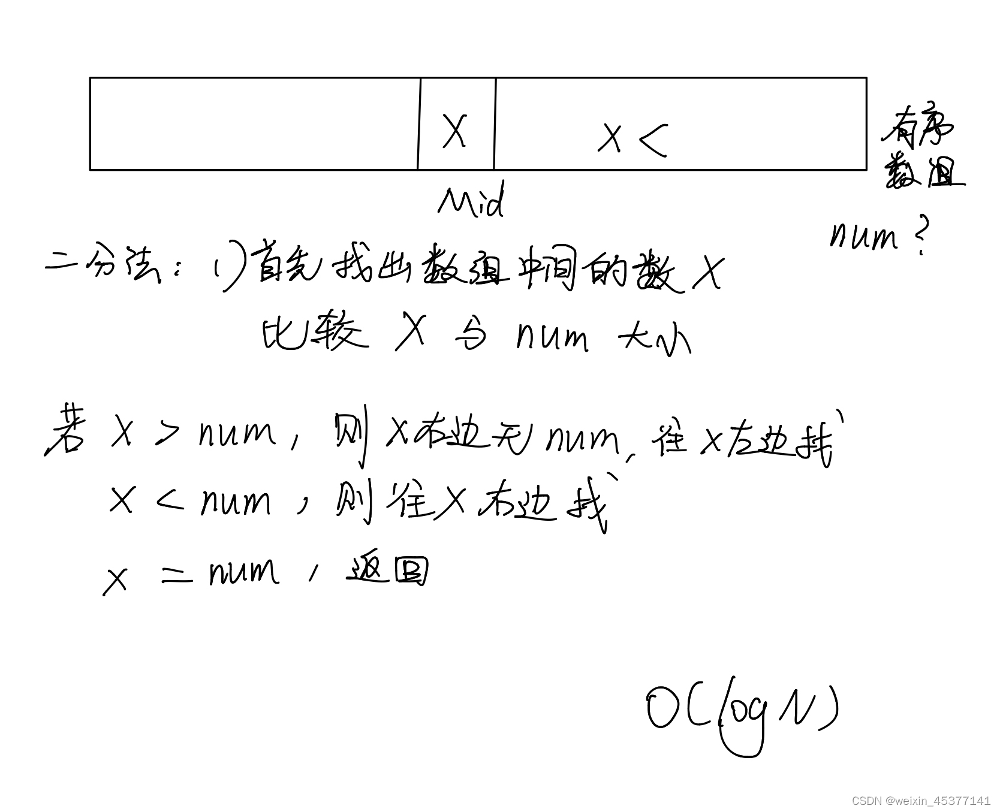
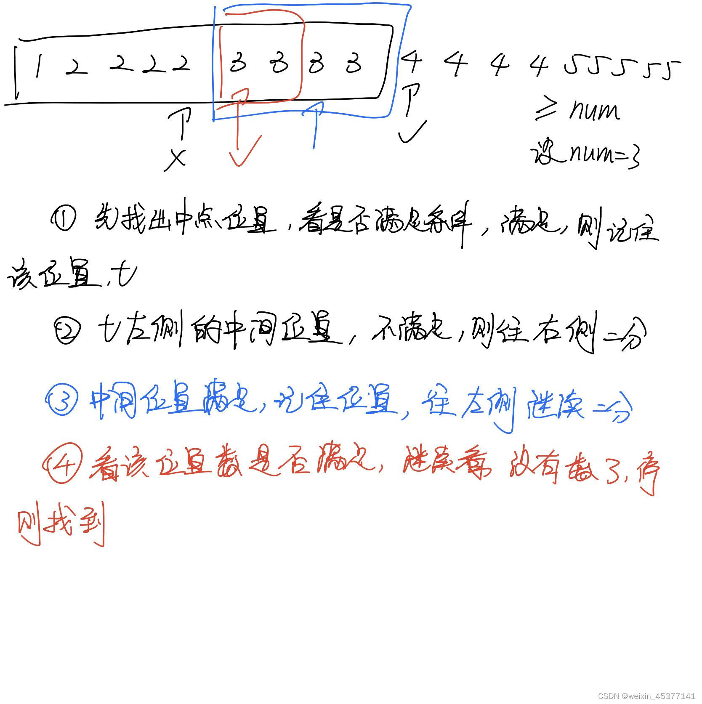
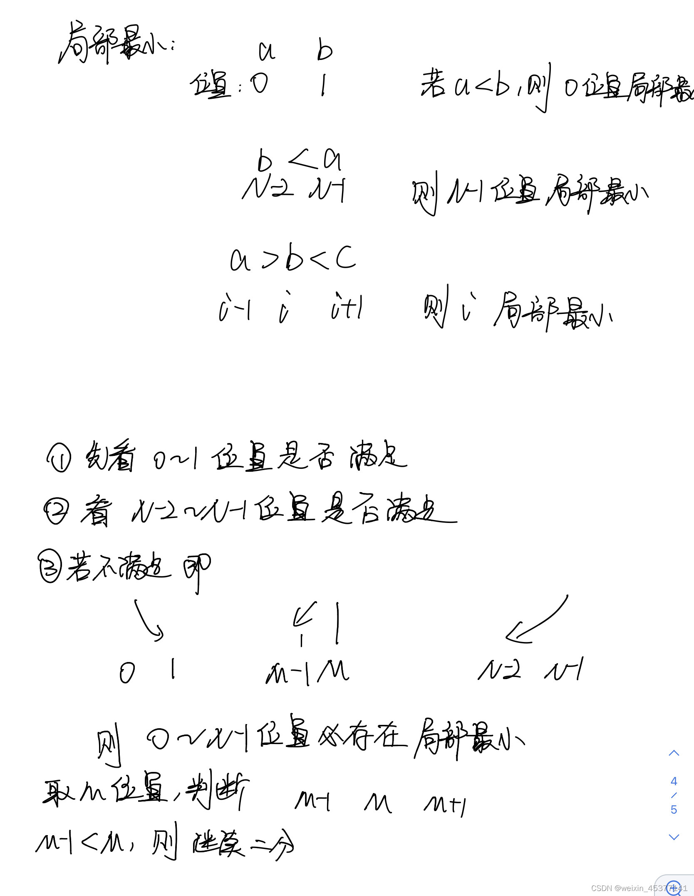

问题一：如何在一个有序数组中找某个是否存在？

**思路：** 遍历，时间复杂度O(N) , 二分法

经典二分：



```js
function BSexist(arr, num) {
    let L = 0;
    let R = arr.length - 1;
    let mid = 0;
    while(L <= R) {
        mid = L + (L - R) / 2;
        if (arr[mid] == num) {
            return true;
        } else if (arr[mid] < num) {
            L = mid + 1;
        } else {
            R = mid - 1;
        }
	}
    return arr[L] == num;
}
```


问题二：在有序数组中找大于等于某个数最左侧的位置



```js
function BSfindLeftMax(arr, num) {
    let L = 0;
    let R = arr.length - 1;
    let mid = 0;
    let leftMaxIndex = -1;
    while (L < R) {
		mid = L + (L - R) / 2;
        if (arr[mid] >= num) {
            leftMaxIndex = mid;
            R = mid - 1;
        } else {
            L = mid + 1;
        }
    }
    return leftMaxIndex;
}
```

 

问题三：局部最小值，在一个无序数组中，任意两个相邻的元素不相等，定义一个局部最小



```js
function BSFindMin(arr) {
    // 无序数组中寻找到任意一个局部最小值
    if (arr.length < 1 || arr === null) return;
    let L = 0;
    let R = arr.length - 1;
    let mid = 0;
    if (arr[L] < arr[L + 1]) {
        return arr[L];
    } else if (arr[R] < arr[R - 1]) {
        return arr[R];
    }
    while (L <= R) {
        mid = L + ((R - L) >> 1);

        if (arr[mid - 1] > arr[mid] && arr[mid + 1] > arr[mid]) {
            return mid;
        } else if (arr[mid - 1] < arr[mid]) {
            R = mid - 1;
        } else if (arr[mid + 1] < arr[mid]) {
            L = mid + 1;
        }
    }
    return arr[L];
}
```

问题四：

珂珂喜欢吃香蕉。这里有 n 堆香蕉，第 i 堆中有 piles[i] 根香蕉。警卫已经离开了，将在 h 小时后回来。

珂珂可以决定她吃香蕉的速度 k （单位：根/小时）。每个小时，她将会选择一堆香蕉，从中吃掉 k 根。如果这堆香蕉少于 k 根，她将吃掉这堆的所有香蕉，然后这一小时内不会再吃更多的香蕉。  

珂珂喜欢慢慢吃，但仍然想在警卫回来前吃掉所有的香蕉。

返回她可以在 h 小时内吃掉所有香蕉的最小速度 k（k 为整数）。

```js
/**
 * @param {number[]} piles
 * @param {number} h
 * @return {number}
 */
var minEatingSpeed = function(piles, h) {
    let ans = Infinity;
    let right = - Infinity;
    for (let i of piles) {
        right = Math.max(i, right);
    }
    let left = 1;
    while (left <= right) {
        let k = left + ((right - left) >> 1);
        let time = 0;
        for (let i = 0; i < piles.length; i++) {
            time += Math.ceil(piles[i] / k)
        }
        if (time > h) {
            // 在h内完成不了，k小了
            left = k + 1;
        } else if (time <= h){
            // 在h内能完成，k大于等于最小速度
            right = k - 1;
            ans = Math.min(k, ans);
        }
    }
    return ans;
}; 
```