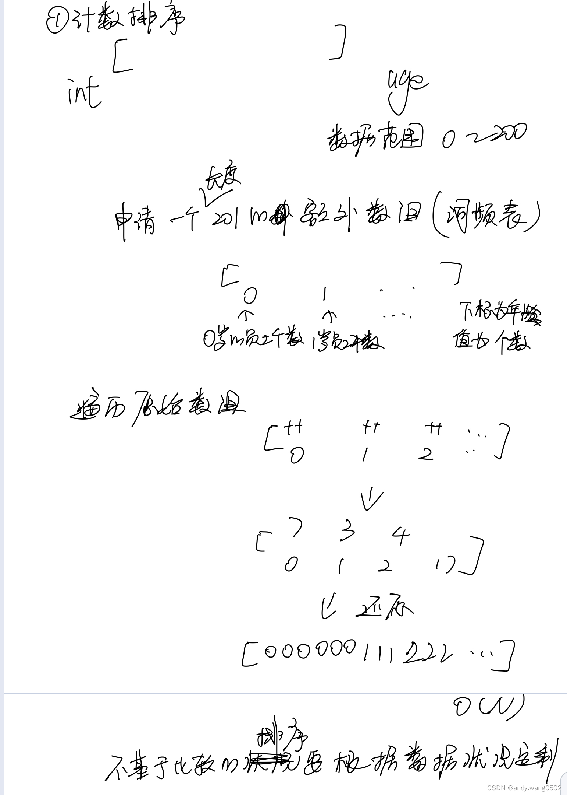
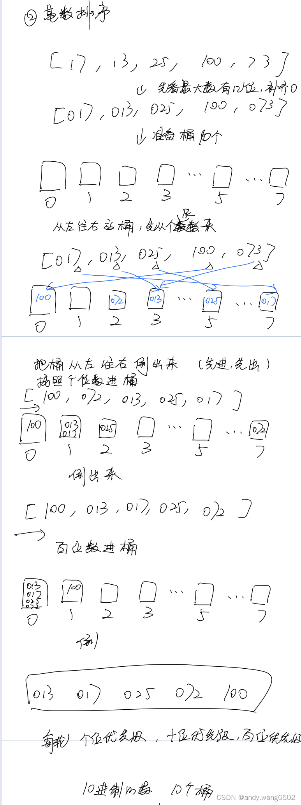
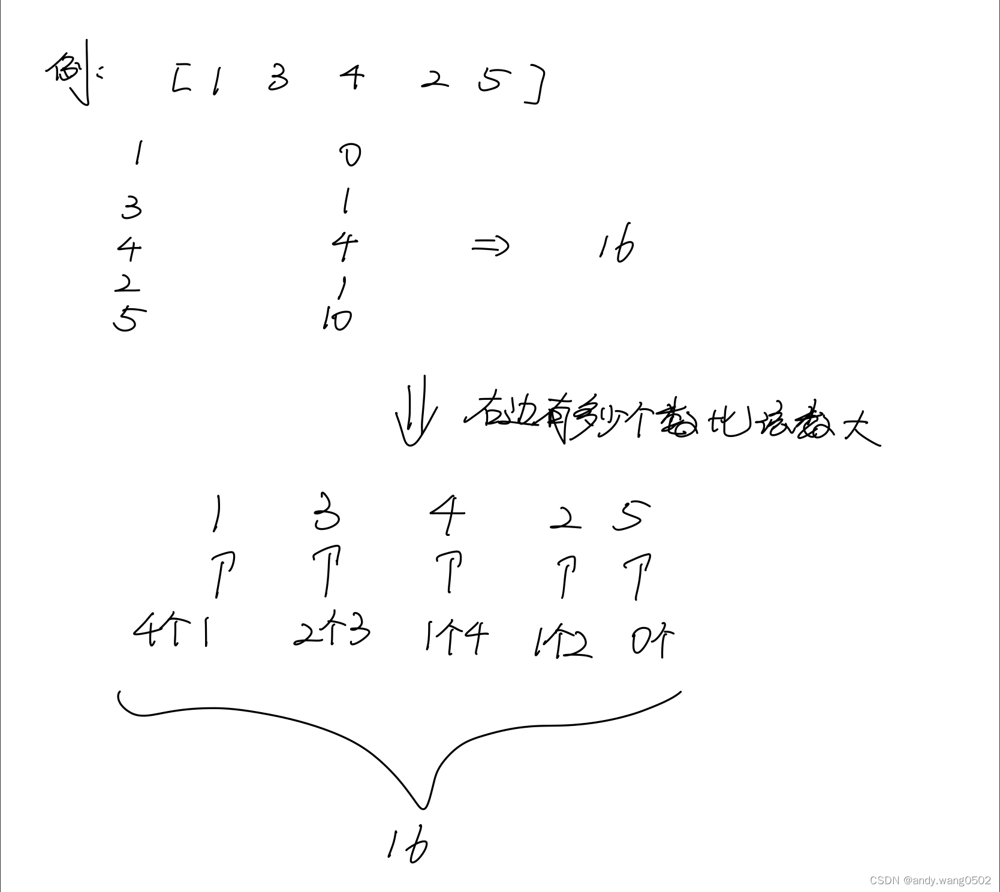
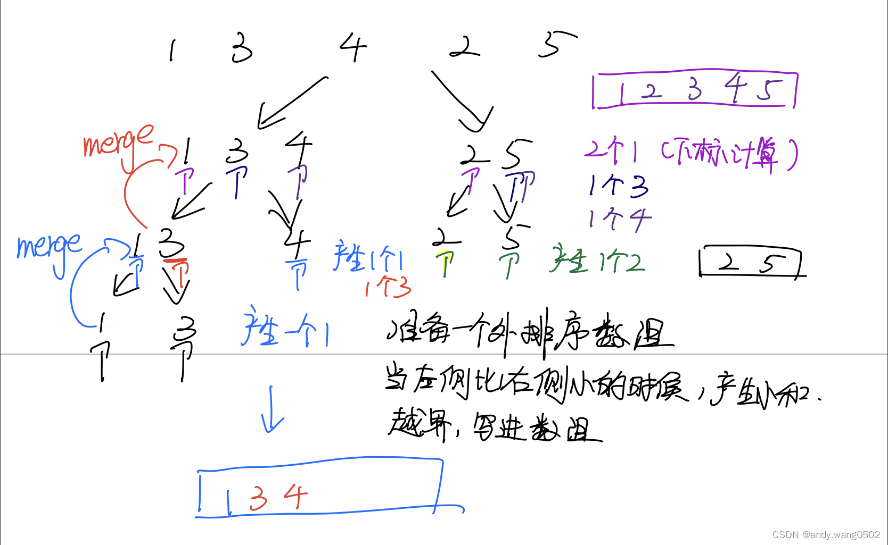
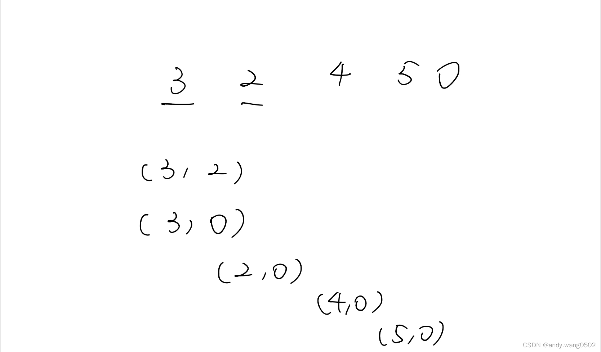
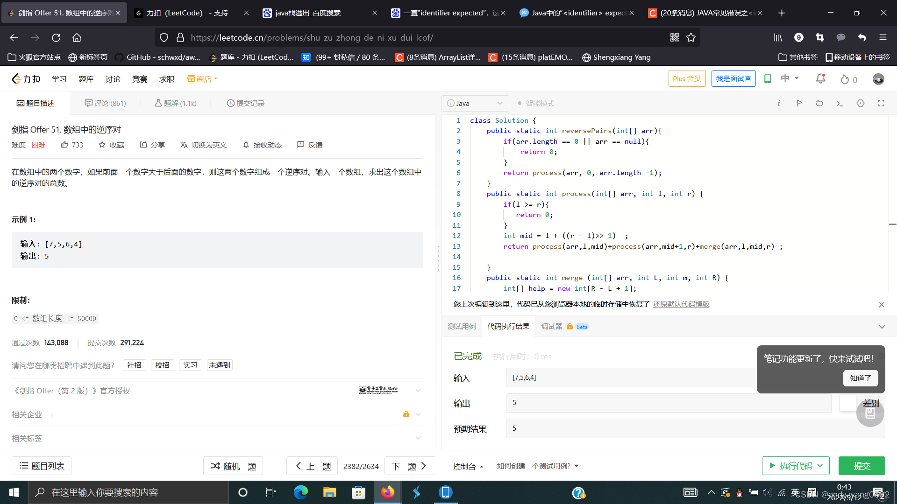

## 排序

|             | 时间复杂度  | 空间复杂度 | 稳定性 |
| :---------: | ----------- | ---------- | ------ |
|  选择排序   | `O(N^2)`    | `O(1) `    | ×      |
|  冒泡排序   | `O(N^2)`    | `O(1) `    | √      |
|  插入排序   | `O(N^2)`    | `O(1)`     | √      |
|  归并排序   | `O(N*logN)` | `O(N)`     | √      |
| 快排（3.0） | `O(N*logN)` | `O(logN)`  | ×      |
|   堆排序    | `O(N*logN)` | `O(1) `    | ×      |
|  计数排序   | `O(n+k)`    | `O(k)`     | √      |
|   桶排序    | `O(n+k)`    | `O(n+k)`   | √      |
|  基数排序   | `O(n*k)`    | `O(n+k)`   | √      |

**分析：**

    1.前三个排序都是基于比较的排序，基于比较的排序的时间复杂度不能做到小于 `O(N^2)`

    2.时间复杂度`O(N*logN)`的三个算法不能兼顾空间复杂度小和稳定性。在实际设计时，一般选择快排，因为其时间复杂度常数项较小，速度较快，考虑稳定性选择归并排序，有空间限制，选择堆排序。

**坑：**

    1.归并排序的额外空间复杂度可为o（1），但会因此丧失稳定性，“内部缓存法”，较难

    2.原地归并排序可以使得空间复杂度为o（1），但会使得时间复杂度为O(N^2)

    3.快排可以做到稳定性，但会使得空间复杂度为O(N)

### 1、冒泡排序

**时间复杂度：** `O(N^2)`

**空间复杂度：** `O(1)`

**稳定性：** 稳定

**算法步骤：**

-   遍历数组待排序部分
-   比较当前位置和相邻下个位置数字大小，如果当前位置大，交换两个位置的数
-   遍历完成后，待排序部分最右侧的值为待排序部分的最大值，待排序长度-1
-   重复上述步骤

```js
function bubbleSort(arr) {
    if (arr === null || arr.length < 2) {
        return;
    }
    for (let i = arr.length - 1; i > 0; i--) {
        for (let j = 0; j < i; j++) {
            if (arr[j] > arr[j + 1]) {
                swap(arr, j, j + 1);
            }
        }
    }
}
function swap(arr, i, j) {
    let temp = arr[i];
    arr[i] = arr[j];
    arr[j] = temp;
}
```

### 2、选择排序

**时间复杂度：** `O(N^2)`

**空间复杂度：** `O(1)`

**稳定性：** 不稳定

**算法步骤：**

-   遍历待排序部分
-   选择出待排序部分最小值与待排序部分第一个值交换，待排序部分起始下标+1
-   重复上述步骤

```js
function selectSort(arr) {
    if (arr === null || arr.length < 2) {
        return;
    }
    //  边界条件需要注意
    for (let i = 0; i < arr.length - 1; i++) {
        let minIndex = i;
        for (let j = i + 1; j < arr.length; j++) {
            if (arr[j] < arr[minIndex]) {
                minIndex = j;
            }
        }
        swap(arr, i, minIndex);
    }
}
```

### 3、插入排序

**时间复杂度：** `O(N^2)`

**空间复杂度：** `O(1)`

**稳定性：** 稳定

**算法步骤：**

-   将待排序序列第一个元素看做一个有序序列，把第二个元素到最后一个元素当成是未排序序列。
-   从头到尾依次扫描未排序序列，将扫描到的每个元素插入有序序列的适当位置。（如果待插入的元素与有序序列中的某个元素相等，则将待插入元素插入到相等元素的后面。）

```js
function insertSort(arr) {
    if (arr === null || arr.length < 2) {
        return;
    }
    for (let i = 1; i < arr.length; i++) {
        let currIndex = i;
        for (let j = i - 1; j >= 0; j--) {
            if (arr[currIndex] < arr[j]) {
                swap(arr, currIndex, j);
                currIndex = j;
            } else {
                break;
            }
        }
    }
}
```

### 4、归并排序

**时间复杂度：** `O(N*logN)`

**空间复杂度：** `O(N)`

**稳定性：** 稳定

**算法步骤(递归)：**

-   申请空间，使其大小为两个已经排序序列之和，该空间用来存放合并后的序列；
-   递归序列左侧部分使其有序；
-   递归序列右侧部分使其有序；
-   利用额外空间将左侧和右侧合并，并使合并后的序列有序；
-   将合并序列复制到原序列。

```js
function mergeSort(arr) {
    if (arr === null || arr.length < 2) {
        return;
    }
    process(arr, 0, arr.length - 1);
}
function process(arr, L, R) {
    if (L === R) {
        return;
    }
    let mid = ((R - L) >> 1) + L;
    process(arr, L, mid);
    process(arr, mid + 1, R);
    merge(arr, L, mid, R);
}
function merge(arr, L, mid, R) {
    let help = new Array(R - L + 1);
    let left1 = L;
    let left2 = mid + 1;
    let i = 0;
    while (left1 <= mid && left2 <= R) {
        help[i++] = arr[left1] < arr[left2] ? arr[left1++] : arr[left2++];
    }
    while (left1 <= mid) {
        help[i++] = arr[left1++];
    }
    while (left2 <= R) {
        help[i++] = arr[left2++];
    }
    for (i = 0; i < help.length; i++) {
        arr[L + i] = help[i];
    }
}
```

### 5、快速排序

**时间复杂度：** `O(N*logN)`

**空间复杂度：** `O(logN)`

**稳定性：** 不稳定

**算法步骤：**

-   随机选取数列中的一个元素与最后一个元素交换，此时最后一个元素为"基准"(pivot);
-   设立双指针分别指向下标-1(left)和数列末尾(right)，代表小于基准的分区和大于基准的分区；
-   遍历数列，如果当前值小于基准，则与 left 指针下一位交换位置，left 指针+1；
-   如果当前值等于基准，继续遍历；
-   如果当前值大于基准，则与 right 指针前一位交换位置，right 指针-1，交换后的当前位置再与基准进行比较；
-   当前遍历位置与 right 指针相遇，终止遍历，返回当前的 left 和 right 指针；
-   根据返回的 left 和 right 指针，将小于基准的分区和大于基准的分区按照上述步骤递归排序；

```js
function quickSort(arr) {
    if (arr === null || arr.length < 2) {
        return;
    }
    function process(arr, L, R) {
        if (L < R) {
            swap(arr, Math.floor((R - L + 1) * Math.random() + L), R);
            const p = partition(arr, L, R);
            process(arr, L, p[0] - 1);
            process(arr, p[1] + 1, R);
        }
    }
    function partition(arr, L, R) {
        let left = L - 1;
        let right = R;
        while (L < right) {
            if (arr[L] < arr[R]) {
                swap(arr, ++left, L++);
            } else if (arr[L] > arr[R]) {
                swap(arr, --right, L);
            } else {
                L++;
            }
        }
        swap(arr, right, R);
        return [left + 1, right];
    }
    process(arr, 0, arr.length - 1);
}
```

### 6、堆排序

**时间复杂度：** `O(N*logN)`

**空间复杂度：** `O(1)`

**稳定性：** 不稳定

**算法步骤：**

-   将数组利用 heapInsert 或者 heapfiy 变成大根堆，此时数组中最大值在堆顶，堆 size 为数组长度
-   将数组第一项和最后一项交换，堆 size 减一，并对堆从第一项进行 heapfiy；
-   循环执行直到堆 size 为 0

```js
function heapSort(arr) {
    if (arr === null || arr.length < 2) {
        return;
    }
    for (let i = 0; i < arr.length; i++) {
        heapInsert(arr, i);
    }
    let heapSize = arr.length;
    swap(arr, 0, --heapSize);

    while (heapSize > 0) {
        heapfiy(arr, 0, heapSize);
        swap(arr, 0, --heapSize);
    }
}

function heapInsert(arr, i) {
    while (arr[i] > arr[(i - 1) >> 1]) {
        swap(arr, i, (i - 1) >> 1);
        i = (i - 1) >> 1;
    }
}

function heapfiy(arr, i, heapSize) {
    let left = 2 * i + 1;

    while (left < heapSize) {
        let maxIndex =
            left + 1 < heapSize && arr[left + 1] > arr[left] ? left + 1 : left;
        if (arr[i] > arr[maxIndex]) {
            break;
        }
        swap(arr, i, maxIndex);
        i = maxIndex;
        left = 2 * i + 1;
    }
}
```

### 7、计数排序

**时间复杂度：** `O(N+K)`

**空间复杂度：** `O(K)`

**稳定性：** 稳定

**算法步骤：**

-   （1）找出待排序的数组中最大和最小的元素，根据最大元素 k 生成长度为 k 的辅助数组 C
-   （2）统计数组中每个值为 i 的元素出现的次数，存入数组 C 的第 i 项
-   （3）对所有的计数累加（从 C 中的第一个元素开始，每一项和前一项相加）
-   （4）反向填充目标数组：将每个元素 i 放在新数组的第 C(i)项，每放一个元素就将 C(i)减去 1



```js
function countingSort(arr, maxValue) {
    const buket = new Array(maxValue + 1).fill(0);
    let sortLen = 0;
    for (let i = 0; i < arr.length; i++) {
        buket[arr[i]]++;
    }

    for (let j = 0; j < buket.length; j++) {
        while (buket[j] > 0) {
            arr[sortLen++] = j;
            buket[j]--;
        }
    }
    return arr;
}
```

### 8、桶排序

```js
function bucketSort(arr, bucketSize) {
    if (arr.length === 0) {
        return arr;
    }

    var i;
    var minValue = arr[0];
    var maxValue = arr[0];
    for (i = 1; i < arr.length; i++) {
        if (arr[i] < minValue) {
            minValue = arr[i]; // 输入数据的最小值
        } else if (arr[i] > maxValue) {
            maxValue = arr[i]; // 输入数据的最大值
        }
    } //桶的初始化

    var DEFAULT_BUCKET_SIZE = 5; // 设置桶的默认数量为5
    bucketSize = bucketSize || DEFAULT_BUCKET_SIZE;
    var bucketCount = Math.floor((maxValue - minValue) / bucketSize) + 1;
    var buckets = new Array(bucketCount);
    for (i = 0; i < buckets.length; i++) {
        buckets[i] = [];
    } //利用映射函数将数据分配到各个桶中

    for (i = 0; i < arr.length; i++) {
        buckets[Math.floor((arr[i] - minValue) / bucketSize)].push(arr[i]);
    }

    arr.length = 0;
    for (i = 0; i < buckets.length; i++) {
        insertionSort(buckets[i]); // 对每个桶进行排序，这里使用了插入排序
        for (var j = 0; j < buckets[i].length; j++) {
            arr.push(buckets[i][j]);
        }
    }

    return arr;
}
```

### 9、基数排序

**时间复杂度：** `O(N*K)`

**空间复杂度：** `O(N+K)`

**稳定性：** 稳定

**算法步骤：**

将整数按位数切割成不同的数字，然后按每个位数分别比较。



```js
var counter = [];
function radixSort(arr, maxDigit) {
    var mod = 10;
    var dev = 1;
    for (var i = 0; i < maxDigit; i++, dev *= 10, mod *= 10) {
        for (var j = 0; j < arr.length; j++) {
            var bucket = parseInt((arr[j] % mod) / dev);
            if (counter[bucket] == null) {
                counter[bucket] = [];
            }
            counter[bucket].push(arr[j]);
        }
        var pos = 0;
        for (var j = 0; j < counter.length; j++) {
            var value = null;
            if (counter[j] != null) {
                while ((value = counter[j].shift()) != null) {
                    arr[pos++] = value;
                }
            }
        }
    }
    return arr;
}
```

## 排序相关

### 小和问题（归并）

在一个数组中，每一个数左边比当前数小的数累加起来，叫做这个数组的小和。求一个数组的小和

暴力解法：遍历，复杂度 O(N^2)

```js
function smallSum(arr) {
    if (arr.length < 2) {
        return 0;
    }
    let ans = 0;
    for (let i = 1; i < arr.length; i++) {
        for (let j = 0; j < i; j++) {
            if (arr[j] < arr[i]) {
                ans += arr[j];
            }
        }
    }
    return ans;
}
```





代码：

```js
function smallSum2(arr) {
    if (arr.length < 2) {
        return 0;
    }
    function process(arr, left, right) {
        if (left >= right) {
            return 0;
        }
        let mid = ((right - left) >> 1) + left;
        return (
            process(arr, left, mid) +
            process(arr, mid + 1, right) +
            merge(arr, left, mid, right)
        );
    }

    function merge(arr, left, mid, right) {
        let help = new Array(right - left + 1);
        let l1 = left;
        let l2 = mid + 1;
        let res = 0;
        let index = 0;
        while (l1 <= mid && l2 <= right) {
            res += arr[l1] < arr[l2] ? (right - l2 + 1) * arr[l1] : 0;
            help[index++] = arr[l1] < arr[l2] ? arr[l1++] : arr[l2++];
        }
        while (l1 <= mid) {
            help[index++] = arr[l1++];
        }
        while (l2 <= right) {
            help[index++] = arr[l2++];
        }
        for (let i = 0; i < help.length; i++) {
            arr[left + i] = help[i];
        }
        return res;
    }

    return process(arr, 0, arr.length - 1);
}
```

```java
public static int smallSum(int[] arr) {
    if(arr == null || arr.length < 2){
        return 0;
    }
    return prcess(arr, 0, arr.length - 1);

}

// arr[L..R]既要做好排序，也要做好小和
public static int process(int[] arr, int l, int r){
    if (l == r){
        return 0;
    }
    int mid = l + (r-l) >> 1;
    return process(arr, l, mid)
            + process(arr, mid + 1, r)
            + merge(arr, l , mid, r);//三块的小和相加才是数组的小和
}

public static int merge(int[] arr, int L, int m, int r){
    int[] help = new help[r - L + 1];
    int i = 0;
    int p1 = L;
    int p2 = m+1;
    int res = 0;
    while (p1 <=m && p2 <=r){
        res += arr[p1] < arr[p2] ? (r - p2 + 1)* arr[p1] : 0;//通过下标一次性计算，节省复杂度
        help[i++] = arr[p1] < arr[p2] ? arr[p1++] : arr[p2++]; //左组数与右组数相等时先拷贝右组数，这样可以知道右边有多少个数比左组数大
    }
    while(p1 <= m){
        help[i++] = arr[p1++];
    }
    while(p2 <=r){
        help[i++] = arr[p2++];
    }
    for(i = 0; i < help.length; i++){
        arr[L + i] = help[i];
    }
    return res;
}
```

### 逆序对（归并）（剑指 offer 51）

在一个数组中，左边的数如果比右边大，则这两个数构成一个逆序对，请打印所有的逆序对。





```js
var reversePairs = function (nums) {
    if (nums.length < 1 || nums === null) return 0;
    return process(nums, 0, nums.length - 1);
};

function process(nums, left, right) {
    let mid = left + ((right - left) >> 1);
    if (left == right) {
        return 0;
    }
    return (
        process(nums, left, mid) +
        process(nums, mid + 1, right) +
        merge(nums, left, mid, right)
    );
}

function merge(nums, left, middle, right) {
    let help = Array.from({ length: right - left + 1 });
    let l1 = left;
    let l2 = middle + 1;
    let i = 0;
    let res = 0;
    while (l1 <= middle && l2 <= right) {
        res += nums[l1] <= nums[l2] ? 0 : middle - l1 + 1;
        help[i++] = nums[l1] <= nums[l2] ? nums[l1++] : nums[l2++];
    }
    while (l1 <= middle) {
        help[i++] = nums[l1++];
    }
    while (l2 <= right) {
        help[i++] = nums[l2++];
    }
    for (let i = 0; i <= help.length - 1; i++) {
        nums[left + i] = help[i];
    }
    return res;
}
```

### 荷兰国旗问题（快速排序）

问题 1：给定一个数组 arr，和一个数`num`，请把小于等于`num`的数放在数组的左边，大于`num`的数放在数组的右边，要求空间复杂度 O(1)，时间复杂度 O(N)

分析：把一个数组分成俩块，左边小于等于`num`，右边大于`num`，不一定有序。

1. `arr[i]<= num`,把 arr[i]和小于等于区的下一个数做交换，然后小于等于区往右扩一个位置，i++

2) `arr[i]> num，i++`

i 越界，停止

```js
function NetherlandsFlag(arr, pivot) {
    let i = 0;
    let left = -1;
    while (i < arr.length) {
        if (arr[i] <= pivot) {
            swap(arr, ++left, i++);
        } else {
            i++;
        }
    }
    return arr;
}

function swap(arr, i, j) {
    let temp = arr[i];
    arr[i] = arr[j];
    arr[j] = temp;
}
```

问题 2：给定一个数组 arr，和一个数`num`，请把小于`num`的数放在数组的左边，等于`num`的数放在数组的中间，大于`num`的数放在数组的右边，要求空间复杂度 O(1)，时间复杂度 O(N)

分析：采用双指针，分成三块，大于区，等于区，小于区

1. `[i]<num`, [i]和<区下一个做交换，<区右扩，i++

2. `[i]==num, i++`

3)  `[i]>num`,[i]和>区前一个做交换，>区左扩大，i 原地不变。

```js
function NetherlandsFlag2(arr, pivot) {
    let i = 0;
    let left = -1;
    let right = arr.length;

    while (i < right) {
        // 小于right
        if (arr[i] < pivot) {
            swap(arr, ++left, i++);
        } else if (arr[i] > pivot) {
            swap(arr, --right, i);
        } else {
            i++;
        }
    }
    return arr;
}

function swap(arr, i, j) {
    let temp = arr[i];
    arr[i] = arr[j];
    arr[j] = temp;
}
```
