### 1. 二叉树节点结构

```js
function TreeNode(val, left, right) {
    this.val = val === undefined ? 0 : val;
    this.left = left === undefined ? null : left;
    this.right = right === undefined ? null : right;
}
```

### 2. 二叉树遍历

### 2.1 递归遍历

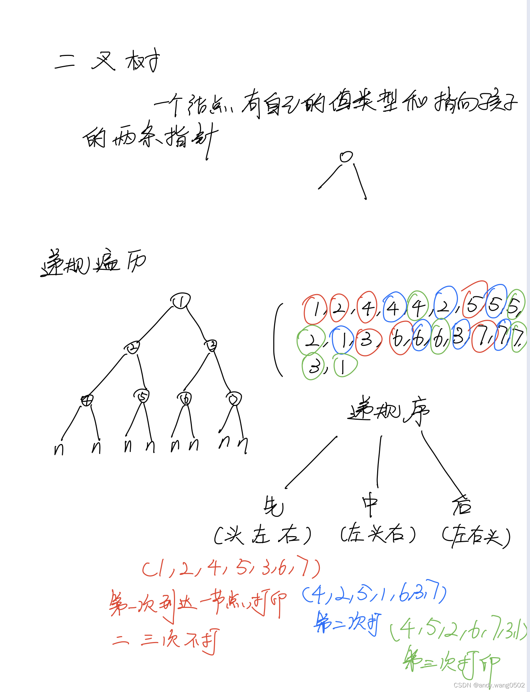

```js
// 递归遍历二叉树
function f(head) {
    //1
    if (head == null) {
        return;
    }
    //1 第一次到达节点
    f(head.left);
    //2 第二次返回节点
    f(head.right);
    //3 第三次返回节点
}
```

#### 前序遍历（递归）

在第一次到达节点时打印或操作

```js
function process(root, arr) {
    if (root === null) {
        return null;
    }
    arr.push(root.val); // 第一次到达节点时加入
    process(root.left, arr);
    process(root.right, arr);
}
var preorderTraversal = function (root) {
    let arr = [];
    process(root, arr);
    return arr;
};
```

#### 中序遍历（递归）

在第二次返回节点时打印或操作

```js
function process(root, arr) {
    if (root === null) {
        return null;
    }
    process(root.left, arr);
    arr.push(root.val); // 第二次返回节点时加入
    process(root.right, arr);
}
var inorderTraversal = function (root) {
    let arr = [];
    process(root, arr);
    return arr;
};
```

#### 后序遍历（递归）

在第三次返回节点时打印或操作

```js
function process(root, arr) {
    if (root === null) {
        return null;
    }
    process(root.left, arr);
    process(root.right, arr);
    arr.push(root.val); // 第三次返回节点时加入
}
var postorderTraversal = function (root) {
    let arr = [];
    process(root, arr);
    return arr;
};
```

### 2.2 使用栈辅助遍历（非递归）

#### 前序遍历（非递归）

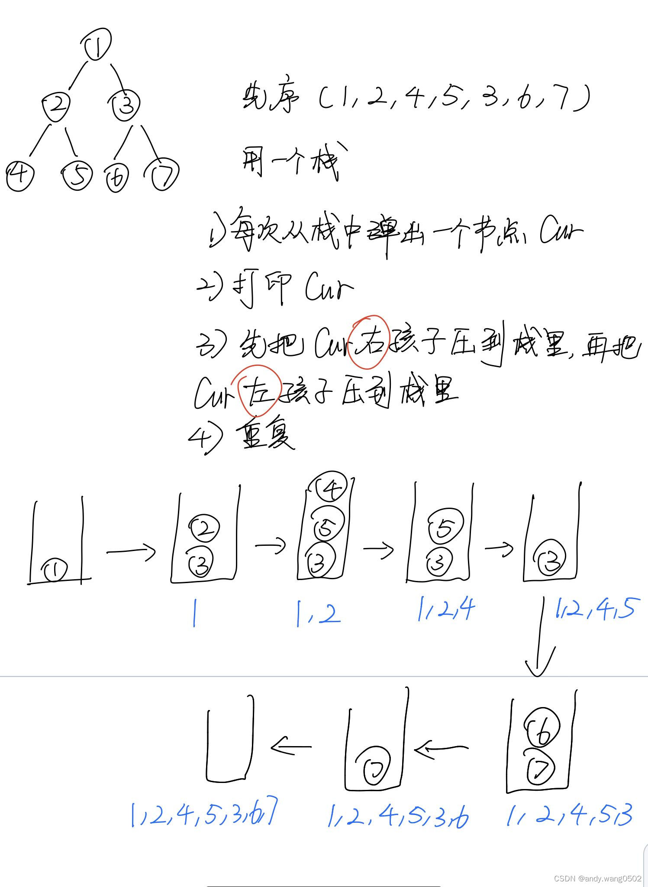

```js
var preorderTraversal = function (root) {
    if (root === null) return [];
    // 不使用递归遍历
    // 使用栈
    let stack = [];
    let arr = [];
    let curr = null;
    stack.push(root);
    while (stack.length !== 0) {
        curr = stack.pop();
        arr.push(curr.val);
        if (curr.right) {
            stack.push(curr.right);
        }
        if (curr.left) {
            stack.push(curr.left);
        }
    }
    return arr;
};
```

#### 中序遍历（非递归）

**note：中序（左头右）**

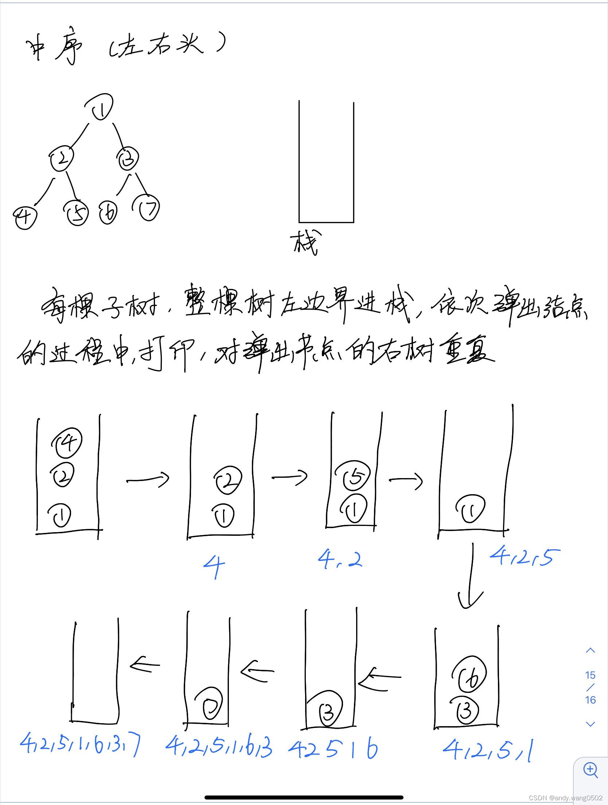

所有的树都可以被左边界分解掉

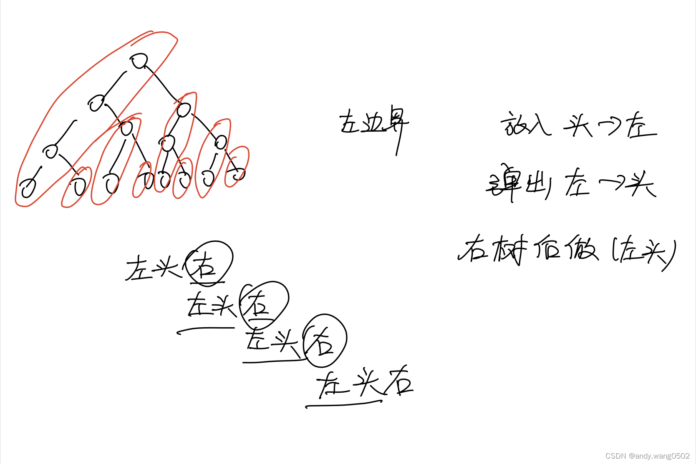

```js
var inorderTraversal = function (root) {
    if (root === null) return [];
    // 非递归，用栈
    let stack = [];
    let arr = [];
    let curr = root;
    while (stack.length !== 0 || curr !== null) {
        if (curr !== null) {
            stack.push(curr);
            curr = curr.left;
        } else {
            curr = stack.pop();
            arr.push(curr.val);
            curr = curr.right;
        }
    }

    return arr;
};
```

#### 后序遍历（非递归）

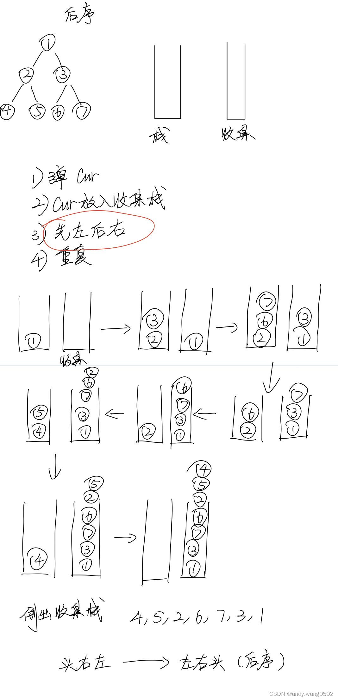

```js
var postorderTraversal = function (root) {
    // 非递归
    if (root === null) {
        return [];
    }
    let arr = [];
    let stack = [];
    let collect = []; // 收集栈
    let curr = null;
    stack.push(root);
    while (stack.length !== 0) {
        curr = stack.pop();
        collect.push(curr); // 将弹出节点压入收集栈
        if (curr.left) {
            // 先添加左节点
            stack.push(curr.left);
        }
        if (curr.right) {
            stack.push(curr.right);
        }
    }
    while (collect.length !== 0) {
        arr.push(collect.pop().val);
    }
    return arr;
};
```

### 2.3 Mirror 遍历

一种遍历二叉树的方式 时间复杂度 O(N) 空间复杂度 O(1)

Morris 遍历的实质: 通过来回标记遍历整棵树

二叉树题目的最优解：如果要用第三次信息的强整合要用递归套路，如果不需要第三次信息的强整合morris遍历是最优解。

#### Morris 遍历细节

假设来到当前节点 cur，开始时 cur 来到头节点位置

1. 如果 cur 没有左孩子，cur 向右移动(cur = cur.right)
2. 如果 cur 有左孩子，找到左子树上最右的节点 mostRight：
    - 如果 mostRight 的右指针指向空，让其指向 cur，然后 cur 向左移动(cur = cur.left)
    - 如果 mostRight 的右指针指向 cur，让其指向 null，然后 cur 向右移动(cur = cur.right)
3. cur 为空时遍历停止

无左树，只有一次到达自己

有左树，会经过自己两次，根据左树的最右节点指向判断第几次达到自己

```js
function morris(head) {
    if (head === null) {
        return;
    }
    let cur = head;
    let mostRight = null;

    while (cur !== null) {
        mostRight = cur.left;
        if (mostRight !== null) {
            // cur有左孩子

            // 找到左孩子的最右节点
            while (mostRight.right !== null && mostRight.right !== cur) {
                mostRight = mostRight.right;
            }

            if (mostRight.right === null) {
                // 第一次经过cur
                mostRight.right = cur;
                cur = cur.left;
            } else {
                // 第二次经过cur
                mostRight.right = null;
                cur = cur.right;
            }
        } else {
            // cur没有左孩子
            cur = cur.right;
        }
    }
}
```

#### 前序遍历

-   只到达自己一次直接打印；
-   能够到达自己两次，在第一次打印；

```js
// 前序
function morrisPre(head) {
    if (head === null) {
        return;
    }
    let cur = head;
    let mostRight = null;

    while (cur !== null) {
        mostRight = cur.left;
        if (mostRight !== null) {
            // cur有左孩子

            // 找到左孩子的最右节点
            while (mostRight.right !== null && mostRight.right !== cur) {
                mostRight = mostRight.right;
            }

            if (mostRight.right === null) {
                // 第一次经过cur
                console.log(cur.value);
                mostRight.right = cur;
                cur = cur.left;
            } else {
                // 第二次经过cur
                mostRight.right = null;
                cur = cur.right;
            }
        } else {
            // cur没有左孩子
            console.log(cur.value);
            cur = cur.right;
        }
    }
}
```

#### 中序遍历

-   只到达自己一次直接打印；
-   能够到达自己两次，在第二次打印；

```js
// 中序
function morrisIn(head) {
    if (head === null) {
        return;
    }
    let cur = head;
    let mostRight = null;

    while (cur !== null) {
        mostRight = cur.left;
        if (mostRight !== null) {
            // cur有左孩子

            // 找到左孩子的最右节点
            while (mostRight.right !== null && mostRight.right !== cur) {
                mostRight = mostRight.right;
            }

            if (mostRight.right === null) {
                // 第一次经过cur
                mostRight.right = cur;
                cur = cur.left;
            } else {
                // 第二次经过cur
                console.log(cur.value);
                mostRight.right = null;
                cur = cur.right;
            }
        } else {
            // cur没有左孩子
            console.log(cur.value);
            cur = cur.right;
        }
    }
}
```

#### 后序遍历

-   能够到达两次的节点，在第二次到达时逆序打印其左子树的右边界（将以 cur.left 为头的右边界看作成链表反转打印，打印完成在逆序回去）；
-   遍历完成后，打印整个树的右边界；

```js
// 后序
function reverseNode(head) {
    if (head === null) {
        return null;
    }
    let prev = null;
    let cur = head;
    let right = null;
    while (cur !== null) {
        right = cur.right;
        cur.right = prev;
        prev = cur;
        cur = right;
    }
    return prev;
}
function printEdge(head) {
    let cur = reverseNode(head);
    while (cur !== null) {
        console.log(cur.value);
        cur = cur.right;
    }
    reverseNode(head);
}
function morrisPos(head) {
    if (head === null) {
        return;
    }
    let cur = head;
    let mostRight = null;

    while (cur !== null) {
        mostRight = cur.left;
        if (mostRight !== null) {
            // cur有左孩子

            // 找到左孩子的最右节点
            while (mostRight.right !== null && mostRight.right !== cur) {
                mostRight = mostRight.right;
            }

            if (mostRight.right === null) {
                // 第一次经过cur
                mostRight.right = cur;
                cur = cur.left;
            } else {
                // 第二次经过cur
                mostRight.right = null;
                printEdge(cur.left);
                cur = cur.right;
            }
        } else {
            // cur没有左孩子
            cur = cur.right;
        }
    }
    printEdge(head);
}
```

### 2.4 宽度优先遍历（求一棵二叉树的宽度）

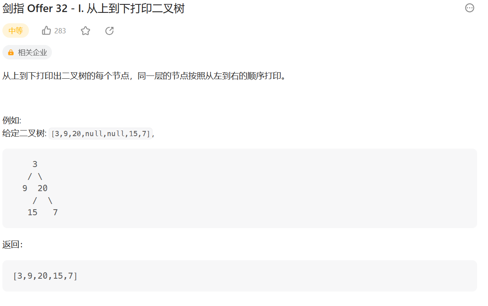

利用队列，弹出队头节点，将左节点放入再放右节点。直到队列为空。

```js
var levelOrder = function (root) {
    if (root === null) return [];
    let queue = [];
    let curr = null;
    let arr = [];
    queue.push(root);

    while (queue.length !== 0) {
        curr = queue.shift();
        if (curr.left) {
            queue.push(curr.left);
        }
        if (curr.right) {
            queue.push(curr.right);
        }
        arr.push(curr.val);
    }
    return arr;
};
```

#### 二叉树最大宽度

**空节点不计入宽度时：**

准备一个`levelMap`记录点在第几层，设置三个变量，当前在哪一层`curLevel`，当前层发现几个节点`curLevelNodes`，所有层中哪一层发现的节点最多的 max

```js
function w(node) {
    if (head == null) {
        return;
    }
    const queue = [];
    queue.push(head);
    const levelMap = new Map(); //记录每个节点对应的层数
    levelMap.set(head, 1); //放入第一个节点
    let curLevel = 1; //当前节点所在的层数
    let curLevelNodes = 0; //当前层发现几个节点数
    let max = -Infinity; //哪一层发现的最多的节点数
    while (queue.length !== 0) {
        let cur = queue.shift();
        let curNodeLevel = levelMap.get(cur); //节点的层数
        if (curNodeLevel == curLevel) {
            //节点是否是当前统计的层
            curLevelNodes++;
        } else {
            max = Math.max(max, curLevelNodes);
            curLevel++;
            curLevelNodes = 1;
        }
        //先放左再放右边，记录每个点所在的层数
        if (cur.left != null) {
            levelMap.set(cur.left, curNodeLevel + 1);
            queue.push(cur.left);
        }
        if (cur.right != null) {
            levelMap.set(cur.right, curNodeLevel + 1);
            queue.push(cur.right);
        }
    }
}
```


**空节点计入宽度：**

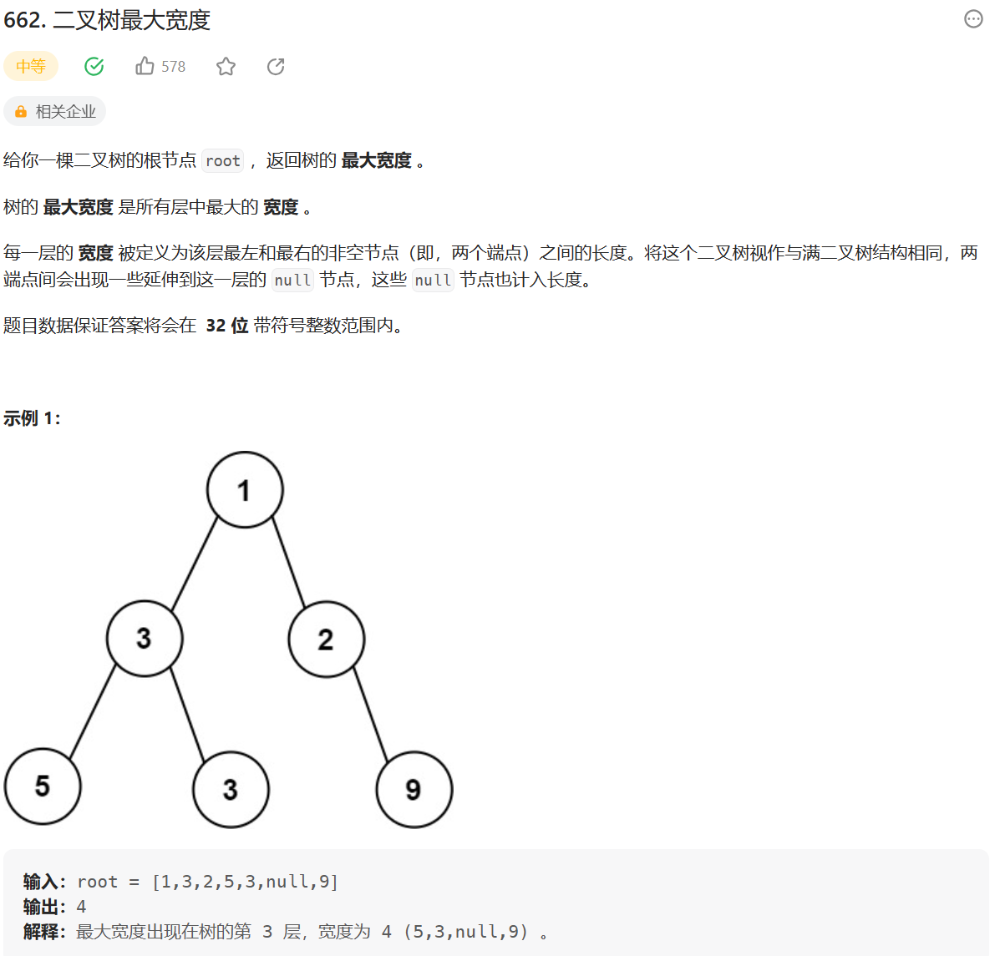

**思路：**

-   宽度优先遍历二叉树
-   记录当前层、当前层节点下标
-   每层节点宽度为每层最后一个节点下标减去第一个节点下标加一
-   返回各层宽度最大的值

```js
var widthOfBinaryTree = function (root) {
    // 宽度优先遍历
    // 记录当前层和当前层的节点数
    // 记录当前层最后一个节点（上一层最后一个节点的右节点）
    if (root === null) return 0;
    let curr = null;
    let queue = [];
    let arr = [[]];
    root.val = 1;
    queue.push(root);

    // 判断是否是当前层
    // 根据hashmap中的currNodeLevel和currLevel对比
    let hashMap = new Map();
    hashMap.set(root, 1);
    let currLevel = 1;
    let currNodeLevel = 1;
    // 取模防止下标溢出
    let mod = 10000000007;
    // 返回的最大值
    let max = -Infinity;
    while (queue.length !== 0) {
        curr = queue.shift();
        currNodeLevel = hashMap.get(curr);
        console.log(curr.val);
        if (currNodeLevel !== currLevel) {
            currLevel += 1;
            arr[currLevel - 1] = [];
        }
        arr[currLevel - 1].push(curr.val);
        if (curr.left) {
            // 下标
            curr.left.val = (2 * curr.val - 1) % mod;
            hashMap.set(curr.left, currLevel + 1);
            queue.push(curr.left);
        }
        if (curr.right) {
            curr.right.val = (2 * curr.val) % mod;
            hashMap.set(curr.right, currLevel + 1);
            queue.push(curr.right);
        }
    }
    for (let i = 0; i < arr.length; i++) {
        max =
            max > arr[i][arr[i].length - 1] - arr[i][0] + 1
                ? max
                : arr[i][arr[i].length - 1] - arr[i][0] + 1;
    }
    return max;
};
```

**递归——深度优先遍历**

-   使用递归深度优先遍历
-   每次递归时记录当前层数、每层的节点及其下标
-   每层节点宽度为每层最后一个节点下标减去第一个节点下标加一
-   返回各层宽度最大的值

```js
var widthOfBinaryTree = function (root) {
    // 深度优先遍历
    let arr = [];
    let mod = 10000000007;
    function getDeepNode(root, deep, val) {
        if (root === null) return null;
        if (!arr[deep]) {
            arr[deep] = [];
        }
        arr[deep].push(val);
        getDeepNode(root.left, deep + 1, (2 * val - 1) % mod);
        getDeepNode(root.right, deep + 1, (2 * val) % mod);
    }
    getDeepNode(root, 0, 1);
    let max = 1;
    for (let i = 0; i < arr.length; i++) {
        max =
            max > arr[i][arr[i].length - 1] - arr[i][0] + 1
                ? max
                : arr[i][arr[i].length - 1] - arr[i][0] + 1;
    }
    return max;
};
```

### 3. 树型 DP（动态规划）解法套路

使用前提：如果题目求解目标是S规则，则求解流程可以定成以每一个节点为头结点的子树在S规则下的每一个答案，并且最终答案一定在其中。

1. 树形dp套路第一步：以某个节点X为头节点的子树中，分析答案有哪些可能性，并且这种分析是以X的左子树、X的右子树和X整棵树的角度来考虑可能性的；

2. 树形dp套路第二步：根据第一步的可能性分析，列出所有需要的信息；

3. 树形dp套路第三步：合并第二步的信息，对左树和右树提出同样的要求，并写出信息结构；

4. 树形dp套路第四步：设计递归函数，递归函数是处理以X为头节点的情况下的答案。包括设计递归的base case，默认直接得到左树和右树的所有信息，以及把可能性做整合，并且要返回第三步的信息结构这四个小步骤；

**以搜索二叉树为例**

判断二叉树是否为搜索树需满足以下条件：

1. 左子树为搜索树，且左子树的最大值 < 当前节点值；
2. 右子树为搜索树，且右子树的最小值 > 当前节点值；

根据以上条件可知递归节点时需返回：

1. 当前树是否为搜索树（`isBST`）；
2. 当前树的最大值（max）；
3. 当前树的最小值（min）；

### 如何判断一颗二叉树是否是搜索二叉树？

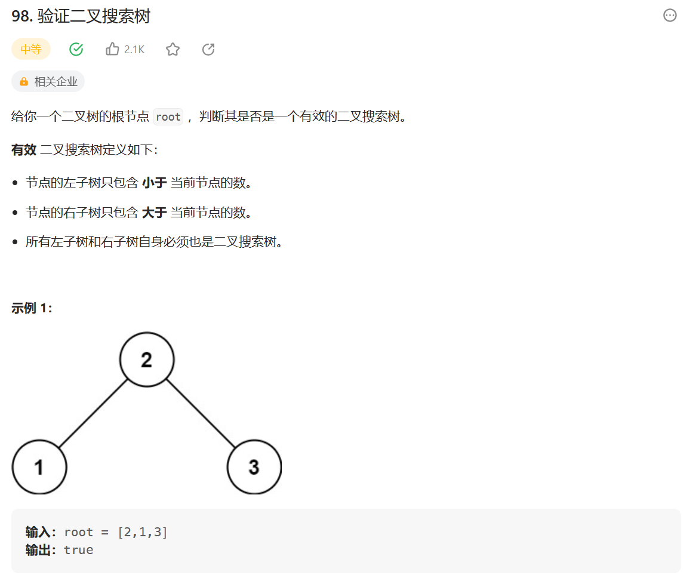

**解 1：**

直接使用中序递归–> 左中右，如果是搜索二叉树，那么最后中序递归出来的顺序一定是**升序**的

如果某个点不是升序的，那就不是搜索二叉树

```js
var isValidBST = function (root) {
    if (root === null) {
        return true;
    }
    let preValue = -Infinity;
    let stack = [];
    while (stack.length !== 0 || root !== null) {
        if (root !== null) {
            stack.push(root);
            root = root.left;
        } else {
            root = stack.pop();
            if (preValue >= root.val) {
                return false;
            } else {
                preValue = root.val;
            }
            root = root.right;
        }
    }
    return true;
};
```

**解 2（递归）：**

判断二叉树是否为搜索树需满足以下条件：

1. 左子树为搜索树，且左子树的最大值 < 当前节点值；
2. 右子树为搜索树，且右子树的最小值 > 当前节点值；

根据以上条件可知递归节点时需返回：

1. 当前树是否为搜索树（`isBST`）；
2. 当前树的最大值（max）；
3. 当前树的最小值（min）；

```js
function process(root) {
    if (root === null) {
        return null;
    }

    let leftData = process(root.left);
    let rightData = process(root.right);
    let isBST = true;
    let max = root.val;
    let min = root.val;
    if (
        (leftData !== null && (!leftData.isBST || leftData.max >= max)) ||
        (rightData !== null && (!rightData.isBST || rightData.min <= min))
    ) {
        isBST = false;
    }

    if (leftData !== null) {
        max = max > leftData.max ? max : leftData.max;
        min = min < leftData.min ? min : leftData.min;
    }
    if (rightData !== null) {
        max = max > rightData.max ? max : rightData.max;
        min = min < rightData.min ? min : rightData.min;
    }

    return {
        isBST,
        max,
        min,
    };
}
var isValidBST = function (root) {
    return process(root).isBST;
};
```

### 二叉树节点间的最大距离问题
从二叉树的节点a出发，可以向上或者向下走，但沿途的节点只能经过一次，到达节点b时路径上的节点个数叫作a到b的距离，那么二叉树任何两个节点之间都有距离，求整棵树上的最大距离。

**思路：**

1. 设以X为头结点的整棵树的最大距离分两种情况讨论：
   - X不参与，要求返回的信息是左子树的最大距离maxdistance和右子树的最大距离maxdistance。maxdistance在左子树的最大距离maxdistance和右子树的最大距离中较大者；
   - X参与，maxdistance为左高度height+1+右高度height；
   - maxdistance为`max(X不参与,X参与)`

2. 返回值结构：maxdistance、height;

```js
function getMaxDistance(head) {
    // 返回值结构
    function Info(maxDistance, height) {
        this.maxDistance = maxDistance;
        this.height = height;
    }
    // base case
    if (head === null) {
        return new Info(0, 0);
    }
    const { maxDistance: leftDistance, height: leftHeight } = getMaxDistance(
        head.left
    );
    const { maxDistance: rightDistance, height: rightHeight } = getMaxDistance(
        head.right
    );

    let height = Math.max(leftHeight, rightHeight) + 1;
    let maxDistance = Math.max(
        leftHeight + rightHeight + 1,
        Math.max(leftDistance, rightDistance)
    );

    return new Info(maxDistance, height);
}
```

### 派对的最大快乐值
员工信息的定义如下:
```tsx
interface Employee {
    happy: number; // 这名员工可以带来的快乐值
    subordinates: Employee[];  // 这名员工有哪些直接下级
}
```
公司的每个员工都符合 Employee 类的描述。整个公司的人员结构可以看作是一棵标准的、 没有环的多叉树。树的头节点是公司唯一的老板。除老板之外的每个员工都有唯一的直接上级。 叶节点是没有任何下属的基层员工(subordinates列表为空)，除基层员工外，每个员工都有一个或多个直接下级。

这个公司现在要办party，你可以决定哪些员工来，哪些员工不来。但是要遵循如下规则。

1. 如果某个员工来了，那么这个员工的所有直接下级都不能来
2. 派对的整体快乐值是所有到场员工快乐值的累加
3. 你的目标是让派对的整体快乐值尽量大


给定一棵多叉树的头节点boss，请返回派对的最大快乐值。

**思路：**

1. 以X为头获得的最大快乐值分为两种情况讨论(X的subordinates为[A,B,C,...])：
   - X参与：X快乐值+A不来的整棵树的最大快乐值+B不来的整棵树的最大快乐值+C不来的整棵树的最大快乐值+...
   - X不参与：0+max{A不来的整棵树的最大快乐值，A来的整棵树的最大快乐值}+max{B来的整棵树的最大快乐值，B来的整棵树的最大快乐值}+...

```js
function getMaxHappiness(head) {
    function Info(headNotIn, headIn) {
        // headNotIn: 头节点不参与整个树的最大快乐值
        // headIn: 头节点参与整个树的最大快乐值
        this.headNotIn = headNotIn;
        this.headIn = headIn;
    }
    function process(head) {
        if (head === null) {
            return new Info(0, 0);
        }

        let headNotInMaxHappiness = 0,
            headInMaxHappiness = head.happy;

        for (let i = 0; i < head.subordinates.length; i++) {
            const { headNotIn, headIn } = process(head.subordinates[i]);
            headNotInMaxHappiness += Math.max(headNotIn, headIn);
            headInMaxHappiness += headNotIn;
        }

        return new Info(headNotInMaxHappiness, headInMaxHappiness);
    }

    const { headNotIn, headIn } = process(head);

    return Math.max(headNotIn, headIn);
}
```

### 4. 二叉树题目

### 如何判断一颗二叉树是完全二叉树？

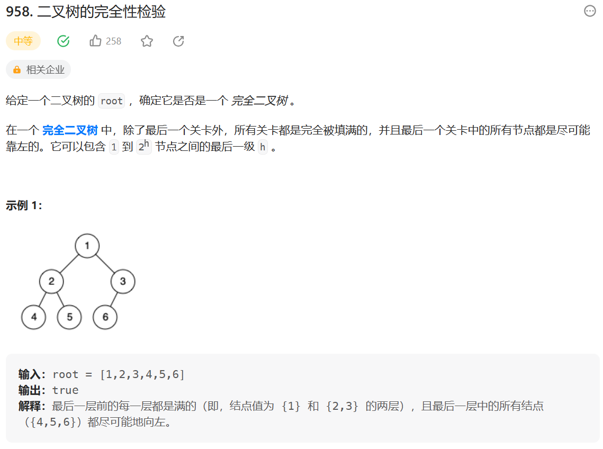

**思路：**

1. 宽度优先遍历整棵树
2. 任一节点，**有右子树，无左子树**，返回 false
3. 在(2)成立时，如果遇到了第一个左右两个孩子不双全，**后续节点必须是叶子节点**，否则返回 false

**解：**

```js
var isCompleteTree = function (root) {
    // 宽度优先遍历
    let queue = [];
    let curr = null;
    // 记录后续节点是否需要为叶子节点
    let isLeaf = false;
    queue.push(root);
    while (queue.length !== 0) {
        curr = queue.shift();
        if (curr.left === null && curr.right !== null) {
            // 有右子树 无左子树 返回false
            return false;
        }
        if (isLeaf && (curr.left !== null || curr.right !== null)) {
            // 必须为叶子节点
            return false;
        }
        if (curr.left === null || curr.right === null) {
            // 遇到第一个节点左右子节点不全时，isLeaf转为true
            isLeaf = true;
        }
        if (curr.left !== null) {
            queue.push(curr.left);
        }
        if (curr.right !== null) {
            queue.push(curr.right);
        }
    }
    return true;
};
```

### 如何判断一颗二叉树是否是满二叉树？

满二叉树（除了叶子节点外，所有节点都有两个子节点）的节点数 N 和最大深度 L 满足，N=2^L-1

```js
function isFBTProcess(root) {
    if (root === null) {
        return {
            N: 0,
            L: 0,
        };
    }
    let leftData = isFBTProcess(root.left);
    let rightData = isFBTProcess(root.right);

    return {
        N: leftData.N + rightData.N + 1,
        L: Math.max(leftData.L, rightData.L) + 1,
    };
}
function isFBT(root) {
    // 满二叉树需的节点数和深度需满足 N = 2 ^ L - 1
    // 递归 左子树的深度和节点数 右子树的深度和节点数
    if (root === null) {
        return true;
    }
    let { N, L } = isFBTProcess(root);
    return N === 2 ** L - 1;
}
```

### 如何判断一颗二叉树是否是平衡二叉树？

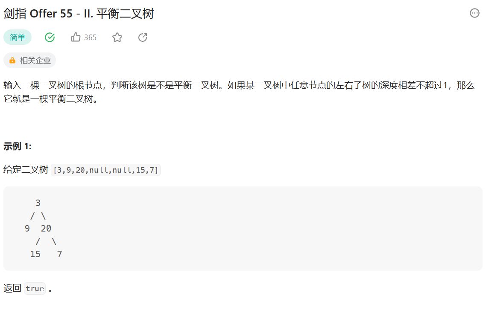

判断是否为平衡二叉树 ：

1. 左子树是否是平衡二叉树
2. 右子树是否是平衡二叉树
3. |左高 - 右高| 小于等于 1

左子树返回的信息：是否是平衡二叉树、高度；

右子树返回的信息：是否是平衡二叉树、高度

```js
var isBalanced = function (root) {
    // 左子树为平衡二叉树 右子树为平衡二叉树 左右子树深度差不超过1
    // 递归信息 是否为平衡二叉树 深度
    return isBalancedProcess(root).isBalancedTree;
};
function isBalancedProcess(root) {
    if (root === null) {
        return {
            isBalancedTree: true,
            L: 0,
        };
    }

    let leftData = isBalancedProcess(root.left);
    let rightData = isBalancedProcess(root.right);
    let isBalancedTree =
        leftData.isBalancedTree &&
        rightData.isBalancedTree &&
        Math.abs(leftData.L - rightData.L) < 2;
    let L = Math.max(leftData.L, rightData.L) + 1;
    return {
        isBalancedTree,
        L,
    };
}
```

### 最低公共祖先节点

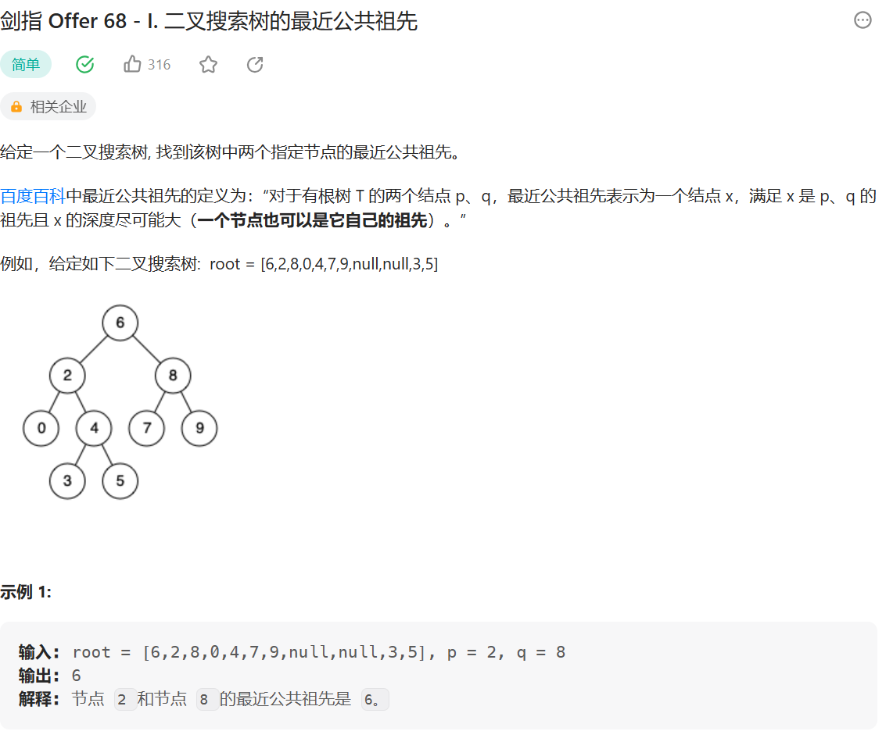

**思路 1：**

-   使用`hashMap`存储所有节点的父节点（root 的父节点为 root）
-   通过`hasMap`遍历 p 的所有祖先，并加入`hashset`
-   遍历 q 的祖先，并判断是否再`hashset`中，如果`hashset`中存在返回当前节点

```js
var lowestCommonAncestor = function (root, p, q) {
    let hashMap = new Map();
    let queue = [];
    let curr = null;
    queue.push(root);
    hashMap.set(root, root);

    while (queue.length !== 0) {
        curr = queue.shift();

        if (curr.left) {
            queue.push(curr.left);
            hashMap.set(curr.left, curr);
        }
        if (curr.right) {
            queue.push(curr.right);
            hashMap.set(curr.right, curr);
        }
    }

    let hashSet = new Set();
    curr = p;
    while (curr !== hashMap.get(curr)) {
        hashSet.add(curr);
        curr = hashMap.get(curr);
    }

    curr = q;
    while (curr !== hashMap.get(curr)) {
        if (hashSet.has(curr)) {
            return curr;
        }
        curr = hashMap.get(curr);
    }
    return root;
};
```

**思路 2：**

1. p 是 q 的 `LCA` (最低公共祖先), 或者 q 是 p 的 `LCA`

    > 那么我们直接把那个更上面的那个返回出来，另外一个没有遇到 (根本不去), 代表最后只有一个然后另外一个是 null
    >
    > 那么整体返回的就是那一个，也就是对的

2. p 和 q 不互为 `LCA`, 要往上才能找到

    > 那么这两个都会被找到然后往上传，一直传到他们的 `LCA` 就会直接返回那个 `LCA`

```js
var lowestCommonAncestor = function (root, p, q) {
    if (root === null || root === p || root === q) {
        // p 是 q的 `LCA` (最低公共祖先), 或者 q是 p的 `LCA`
        return root;
    }

    let left = lowestCommonAncestor(root.left, p, q);
    let right = lowestCommonAncestor(root.right, p, q);

    if (left !== null && right !== null) {
        // p和q一路向上传递，直到在LCA处汇聚，返回LCA
        return root;
    }
    return left !== null ? left : right;
};
```

### 二叉树中的后继节点

**【题目】** 现在有一种新的二叉树节点类型如下:

```java
public class Node {
    public int value;
    public Node left;
    public Node right;
    public Node parent;
    public Node(int val) {
        value = val;
    }
}
```

该结构比普通二叉树节点结构多了一个指向父节点的 parent 指针。

假设有一棵 Node 类型的节点组成的二叉树，树中每个节点的 parent 指针都正确地指向自己的父节点，头节 点的 parent 指向 null。

只给一个在二叉树中的某个节点 node，请实现返回 node 的后继节点的函数。

在二叉树的中序遍历的序列中， node 的下一个节点叫作 node 的后继节点。

**思路：**

给定节点 X 找后继节点，有两种情况:

-   X 有右子树时，那么右子树的**最左**的 leaf 节点就是 X 的后继节点 (因为中序遍历时，遍历到 X 节点后下一步要遍历其右子树，而在遍历 X 节点的右子树时需先遍历右子树的左子树，这样 X 节点的**后继为右子树的最左 leaf 节点**)
-   X 没有右子树，那么判断 X 节点是否是父节点的左子树节点
    -   如果是，那么这个父亲就是 X 的后继节点
    -   如果不是，那就向上遍历父节点，判断所遍历的节点是否是其父节点的左子树节点
        -   如果是此节点为 X 的后继节点
        -   如果直到 root 还未找到，那就代表 X 节点 是整颗树最右的叶节点，中序排序最后一个节点，没有后继节点，返回 null

```js
function getSuccessorNode(head) {
    if (head === null) {
        return null;
    }
    // 判断head是否有右节点
    if (head.right !== null) {
        // 返回右子树中最深的左节点
        return getLeftNode(head.right);
    }
    let parent = head.parent;
    // 无右节点，则需要向上找到第一个为父亲节点左节点的节点
    while (parent !== null && head !== parent.left) {
        head = parent;
        parent = head.parent;
    }
    return parent;
}

function getLeftNode(head) {
    if (head === null) {
        return null;
    }
    if (head.left !== null) {
        return getLeftNode(head.left);
    } else {
        return head;
    }
}
```

### 二叉树的序列化和反序列化

```java
//先序方式
public static String seriaByPre(Node node){
    if(head == null){
        return "#_";
    }
    String res = head.value + "_";
    res += serialByPre(head.left);
    res += serialByPre(head.right);
    return res;
}

//反序列化
public static Node reconByPreString(String preStr){
    String[] values = preStr.split("_");
    Queue<String> queue = new LinkedList<String>();
    for(int i = 0; i != values.length; i++){
        queue.add(values[i]);
    }
    return reconPreOrder(queue);
}

public static Node reconPreOrder(Queue<String> queue){
        String value = queue.poll();
        if(value.equals("#"){
        return null;
}
        Node head = new Node(Integer.valueOf(value));
        head.left = reconPreOrder(queue);
        head.right = reconPreOrder(queue);
        return head;
}
```

### 折纸问题

请把一段纸条竖着放在桌子上，然后从纸条的下边向上方对折 1 次，压出折痕后 展开。

此时折痕是凹下去的，即折痕突起的方向指向纸条的背面。

如果从纸条的下边向上方连续对折 2 次，压出折痕后展开，此时有三条折痕，从 上到下依次是下折痕、下折痕和上折痕。

给定一个输入参数 N，代表纸条都从下边向上方连续对折 N 次。

请从上到下打印所有折痕的方向。

例如:N=1 时，打印: down N=2 时，打印: down down up

**思路：**

整个就是二叉树

-   左子树都是凹折痕
-   右子树都是凸折痕
-   然后整个的头节点就是凹折痕

```java
//递归过程
//i是节点的层数，N一共的层数，down == true凹 down ==false 凸
public static void printProcess(int i, int N, boolean down){
    if(i > N){
        return ;
    }
    printProcess(i+1,N,true);
    System.out.println(down ? "凹" :"凸");
    printProcess(i+1,N,false);
}

```
