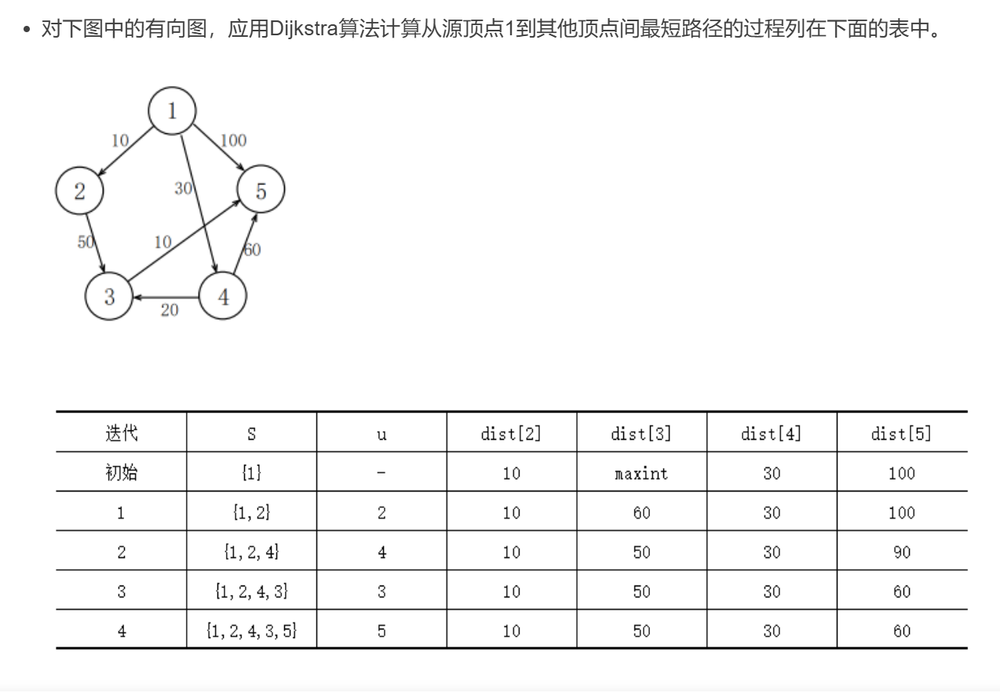

### 单源最短路：Dijkstra 算法

[**基本思想**](https://blog.csdn.net/qq_41040550/article/details/107029809)：

- 一个顶点属于集合 S，当且仅当从源到该顶点的最短路径长度已知。
- 设置顶点集合 S，并不断地作贪心选择来扩充这个集合。
- 贪心策略：每次都从 V-S 中找出具有最短特殊路长的顶点 u 加入 S。

**算法思路**：

1. 初始时，S 中仅含有源点。
2. 设 u 是 G 的某一个顶点，把从源点到 u 且中间只经过 S 中顶点的路称为从源点到 u 的特殊路径，并用数组 dist 记录当前每个顶点所对应的最短特殊路径长度。
3. Dijkstra 算法每次从 V-S 中取出具有最短特殊路长度的顶点 u，将 u 添加到 S 中，同时对数组 dist 作必要的修改。
4. 一旦 S 包含了 V 中所有顶点，dist 就记录了从源到其它所有顶点之间的最短路径长度。



#### [743. 网络延迟时间](https://leetcode.cn/problems/network-delay-time/description/)

给你一个列表 times，表示信号经过 有向 边的传递时间。 times[i] = (ui, vi, wi)，其中 ui 是源节点，vi 是目标节点， wi 是一个信号从源节点传递到目标节点的时间。

现在，从某个节点 K 发出一个信号。需要多久才能使所有节点都收到信号？如果不能使所有节点收到信号，返回 -1 。

[**两种 Dijkstra 写法（附题单）**](https://leetcode.cn/problems/network-delay-time/solutions/2668220/liang-chong-dijkstra-xie-fa-fu-ti-dan-py-ooe8/)

**写法一：朴素 Dijkstra** （适用于稠密图）

> 稠密图：边的数量级和 n ^ 2 相当的图。

```js
/**
 * 计算网络信号从节点k传播到所有其他节点所需的最短时间
 * @param {number[][]} times 边列表，每个元素格式为 [源节点, 目标节点, 传播时间]
 * @param {number} n 网络中的节点总数
 * @param {number} k 信号起始节点
 * @return {number} 信号传播到所有节点的最长时间，如果无法到达所有节点则返回-1
 */
var networkDelayTime = function (times, n, k) {
  // 初始化邻接矩阵，默认值为Infinity表示不可达
  const graph = Array.from({ length: n }, () => Array(n).fill(Infinity));
  // 构建图的邻接矩阵表示
  for (let [u, v, w] of times) {
    graph[u - 1][v - 1] = w; // 节点编号转为0-based索引
  }

  // dist数组记录从起点k到各节点的最短距离
  const dist = Array(n).fill(Infinity);
  // done数组标记节点是否已确定最短路径
  const done = Array(n).fill(false);
  dist[k - 1] = 0; // 起点到自身的距离为0

  while (true) {
    // 找出当前未处理节点中距离起点最近的节点x
    let x = -1;
    for (let i = 0; i < n; i++) {
      if (!done[i] && (x < 0 || dist[i] < dist[x])) {
        x = i;
      }
    }

    // 所有节点都已处理，返回最大距离
    if (x == -1) return Math.max(...dist);
    // 存在不可达节点，返回-1
    if (dist[x] === Infinity) return -1;

    done[x] = true; // 标记节点x为已处理
    // 松弛操作：更新x的邻居节点的最短距离
    for (let y = 0; y < n; y++) {
      dist[y] = Math.min(dist[y], dist[x] + graph[x][y]);
    }
  }
};
```

**写法二：堆优化 Dijkstra**（适用于稀疏图）

> 稀疏图：边的数量远小于 n ^ 2 的图。

```js
/**
 * 计算网络信号从节点k传播到所有节点所需的最短时间
 * @param {number[][]} times - 网络连接信息数组，格式为[u, v, w]表示从u到v需要w时间
 * @param {number} n - 网络中的节点总数
 * @param {number} k - 信号起始节点
 * @return {number} - 返回信号传播到所有节点的最短时间，如果无法到达所有节点则返回-1
 */
var networkDelayTime = function (times, n, k) {
  // 初始化邻接表表示的图结构
  const graph = Array.from({ length: n }, () => []);

  // 构建图的邻接表表示
  for (let [u, v, w] of times) {
    graph[u - 1].push([v - 1, w]); // 节点编号转为0-based
  }

  // 初始化距离数组，所有节点初始距离为无穷大
  const dist = Array(n).fill(Infinity);
  // 创建最小优先队列，按距离排序
  const queue = new MinPriorityQueue((p) => p[1]);
  // 将起始节点加入队列，距离设为0
  queue.enqueue([k - 1, 0]);
  dist[k - 1] = 0;

  // Dijkstra算法主循环
  while (!queue.isEmpty()) {
    let [x, dx] = queue.dequeue();
    // 如果当前距离大于已知最短距离，跳过
    if (dx > dist[x]) {
      continue;
    }

    // 遍历当前节点的所有邻居
    for (let [y, w] of graph[x]) {
      let newDis = dx + w;
      // 如果找到更短的路径，更新距离并加入队列
      if (newDis < dist[y]) {
        dist[y] = newDis;
        queue.enqueue([y, dist[y]]);
      }
    }
  }

  // 找出所有节点中的最大距离
  let ans = Math.max(...dist);

  // 如果所有节点都可达则返回最大距离，否则返回-1
  return ans < Infinity ? ans : -1;
};
```

### 多源最短路：Floyd 算法

**[带你发明 Floyd 算法：从记忆化搜索到递推](https://leetcode.cn/problems/find-the-city-with-the-smallest-number-of-neighbors-at-a-threshold-distance/solutions/2525946/dai-ni-fa-ming-floyd-suan-fa-cong-ji-yi-m8s51/)**

```js
/**
 * 使用Floyd算法实现多源最短路径计算
 * @param {number} n - 图中节点的数量
 * @param {number[][]} graph - 图 graph[i][j] 表示节点 i 到节点 j 的边权, 不存在边则为 Infinity
 * @return {number[][]} - 返回一个二维数组，其中 res[i][j] 表示节点 i 到节点 j 的最短路径长度
 */
var Floyd = function (n, graph) {

  // Floyd算法核心：动态规划更新所有节点间的最短路径
  for (let k = 0; k < n; k++) {
    // 中间节点k
    for (let i = 0; i < n; i++) {
      // 起点i
      if (graph[i][k] === Infinity) continue; // 优化：i到k不可达则跳过
      for (let j = 0; j < n; j++) {
        // 终点j
        graph[i][j] = Math.min(
          graph[i][j],
          graph[i][k] + graph[k][j] // 检查通过k中转是否更短
        );
      }
    }
  }

  return graph;
};
```

#### [2642. 设计可以求最短路径的图类](https://leetcode.cn/problems/design-graph-with-shortest-path-calculator/description/)

给你一个有 n 个节点的 有向带权 图，节点编号为 0 到 n - 1 。图中的初始边用数组 edges 表示，其中 edges[i] = [fromi, toi, edgeCosti] 表示从 fromi 到 toi 有一条代价为 edgeCosti 的边。

请你实现一个 Graph 类：

Graph(int n, int[][] edges) 初始化图有 n 个节点，并输入初始边。
addEdge(int[] edge) 向边集中添加一条边，其中 edge = [from, to, edgeCost] 。数据保证添加这条边之前对应的两个节点之间没有有向边。
int shortestPath(int node1, int node2) 返回从节点 node1 到 node2 的路径 最小 代价。如果路径不存在，返回 -1 。一条路径的代价是路径中所有边代价之和。

```js
/**
 * 图类，使用Floyd算法实现多源最短路径计算
 * @param {number} n - 图中节点的数量
 * @param {number[][]} edges - 图的边集合，每个元素格式为[起点, 终点, 权重]
 */
var Graph = function (n, edges) {
  // 初始化邻接矩阵，所有节点间距离默认为Infinity(不可达)
  this.graph = Array.from({ length: n }, () => Array(n).fill(Infinity));

  // 节点到自身的距离为0
  for (let i = 0; i < n; i++) {
    this.graph[i][i] = 0;
  }

  // 填充初始边权重
  for (let [x, y, w] of edges) {
    this.graph[x][y] = w;
  }

  // Floyd算法核心：动态规划更新所有节点间的最短路径
  for (let k = 0; k < n; k++) {
    // 中间节点k
    for (let i = 0; i < n; i++) {
      // 起点i
      if (this.graph[i][k] === Infinity) continue; // 优化：i到k不可达则跳过
      for (let j = 0; j < n; j++) {
        // 终点j
        this.graph[i][j] = Math.min(
          this.graph[i][j],
          this.graph[i][k] + this.graph[k][j] // 检查通过k中转是否更短
        );
      }
    }
  }
};

/**
 * 添加新边并更新最短路径
 * @param {number[]} edge - 新边，格式为[起点, 终点, 权重]
 */
Graph.prototype.addEdge = function (edge) {
  let [x, y, w] = edge;
  let n = this.graph.length;

  // 只有新边的权重比现有值更小时才需要更新
  if (w < this.graph[x][y]) {
    this.graph[x][y] = w;

    // 更新所有可能受影响的路径(i->x->y->j)
    for (let i = 0; i < n; i++) {
      for (let j = 0; j < n; j++) {
        this.graph[i][j] = Math.min(
          this.graph[i][j],
          this.graph[i][x] + w + this.graph[y][j]
        );
      }
    }
  }
};

/**
 * 查询两个节点间的最短路径
 * @param {number} node1 - 起点
 * @param {number} node2 - 终点
 * @return {number} 最短路径长度，不可达返回-1
 */
Graph.prototype.shortestPath = function (node1, node2) {
  return this.graph[node1][node2] < Infinity ? this.graph[node1][node2] : -1;
};
```
