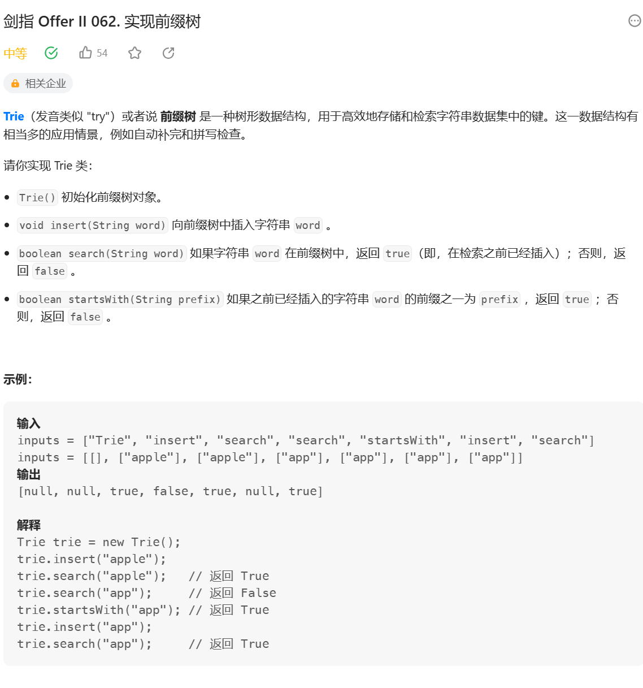

### 前缀树
何为前缀树? 如何生成前缀树?

例子: 一个字符串类型的数组arr1，另一个字符串类型的数组arr2。

arr2中有哪些字符，是arr1中出现的？请打印。

arr2中有哪些字符，是作为arr1中某个字符串前缀出现的？请打印。

arr2中有哪些字符，是作为arr1中某个字符串前缀出现的？请打印 

arr2中出现次数最大的前缀


**思路：**
1. 将字符放在edge上，用长度为26的数组记录可能出现的字符，根据字符的code值判断在数组中的位置
2. 记录字符路过的数量p和以当前字符为结尾的个数e
```js
/**
 * Initialize your data structure here.
 */
var Trie = function() {
    this.p = 0;
    this.e = 0;
    this.next = Array.from({length: 26});
};

/**
 * Inserts a word into the trie. 
 * @param {string} word
 * @return {void}
 */
Trie.prototype.insert = function(word) {
    if (word === null) return;
    let arr = word.split('')
    let node = this;
    let index = 0;
    node.p++
    for (let i = 0; i < arr.length; i++) {
        index = arr[i].charCodeAt() - 'a'.charCodeAt();
        if (!node.next[index]) {
            node.next[index] = new Trie();
        }
        node = node.next[index]
        node.p++
    }
    node.e++
};

/**
 * Returns if the word is in the trie. 
 * @param {string} word
 * @return {boolean}
 */
Trie.prototype.search = function(word) {
    if (word === null) return true;
    let arr = word.split('');
    let node = this;
    let index = 0;

    for (let i = 0; i < arr.length; i++) {
        index = arr[i].charCodeAt() - 'a'.charCodeAt();
        if (!node.next[index]) {
            return false;
        }
        node = node.next[index];
    }
    if (node.e === 0) return false
    return true
};

/**
 * Returns if there is any word in the trie that starts with the given prefix. 
 * @param {string} prefix
 * @return {boolean}
 */
Trie.prototype.startsWith = function(prefix) {
     if (prefix === null) return true;
    let arr = prefix.split('');
    let node = this;
    let index = 0;

    for (let i = 0; i < arr.length; i++) {
        index = arr[i].charCodeAt() - 'a'.charCodeAt();
        if (!node.next[index]) {
            return false;
        }
        node = node.next[index];
    }
    return true
};

/**
 * Your Trie object will be instantiated and called as such:
 * var obj = new Trie()
 * obj.insert(word)
 * var param_2 = obj.search(word)
 * var param_3 = obj.startsWith(prefix)
 */
```
