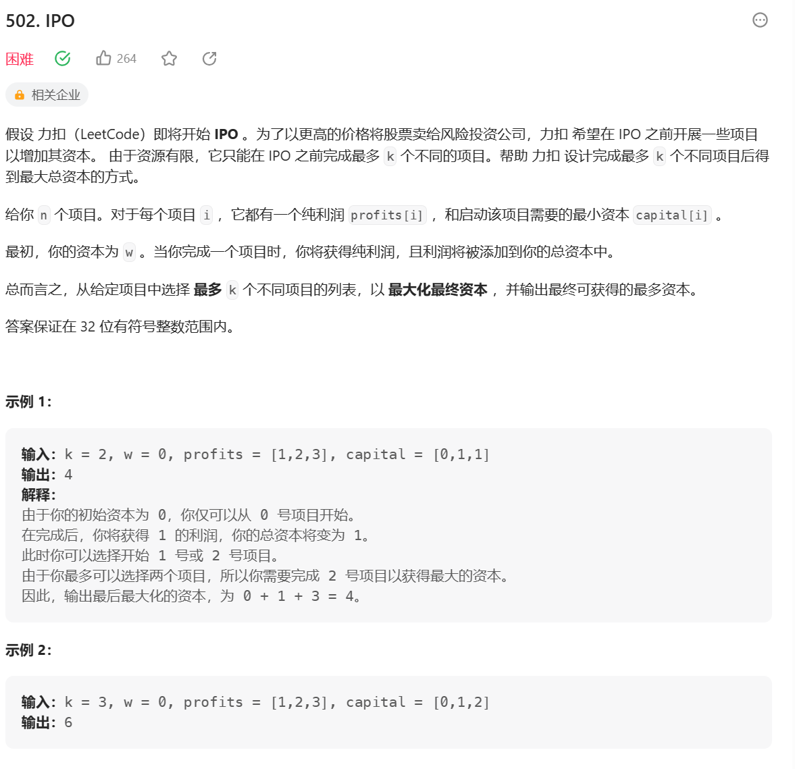
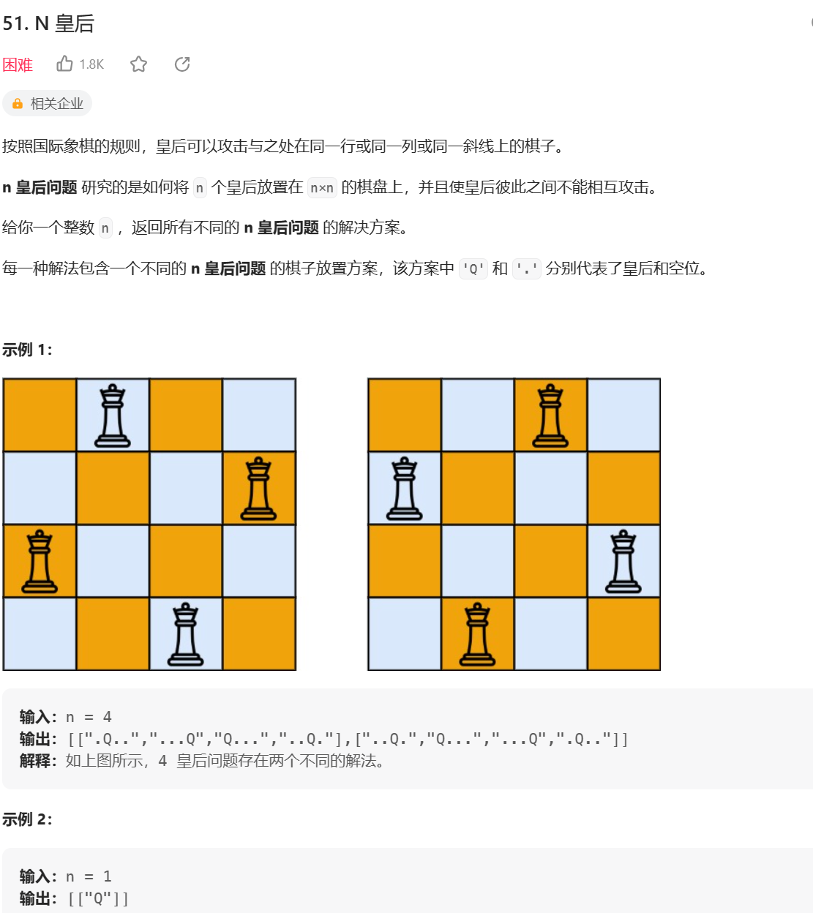

## 贪心算法
在某一个标准下，优先考虑最满足标准的样本，然后考虑最不满足的样本，最终得到一个答案的算法，叫做贪心算法。
即不从整体最优上加以考虑，所做出的是在某种意义上的**局部最优解**

**解题套路：**

1. 实现一个不依靠贪心策略的解法x，可以用最暴力的尝试

2. 脑补出贪心策略

3. 用解法X和对数器，验证每一个贪心策略，用实验得到正确解

### **会议安排**
一些项目要占用一个会议室宣讲，会议室不能同时容纳俩个项目，给出项目的起始时间和截止时间，如何安排最多的项目。

**策略：截止时间早**
以截至时间排序，选择截至时间在前的会议。每当选择一个会议时，以这个会议的end为时间点判断接下来的会议是否满足条件

```ts
function Program(start, end) {
    this.start = start;
    this.end = end;
}

function bestArrange(program: Program[], start = 0) {
    program.sort((a,b) => a.end  - b.end)
    let result = 0;
    for (let i = 0; i < program.length; i++) {
        if (program[i].start >= start) {
            result++
            start = program[i].start
        }
    }
    console.log(program)
    return result
}
```

### **IPO**

给定初始资金和最多做几个项目，最大化资本

先给定一个花费组织排序的小根堆，锁住，在给定一个大根堆，以利润组织

```js
class Heap {
    constructor(cmp = (x,y) => x - y) {
        this.heap = []
        this.cmp = cmp
    }
    insert(data) {
        const {heap, cmp, swap} = this
        heap.push(data)
        let index = this.size() - 1
        while (index) {
            let parentIndex = (index-1)>>1
            if (!cmp(heap[index], heap[parentIndex])) return 
            swap(heap, index, parentIndex)
            index = parentIndex
        } 
    }
    pop() {
        const {heap, swap} = this
        if (!this.size()) {
            return null;
        }
        swap(heap, 0, this.size() - 1)
        let res = heap.pop();

        let len = this.size()
        // 有可能没有右孩子但是又左孩子，所以以左孩子进行判断
        let index = 0, left = index * 2 + 1

        while (left < len) {
            let largestIndex = left + 1 < len && this.cmp(heap[left + 1], heap[left]) ? left + 1 : left
            if (this.cmp(heap[index], heap[largestIndex])) {
                break 
            }
            swap(heap, index, largestIndex)
            index = largestIndex
            left = index * 2 + 1
        }


        return res
    }
    swap(arr, i, j) {
        [arr[i], arr[j]] = [arr[j], arr[i]]
    }
    size() {
        return this.heap.length
    }
    peak() {
        return this.heap[0]
    }
    isEmpty() {
        return !this.heap.length
    }
}
var findMaximizedCapital = function(k, w, profits, capital) {
    let n = capital.length
    let minCosts = []
    let maxProfit = new Heap()
    for (let i = 0; i < n; i++) {
        minCosts.push([profits[i], capital[i]])
    }
    minCosts.sort((a, b) => a[1] - b[1])
    let curr = 0
    for (let i = 0; i < k; i++) {
        while (curr <  n && minCosts[curr][1] <= w) {
            maxProfit.insert(minCosts[curr++][0])
        }
        if (!maxProfit.size()) {
            return w
        }
        w += maxProfit.pop()
    }
    return w
};
```

### **取中位数**

一个数据流中，随时可以取得中位数

先给一个数字，放入大根堆的堆顶；第二个数字cur是否小于等于大根堆顶，是，cur入大根堆，不是，入小根堆；接着看大根堆和小根堆的size，如果size差距大于等于2，则较大的那个堆顶弹出进另外一个。

```js
class Heap {
    constructor(cmp = (x,y) => x > y) {
        this.heap = []
        this.cmp = cmp
    }
    insert(data) {
        const {heap, cmp, swap} = this
        heap.push(data)
        let index = this.size() - 1
        while (index) {
            let parentIndex = (index-1)>>1
            if (!cmp(heap[index], heap[parentIndex])) return 
            swap(heap, index, parentIndex)
            index = parentIndex
        } 
    }
    pop() {
        const {heap, swap} = this
        if (!this.size()) {
            return null;
        }
        swap(heap, 0, this.size() - 1)
        let res = heap.pop();

        let len = this.size()
        // 有可能没有右孩子但是又左孩子，所以以左孩子进行判断
        let index = 0, left = index * 2 + 1

        while (left < len) {
            let largestIndex = left + 1 < len && this.cmp(heap[left+1], heap[left]) ? left + 1 : left
            if (this.cmp(heap[index], heap[largestIndex])) {
                break 
            }
            swap(heap, index, largestIndex)
            index = largestIndex
            left = index * 2 + 1
        }


        return res
    }
    swap(arr, i, j) {
        [arr[i], arr[j]] = [arr[j], arr[i]]
    }
    size() {
        return this.heap.length
    }
    peak() {
        return this.heap[0]
    }
    isEmpty() {
        return !this.heap.length
    }
}

/**
 * initialize your data structure here.
 */
var MedianFinder = function() {
     this.minHeap = new Heap((x,y) => x < y)
     this.maxHeap = new Heap()
};


/** 
 * @param {number} num
 * @return {void}
 */
MedianFinder.prototype.addNum = function(num) {
    if (this.maxHeap.size() === 0 || num <= this.maxHeap.peak()) {
        this.maxHeap.insert(num)
    } else {
       this.minHeap.insert(num)
    }
    if (this.minHeap.size() === this.maxHeap.size() + 2) {
        this.maxHeap.insert(this.minHeap.pop())
    }
    if (this.maxHeap.size() === this.minHeap.size() + 2) {
        this.minHeap.insert(this.maxHeap.pop())
    }
};

/**
 * @return {number}
 */
MedianFinder.prototype.findMedian = function() {
    let minHeapSize = this.minHeap.size()
    let maxHeapSize = this.maxHeap.size()
    let minHeapHead = this.minHeap.peak()
    let maxHeapHead = this.maxHeap.peak()
    console.log(this.minHeap, this.maxHeap)
    let len = minHeapSize + maxHeapSize
    if (len === 0) return null
    if (len % 2 !== 0) {
        return maxHeapSize > minHeapSize ? maxHeapHead : minHeapHead;
    } else {
        // console.log(this.maxHeap.pop(), this.minHeap.pop())
        return (minHeapHead + maxHeapHead) / 2
    }
};

/**
 * Your MedianFinder object will be instantiated and called as such:
 * var obj = new MedianFinder()
 * obj.addNum(num)
 * var param_2 = obj.findMedian()
 */
```

### **N皇后**



**思路：暴力递归**
1. 用record记录皇后位置，下标i代表行，record[i]代表列
2. 递归函数process(i, record, n)，递归每一行，并传递record
3. 递归中循环判断第i行的所有j是否满足条件，满足就将j记录到record中并递归下一行
4. 当递归到第n行后，表明此时record中记录的位置信息满足所有条件，添加到返回结果中
```js
/**
 * @param {number} n
 * @return {string[][]}
 */
var solveNQueens = function(n) {
    if (n === 1) {
        return [["Q"]]
    }
    let res = []
    let record = new Array(n) // 记录第i行皇后放在第几列上，下标i代表行，record[i]代表列
    process(0, record, n)
    function process(i, record, n) {
    if (i === n) {
        res.push(toString(record, n))
        return
    }
    for (let j = 0; j < n; j++) {
        if (isValid(record, i, j)) {
            record[i] = j
            process(i+1, record,  n)
        }
    }
}
function isValid(record, i, j) {
    for (let k = 0; k < i; k++) {
        if (record[k] === j || Math.abs(i - k) === Math.abs(record[k] - j)) {
            return false;
        }
    }
    return true
}
function toString(record, n) {
    let res = []
    for (let i = 0; i < n; i++) {
        let strArr = new Array(n).fill('.')
        let j = record[i]
        strArr[j] = 'Q'
        res.push(strArr.join(''))
    }
    return res
}

return res
// console.log(res)
};

```
**优化：位运算加速**