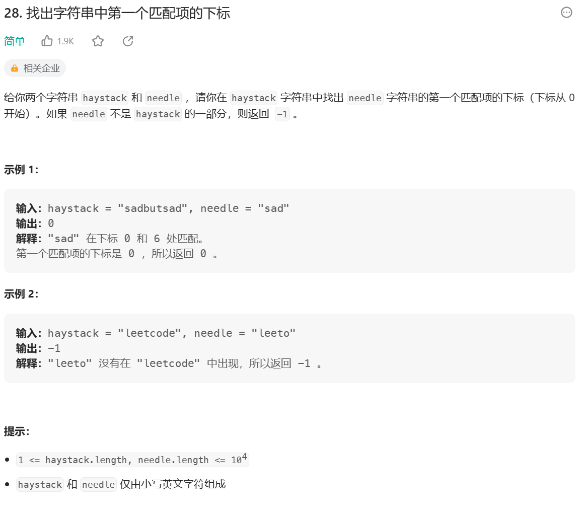

## KMP算法

KMP 算法（Knuth-Morris-Pratt 算法）是一个著名的字符串匹配算法。

**问题：** 字符串str1和str2，str1是否包含str2，如果包含返回str2在str1中开始的位置。

如何做到时间复杂度O(N)完成？

**分析(暴力破解)：**

1. 将str1和str2数组化，循环遍历str1数组，从当前位置i开始与str2数组从头逐位比对，如果比对不成功继续从i+1位置与str2数组比对；
2. 时间复杂度O(N*M)

**分析(KMP)：**

1. 将str1和str2数组化，获取str2数组每个位置的前缀和后缀最大相等的长度(如：第j个位置时，前0~j-1个字符为‘abceabc’，则前缀和后缀最大相等的长度为3)；
2. 循环遍历str1数组，假设当前遍历到第i个位置，从i开始与str2数组从头逐位比对；
   1. 如果str1和str2数组i1位置与i2位置相同，则i1和i2一起加一；
   2. 如果str2数组越界说明比对成功，返回i1-i2(str2数组的循环标志);
   3. 如果在str1数组在i+x位置于str2数组x位置不一致。获取str2数组x位置的前缀和后缀最大相等的长度，假设为p。将str2数组下标位置跳回p，从str1数组的i+x位置和str2数组的p位置重新开始比对;
   4. 如果i+x位置和p位置比对成功，则str1和str2数组下标皆+1，向下比对；
   5. 如果i+x位置和p位置比对不成功，则获取p位置的前缀和后缀最大相等的长度p1，将str2数组下标位置跳回p1，继续与str1数组的i+x位置比对；
   6. 如果str2数组下标位置跳回到0比对依旧不成功，则str1数组位置+1(i+x+1);
   
    其中2.3中str2回跳到位置p相等于包含了一个假设和一步操作：

        - 假设：str1数组以从i位置一直到i+p位置的字符开头都无法完整的拼出str2
        - 操作：str2回跳到位置p，相当于将str2数组右移了位置p与str1数组的i+p位置对齐，因为str2数组的0~p位置与str1数组的i+x-p~i+x位置相同，所以直接从p位置和i+x位置开始比对；

    ```js
    function getIndexOf(str1, str2) {
        const str1Arr = str1.split("");
        const str2Arr = str2.split("");
        // 获取前缀和后缀最大相等的长度
        const next = getNextArr(str2Arr);
        // str1Arr下标
        let i1 = 0;
        // str2Arr下标
        let i2 = 0;

        while (i1 < str1Arr.length && i2 < str2Arr.length) {
            // 2.1 如果str1和str2数组i1位置与i2位置相同，则i1和i2一起加一
            if (str1Arr[i1] === str2Arr[i2]) {
                i1 += 1;
                i2 += 1;
            } else if (i2 === 0) {
                // 2.6
                i1 += 1;
            } else {
                // 2.3
                i2 = next[i2]
            }
        }

        // 2.2
        return i2 === str2Arr.length ? i1 - i2 : -1;
    }
    ```

3. 前缀和后缀最大相等的长度：

    - 下标位置为0的最大相等的长度为-1，下标位置为1的最大相等的长度为0；
    - 下标位置为i的最大相等的长度：
      - 获取下标位置为i-1的最大相等长度p；
      - 如果位置p字符和位置i-1的字符相同，则位置i的最大相等长度为p+1,i++并且p++；
      - 如果位置p字符和位置i-1的字符不相同，获取下标位置为p的最大相等长度p1，继续判断p1与i-1位置字符是否相同；
      - 循环执行直到返回到位置0表示前缀和后缀最大相等的长度为0；

    ```js
    function getNextArr(arr) {
        if (arr.length < 2) {
            return [-1];
        }
        const next = new Array(arr.length);
        next[0] = -1;
        next[1] = 0;

        let prev = 0;
        let currIndex = 2;

        while (currIndex < arr.length) {
            if (arr[currIndex - 1] === arr[prev]) {
                // 如果位置p字符和位置i-1的字符相同，则位置i的最大相等长度为p+1,i++并且p++
                next[currIndex++] = ++prev;
            } else if (prev > 0) {
                // 如果位置p字符和位置i-1的字符不相同，获取下标位置为p的最大相等长度p1，继续判断p1与i-1位置字符是否相同
                prev = next[prev];
            } else {
                // 循环执行直到返回到位置0表示前缀和后缀最大相等的长度为0
                next[currIndex++] = 0;
            }
        }

        return next;
    }
    ```

4. 时间复杂度O(N)

