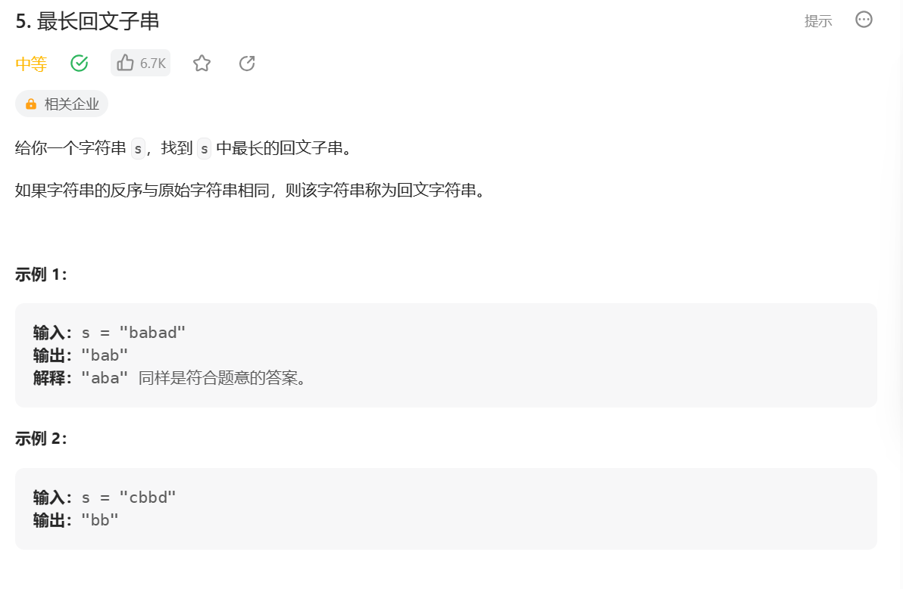

## Manacher 算法

**解决的问题**

字符串 str 中，最长回文子串的长度如何求解？

如何做到时间复杂度 O(N)完成？

**思路(暴力破解)：**

1. 在每个字符前后添加特殊字符(abba -> #a#b#b#a#)；
2. 遍历处理后的每个字符，从当前字符同时向两边扩的位置进行比对
    - 如果左右两边字符相等，继续向两边扩展；
    - 如果不相等，记录下当前回文长度，停止扩展，循环到下个位置；

```js
var longestPalindrome = function (s) {
    if (s.length === 1) {
        return s;
    }

    const charArr = manacherString(s);
    let longest = charArr[1];

    for (let i = 0; i < charArr.length; i++) {
        let left = i - 1;
        let right = i + 1;
        while (
            left >= 0 &&
            right < charArr.length &&
            charArr[left] === charArr[right]
        ) {
            left--;
            right++;
        }

        left++;
        right--;
        if (longest.length < (right - left) / 2) {
            longest = "";
            for (let j = left; j <= right; j++) {
                if (j % 2 !== 0) {
                    longest += charArr[j];
                }
            }
        }
    }

    return longest;
};

var manacherString = function (s) {
    const arr = s.split("");
    const res = new Array(s.length * 2 + 1);

    for (let i = 0; i < res.length; i++) {
        if (i % 2 === 0) {
            res[i] = "#";
        } else {
            res[i] = arr[(i - 1) / 2];
        }
    }

    return res;
};
```

**思路(Manacher)：**

-   最长回文直径：从当前字符向外扩所能得到的最大回文字符串的长度
-   最长回文半径：Math.ceil(最长回文直径 / 2)
-   回文半径数组: 每个位置字符的最长回文半径所组成的数组
-   之前扩的所有位置中所达到的最右回文右边界 R
-   中心点 C：之前扩的所有位置中所达到的最右回文右边界 R 所对应的中心点

1. 在每个字符前后添加特殊字符(abba -> #a#b#b#a#)；
2. 遍历处理后的每个字符，从当前字符同时向两边扩的位置进行比对，假设当前遍历到 i 位置：
    1. i 位置经由 C 的对称位置记为 i'
    2. i'位置的最长回文半径所形成的区域[L',R']
        - 如果`i > R`，则从 i 位置同时向两边扩逐位比对，无加速；
        - 如果[L',R']包含在[2c-R,R]内，则 i 位置与 i'位置的最长回文半径相等；
        - 如果一部分落在[2C-R,R]内(`L' < 2C-R < R' < R` )，则 i 位置的最长回文半径为`R - i`
        - 如果`L' = 2C-R`，则以 i 为中心从 R 位置同时向两边扩逐位比对

```js
function maxLcpsLength(s) {
    if (s.length === 1) {
        return 1;
    }

    const charArr = manacherString(s);
    const pArr = new Array(charArr.length).fill(0);
    let R = -1;
    let C = -1;
    let max = -Infinity;
    for (let i = 0; i < charArr.length; i++) {
        // 判断加速多少位置
        pArr[i] = R > i ? Math.min(pArr[2 * C - i], R - i) : 1;
        while (i + pArr[i] < charArr.length && i - pArr[i] > -1) {
            if (charArr[i + pArr[i]] === charArr[i - pArr[i]]) {
                pArr[i] = pArr[i] + 1;
            } else {
                break;
            }
        }
        if (i + pArr[i] > R) {
            R = i + pArr[i];
            C = i;
        }
        max = Math.max(max, pArr[i]);
    }
    return max - 1;
}
```



```js
var longestPalindrome = function (s) {
    if (s.length === 1) {
        return s;
    }

    const charArr = manacherString(s);
    let longest = charArr[1];

    for (let i = 0; i < charArr.length; i++) {
        let left = i - 1;
        let right = i + 1;
        while (
            left >= 0 &&
            right < charArr.length &&
            charArr[left] === charArr[right]
        ) {
            left--;
            right++;
        }

        left++;
        right--;
        if (longest.length < (right - left) / 2) {
            longest = "";
            for (let j = left; j <= right; j++) {
                if (j % 2 !== 0) {
                    longest += charArr[j];
                }
            }
        }
    }

    return longest;
};

var manacherString = function (s) {
    const arr = s.split("");
    const res = new Array(s.length * 2 + 1);

    for (let i = 0; i < res.length; i++) {
        if (i % 2 === 0) {
            res[i] = "#";
        } else {
            res[i] = arr[(i - 1) / 2];
        }
    }

    return res;
};
```

## 滑动窗口 -> 双端队列

### 1. 窗口滑动

有一个整型数组 arr 和一个大小为 w 的窗口从数组的最左边滑到最右边，窗口每次向右边滑一个位置。返回 *滑动窗口中的最大值* 。`(leetcode 239 题)`

例如，数组为[4,3,5,4,3,3,6,7]，窗口大小为 3 时:

```js
[4 3 5]4 3 3 6 7 // 窗口中最大值为5

4[3 5 4]3 3 6 7 // 窗口中最大值为5

4 3[5 4 3]3 6 7 // 窗口中最大值为5

4 3 5[4 3 3]6 7 // 窗口中最大值为4

4 3 5 4[3 3 6]7 // 窗口中最大值为6

4 3 5 4 3[3 6 7] // 窗口中最大值为7
```

如果数组长度为 n，窗口大小为 w，则一共产生 n-w+1 个窗口的最大值。请实现一个函数。

**输入:** 整型数组 arr，窗口大小为 w。

**输出:** 一个长度为 n-w+1 的数组 res，res[i]表示每一种窗口状态下的

以本题为例，结果应该返回{5,5,5,4,6,7}。

**思路：**

1. 借助双端队列（queueMax）存储 arr 下标，**需严格保证单调性**（从大到小，以下标对应的值组织）；
2. 窗口右边界 R 移动时，queueMax 从队尾向队头依次与新纳入窗口下标 i 的值比较，如果`i`对应的值大，则弹出对应 queueMax 中位置，直到将`i`放置到合适位置，严格保证单调递减；
3. 窗口左边界 L 移动时，L 所对应的下标`j`为移出窗口的下标，比较 queueMax 队头位置是否为`j`，如果是则弹出队头，否则不做任何操作；
4. 当形成窗口时，queueMax 队头位置为窗口内最大值的下标；

每个位置的数最多进队列一次，出队列一次，所以总代价 O(N)，平均单次代价 O(1)

```js
/**
 * @param {number[]} nums
 * @param {number} k
 * @return {number[]}
 */
var maxSlidingWindow = function (nums, k) {
    if (nums == null || k < 1 || nums.length < k) {
        return null;
    }
    let res = [],
        queueMax = [];
    for (let i = 0; i < nums.length; i++) {
        while (
            queueMax.length !== 0 &&
            nums[queueMax[queueMax.length - 1]] <= nums[i]
        ) {
            queueMax.pop();
        }
        queueMax.push(i);
        if (queueMax[0] === i - k) {
            queueMax.shift();
        }
        if (i + 1 >= k) {
            res.push(nums[queueMax[0]]);
        }
    }
    return res;
};
```

### 2. 边界滑动

窗口只能右边界或左边界向右滑的情况下，维持窗口内部最大值或者最小值快速更新的结构。

窗口内最大值与最小值更新结构的原理与实现。

**思路：** 与 1 一致，只是具体 code 不一样。

## 单调栈

在数组中想找到一个数，左边和右边比这个数大、且离这个数最近的位置。

如果对每一个数都想求这样的信息，能不能整体代价达到 O(N)？（借助单调栈）

**1. 数组中无重复值**

**思路：**

1. 创建单调栈存储数组下标，以下标对应值组织严格保持单调性（栈顶（小）->栈底（大））；
2. 将数组下标（`i`）依次加入单调栈，每次加入时与栈顶下标对应值比较，如果当前下标对应值大于或等于栈顶所对应值，则将栈顶下标弹出。组织弹出下标的返回值，`{leftMax: 栈顶, rightMax: i}`。当前下标继续与栈顶位置比较，直到将其放置在合适位置严格保证单调性；
3. 数组遍历完成后，将单调栈下标依次弹出，此时每个被弹出下标的返回值`{leftMax: 栈顶, rightMax: -1}`（-1 表示无比这个数大的位置）；

```js
/**
 * @param {number[]} arr
 * @return {number[][]} [[leftMaxIndex, rightMaxIndex]]
 */
function leftAndRightMaxIndex(arr) {
    const stack = [];
    const res = new Array(arr.length);
    for (let i = 0; i < arr.length; i++) {
        while (stack.length !== 0 && arr[stack[stack.length - 1]] <= arr[i]) {
            let index = stack.pop();
            res[index] = [
                stack.length - 1 >= 0 ? stack[stack.length - 1] : -1,
                i,
            ];
        }
        stack.push(i);
    }
    while (stack.length !== 0) {
        let index = stack.pop();
        res[index] = [stack.length - 1 >= 0 ? stack[stack.length - 1] : -1, -1];
    }
    return res;
}
```

**2. 数组中有重复值**

**思路：** 同上，重复值下标以数组方式存储在单调栈中

```js
/**
 * @param {number[]} arr
 * @return {number[][]} [[leftMaxIndex, rightMaxIndex]]
 */
function leftAndRightMaxIndex2(arr) {
    const stack = [];
    const res = new Array(arr.length);
    for (let i = 0; i < arr.length; i++) {
        while (stack.length !== 0 && arr[stack[stack.length - 1][0]] < arr[i]) {
            // 不断弹出比arr[i]小的位置
            let indexList = stack.pop();
            for (let index of indexList) {
                // 组织返回值
                res[index] = [
                    stack.length - 1 >= 0
                        ? stack[stack.length - 1][
                              stack[stack.length - 1].length - 1
                          ]
                        : -1,
                    i,
                ];
            }
        }
        if (stack.length > 0 && arr[stack[stack.length - 1][0]] === arr[i]) {
            // 如果有重复值直接加入到末尾
            stack[stack.length - 1].push(i);
        } else {
            stack.push([i]);
        }
    }
    // 弹出栈中剩余的位置
    while (stack.length !== 0) {
        let indexList = stack.pop();
        for (let index of indexList) {
            res[index] = [
                stack.length - 1 >= 0
                    ? stack[stack.length - 1][stack[stack.length - 1].length]
                    : -1,
                -1,
            ];
        }
    }
    return res;
}
```

**3. 应用**

数组中累积和与最小值的乘积，假设叫做指标 A。给定一个数组，请返回**子数组**中，指标 A 最大的值。

如：5 3 2 1 6，指标 A 为`17 * 1 = 17`

**思路：**

-   遍历整个数组，求以当前遍历的值为最小值所能组成的最大长度子数组的指标 A，选出所有指标 A 中最大值；
-   找到当前遍历的值为最小值所能组成的最大长度子数组：套用单调栈寻找左右两侧最近比当前值小的位置，两者之间即为所寻找的数组；

```js
/**
 * @param {number[]} arr
 * @return {number[][]} [[leftMinIndex, rightMinIndex]]
 */
function leftAndRightMinIndex(arr) {
  const stack = [];
  const res = new Array(arr.length);
  for (let i = 0; i < arr.length; i++) {
      while (stack.length !== 0 && arr[stack[stack.length - 1][0]] > arr[i]) {
          // 不断弹出比arr[i]大的位置
          let indexList = stack.pop();
          for (let index of indexList) {
              // 组织返回值
              res[index] = [
                  stack.length - 1 >= 0
                      ? stack[stack.length - 1][
                            stack[stack.length - 1].length - 1
                        ]
                      : -1,
                  i,
              ];
          }
      }
      if (stack.length > 0 && arr[stack[stack.length - 1][0]] === arr[i]) {
          // 如果有重复值直接加入到末尾
          stack[stack.length - 1].push(i);
      } else {
          stack.push([i]);
      }
  }
  // 弹出栈中剩余的位置
  while (stack.length !== 0) {
      let indexList = stack.pop();
      for (let index of indexList) {
          res[index] = [
              stack.length - 1 >= 0
                  ? stack[stack.length - 1][stack[stack.length - 1].length - 1]
                  : -1,
              -1,
          ];
      }
  }
  return res;
}

function maxA(arr) {
    let maxA = -Infinity;
    const minRange = leftAndRightMinIndex(arr);
    for (let i = 0; i < arr.length; i++) {
        let [left, right] = minRange[i];
        let sum = 0;
        left = left === -1 ? i : left + 1;
        right = right === -1 ? i : right - 1;
        for (; left <= right; left++) {
            sum += arr[left];
        }
        maxA = maxA > sum * arr[i] ? maxA : sum * arr[i];
    }
    return maxA;
}
```
