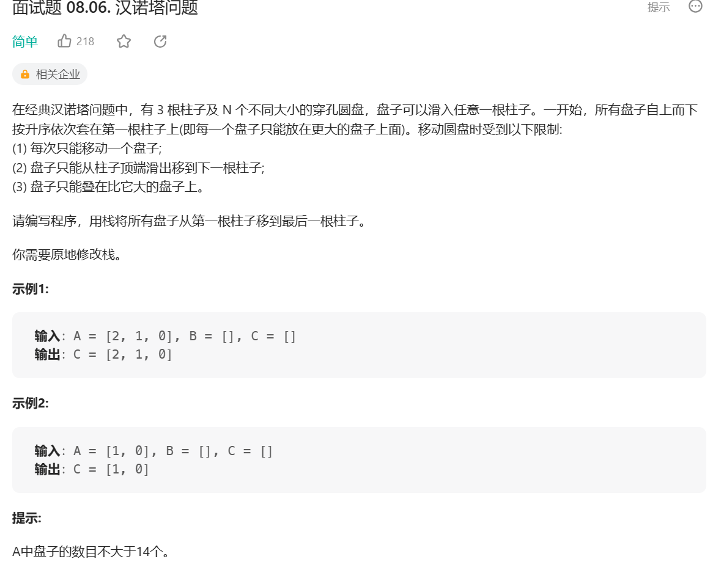
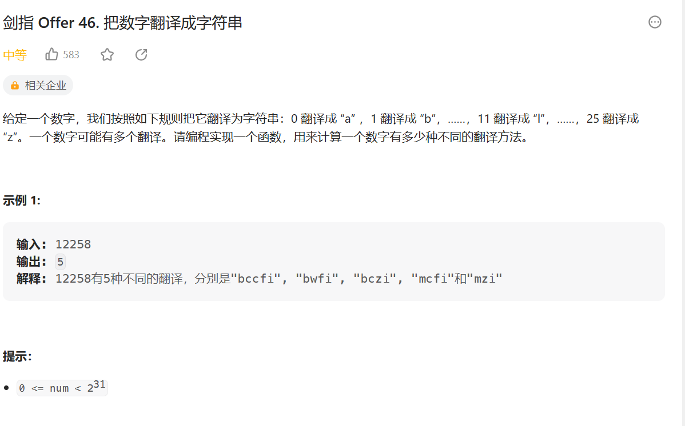

### Dijkstra 算法改进（堆加速）

一个优化 -> 在选择我们没有处理过且值最小的节点的时候是遍历的方式，可以使用堆结构来存储，然后每次就是存还没处理的，最小值的在堆顶，然后处理过的让他别参加堆结构

但是有一个问题，因为我们那些 values 是存从 source 到每个节点最小的 weight, 所以可能哪次遍历中我们会把一个堆结构中一个节点的值改了改成了一个更小的值，我们知道系统提供的堆结构无法接收让我们改变里面已经在的节点 (你要是硬改，系统里面自己做出的操作其实就跟我们直接遍历的复杂度都差不多了 —> 他需要全局扫描), 所以要是想实现，必须我们自己写一个堆

```js
class NodeRecord {
    constructor(node, distance) {
        this.node = node;
        this.distance = distance;
    }
}
// 小根堆
class Heap {
    constructor() {
        this.heap = [];
        // 记录节点在heap中的index
        this.heapIndexMap = new Map();
        // 记录节点的distance
        this.distanceMap = new Map();
    }
    addOrUpdateOrIgore(node, distance) {
        if (this.inHeap(node)) {
            this.distanceMap.set(
                node,
                Math.min(this.distanceMap.get(node), distance)
            );
            this.insertHeapify(node, this.heapIndexMap.get(node));
        }
        if (!this.isEntered(node)) {
            this.heap.push(node);
            this.heapIndexMap.set(node, this.size() - 1);
            this.distanceMap.set(node, distance);
            this.insertHeapify(node, this.size() - 1);
        }
    }
    pop() {
        this.swap(0, this.size() - 1);
        let node = this.heap.pop();
        let nodeRecord = new NodeRecord(node, this.distanceMap.get(node));
        this.heapIndexMap.set(node, -1);
        this.heapify(0, this.size());
        return nodeRecord;
    }
    // 在指定位置插入时向上调整
    insertHeapify(node, index) {
        while (
            this.distanceMap.get(node) <
            this.distanceMap.get(this.heap[(index - 1) >> 1])
        ) {
            this.swap(index, (index - 1) >> 1);
            index = (index - 1) >> 1;
        }
    }
    // 向下调整
    heapify(index, size) {
        let left = index * 2 + 1;
        while (left < size) {
            let minIndex =
                left + 1 < size &&
                this.distanceMap.get(this.heap[left + 1]) <
                    this.distanceMap.get(this.heap[left])
                    ? left + 1
                    : left;
            if (
                this.distanceMap.get(this.heap[index]) >
                this.distanceMap.get(this.heap[minIndex])
            ) {
                break;
            }
            this.swap(index, minIndex);
            index = minIndex;
            left = index * 2 + 1;
        }
    }
    // heap的长度
    size() {
        return this.heap.length;
    }
    // heap是否为空
    isEmpty() {
        return this.heap.length === 0;
    }
    // 节点是否进入过heap
    isEntered(node) {
        return this.heapIndexMap.has(node);
    }
    // 节点是否在heap上
    inHeap(node) {
        return (
            this.heapIndexMap.has(node) && this.heapIndexMap.get(node) !== -1
        );
    }
    swap(i, j) {
        // 交换heapIndexMap中记录的节点位置
        this.heapIndexMap.set(this.heap[i], j);
        this.heapIndexMap.set(this.heap[j], i);
        // 交换heap中的记录
        let temp = this.heap[i];
        this.heap[i] = this.heap[j];
        this.heap[j] = temp;
        // [this.heap[i], this.heap[j]] = [this.heap[j], this.heap[i]]
    }
}

function dijkstra2(node) {
    let heap = new Heap();
    heap.addOrUpdateOrIgore(node, 0);

    let result = new Map();
    while (!heap.isEmpty()) {
        let curr = heap.pop();
        console.log(curr, "curr");
        let node = curr.node;
        let distance = curr.distance;
        for (let edge of node.edges) {
            heap.addOrUpdateOrIgore(edge.to, edge.weight + distance);
        }
        result.set(node, distance);
    }
    return result;
}
```

## 暴力递归

### n 层汉诺塔



**思路：**

-   将柱子抽象为 from、to、other 三个栈
-   将 i 个圆盘从 from 移动到 to 上可拆解为三步：
    1. 将 1 到 i-1 个圆盘移动到 other
    2. 将第 i 个圆盘移动到 to
    3. 将 1 到 i-1 个圆盘移动到 to
    4. 其中第一和第三步递归主函数
-   base case 只剩最后一个直接移动

```js
var hanota = function (A, B, C) {
    process(A, C, B, A.length);
    return C;
};

function process(from, to, other, i) {
    if (i === 1) {
        // base case 只剩最后一个直接移动
        to.push(from.pop());
        return;
    }
    // 将 1 到 i-1 个圆盘移动到 other
    process(from, other, to, i - 1);
    // 将第 i 个圆盘移动到 to
    to.push(from.pop());
    // 将 1 到 i-1 个圆盘移动到 to
    process(other, to, from, i - 1);
}
```

### 字符串的全部子序列

打印一个字符串全部子序列，包括空字符串

-   记录前 i-1 个字符的全部子序列
-   分第 i 个字符加入子序列和不加入子序列

```js
function printAllSubsquences(str) {
    function process(subsquences, i) {
        if (i === str.length) {
            return result.push(subsquences);
        }
        // 前1-i子序列不加上第i个字符
        process(subsquences, i + 1);
        subsquences += str[i];
        // 前1-i子序列加上第i个字符
        process(subsquences, i + 1);
    }
    let result = [];
    subsquences = "";
    process(subsquences, 0);
    return result;
}
```

### 字符串的全排列


**思路：**

-   因为 js 的字符串不可以交换元素，因此需要先转化为数组。
-   这里的 dfs 非常抽象，大概的作用是，就是获取 arr 数组从 start 下标到结尾开始的交换排列，排列的做法是让从 start 开始的第一个值与之后的每一个值（需要包括自己，因为不换也算一种排列）进行交换，以 abcd 为例，让 a 与后面每个值交换可以得到[abcd,bacd,cbad,dbca]，你会想说，这也不是全排列啊？这时候就需要 dfs 进行递归了，当 a 得到第一种排列 abcd 时，我们固定 a，让 start+1，start+1 意味着我们可以得到 bcd 的所有交换排列，当 a 得到 bacd 这种排列时同理，固定 b，得到 acd 的所有交换排列，是不是有点理解了？
-   条件!arr.slice(start, i).includes(arr[i])用于剪枝，arr.slice(start, i)是 arr[i]之前的每一个值，假如之前已经存在 arr[i]了，说明 arr[i]的交换排列已经取过了，同一个字母的交换排列是一样的，等效，剪枝即可。

```js
var permutation = function (s) {
    function dfs(arr, i) {
        if (i === arr.length) {
            return result.push(arr.join(""));
        }
        for (let j = i; j < arr.length; j++) {
            if (!arr.slice(i, j).includes(arr[j])) {
                swap(arr, i, j);
                dfs(arr, i + 1);
                swap(arr, i, j);
            }
        }
    }
    let result = [];
    let arr = s.split("");
    // 0~i-1位置上已经全排，添加第i个位置上的字符
    dfs(arr, 0);
    return result;
};

function swap(arr, i, j) {
    let temp = arr[i];
    arr[i] = arr[j];
    arr[j] = temp;
}
```

### 拿纸牌

给定一个整型数组 arr，代表数值不同的纸牌排成一条线。玩家 A 和玩家 B 依次拿走每张纸牌，规定玩家 A 先拿，玩家 B 后拿，但是每个玩家每次只能拿走最左或最右的纸牌，玩家 A 和玩家 B 都绝顶聪明。请返回最后获胜者的分数。

【举例】
arr=[1,2,100,4]。
开始时，玩家 A 只能拿走 1 或 4。

如果开始时玩家 A 拿走 1，则排列变为[2,100,4]，接下来玩家 B 可以拿走 2 或 4，然后继续轮到玩家 A...

如果开始时玩家 A 拿走 4，则排列变为[1,2,100]，接下来玩家 B 可以拿走 1 或 100，然后继续轮到玩家 A...

玩家 A 作为绝顶聪明的人不会先拿 4，因为拿 4 之后，玩家 B 将拿走 100。所以玩家 A 会先拿 1，让排列变为[2,100,4]，接下来玩家 B 不管怎么选，100 都会被玩家 A 拿走。玩家 A 会获胜，分数为 101。所以返回 101。

arr=[1,100,2]。

开始时，玩家 A 不管拿 1 还是 2，玩家 B 作为绝顶聪明的人，都会把 100 拿走。玩家 B 会获胜，分数为 100。所以返回 100

```js
function win(arr) {
    // 先手函数
    // 在L到R范围上先手可以获得的最大分数
    function f(arr, L, R) {
        if (L === R) {
            // base case 只有一个数，先手直接拿走
            return arr[L];
        }
        // 先手拿L获得的最大分为 arr[L]加上后手在L+1到R上的最大值
        let LMax = arr[L] + s(arr, L + 1, R);
        // 先手拿R获得的最大分为 arr[R]加上后手在L到R-1上的最大值
        let RMax = arr[R] + s(arr, L, R - 1);
        return Math.max(LMax, RMax);
    }
    // 在L到R范围上后手可以获得的最大分数
    function s(arr, L, R) {
        if (L === R) {
            // base case 如果只剩一个数，后手没有数可拿，返回0
            return 0;
        }
        // 后手的情况下，对手先手拿到最优的值，自己则会拿到最小的值
        return Math.min(f(arr, L + 1, R), f(arr, L, R - 1));
    }

    return Math.max(f(arr, 0, arr.length - 1), s(arr, 0, arr.length - 1));
}
```

### 逆序栈
给你一个栈，请你逆序这个栈，不能申请额外的数据结构，只能使用递归函数。
如何实现？

```js
function reverseStack(stack) {
    function reverse(stack) {
        if (stack.length === 0) {
            return 
        }
        // 弹出栈底元素
        let result = f(stack)
        // 将剩下的元素逆序
        reverse(stack)
        // 将栈底元素压栈
        stack.unshift(result)
    }
    // 只弹出栈底元素 stack= [1,2,3] f(stack) 返回3，stack变为[1,2]
    function f(stack) {
        let result = stack.shift()
        if (stack.length === 0) {
            return result
        } else {
            let last = f(stack)
            stack.unshift(result)
            return last
        }
        
    }
    reverse(stack)
}

```

### 把数字翻译成字符串

```js
var translateNum = function(num) {
    // 已经知道前i-1个怎么翻，i后面有多少种翻译
    function process(num, i) {
        if (i === num.length) {
            return 1
        }
        if (num[i] === '1') {
            let res = process(num, i + 1)
            if (i+1< num.length) {
                res += process(num, i + 2)
            }
            return res
        }
        if (num[i] === '2') {
            let res = process(num, i + 1)
            if (i+1< num.length && parseInt(num[i+1]) <= 5) {
                res += process(num, i + 2)

            }
            return res
        }
        return process(num, i + 1)
    }
    return process(String(num), 0)
};
```

### 装价值最多的物品
给定两个长度都为N的数组weights和values，weights[i]和values[i]分别代表
i号物品的重量和价值。给定一个正数bag，表示一个载重bag的袋子，你装的物
品不能超过这个重量。返回你能装下最多的价值是多少

```js
function maxValue(weights, values, n) {
    function process(weights, values, n, i, alreadyWight) {
        if (alreadyWight + weights[i] > n) {
            return 0
        }
        if (i === weights.length) {
            return 0
        }
        return Math.max(
            values[i] + process(weights, values, n, i + 1, alreadyWight + weights[i]),
            process(weights, values, n, i + 1, alreadyWight)
        )
    }
    return process(weights, values, n, 0, 0)
}


```