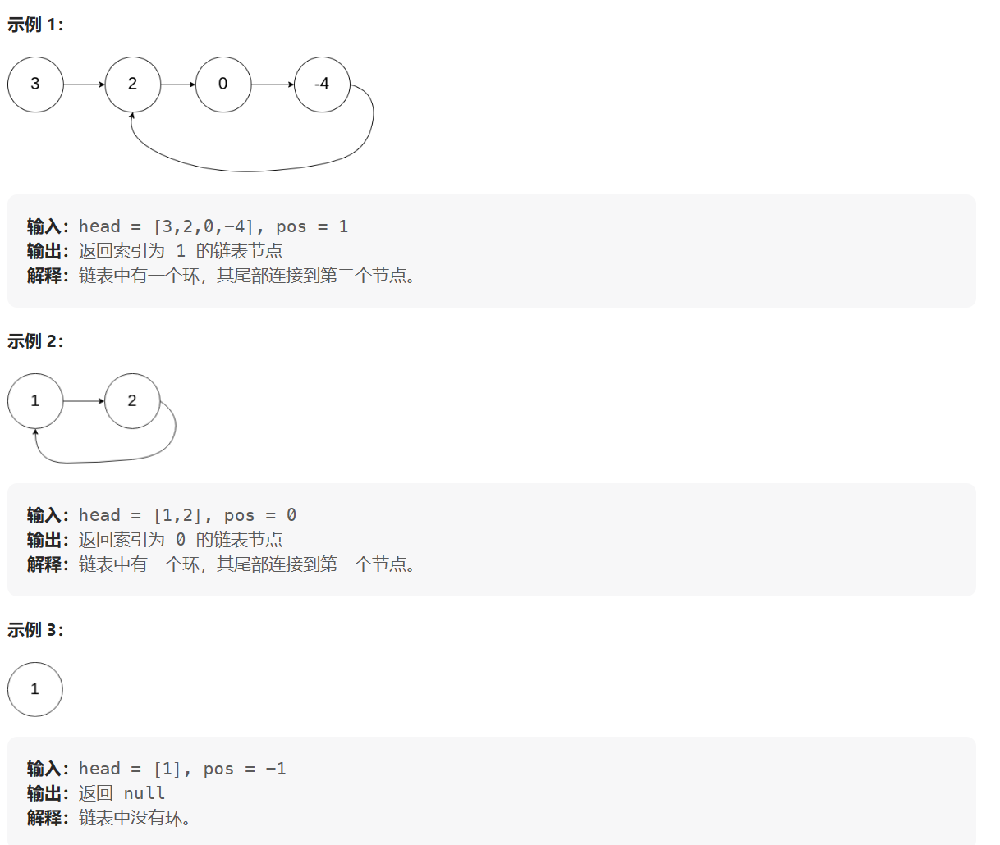
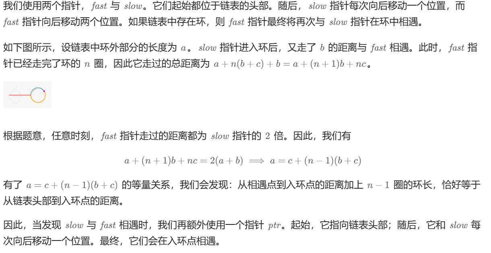

-   [JS 中的数据结构——链表(Linked-list)详解](https://juejin.cn/post/7038386476630933541)

-   [前端学数据结构 - 链表（Linked List）](https://cloud.tencent.com/developer/article/1607461)

**面试时链表解题的方法论**

1. 对于笔试，不用太在乎空间复杂度，一切为了时间复杂度

2. 对于面试，时间复杂度依然放在第一位，但是一定要找到空间最省的方法

**重要技巧**

1. 额外数据结构记录（哈希表等）

2. 快慢指针

### 反转单向和双向链表

**题目：** 分别实现反转单向链表和反转双向链表的函数

**要求：** 如果链表长度为 N，时间复杂度要求为 O(N)，额外空间复杂度要求为 O(1)

**反转单向链表：**

```js
// 迭代
var reverseList = function (head) {
    if (head === null || head.next === null) return head;
    let prev = null;
    let cur = head;
    let next = null;
    while (cur) {
        next = cur.next;
        cur.next = prev;
        prev = cur;
        cur = next;
    }
    return prev;
};
// 递归
var reverseList1 = function (head) {
    if (head === null || head.next === null) return head;
    let newHead = reverseList1(head.next);
    head.next.next = head;
    head.next = null;
    return newHead;
};
```

**反转双向链表：**

```js
function reverseDoubleLinkedList(head) {}
```

### 打印两个有序链表的公共部分

【题目】 给定两个有序链表的头指针 head1 和 head2，打印两个链表的公共部分。

【要求】 如果两个链表的长度之和为 N，时间复杂度要求为 O(N)，额外空间复 杂度要求为 O(1)


```ts
function printCommonPart(head1, head2) {
    let A = head1,
        B = head2;
    while (A !== B) {
        A = A === null ? head1 : A.next;
        B = B === null ? head2 : B.next;
    }
    return A;
}
```


### 判断一个链表是否为回文结构

【题目】给定一个单链表的头节点 head，请判断该链表是否为回文结构。

【例子】1->2->1，返回 true； 1->2->2->1，返回 true；15->6->15，返回 true； 1->2->3，返回 false。

【要求】如果链表长度为 N，时间复杂度达到 O(N)，额外空间复杂度达到 O(1)。

**使用额外空间方式:**

-   把每一个元素放入栈里面
-   从栈取出的顺序就是链表的逆序，我们边弹出边比较一不一样，如果回文结构一定一样，所以直到栈弹空要是还是都一样那么就回文
-   如果有一步不一样，就不是回文

```js
var isPalindrome = function (head) {
    if (head.next === null) return true;
    let stack = [];
    let next = head;
    while (next) {
        stack.push(next.val);
        next = next.next;
    }
    next = head;
    while (stack.length > 0) {
        if (next.val !== stack.pop()) return false;
        next = next.next;
    }
    return true;
};
```

**快慢指针**

快指针一次走两步，慢指针一次走一步，当快指针走到尾部，慢指针到链表中间。需要定制慢指针停的位置，在中间位置前，还是后（区分奇偶）

```js
var isPalindrome = function (head) {
    if (head.next === null) return true;
    // 快慢指针， 将链表右边的内容放进栈与左边对比
    let quick = head;
    let slow = head;
    while (quick) {
        quick = quick?.next?.next;
        slow = slow?.next;
    }
    let stack = [];
    while (slow !== null) {
        stack.push(slow.val);
        slow = slow.next;
    }
    while (stack.length > 0) {
        if (head.val !== stack.pop()) return false;
        head = head.next;
    }
    return true;
};
```

**超级省空间的方法 (面试做的时候很加分):**

-   快慢指针，最后让慢指针指向差不多中间位置
-   中间那个节点的 next 指向 null
-   然后让那个节点后面的节点都逆序

```js
const isPalindrome = (head) => {
    if (head === null) return true;
    let quick = head;
    let slow = head;
    // 1、快慢指针，slow停在mid
    while (quick?.next?.next) {
        quick = quick?.next?.next;
        slow = slow.next;
    }
    // 2、从mid开始反转链表
    let tail = reverseList(slow.next);
    // 3、分别从head和tail开始比较
    let _tail = tail;
    let _head = head;
    while (_tail && _head) {
        if (_tail.val !== _head.val) return false;
        _tail = _tail.next;
        _head = _head.next;
    }
    // 4、复原链表
    slow.next = reverseList(tail);
    return true;
};

const reverseList = (head) => {
    let prev = null;
    let current = head;
    let next = null;
    while (current) {
        next = current.next;
        current.next = prev;
        prev = current;
        current = next;
    }
    return prev;
}
```

### 将单向链表按某值划分成左边小、中间相等、右边大的形式

【题目】给定一个单链表的头节点 head，节点的值类型是整型，再给定一个整数 pivot。实现一个调整链表的函数，将链表调整为左部分都是值小于pivot的节点，中间部分都是值等于pivot的节点，右部分都是值大于pivot的节点。

【进阶】在实现原问题功能的基础上增加如下的要求

【要求】调整后所有小于 pivot 的节点之间的相对顺序和调整前一样

【要求】调整后所有等于 pivot 的节点之间的相对顺序和调整前一样

【要求】调整后所有大于 pivot 的节点之间的相对顺序和调整前一样

【要求】时间复杂度请达到 O(N)，额外空间复杂度请达到 O(1)。

把链表里面的数放到**Node 类型的**数组里面去，然后对数组玩 partition, 然后再把数组里面的数放回链表就行了

```js
function listPartition1(head, pivot) {
    if (head === null || head.next === null) return head;
    let node = head;
    let arr = [];
    while (node !== null) {
        arr.push(node);
        node = node.next;
    }
    partition(arr, pivot);
    for (let i = 0; i < arr.length - 1; i++) {
        arr[i].next = arr[i + 1];
    }
    arr[arr.length - 1].next = null;
    return arr[0];
}
function partition(arr, pivot) {
    let left = -1;
    let right = arr.length;
    let i = 0;
    while (i < right) {
        if (arr[i].val < pivot) {
            swap(arr, i++, ++left);
        } else if (arr[i].val > pivot) {
            swap(arr, i, --right);
        } else {
            i++;
        }
    }
}
function swap(arr, i, j) {
    let temp = arr[i];
    arr[i] = arr[j];
    arr[j] = temp;
}
```

**面试里面做法 (省空间！):**

**对于划分的值是 ⑤**

需要六个变量:

| 变量名             | 等于什么     |
| ------------------ | ------------ |
| SH (一开始是 null) | 小于部分的头 |
| ST (一开始是 null) | 小于部分的尾 |
| EH (一开始是 null) | 等于部分的头 |
| ET (一开始是 null) | 等于部分的尾 |
| BH (一开始是 null) | 大于部分的头 |
| BT (一开始是 null) | 大于部分的尾 |

-   首先第一个节点 ④, 发现比我们的 ⑤ 小，所以让 SH 和 ST为④
-   下一个节点 ⑥, 发现比我们的 ⑤ 大，所以让 BH 和 BT⑥
-   下一个节点 ③, 发现比我们的 ⑤ 小，所以让 ST 当前指向的节点 ④ 指向 ③, 然后让 ST 指向 ③(SH 不要动之后只有是一开始 null 的时候才会被第一个更新)
-   下一个节点 ⑤, 发现跟我们的 ⑤ 相等，所以让 EH 和 ET 都指向这个当前找到的 ⑤!!! **需要这个，因为可能有多个，我们要串起来所有相等的，然后让头代表第一个，尾代表最后一个 (可以看出是稳定的，保持了顺序，小于区域和大于区域都是同理)**
-   等等等
-   最后就是:

-   ST 的当前指向的节点的 next 指向 EH
-   ET 的当前指向的节点的 next 指向 BH

== 不过注意！！！== 可能压根没有小于区域，可能压根没有等于区域，可能压根没有大于区域！！！

> 所以只有不是 null 的时候才可以调用 next 连，如果有一个是 null, 需要连下一个区域等等等

```js
function listPartition2(head, pivot) {
    if (head === null || head.next === null) return head;
    let sH = null;
    let sT = null;
    let eH = null;
    let eT = null;
    let mH = null;
    let mT = null;
    while (head !== null) {
        if (head.val < pivot) {
            if (sH === null) {
                sH = head;
                sT = head;
            } else {
                sT.next = head;
                sT = head;
            }
        } else if (head.val == pivot) {
            if (eH === null) {
                eH = head;
                eT = head;
            } else {
                eT.next = head;
                eT = head;
            }
        } else {
            if (mH === null) {
                mH = head;
                mT = head;
            } else {
                mT.next = head;
                mT = head;
            }
        }
        head = head.next;
    }
    if (sT !== null) {
        sT.next = eH === null ? mH : eH;
        eT = et !== null ? et : sT;
    }
    if (eT !== null) {
        eT.next = mH;
    }
    if (mT !== null) {
        mT.next = null;
    }
    return sH != null ? sH : eH != null ? eH : mH;
}
```

### 复制含有随机指针节点的链表

【题目】一种特殊的单链表节点类描述如下

```ts
interface Node {
    value: number;
    next: Node;
    rand: Node;
}
```

rand 指针是单链表节点结构中新增的指针，rand 可能指向链表中的任意一个节点，也可能指向 null。给定一个由 Node 节点类型组成的无环单链表的头节点 head，请实现一个函数完成这个链表的复制，并返回复制的新链表的头节点。

【要求】时间复杂度 O(N)，额外空间复杂度 O(1)

**使用比较多额外空间方式:**

哈希表！HashMap!

-   遍历原来的链表，我们只需要把原来的链表的节点 (的指针) 和对应的新链表的新建的节点 (的指针) 作为 key 和 value 存入 hashMap
-   遍历老链表，或者遍历哈希表
-   对于每一个哈希表里面的值也就是新链表的节点的指针，我们让他的 next 指向这个新节点对应的 key (也就是老节点的指针) 的 next **指向的节点在哈希表里面对应的值**，然后让他的 rand 指向这个新节点对应的 key (也就是老节点的指针) 的 rand **指向的节点在哈希表里面对应的值**，就可以了

> 我们产生了一个 mapping (自己造的次) 相当于，就大概理念就这样！

```js
var copyRandomList = function (head) {
    let map = new Map();
    let curr = head;
    while (curr !== null) {
        map.set(curr, new Node(curr.val, null, null));
        curr = curr.next;
    }
    curr = head;
    while (curr !== null) {
        map.get(curr).next = curr.next === null ? null : map.get(curr.next);
        map.get(curr).random =
            curr.random === null ? null : map.get(curr.random);
        curr = curr.next;
    }
    return map.get(head);
};
```

**不使用比较多额外空间方式:**

-   生成一个个新节点，但是我们让他们跟老链表的节点这么串起来


-   **我们让每一个新生成的节点的 rand 指针指向当前这个新节点对应的老节点的 rand 指向的节点的 next**


> 反正这种想法就是让老的节点和旧的产生连接，这样我们就可以按照老节点的方式连的连我们自己的这个新节点，毕竟我们想要的是复制嘛，肯定是照着来啊

-   这么做后，就会成这样:


-   接着就把 next 改变，让新链表从这里分离出来

```js
var copyRandomList = function (head) {
    if (head === null) return null;
    let curr = head;
    let next = null;
    // 生成新节点并链接到老节点后面
    while (curr !== null) {
        next = curr.next;
        curr.next = new Node(curr.val, next, null);
        curr = next;
    }
    // 根据老节点的random链接新节点的random
    curr = head;
    while (curr !== null) {
        curr.next.random = curr.random === null ? null : curr.random.next;
        curr = curr.next.next;
    }
    // 断开老节点和新节点
    let res = head.next;
    curr = head;
    let copyNode = null;
    while (curr !== null) {
        next = curr.next.next;
        copyNode = curr.next;
        curr.next = next;
        copyNode.next = next === null ? null : next.next;
        curr = next;
    }
    return res;
};
```

### 链表中环的入口节点

给定一个链表，返回链表开始入环的第一个节点。 从链表的头节点开始沿着 `next` 指针进入环的第一个节点为环的入口节点。如果链表无环，则返回 `null`。

为了表示给定链表中的环，我们使用整数 `pos` 来表示链表尾连接到链表中的位置（索引从 0 开始）。 如果 `pos` 是 `-1`，则在该链表中没有环。**注意，`pos` 仅仅是用于标识环的情况，并不会作为参数传递到函数中。**

**说明：** 不允许修改给定的链表。



**解1：哈希表**

利用Hash表存储节点，每次遍历前在Hash表中查找是否存在当前节点，如果存在即代表存在环，且当前节点为环的入口节点，直到遍历到null代表无环。

时间复杂度：O（N）

空间复杂度：O（N）

```tsx
function detectCycle(head: ListNode | null): ListNode | null {
    if (head === null || head.next === null) {
        return null;
    }
    let map = new Set();
    while (head !== null) {
        if (map.has(head)) {
            return head;
        }
        map.add(head);
        head = head.next;
    }
    return null;
};
```

**解2：快慢指针**




时间复杂度：O（N）

空间复杂度：O（1）

```tsx
function detectCycle(head: ListNode | null): ListNode | null {
    if (head === null || head.next === null || head.next.next === null) {
        return null;
    }
    let slow: ListNode | null = head.next;
    let quick: ListNode | null = head.next.next;
    while (quick !== null) {
        // 如果快慢指针相遇则代表有环
        if (quick === slow) {
            break;
        }
        slow = slow.next;
        quick = quick.next === null ? null : quick.next.next;
    }
    // 如果快指针走到null代表没有环
    if (quick === null) {
        return null;
    }
    // 让快指针重新执行头节点，快慢指针同时移动一步，当快慢指针再次相遇时即为环的入口节点
    quick = head;
    while (quick !== slow) {
        quick = quick.next;
        slow = slow.next;
    }
    return slow;
};
```


### 两个单链表相交的一系列问题 

【题目】给定两个可能有环也可能无环的单链表，头节点`head1`和`head2`。请实 现一个函数，如果两个链表相交，请返回相交的 第一个节点。如果不相交，返 回null 

【要求】如果两个链表长度之和为N，时间复杂度请达到O(N)，额外空间复杂度 请达到O(1)。

**解1：哈希表**

第一条链表节点都入 set，第二条链表查，查到重复即为相交节点

```js
// 哈希表
function getIntersectNode(head1, head2) {
    let hashMap = new Set();
    while (head1 !== null) {
        if (hashMap.has(head1)) {
            break;
        }
        hashMap.add(head1);
        head1 = head1.next;
    }
    while (head2 !== null) {
        if (hashMap.has(head2)) {
            return head2;
        }
        head2 = head2.next;
    }
    return null;
}
```

**解2：**

第一步：判断有无环，有环返回第一个入环节点。

第二步：讨论，获知了两个链表是否有环，分情况讨论。

- 都无环，可能相交也可能不相交，讨论两个链表的尾节点的地址是否一致，不是，则不相交，一致，则让长链表先走两个链表长度的插值步之后，再一起走，会在第一个相交节点相遇；

- 一个有环，一个无环，不相交，返回null；

- 都有环，分为三种情况，**不相交**，**相交且入环节点一样**，**相交但入环节点不一样**。

  1. 首先判断入环节点一样时，则链表1和链表2 的入环节点的内存结点相等，此时，我们可以把入环节点看作是终止节点，则将问题转换成了都无环时候的情况；

  2. 入环节点不一样时，给一个指针指向链表1的入环节点，继续往下走，在遇到自己之前，遇到了2的入环节点，则返回1或2的入环节点，如果没遇到，则说明不相交，返回null。

```js
// 判断链表是否有环，并返回入环节点
function detectCycle(head) {
    if (
        head === null ||
        head.next === null ||
        head.next.next === null
    ) {
        return null;
    }
    let slow = head.next;
    let quick = head.next.next;
    while (quick !== null) {
        // 如果快慢指针相遇则代表有环
        if (quick === slow) {
            break;
        }
        slow = slow.next;
        quick = quick.next === null ? null : quick.next.next;
    }
    // 如果快指针走到null代表没有环
    if (quick === null) {
        return null;
    }
    // 让快指针重新执行头节点，快慢指针同时移动一步，当快慢指针再次相遇时即为环的入口节点
    quick = head;
    while (quick !== slow) {
        quick = quick.next;
        slow = slow.next;
    }
    return slow;
}
// 省空间的解法
function getIntersectNode2(head1, head2) {
    let loop1 = detectCycle(head1);
    let loop2 = detectCycle(head2);
    let node1 = head1;
    let node2 = head2;
    if (loop1 === null && loop2 === null) {
        // 链表1和2都无环,如果最后一个节点是同一个则有交点
        let n = 0;
        while (node1.next !== null) {
            n++;
            node1 = node1.next;
        }
        while (node2.next !== null) {
            n--;
            node2 = node2.next;
        }
        if (node1 !== node2) {
            return null;
        }
        // 将链表长的赋值为node1，短的为node2
        node1 = n > 0 ? head1 : head2;
        node2 = n > 0 ? head2 : head1;
        n = Math.abs(n);
        while (n > 0) {
            // 将node1和node2对齐
            node1 = node1.next;
            n--;
        }
        while (node1 !== node2) {
            node1 = node1.next;
            node2 = node2.next;
        }
        return node1;
    } else if (loop1 !== null && loop2 !== null) {
        if (loop1 === loop2) {
            // 两个链表的入环节点是同一个
            // 从入环节点以上截取，看成两个无环链表求交点
            let n = 0;
            while (node1 !== loop1) {
                n++;
                node1 = node1.next;
            }
            while (node2 !== loop2) {
                n--;
                node2 = node2.next;
            }
            // 将链表长的赋值为node1，短的为node2
            node1 = n > 0 ? head1 : head2;
            node2 = n > 0 ? head2 : head1;
            n = Math.abs(n);
            while (n > 0) {
                // 将node1和node2对齐
                node1 = node1.next;
                n--;
            }
            while (node1 !== node2) {
                node1 = node1.next;
                node2 = node2.next;
            }
            return node1;
        } else {
            node1 = loop1;
            while (node1 === loop2) {
                node1 = node1.next;
                if (node1 === loop1) {
                    return null;
                }
            }
            return loop2;
        }
    } else {
        return null;
    }
}

```