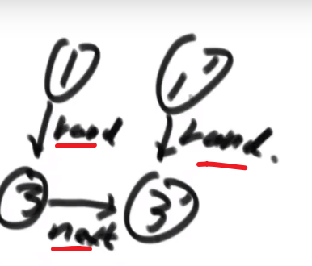

## 排序算法的稳定性
稳定性是指：排序时值相同的元素在排序后能否保证其相对次序不变（可理解为网购时先将价格由低到高排列，在以质量好坏进行排序，实现物美价廉）

|             | 时间复杂度  | 空间复杂度 | 稳定性 |
| :---------: | ----------- | ---------- | ------ |
|  选择排序   | `O(N^2)`    | `O(1) `    | ×      |
|  冒泡排序   | `O(N^2)`    | `O(1) `    | √      |
|  插入排序   | `O(N^2)`    | `O(1)`     | √      |
|  归并排序   | `O(N*logN)` | `O(N)`     | √      |
| 快排（3.0） | `O(N*logN)` | `O(logN)`  | ×      |
|   堆排序    | `O(N*logN)` | `O(1) `    | ×      |


分析：

1.前三个排序都是基于比较的排序，基于比较的排序的时间复杂度不能做到< `O(N^2)`

2.时间复杂度`O(N*logN)`的三个算法不能兼顾空间复杂度小和稳定性。在实际设计时，一般选择快排，因为其时间复杂度常数项较小，速度较快，考虑稳定性选择归并排序，有空间限制，选择堆排序。

坑：

    1.归并排序的额外空间复杂度可为o（1），但会因此丧失稳定性，“内部缓存法”，较难

    2.原地归并排序可以使得空间复杂度为o（1），但会使得时间复杂度为O(N^2)

    3.快排可以做到稳定性，但会使得空间复杂度为O(N)

题目：奇数放数组左边，偶书放数组右边，且要求原有的相对次序不变。（这是一个0-1问题，快排无法达到，因为其进化过程做不到稳定性）

工程上对排序的改进：大样本，调度时一般选择快排，小样本时，选择插入排序。综合排序，利用各自的优势（时间快，空间低，以及稳定性的考虑）

Java中的Array.sort()在基础类型时选择快排，非基础类型时选择归并保持稳定性

## 哈希表
HashSet <key> 由增（add）、删（remove）、查（contains）

HashMap<key,value> value是伴随数据，排序组织以key来

HashMap由增/更新（add）、删（remove）、查（containkey）、拿（get）key的value

哈希表的时间复杂度是常数级别的，能实现增删改查功能

`javascript`中哈希表的实现有**map和set**


## 有序表
有序表的性能比哈希表差，是和哈希表一样，分为TreeSet和TreeMap，内部按照Key来组织排序

注意：当放如有序表的东西是基本数据类型的时候，可以实现比较。当放入有序表的东西不是基本数据类型时，要提供比较器。

操作：

1.put（k key， V value） :将（key，value）加入表中，也可实现将key更新成value

2.V get（k key）：根据key查询value返回

3.remove（k key）：删去key的记录

4.boolean containskey（k key）：查

5.k firstkey：所有键值的排序结果中，最小（左）的那个

6.k lastkey：所有键值的排序中，最大（右）的那个

7.k floorkey（k key）：如果表中存过key，则返回key，否则返回所有键值的排序结果中，key的前一个（小于等于）

8.k ceilingkey（k key）：大于等于（后一个）

链表
重要技巧：额外数据结构记录（哈希表）、快慢指针

题目


### 反转单向和双向链表

题目 分别实现反转单向链表和反转双向链表的函数

要求 如果链表长度为N，时间复杂度要求为O(N)，额外空间复杂度要求为O(1)

```js
// 迭代
var reverseList = function (head) {
    if (head === null || head.next === null) return head;
    let prev = null;
    let curr = head;
    let next = null;
    while (curr) {
        next = curr.next;
        curr.next = prev;
        prev = curr;
        curr = next;
    }
    return prev;
};
// 递归
var reverseList1 = function (head) {
    if (head === null || head.next === null) return head;
    let newHead = reverseList1(head.next);
    head.next.next = head;
    head.next = null;
    return newHead;
};
```


### 打印两个有序链表的公共部分 

【题目】 给定两个有序链表的头指针head1和head2，打印两个链表的公共部分。 

【要求】 如果两个链表的长度之和为N，时间复杂度要求为O(N)，额外空间复 杂度要求为O(1)

```js
function printCommonPart(head1, head2) {
    //  给定两个有序链表的头指针head1和head2，打印两个链表的公共部分。
    while (head1 && head2) {
        if (head1.val === head2.val) {
            console.log("有序链表公共部分", head1.val);
            head1 = head1.next;
            head2 = head2.next;
        } else if (head1.val < head2.val) {
            head1 = head1.next;
        } else {
            head2 = head2.next;
        }
    }
}
```


面试时链表解题的方法论

1. 对于笔试，不用太在乎空间复杂度，一切为了时间复杂度 

2. 对于面试，时间复杂度依然放在第一位，但是一定要找到空间最省的方法 

重要技巧：

1. 额外数据结构记录（哈希表等）

2. 快慢指针

   

### 判断一个链表是否为回文结构 

【题目】给定一个单链表的头节点head，请判断该链表是否为回文结构。 

【例子】1->2->1，返回true； 1->2->2->1，返回true；15->6->15，返回true； 1->2->3，返回false。 

【要求】如果链表长度为N，时间复杂度达到O(N)，额外空间复杂度达到O(1)。

**使用额外空间方式:**

- 把每一个元素放入栈里面
- 从栈取出的顺序就是链表的逆序，我们边弹出边比较一不一样，如果回文结构一定一样，所以直到栈弹空要是还是都一样那么就回文
- 如果有一步不一样，就不是回文

```js
var isPalindrome = function(head) {
    if (head.next === null) return true
    let stack = [];
    let next = head;
    while (next) {
        stack.push(next.val)
        next = next.next
    }
    next = head;
    while (stack.length > 0) {
        if (next.val !== stack.pop()) return false
        next = next.next
    }
    return true
};
```


#### 快慢指针 ：

快指针一次走两步，慢指针一次走一步，当快指针走到尾部，慢指针到链表中间。需要定制慢指针停的位置，在中间位置前，还是后（区分奇偶）

```js
var isPalindrome = function(head) {
    if (head.next === null) return true
    // 快慢指针， 将链表右边的内容放进栈与左边对比
    let quick = head;
    let slow = head;
    while (quick) {
        quick = quick?.next?.next;
        slow = slow?.next;
    }
    let stack = [];
    while (slow !== null ) {
        stack.push(slow.val);
        slow = slow.next;
    }
    while (stack.length > 0) {
        if (head.val !== stack.pop()) return false
        head = head.next
    }
    return true
};
```

**超级省空间的方法 (面试做的时候很加分):**

- 快慢指针，最后让慢指针指向差不多中间位置
- 中间那个节点的 next 指向 null
- 然后让那个节点后面的节点都逆序

```js
var isPalindrome = function(head) {
    if (head === null || head.next === null) return true
    // 快慢指针， 将链表右边的内容逆序，头尾同时移动比对
    let quick = head;
    let slow = head;
    while (slow.next && quick?.next?.next) {
        quick = quick?.next?.next;  // 2
        slow = slow?.next; // mid 1
    }
    let n2 = slow.next // right first 2
    slow.next = null;
    let n1 = slow // mid 1
    let n3 = null
    while (n2 != null) {
        n3 = n2.next
        n2.next = n1
        n1 = n2
        n2 = n3
    }
    end = n1
    n2 = head
    let res = true

    while (end && n2) {
        if (end.val !== n2.val) {
            res = false
            break
        }
        end = end.next
        n2 = n2.next
    }
    n2 = n1.next
    n1.next = null
    while (n1 != null && n2) {
        n3 = n2?.next
        n2.next = n1
        n1 = n2
        n2 = n3
    }
    return res
};
```

### 将单向链表按某值划分成左边小、中间相等、右边大的形式 

【题目】给定一个单链表的头节点head，节点的值类型是整型，再给定一个整 数pivot。实现一个调整链表的函数，将链表调整为左部分都是值小于pivot的 节点，中间部分都是值等于pivot的节点，右部分都是值大于pivot的节点。 

【进阶】在实现原问题功能的基础上增加如下的要求 

【要求】调整后所有小于pivot的节点之间的相对顺序和调整前一样 

【要求】调整后所有等于pivot的节点之间的相对顺序和调整前一样 

【要求】调整后所有大于pivot的节点之间的相对顺序和调整前一样 

【要求】时间复杂度请达到O(N)，额外空间复杂度请达到O(1)。

把链表里面的数放到__Node 类型的__数组里面去，然后对数组玩 partition, 然后再把数组里面的数放回链表就行了

```js
function listPartition1(head, pivot) {
    if (head === null || head.next === null) return head;
    let node = head;
    let arr = [];
    while (node !== null) {
        arr.push(node);
        node = node.next;
    }
    partition(arr, pivot);
    for (let i = 0; i < arr.length - 1; i++) {
        arr[i].next = arr[i + 1];
    }
    arr[arr.length - 1].next = null;
    return arr[0];
}
function partition(arr, pivot) {
    let left = -1;
    let right = arr.length;
    let i = 0;
    while (i < right) {
        if (arr[i].val < pivot) {
            swap(arr, i++, ++left);
        } else if (arr[i].val > pivot) {
            swap(arr, i, --right);
        } else {
            i++;
        }
    }
}
function swap(arr, i, j) {
    let temp = arr[i];
    arr[i] = arr[j];
    arr[j] = temp;
}
```

**面试里面做法 (省空间！):**

**对于划分的值是⑤**

需要六个变量:

| 变量名             | 等于什么     |
| ------------------ | ------------ |
| SH (一开始是 null) | 小于部分的头 |
| ST (一开始是 null) | 小于部分的尾 |
| EH (一开始是 null) | 等于部分的头 |
| ET (一开始是 null) | 等于部分的尾 |
| BH (一开始是 null) | 大于部分的头 |
| BT (一开始是 null) | 大于部分的尾 |

- 首先第一个节点④, 发现比我们的⑤小，所以让 SH 和 ST④
- 下一个节点⑥, 发现比我们的⑤大，所以让 BH 和 BT⑥
- 下一个节点③, 发现比我们的⑤小，所以让 ST 当前指向的节点④指向③, 然后让 ST 指向③(SH 不要动之后只有是一开始 null 的时候才会被第一个更新)
- 下一个节点⑤, 发现跟我们的⑤相等，所以让 EH 和 ET 都指向这个当前找到的⑤!!! **需要这个，因为可能有多个，我们要串起来所有相等的，然后让头代表第一个，尾代表最后一个 (可以看出是稳定的，保持了顺序，小于区域和大于区域都是同理)**
- 等等等
- 最后就是:


- ST 的当前指向的节点的 next 指向 EH
- ET 的当前指向的节点的 next 指向 BH

== 不过注意！！！== 可能压根没有小于区域，可能压根没有等于区域，可能压根没有大于区域！！！

> 所以只有不是 null 的时候才可以调用 next 连，如果有一个是 null, 需要连下一个区域等等等

```js
function listPartition2(head, pivot) {
    if (head === null || head.next === null) return head;
    let sH = null;
    let sT = null;
    let eH = null;
    let eT = null;
    let mH = null;
    let mT = null;
    while (head !== null) {
        if (head.val < pivot) {
            if (sH === null) {
                sH = head;
                sT = head;
            } else {
                sT.next = head;
                sT = head;
            }
        } else if (head.val == pivot) {
            if (eH === null) {
                eH = head;
                eT = head;
            } else {
                eT.next = head;
                eT = head;
            }
        } else {
            if (mH === null) {
                mH = head;
                mT = head;
            } else {
                mT.next = head;
                mT = head;
            }
        }
        head = head.next;
    }
    if (sT !== null) {
        sT.next = eH === null ? mH : eH;
        eT = et !== null ? et : sT
    }
    if (eT !== null) {
        eT.next = mH;
    }
    if (mT !== null) {
        mT.next = null;
    }
    return sH != null ? sH : eH != null ? eH : mH;
}

```

### 复制含有随机指针节点的链表 

【题目】一种特殊的单链表节点类描述如下 

```java
class Node { int value; 
            Node next; 
            Node rand; 
            Node(int val) { 
                value = val; 
            } 
           } 
```


rand指针是单链表节点结构中新增的指针，rand可能指向链表中的任意一个节 点，也可能指向null。给定一个由Node节点类型组成的无环单链表的头节点 head，请实现一个函数完成这个链表的复制，并返回复制的新链表的头节点。 

【要求】时间复杂度O(N)，额外空间复杂度O(1)

**使用比较多额外空间方式:**

哈希表！HashMap!

- 遍历原来的链表，我们只需要把原来的链表的节点 (的指针) 和对应的新链表的新建的节点 (的指针) 作为 key 和 value 存入 hashMap
- 遍历老链表，或者遍历哈希表
- 对于每一个哈希表里面的值也就是新链表的节点的指针，我们让他的 next 指向这个新节点对应的 key (也就是老节点的指针) 的 next **指向的节点在哈希表里面对应的值**，然后让他的 rand 指向这个新节点对应的 key (也就是老节点的指针) 的 rand **指向的节点在哈希表里面对应的值**，就可以了

> 我们产生了一个 mapping (自己造的次) 相当于，就大概理念就这样！

```js
var copyRandomList = function(head) {
    let map = new Map();
    let curr = head;
    while (curr !== null) {
        map.set(curr, new Node(curr.val, null, null));
        curr = curr.next;
    }
    curr = head;
    while (curr !== null) {
        map.get(curr).next = curr.next === null ? null : map.get(curr.next);
        map.get(curr).random = curr.random === null ? null : map.get(curr.random);
        curr = curr.next;
    }
    return map.get(head)
};
```


**不使用比较多额外空间方式:**

- 生成一个个新节点，但是我们让他们跟老链表的节点这么串起来


- **我们让每一个新生成的节点的 rand 指针指向当前这个新节点对应的老节点的 rand 指向的节点的 next**



> 反正这种想法就是让老的节点和旧的产生连接，这样我们就可以按照老节点的方式连的连我们自己的这个新节点，毕竟我们想要的是复制嘛，肯定是照着来啊

- 这么做后，就会成这样:


- 接着就把 next 改变，让新链表从这里分离出来

```js
var copyRandomList = function(head) {
    if (head === null ) return null;
    let curr = head;
    let next = null;
    // 生成新节点并链接到老节点后面
    while (curr !== null )  {
        next = curr.next;
        curr.next = new Node(curr.val, next, null);
        curr = next;
    }
    // 根据老节点的random链接新节点的random
    curr = head;
    while (curr !== null ) {
        curr.next.random = curr.random === null ? null : curr.random.next;
        curr = curr.next.next;
    }
    // 断开老节点和新节点
    let res = head.next;
    curr = head;
    let copyNode = null;
    while (curr !== null) {
        next = curr.next.next;
        copyNode = curr.next;
        curr.next = next;
        copyNode.next = next === null ? null : next.next;
        curr = next;
    }
    return res;
};
```


————————————————
版权声明：本文为CSDN博主「andy.wang0502」的原创文章，遵循CC 4.0 BY-SA版权协议，转载请附上原文出处链接及本声明。
原文链接：https://blog.csdn.net/weixin_45377141/article/details/124744423