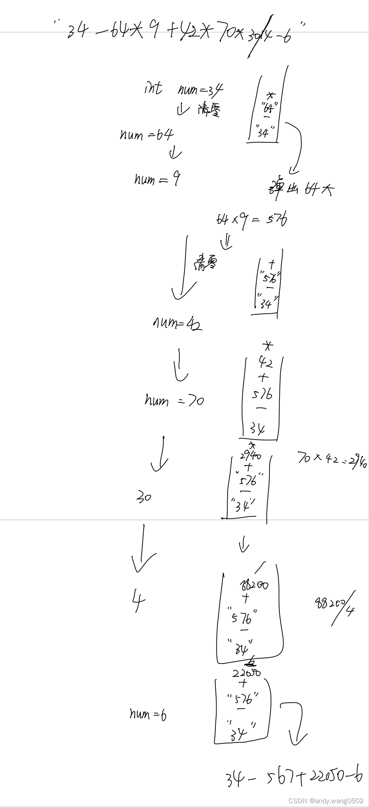

### 题目1（伪进制）

一个 char 类型的数组 chs，其中所有的字符都不同。

例如，chs=['A', 'B', 'C', ... 'Z']，则字符串与整数的对应关系如下:

A, B... Z, AA,AB...AZ,BA,BB...ZZ,AAA... ZZZ, AAAA...

1, 2...26,27, 28... 52,53,54...702,703...18278, 18279... 

例如，chs=['A', 'B', 'C']，则字符串与整数的对应关系如下:

A,B,C,AA,AB...CC,AAA...CCC,AAAA...

1, 2,3,4,5...12,13...39,40... 

给定一个数组 chs，实现根据对应关系完成字符串与整数相互转换的两个函数。

**思路（伪进制）：**

9的3进制：100，转为3伪进制

```
2  3
_  _
3  1 // 从右到左依次代表3^0 3^1 3^2 2*3+3*1
```

先在每个位置上放置1，再依次从左向右凑出目标。

```
1  1
-  -
3  1 //此时的值为4，还剩5，在3^1上还可以放1个，剩下2放在3^0
```

3伪进制 2 3  每个位置上的进制都是1~k，不能为0


### 题目2

给定一个二维数组matrix，每个单元都是一个整数，有正有负。

最开始的时候小Q操纵一条长度为0的蛇，蛇从矩阵最左侧任选一个单元格进入地图，蛇每次只能够到达当前位置的右上相邻，右侧相邻和右下相邻的单元格。

蛇到达一个单元格后，自身的长度会瞬间加上该单元格的数值，任何情况下长度为负则游戏结束。

小Q是个天才，他拥有一个超能力，可以在游戏开始的时候把地图中的某一个节点的值变为其相反数（注：最多只能改变一个节点）。

问在小Q游戏过程中，他的蛇最长长度可以到多少？

比如：
```
1 -4 10
3 -2 -1
2 -1 0
0 5 -2
```

最优路径为从最左侧的3开始，3 -> -4(利用能力变成4) -> 10。所以返回17

**思路：（动态规划尝试）**

process求到达位置（i,j）时最大路径和。

返回的信息:
```ts
interface Info {
    yes: number;  // 到达位置（i,j）时，使用过一次能力时的最大路径和（包括位置（i,j））
    no: number; // 到达位置（i,j）时，没使用能力时的最大路径和（包括位置（i,j））
}
```

主函数遍历所有位置的process，求出最大值

**思路2：（动态规划尝试+记忆搜索优化）**

1. 建立dp表，process每次返回值时先将值存入dp表中，process每次进入时判断dp中是否有值，有值返回dp表中值，没值执行。

### 题目3（优先级结合递归套路）

给定一个字符串str，str表示一个公式，公式里可能有整数、加减乘除符号和左右
括号，返回公式的计算结果。
【举例】
str="48*((70-65)-43)+8*1"，返回-1816。
str="3+1*4"，返回7。
str="3+(1*4)"，返回7。
【说明】
1．可以认为给定的字符串一定是正确的公式，即不需要对str做公式有效性检查。
2．如果是负数，就需要用括号括起来，比如"4*(-3)"。但如果负数作为公式的开头
或括号部分的开头，则可以没有括号，比如"-3*4"和"(-3*4)"都是合法的。
3．不用考虑计算过程中会发生溢出的情况。


**思路1：（递归）**

- 当字符串中没有括号时
   
34 - 64 * 9 + 42* 70 * 30 / 4 - 6

利用栈stack和变量num。遍历字符串，如果是数字就赋值给num（num当前为3，遇到4，则num=num*10+4）；遇到符号判断栈顶元素是否为乘除，如果不是则将num转为字符串入栈、符号入栈，num变为0；如果栈顶是乘除，则从栈顶弹出两个元素与num计算，得出的结果和当前遇到的符号入栈，num变为0。


- 当字符串中有括号时，利用递归。

process(str,i)含义为从位置i开始计算str字符的结果。

process从位置i开始利用没有括号时的算法计算，遇到左括号则从左括号右侧调用子过程；

当遇到右括号时停止计算返回当前结果；

process的返回结果为：
```ts
interface Info {
    endIndex: number; // 遇到右括号的下标位置
    num: number; // 当前process从i到endIndex的计算结果
}
```

主函数调用process(str,0)

**思路2：栈**

### 题目4（动态规划空间压缩的技巧讲解）

请注意区分子串和子序列的不同，给定两个字符串str1和str2，求两个字符串的最长公共子串（子串必须连续）。

**思路：**

建立dp表，dp[i][j]表示str1子串以i位置结尾、str2子串以j位置结尾情况下，最长公共子串有多长（公共子串也需要以i和j位置结尾）

如果i位置和j位置不相等，dp[i][j] = 0；

如果i位置和j位置相等，则dp[i][j] = dp[i-1][j-1] + 1;


**思路：（空间压缩）**

dp表中的数只依赖左上角的位置，因此只需要有限几个变量不必申请数组或者dp。

申请变量len表示右上角的值，然后依次沿着对角线计算，赋值给len，并用max记录最大长度、end记录最大长度所对应的下标（str1和str2都可）


### 题目5

请注意区分子串和子序列的不同，给定两个字符串str1和str2，求两个字符串
的最长公共子序列（子序列可以不连续）。

**思路：（动态规划）**

建立dp表，dp[i][j]表示str1从（0,i）位置、str2从（0,j）位置中的最长公共子序列长度。

dp[i][j]中的最长公共子序列有四种可能：

1. 最长公共子序列不以i位置和j位置结尾：dp[i][j] = dp[i-1][j-1];
2. 最长公共子序列不以i位置结尾,以j位置结尾：dp[i][j] = dp[i-1][j];
3. 最长公共子序列以i位置结尾，不以j位置结尾：dp[i][j] = dp[i][j-1];
4. 最长公共子序列以i位置和j位置结尾（str1[i]必须等于str2[j]）：dp[i][j] = dp[i-1][j-1] + 1;

dp[i][j]取四种情况最大值。