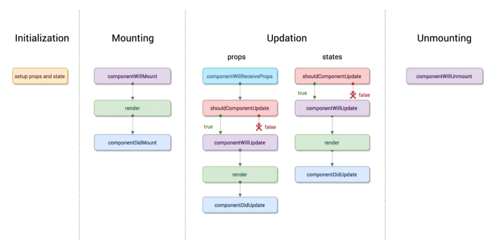

# react

## 1、什么是 React，对它的理解
React 是一个用于构建用户界面的 JavaScript 库，由 Facebook 开发和维护。它采用组件化的方式构建 UI，使得开发者能够更高效地创建复杂、动态的 Web 应用程序。
::: details 详情
React 的核心思想是组件化，组件是可复用的、可组合的 UI 元素，它们通过 `props` 传递数据，并使用 `state` 进行状态管理。React 使用`虚拟 DOM`（Virtual DOM）来优化性能，它将 UI 渲染为虚拟 DOM，然后进行比较，以确定需要更新的部分，最后更新到`真实 DOM`。

React 的核心概念包括：
- 组件：React 的核心概念，用于构建用户界面的代码片段，可以包含 HTML、CSS、JavaScript 等内容。
- JSX：`JSX` 是 React 的语法扩展，允许在 JavaScript 中编写类似 HTML 的代码。它使得 UI 的描述更加直观和简洁。
- 虚拟 DOM：React 使用虚拟 DOM 来提高性能。虚拟 DOM 是实际 DOM 的轻量级副本，React 通过比较虚拟 DOM 的变化，最小化对实际 DOM 的操作，从而提升渲染效率。
- 单向数据流：React 遵循`单向数据流`的原则，数据从父组件传递到子组件，子组件通过回调函数将数据变化通知父组件。这种方式使得数据流动更加清晰和可控。

React 的主要特性包括：
- 声明式编程：React 是声明式的，开发者只需描述 UI 应该是什么样子，而不需要关心如何更新 DOM。React 会自动处理 DOM 的更新。
- 组件化开发：React 的组件化设计使得代码更易于维护、复用和测试。每个组件可以独立开发和测试，降低了代码的耦合度。
- 状态管理：React 提供了状态管理机制，组件可以修改 `state`，并触发重新渲染。
- 生命周期方法：React 组件有生命周期方法（如 `componentDidMount`、`componentDidUpdate` 等），用于在组件的不同阶段执行特定逻辑。在函数组件中，这些逻辑可以通过 `useEffect` Hook 实现。
- 生态丰富：React 拥有庞大的生态系统，包括 `React-Router`（路由）、`Redux`（状态管理）、`Next.js`（服务器端渲染）等工具和库，帮助开发者构建完整的应用。

React 的优势：
- 高效性能：虚拟 DOM 和高效的 Diff 算法使得 React 在处理复杂 UI 时性能优异。
- ​开发效率高：组件化和声明式编程使得代码更易于开发和维护。
- ​社区支持强大：React 拥有庞大的开发者社区，提供了丰富的工具、库和教程。
- ​跨平台能力：通过 React Native，React 可以用于开发移动端应用，实现代码复用。
:::

## 2、谈谈对 React Hooks 的理解
React Hooks 是 React 16.8 版本引入的一种新特性，它允许开发者在 ​函数组件 中使用状态（state）和其他 React 特性（如生命周期方法、上下文等），而无需将组件转换为类组件。
::: details 详情
为什么引入hook，官方给出的动机是解决长时间使用和维护react过程中常遇到的问题，例如：
- 难以重用和共享组件中的与状态相关的逻辑。
- 逻辑复杂的组件难以开发与维护，当我们的组件需要处理多个互不相关的 local state 时，每个生命周期函数中可能会包含着各种互不相关的逻辑在里面。
- 类组件中的 this 增加学习成本，类组件在基于现有工具的优化上存在些许问题。
- 由于业务变动，函数组件不得不改为类组件等等。

Hooks 能够更容易解决状态相关的重用的问题：
- 每调用 useHook 一次都会生成一份独立的状态。
- 通过自定义 Hook 能够更好的封装我们的功能。

Hooks 的出现，使函数组件的功能得到了扩充，拥有了类组件相似的功能，在我们日常使用中，使用 Hooks 能够解决大多数问题，并且还拥有代码复用机制，整体风格更清爽，更优雅，因此优先考虑 Hooks。
:::

## 3、React 的生命周期
React 组件的生命周期在过去的不同版本中有所调整，以下是 React 类组件的经典生命周期钩子（React v16及之前版本）和现代函数组件使用的Hook形式生命周期方法的对比表：
::: details 详情
**类组件生命周期方法（经典生命周期）：**
|阶段|生命周期钩子|描述|
|----|-------|-------|
|初始化/挂载|`constructor(props)`|构造函数，在组件实例化时调用，用于设置初始状态或绑定实例方法|
|挂载前/实例化后|`static getDerivedStateFromProps(props, state)`|（可选）在每次渲染前调用，返回新的 state 以响应 props 更改，但不推荐过度依赖此方法|
|挂载前|`render()`|必须定义的方法，用于返回 jsx 元素，React 根据此方法渲染 DOM|
|挂载后|`componentDidMount()`|组件挂载到 DOM 后调用，常用于网络请求、订阅或手动操作 DOM|
|更新前|`shouldComponentUpdate(nextProps, nextState)`|（可选）在 props 或 state 即将更改时调用，返回布尔值决定是否重新渲染|
|更新前|`static getSnapshotBeforeUpdate(prevProps, prevState)`|在最新的渲染被提交到 DOM 之前获取一些信息，返回值将在 componentDidUpdate 中作为第三个参数|
|更新|`render()`|（同上）在 props 或 state 更改时再次调用|
|更新后|`componentDidUpdate(prevProps, prevState, snapshot)`|组件完成更新并重新渲染到 DOM 后调用|
|卸载前|`componentWillUnmount()`|组件从 DOM 移除之前调用，用于清理工作如取消定时器、解绑事件监听器等|



**函数组件生命周期钩子（使用React Hooks）：**
|阶段|Hook 方法|描述|
|----|-------|-------|
|初始化/挂载|`useState()`|初始化状态并在每次渲染时返回一对值（当前状态和更新状态的函数）|
|初始化/挂载|`useEffect(fn, deps)`|类似于 `componentDidMount` 和 `componentDidUpdate` 的合并，以及 `componentWillUnmount` 功能；fn 函数在组件渲染后运行，deps 是依赖数组，控制何时重新运行该效果|
|初始化/挂载|`useLayoutEffect(fn, deps)`|类似 `useEffect`，但在所有 DOM 变更之后同步调用|
|初始化/挂载|`useMemo(() => result, deps)`|记忆化计算结果，仅当依赖项 deps 改变时重新计算|
|初始化/挂载|`useCallback(fn, deps)`|记忆化函数引用，避免不必要的函数重创建|
|卸载|`useCleanup(returnFn)`|返回的函数在组件卸载时执行，用于资源清理|


:::

## 4、React 如何捕获错误
::: details 详情
- 错误边界（Error Boundaries）
  - React 16及更高版本引入了错误边界这一概念，它是一种特殊的 React 组件，能够在其子组件树中捕获任何渲染错误或其他 JavaScript 错误。当错误边界内的任何子组件抛出错误时，错误边界能够捕获这个错误，记录日志，并且可以选择性地显示恢复界面，而不是让整个应用程序崩溃。
  - 错误边界不会捕获以下情况的错误：
    > - 事件处理器中的错误。
    > - 异步代码（如 setTimeout 或 Promise）中的错误。
    > - 服务端渲染中的错误。
    > - 错误边界自身抛出的错误。
  ```js
  import React from 'react';

  // 定义错误边界组件
  class ErrorBoundary extends React.Component {
    constructor(props) {
      super(props);
      this.state = { hasError: false };
    }

    static getDerivedStateFromError(error) {
      // 更新 state 以显示降级 UI
      return { hasError: true };
    }

    componentDidCatch(error, errorInfo) {
      // 可以在这里记录错误日志
      console.error("捕获到错误:", error, errorInfo);
    }

    render() {
      if (this.state.hasError) {
        // 渲染降级 UI
        return <h1>发生错误，请稍后再试。</h1>;
      }

      return this.props.children;
    }
  }

  // 使用错误边界
  function ErrorProneComponent() {
    throw new Error("这是一个测试错误");
  }

  export default function App() {
    return (
      <ErrorBoundary>
        <ErrorProneComponent />
      </ErrorBoundary>
    );
  }
  ```
- window.onerror
  ```js
  window.onerror = function (message, source, lineno, colno, error) {
  console.error("捕获到全局错误:");
  console.log("错误信息:", message);
  console.log("错误来源:", source);
  console.log("行号:", lineno, "列号:", colno);
  console.log("错误对象:", error);
  };
  ```
- unhandledrejection
  ```js
  window.addEventListener("unhandledrejection", function (event) {
  console.error("捕获到未处理的 Promise 错误:");
  console.log("原因:", event.reason);
  });
  ```
:::

## 5、React 组件通讯方式
::: details 详情
- 通过 props 向子组件传递数据
```js
//父组件
const Parent = () => {
  const message = 'Hello from Parent'
  return <Child message={message} />
}

// 子组件
const Child = ({ message }) => {
  return <div>{message}</div>
}
```

- 通过回调函数向父组件传递数据
```js
//父组件
const Parent = () => {
  const handleData = (data) => {
    console.log('Data from Child:', data)
  }
  return <Child onSendData={handleData} />
}

// 子组件
const Child = ({ message }) => {
  return <button onClick={() => onSendData('Hello from Child')}>Send Data</button>
}
```

- 使用refs调用子组件暴露的方法
  ::: code-group
  ```js [React 19之前]
  import React, { useRef, forwardRef, useImperativeHandle } from 'react'

  // 子组件
  const Child = forwardRef((props, ref) => {
    // 暴露方法给父组件
    useImperativeHandle(ref, () => ({
      sayHello() {
        alert('Hello from Child Component!')
      },
    }))

    return <div>Child Component</div>
  })

  // 父组件
  function Parent() {
    const childRef = useRef(null)

    const handleClick = () => {
      if (childRef.current) {
        childRef.current.sayHello()
      }
    }

    return (
      <div>
        <Child ref={childRef} />
        <button onClick={handleClick}>Call Child Method</button>
      </div>
    )
  }

  export default Parent
  ```
  ```js [React 19+]
  // In React 19, forwardRef is no longer necessary. Pass ref as a prop instead. forwardRef will deprecated in a future release.
  // https://zh-hans.react.dev/blog/2024/12/05/react-19#ref-as-a-prop
  import React, { useRef, useImperativeHandle } from 'react'

  // 子组件
  const Child = (props) => {
    // 暴露方法给父组件
    useImperativeHandle(props.ref, () => ({
      sayHello() {
        alert('Hello from Child Component!')
      },
    }))

    return <div>Child Component</div>
  }

  // 父组件
  function Parent() {
    const childRef = useRef(null)

    const handleClick = () => {
      if (childRef.current) {
        childRef.current.sayHello()
      }
    }

    return (
      <div>
        <Child ref={childRef} />
        <button onClick={handleClick}>Call Child Method</button>
      </div>
    )
  }

  export default Parent
  ```

- 通过 Context 进行跨组件通信
```js
import React, { useState } from 'react'

// 创建一个 Context
const MyContext = React.createContext()

// 父组件
function Parent() {
  const [sharedData, setSharedData] = useState('Hello from Context')

  const updateData = () => {
    setSharedData('Updated Data from Context')
  }

  return (
    // 提供数据和更新函数
    <MyContext.Provider value={{ sharedData, updateData }}>
      <ChildA />
    </MyContext.Provider>
  )
}

// 子组件 A（引用子组件 B）
function ChildA() {
  return (
    <div>
      <ChildB />
    </div>
  )
}

// 子组件 B（使用 useContext）
function ChildB() {
  const { sharedData, updateData } = React.useContext(MyContext)
  return (
    <div>
      <div>ChildB: {sharedData}</div>
      <button onClick={updateData}>Update Data</button>
    </div>
  )
}

export default Parent
```

- 使用状态管理库进行通信
  - React Context + useReducer
  ```js
  import React, { useReducer } from 'react'

  const initialState = { count: 0 }

  function reducer(state, action) {
    switch (action.type) {
      case 'increment':
        return { count: state.count + 1 }
      case 'decrement':
        return { count: state.count - 1 }
      default:
        throw new Error()
    }
  }

  const CounterContext = React.createContext()

  function CounterProvider({ children }) {
    const [state, dispatch] = useReducer(reducer, initialState)
    return <CounterContext.Provider value={{ state, dispatch }}>{children}</CounterContext.Provider>
  }

  function Counter() {
    const { state, dispatch } = React.useContext(CounterContext)
    return (
      <div>
        Count: {state.count}
        <button onClick={() => dispatch({ type: 'increment' })}>+</button>
        <button onClick={() => dispatch({ type: 'decrement' })}>-</button>
      </div>
    )
  }

  function App() {
    return (
      <CounterProvider>
        <Counter />
      </CounterProvider>
    )
  }

  export default App
  ```

  - Redux：使用 Redux Toolkit 简化 Redux 开发
  ```js
  import { createSlice, configureStore } from '@reduxjs/toolkit'

  const counterSlice = createSlice({
    name: 'counter',
    initialState: { value: 0 },
    reducers: {
      increment: (state) => {
        state.value += 1
      },
      decrement: (state) => {
        state.value -= 1
      },
    },
  })

  const { increment, decrement } = counterSlice.actions

  const store = configureStore({
    reducer: counterSlice.reducer,
  })

  store.subscribe(() => console.log(store.getState()))

  store.dispatch(increment())
  store.dispatch(decrement())
  ```

  - MobX
  ```js
  import { makeAutoObservable } from 'mobx'
  import { observer } from 'mobx-react-lite'

  class CounterStore {
    count = 0

    constructor() {
      makeAutoObservable(this)
    }

    increment() {
      this.count += 1
    }

    decrement() {
      this.count -= 1
    }
  }

  const counterStore = new CounterStore()

  const Counter = observer(() => {
    return (
      <div>
        Count: {counterStore.count}
        <button onClick={() => counterStore.increment()}>+</button>
        <button onClick={() => counterStore.decrement()}>-</button>
      </div>
    )
  })

  export default Counter
  ```

  - Zustand
  ```js
  import create from "zustand";

  const useStore = create((set) => ({
    count: 0,
    increment: () => set((state) => ({ count: state.count + 1 })),
    decrement: () => set((state) => ({ count: state.count - 1 })),
  }));

  function Counter() {
    const { count, increment, decrement } = useStore();
    return (
      <div>
        Count: {count}
        <button onClick={increment}>+</button>
        <button onClick={decrement}>-</button>
      </div>
    );
  }

  export default Counter;
  ```
  
- 使用事件总线（Event Bus）进行通信
  > 可以使用第三方库如 pubsub-js 来实现父子组件间通信。在父组件中订阅一个事件，子组件在特定情况下发布这个事件并传递数据。
```js
import React from 'react'
import PubSub from 'pubsub-js'

const ParentComponent = () => {
  React.useEffect(() => {
    const token = PubSub.subscribe('childData', (msg, data) => {
      console.log('Received data from child:', data)
    })
    return () => {
      PubSub.unsubscribe(token)
    }
  }, [])

  return <ChildComponent />
}

const ChildComponent = () => {
  const sendData = () => {
    PubSub.publish('childData', { message: 'Hello from child' })
  }

  return <button onClick={sendData}>Send data from child</button>
}

export default ParentComponent
```
:::

## 6、state 和 props 有什么区别
在 React 中，`state`和 `props` 都用于管理组件的数据和状态。
::: details 详情
- State（状态）
  > state 是组件内部的数据，用于管理组件的状态和变化。 `state 是可变的`，组件可以通过 setState 方法来更新和修改 state。 state 是在组件的构造函数中初始化的，通常被定义为组件的类属性。 state 的值可以由组件自身内部改变，通过调用 setState 方法触发组件的重新渲染。 当组件的 state 发生变化时，组件会重新渲染。
- Props（属性）
  > props 是组件之间传递数据的一种方式，用于从父组件向子组件传递数据。 `props 是只读的`，即父组件传递给子组件的数据在子组件中不能被修改。 props 是在组件的声明中定义，通过组件的属性传递给子组件。 props 的值由父组件决定，子组件无法直接改变它的值。 当父组件的 props 发生变化时，子组件会重新渲染。

总结
|特性|State|Props|
|---|------|------|
|​来源|组件内部定义|父组件传递给子组件|
|​可变性|可变，通过 `setState` 或 `useState` 更新|不可变，子组件只能读取|
|​用途|存储组件的内部状态|传递数据和配置信息给子组件|
|​更新机制|修改 `state` 会触发组件重新渲染|父组件更新 `props` 会触发子组件重新渲染|
|​共享范围|私有，仅限组件内部使用|共享，父子组件之间传递|
:::

## 7、React 有哪些内置 Hooks 
- 状态管理 Hooks
::: details 详情
- `useState`
  > 用于在函数组件中添加局部状态。
  ```js
  import React, { useState } from "react";

  function Counter() {
    const [count, setCount] = useState(0); // 初始化状态为 0

    return (
      <div>
        <p>Count: {count}</p>
        <button onClick={() => setCount(count + 1)}>Increment</button>
      </div>
    );
  }
  ```
- `useReducer`
  > 用于管理复杂的状态逻辑，类似于 Redux 的 reducer。
  ```js
  import React, { useReducer } from "react";

  function counterReducer(state, action) {
    switch (action.type) {
      case "increment":
        return { count: state.count + 1 };
      case "decrement":
        return { count: state.count - 1 };
      default:
        throw new Error();
    }
  }

  function Counter() {
    const [state, dispatch] = useReducer(counterReducer, { count: 0 });

    return (
      <div>
        <p>Count: {state.count}</p>
        <button onClick={() => dispatch({ type: "increment" })}>Increment</button>
        <button onClick={() => dispatch({ type: "decrement" })}>Decrement</button>
      </div>
    );
  }
  ```
:::
- 副作用 Hooks
::: details 详情
- `useEffect`
  > 用于在函数组件中执行副作用操作（如数据获取、订阅、手动 DOM 操作等）。
  ```js
  import React, { useState, useEffect } from "react";

  function Example() {
    const [count, setCount] = useState(0);

    useEffect(() => {
      document.title = `You clicked ${count} times`; // 更新文档标题
      return () => {
        console.log("Component unmounted or count changed");
      }; // 清理函数
    }, [count]); // 仅在 count 变化时执行

    return <button onClick={() => setCount(count + 1)}>Click me</button>;
  }
  ```
- `useLayoutEffect`
  > 与 useEffect 类似，但在 DOM 更新后同步执行，适用于需要直接操作 DOM 的场景。
  ```js
  import React, { useLayoutEffect, useRef, useState } from "react";

  function App() {
    const divRef = useRef(null);
    const [width, setWidth] = useState(0);

    useLayoutEffect(() => {
      if (divRef.current) {
        setWidth(divRef.current.offsetWidth); // 同步获取 DOM 宽度
      }
    }, []);

    return <div ref={divRef}>Width: {width}px</div>;
  }
  ```
:::
- 上下文 Hooks
::: details 详情
- `useContext`
  > 用于在函数组件中访问 React 上下文（Context）。
  ```js
  import React, { createContext, useContext } from "react";

  const ThemeContext = createContext("light"); // 创建 Context

  function App() {
    return (
      <ThemeContext.Provider value="dark">
        <Toolbar />
      </ThemeContext.Provider>
    );
  }

  function Toolbar() {
    const theme = useContext(ThemeContext); // 使用 useContext 访问 Context
    return <p>Current theme: {theme}</p>;
  }
  ```
:::
- 引用 Hooks
::: details 详情
- `useRef`
  > 用于在函数组件中获取一个可变的引用对象，通常用于访问 DOM 元素或存储可变值。
  ```js
  import React, { useRef } from "react";

  function TextInput() {
    const inputRef = useRef(null); // 创建一个 ref

    const focusInput = () => {
      inputRef.current.focus(); // 访问 DOM 元素
    };

    return (
      <div>
        <input ref={inputRef} type="text" />
        <button onClick={focusInput}>Focus Input</button>
      </div>
    );
  }
  ```
:::
- 性能优化 Hooks
::: details 详情
- `useMemo`
  > 用于缓存计算结果，避免重复计算。
  ```js
  import React, { useState, useMemo } from "react";

  function App() {
    const [count, setCount] = useState(0);
    const [text, setText] = useState("");

    const expensiveCalculation = useMemo(() => {
      console.log("Calculating...");
      return count * 2; // 仅在 count 变化时重新计算
    }, [count]);

    return (
      <div>
        <button onClick={() => setCount(count + 1)}>Increment</button>
        <input value={text} onChange={(e) => setText(e.target.value)} />
        <p>Result: {expensiveCalculation}</p>
      </div>
    );
  }
  ```
- `useCallback`
  > 用于缓存函数，避免重复创建。
  ```js
  import React, { useState, useCallback } from "react";

  function App() {
    const [count, setCount] = useState(0);
    const [text, setText] = useState("");

    const handleClick = useCallback(() => {
      console.log("Button clicked");
    }, []); // 仅在组件首次渲染时创建

    return (
      <div>
        <button onClick={handleClick}>Click me</button>
        <input value={text} onChange={(e) => setText(e.target.value)} />
        <p>Count: {count}</p>
      </div>
    );
  }
  ```
:::
- 其他 Hooks
::: details 详情
- `useDeferredValue`
  > 延迟更新 UI 的某些部分，适用于处理高优先级和低优先级的更新。
  ```js
  import React, { useState, useDeferredValue } from "react";

  function App() {
    const [input, setInput] = useState("");
    const deferredInput = useDeferredValue(input); // 延迟更新

    return (
      <div>
        <input
          type="text"
          value={input}
          onChange={(e) => setInput(e.target.value)}
          placeholder="Type something..."
        />
        <p>Low priority: {deferredInput}</p> {/* 延迟显示输入内容 */}
      </div>
    );
  }
  ```
- `useActionState`
  > 根据某个表单动作的结果更新状态，通常用于处理表单提交的中间状态。
  ```js
  import React, { useState } from "react";

  function App() {
    const [isSubmitting, setIsSubmitting] = useState(false);
    const [formData, setFormData] = useState({ username: "", password: "" });

    const handleSubmit = async (state, formData) => {
      setIsSubmitting(true);
      try {
        // 模拟异步提交
        await new Promise((resolve) => setTimeout(resolve, 2000));
        return { success: true }; // 提交成功
      } catch (error) {
        return { success: false }; // 提交失败
      } finally {
        setIsSubmitting(false);
      }
    };

    const actionState = handleSubmit(isSubmitting, formData);

    return (
      <form>
        <input
          type="text"
          placeholder="Username"
          value={formData.username}
          onChange={(e) => setFormData({ ...formData, username: e.target.value })}
        />
        <input
          type="password"
          placeholder="Password"
          value={formData.password}
          onChange={(e) => setFormData({ ...formData, password: e.target.value })}
        />
        <button type="submit" disabled={isSubmitting}>
          {isSubmitting ? "Submitting..." : "Submit"}
        </button>
        {actionState?.success === false && <p>Submission failed!</p>}
      </form>
    );
  }
  ```
- `useImperativeHandle`
  > 自定义暴露给父组件的实例值，通常与 `forwardRef` 一起使用。
  ```js
  import React, { useRef, useImperativeHandle, forwardRef } from "react";

  const Input = forwardRef((props, ref) => {
    const inputRef = useRef();

    useImperativeHandle(ref, () => ({
      focusInput: () => {
        inputRef.current.focus();
      },
      getValue: () => {
        return inputRef.current.value;
      },
    }));

    return <input ref={inputRef} {...props} />;
  });

  function App() {
    const inputRef = useRef();

    const focusHandler = () => {
      inputRef.current.focusInput(); // 调用子组件暴露的方法
    };

    const getValueHandler = () => {
      alert(inputRef.current.getValue()); // 获取子组件的值
    };

    return (
      <div>
        <Input placeholder="Type something..." />
        <button onClick={focusHandler}>Focus Input</button>
        <button onClick={getValueHandler}>Get Value</button>
      </div>
    );
  }
  ```
- `useDebugValue`
  > 用于在 React Developer Tools 中显示自定义调试值。
  ```js
  import { useDebugValue, useState } from "react";

  function useCustomHook() {
    const [value, setValue] = useState(0);
    useDebugValue(value > 0 ? "Positive" : "Non-positive"); // 在 DevTools 中显示标签
    return [value, setValue];
  }

  function App() {
    const [value, setValue] = useCustomHook();

    return (
      <div>
        <button onClick={() => setValue(value + 1)}>Increment</button>
        <p>Value: {value}</p>
      </div>
    );
  }
  ```
- `useOptimistic`
  > 帮助你更乐观地更新用户界面，假设操作会成功，并在失败时回滚。
  ```js
  import React, { useState } from "react";
  import { useOptimistic } from "react";

  function App() {
    const [count, setCount] = useState(0);
    const [increment, setIncrement] = useOptimistic(setCount, (newCount) => newCount + 1);

    const handleClick = () => {
      increment(); // 乐观更新
      setTimeout(() => {
        setCount(count + 1); // 实际更新
      }, 1000);
    };

    return (
      <div>
        <p>Count: {count}</p>
        <button onClick={handleClick}>Increment</button>
      </div>
    );
  }
  ```
- `useTransition`
  > 用于标记某些状态更新为“过渡”状态，允许你在更新期间显示加载指示器。
  ```js
  import React, { useState, useTransition } from "react";

  function App() {
    const [isPending, startTransition] = useTransition();
    const [count, setCount] = useState(0);
    const [input, setInput] = useState("");

    const handleClick = () => {
      startTransition(() => {
        setCount(count + 1); // 标记为过渡更新
      });
    };

    const handleInputChange = (e) => {
      setInput(e.target.value); // 高优先级更新
    };

    return (
      <div>
        {isPending ? <p>Updating...</p> : <p>Count: {count}</p>}
        <button onClick={handleClick}>Increment</button>
        <input type="text" value={input} onChange={handleInputChange} />
      </div>
    );
  }
  ```
- `useId`
  > 用于生成唯一的 ID，可以生成传递给无障碍属性的唯一 ID。
  ```js
  import React, { useId } from "react";

  function App() {
    const inputId = useId();

    return (
      <div>
        <label htmlFor={inputId}>Username:</label>
        <input id={inputId} type="text" placeholder="Enter your username" />
      </div>
    );
  }
  ```
- `useSyncExternalStore`
  > 用于订阅外部存储（如 Redux 或 Zustand）的状态。
  ```js
  import React, { useSyncExternalStore } from "react";

  // 模拟外部存储
  const externalStore = {
    subscribe: (callback) => {
      window.addEventListener("storage", callback);
      return () => window.removeEventListener("storage", callback);
    },
    getSnapshot: () => localStorage.getItem("key") || "default",
  };

  function App() {
    const value = useSyncExternalStore(externalStore.subscribe, externalStore.getSnapshot);

    return <p>External Store Value: {value}</p>;
  }
  ```
- `useInsertionEffect`
  > 为 CSS-in-JS 库的作者特意打造的，在布局副作用触发之前将元素插入到 DOM 中。
  ```js
  import React, { useInsertionEffect, useState } from "react";

  function App() {
    const [style, setStyle] = useState({ color: "black" });

    useInsertionEffect(() => {
      const styleElement = document.createElement("style");
      styleElement.textContent = `
        .dynamic-style {
          font-weight: bold;
        }
      `;
      document.head.appendChild(styleElement);
      return () => document.head.removeChild(styleElement);
    }, []);

    return (
      <div>
        <p className="dynamic-style" style={style}>
          This text has dynamic styles.
        </p>
        <button onClick={() => setStyle({ color: "red" })}>Change Color</button>
      </div>
    );
  }
  ```
:::

## 8、useEffect 和 useLayoutEffect 的区别
::: details 详情
|特性|`useEffect`|`useLayoutEffect`|
|----|--------|--------|
|​执行时机|异步，在浏览器绘制后执行|同步，在浏览器绘制前执行|
|​适用场景|数据获取、订阅、定时器等|操作 DOM、测量布局、动画等|
|​性能影响|不阻塞页面渲染，性能更高|可能阻塞页面渲染，需谨慎使用|
|​清理副作用|支持，返回清理函数|支持，返回清理函数|

总结
- `useEffect`：**异步执行**，不阻塞渲染，适合大多数副作用操作。
- `useLayoutEffect`：**同步执行**，阻塞渲染，适合需要在绘制前同步完成的副作用操作。
:::

## 9、什么是 React 受控组件 和 非受控组件
::: details 详情
- 受控组件：
  > 受控组件是指其值由 React 的 `state` 或 `context` 管理的表单元素。表单元素的值通过 React 的状态驱动，并通过 `onChange` 事件监听用户的输入来更新状态。
- 非受控组件：
  > 非受控组件是指其值由 `DOM` 自身管理的表单元素。表单元素的值不依赖于 React 的状态，而是通过 `ref` 或 `defaultValue` 直接从 `DOM` 中获取。

|特性|受控组件|非受控组件|
|----|--------|-------|
|​状态管理|React 状态管理|DOM 自身管理|
|​数据流|单向数据流|DOM → React（通过事件回调获取值）|
|​实现方式|`value` + `onChange`|`ref` 或 `defaultValue`|
|​优点|易于控制、验证、动态更新|简单直接|
|​缺点|需要额外的状态管理代码|可能导致代码难以维护|
|​适用场景|复杂表单、实时验证、动态更新|简单表单、一次性提交|

总结：
- 受控组件：是 React 推荐的方式，适合大多数场景，尤其是需要复杂逻辑和实时验证的场景。
- ​非受控组件：适合简单的表单场景，代码更简洁，但不适合复杂逻辑。
:::

## 10、什么是高阶组件
在 React 中，​高阶组件（HOC）​ 是一种用于复用组件逻辑的高级技术。HOC 本身是一个函数，它接收一个组件作为参数，并返回一个新的组件。
::: details 详情
应用场景
- **权限验证**：检查用户是否登录，决定是否渲染组件。
- **数据获取**：在组件渲染前获取数据，并将数据作为 props 传递给组件。
- **​状态管理**：为组件添加额外的状态或逻辑。
- **​日志记录**：记录组件的生命周期事件或用户操作。
- **​性能优化**：通过 HOC 实现组件的懒加载或缓存。

示例：权限验证
```js
import React from "react";

// 高阶组件：权限验证
function withAuth(WrappedComponent) {
  return function AuthenticatedComponent(props) {
    const isAuthenticated = false; // 模拟用户是否登录

    if (!isAuthenticated) {
      return <p>去登录</p>;
    }

    return <WrappedComponent {...props} />;
  };
}

// 普通组件
function Dashboard(props) {
  return <h1>Welcome to the Dashboard!</h1>;
}

// 使用高阶组件增强组件
const AuthenticatedDashboard = withAuth(Dashboard);

export default function App() {
  return <AuthenticatedDashboard />;
}
```
:::

## 11、React.setState 是同步还是异步的
- `setState` 并不能保证是同步的，在生命周期函数和合成事件中是异步的，在原生事件和 `setTimeout` 中是同步的。
- `React18+` 用 `createRoot` 之后所有的 `setState` 都是异步了。

## 12、React.setState 到页面重新渲染经历了什么
::: details 详情
```mermaid
调用 setState
    ↓
批量处理更新（可能合并多个状态）
    ↓
触发协调（Reconciliation）
    ↓
生成虚拟 DOM 并比对差异
    ↓
提交差异到真实 DOM
    ↓
触发生命周期钩子（如 componentDidUpdate）
    ↓
页面渲染完成
```
:::

## 13、React.createRef 和 React.useRef 的区别
::: details 详情
|特性|`React.createRef`|`React.useRef`|
|----|--------|--------|
|适用场景|`类组件`|`函数组件`|
|引用对象是否变化|每次渲染都会创建新的 `ref` 对象|在整个生命周期内保持不变
|常见用途|访问类组件中的 DOM 或子组件实例|访问函数组件中的 DOM 或存储可变值|
|性能|每次渲染都会创建新对象，性能稍低|对象保持不变，性能更高|
:::

## 14、React.useRef、useState 和普通变量存储值的区别
主要区别在于值的存储方式、生命周期以及是否会触发组件重新渲染。
::: details 详情
|特性|组件内变量（普通变量）|组件外变量（模块级别变量）|useState|useRef|
|----|--------|--------|--------|-------|
|​作用域|组件内部|模块级别|组件内部|组件内部|
|​生命周期|每次渲染重新初始化|整个模块生命周期内持久化|组件生命周期内持久化|组件生命周期内持久化|
|​触发渲染|不触发|不触发|触发|不触发|
|​初始值|每次渲染时重新初始化|模块加载时初始化|	仅在首次渲染时初始化|仅在首次渲染时初始化|
|​适用场景|临时数据、中间计算结果|全局配置、常量、模块级别状态|需要与 UI 同步的状态|不需要触发渲染的值（如 DOM 引用）|
|​性能影响|每次渲染重新初始化，无额外开销|无额外开销|可能因频繁更新导致性能问题|无额外开销|
|​访问 DOM|不支持|不支持|不支持|支持|
:::

## 15、Hooks 为什么必须要在函数组件顶层或者自定义 Hook 顶层使用
就是创建了一个`链表`，当在条件语句中使用 `Hooks` 时可能会导致前后两次链表不同，从而导致错误。
::: details 详情
`Hooks` 是 React 16.8 引入的特性，基于 `Fiber` 架构实现。每个组件对应一个 `FiberNode`，组件内的 `Hooks` 以`链表形式`挂载在 `FiberNode` 的 `memoizedState` 上。多个 `FiberNode` 构成 `Fiber` 树，`React` 按固定顺序遍历树以管理 `Hooks`。重新渲染时，`React` 会基于旧的 `FiberNode` 复制 `Hooks` 链表到新的 `FiberNode`。`React` 依赖 Hooks 调用顺序区分不同 `Hooks`，若在非顶层调用 `Hook` 或打乱顺序，会导致 `React` 无法正确关联 `Hooks`。
:::

## 16、在 React 中发现状态更新时卡顿，此时应该如何定位及优化
::: details 详情

如何定位性能问题
- 使用 React DevTools 的 Profiler 面板：
   - 记录组件的渲染时间，找到渲染时间过长的组件。
   - 查看哪些组件频繁重新渲染，分析是否存在不必要的渲染。

- 使用 Chrome Performance 面板：
   - 记录页面的性能数据，查看是否有长时间的任务阻塞主线程。
   - 找到导致卡顿的 JavaScript 执行或布局计算。

- 分析组件的依赖：
   - 检查组件的依赖项是否发生了不必要的变化，导致重新渲染。

---

状态更新卡顿的常见原因
- 大量计算：
   - 组件中存在复杂的计算逻辑，例如循环、递归等。
   - 示例：在渲染过程中对大量数据进行排序或过滤。

- 大量渲染：
   - 父组件的状态更新导致子组件不必要地重新渲染。
   - 示例：父组件传递的回调函数未使用 `useCallback`，导致子组件每次都重新渲染。

- 大量数据：
   - 组件需要一次性渲染大量数据，例如长列表或表格。
   - 示例：直接渲染 10,000 条数据，而没有使用分页或虚拟滚动。

- 异步更新：
   - 异步加载数据或组件时，未对加载状态进行优化。
   - 示例：在加载过程中阻塞了主线程，导致页面卡顿。

---

优化措施

- 减少不必要的渲染
  - 使用 `React.memo`：
    - 避免子组件因父组件的状态更新而重新渲染。
  - 使用 `shouldComponentUpdate`：
    - 在类组件中，通过控制组件是否需要更新来优化性能。

- 优化计算性能
  - 使用 `useMemo`：
    - 缓存计算结果，避免每次渲染都重复计算。
  - 使用 `useCallback`：
    - 缓存函数引用，避免子组件因回调函数变化而重新渲染。

- 优化大量数据的渲染
  - 使用分页：
    - 将数据分批加载，避免一次性渲染过多数据。
  - 使用虚拟滚动：
    - 仅渲染可见区域的数据，提升长列表的渲染性能。

- 异步加载优化
  - 使用 `React.lazy` 和 `Suspense`：
    - 按需加载组件，减少初始渲染的体积。
  - 优化加载状态：
    - 在加载过程中显示占位符，避免页面卡顿。

- 使用性能分析工具
  - React DevTools 的 Profiler 面板：
    - 找到渲染时间过长的组件。
  - Chrome Performance 面板：
    - 分析 JavaScript 执行时间和布局计算时间。

---

总结
- 定位问题：使用 React DevTools 和 Chrome Performance 面板找到性能瓶颈。
- 优化渲染：通过 `React.memo`、`useMemo` 和 `useCallback` 避免不必要的渲染。
- 优化数据处理：使用分页或虚拟滚动处理大量数据。
- 异步加载：使用 `React.lazy` 和 `Suspense` 优化组件加载。
- 持续监控：结合性能分析工具，持续优化应用性能。

:::

## 17、React 中什么是合成事件
- React 的合成事件是对原生事件的封装，提供统一的 API，抹平各大浏览器差异。
- 合成事件通过事件委托和事件池机制，减少了内存消耗和性能开销。

## 18、JSX 的本质是什么
::: details 详情
JSX（JavaScript XML） 是一个 JavaScript 的语法扩展，允许在 JavaScript 代码中通过类 HTML 语法创建 React 元素。它需要通过 Babel 等工具编译为标准的 JavaScript 代码，最终生成 React 元素对象（React Element），这些元素共同构成虚拟 DOM（Virtual DOM）树。

**核心原理**
- JSX 编译为 React 元素 JSX 会被转换为 `React.createElement()` 调用（或 React 17+ 的 `_jsx` 函数），生成描述 UI 结构的对象（React 元素），而非直接操作真实 DOM。
```jsx
// JSX
const element = <h1 className="title">Hello, world!</h1>

// 编译后（React 17 之前）
const element = React.createElement('h1', { className: 'title' }, 'Hello, world!')

// 编译后（React 17+，自动引入 _jsx）
import { jsx as _jsx } from 'react/jsx-runtime'
const element = _jsx('h1', { className: 'title', children: 'Hello, world!' })
```
- 虚拟 DOM 的运作
  - React 元素组成虚拟 DOM 树，通过 Diff 算法对比新旧树差异，最终高效更新真实 DOM。
  - 虚拟 DOM 是内存中的轻量对象，避免频繁操作真实 DOM 的性能损耗。

**JSX 的核心特性**
- 类 HTML 语法与 JavaScript 的融合
  - 表达式嵌入
  > 通过 `{}` 嵌入 JavaScript 表达式（如变量、函数调用、三元运算符）。
  ```jsx
  const userName = 'Alice'
  const element = <p>Hello, {userName.toUpperCase()}</p>
  ```
  - 禁止语句
  > `{}` 内不支持 `if/for` 等语句，需改用表达式（如三元运算符或逻辑与）。
  ```jsx
  <div>{isLoggedIn ? 'Welcome' : 'Please Login'}</div>
  ```
- 语法规则
  - 属性命名
    > 属性名必须使用驼峰命名法，如 `className`，而不是 `class`，`htmlFor` 代替 `for`。
  - 闭合标签
    > 所有标签都需要闭合，如 ``。
  - 单一根元素
    > JSX 必须有唯一根元素（或用 `<></>` 空标签包裹）。
- 安全性
  - 默认 `XSS` 防护
    > JSX 自动转义嵌入内容中的特殊字符（如 `<` 转为 `&lt;`）。
  - 例外场景
    > 使用 `dangerouslySetInnerHTML` 属性，手动转义 HTML 字符串。
    ```jsx
    <div dangerouslySetInnerHTML={{ __html: userContent }} />
    ```

**编译与工具链**
- 编译流程 JSX 需通过 Babel 编译为浏览器可执行的 JavaScript。典型配置如下：
```json
// .babelrc
{
  "presets": ["@babel/preset-react"]
}
```
- React 17+ 的优化
  - 无需手动导入 React：编译器自动引入 `_jsx` 函数。
  - 更简洁的编译输出：减少代码体积，提升可读性。
:::

## 19、如何理解 React Fiber 架构
::: details 详情
**Fiber 架构的本质与设计目标**

Fiber 是 React 16+ 的核心算法重写，本质是基于链表的增量式协调模型。其核心目标并非单纯提升性能，而是重构架构以实现：
- 可中断的异步渲染
  > 将同步递归的调和过程拆解为可暂停/恢复的异步任务。
- 优先级调度
  > 高优先级任务（如用户输入）可打断低优先级任务（如数据更新）。
- 并发模式基础
  > 为 `Suspense`、`useTransition` 等特性提供底层支持。

**Fiber 节点的核心设计**

每个组件对应一个 Fiber 节点，构成双向链表树结构，包含以下关键信息：
- 组件类型
  > 函数组件、类组件、原生组件等。
- 状态和副作用
  > Hooks 状态（如 `useState`）、生命周期标记（如 `useEffect`）。
- 调度信息
  > 任务优先级（`lane` 模型）、到期时间（`expirationTime`）。
- 链表指针
  > `child`（子节点）、`sibling`（兄弟节点）、`return`（父节点）。
```js
// Fiber 节点结构简化示例
const fiberNode = {
  tag: FunctionComponent, // 组件类型
  stateNode: ComponentFunc, // 组件实例或 DOM 节点
  memoizedState: {
    /* Hooks 链表 */
  },
  pendingProps: {
    /* 待处理 props */
  },
  lanes: Lanes.HighPriority, // 任务优先级
  child: nextFiber, // 子节点
  sibling: null, // 兄弟节点
  return: parentFiber, // 父节点
}
```

**Fiber 协调流程（两阶段提交）**

阶段一：Reconciliation（协调/渲染阶段）
- 可中断的增量计算
  > React 将组件树遍历拆解为多个 Fiber 工作单元，通过循环（而非递归）逐个处理。
  - 每次循环执行一个 Fiber 节点，生成子 Fiber 并连接成树。
  - 通过 `requestIdleCallback`（或 `Scheduler` 包）在浏览器空闲时段执行，避免阻塞主线程。
- 对比策略
  > 根据 `key` 和 `type` 复用节点，标记 `Placement`（新增）、`Update`（更新）、`Deletion`（删除）等副作用。
阶段二：Commit（提交阶段）
- 不可中断的 DOM 更新
  > 同步执行所有标记的副作用（如 DOM 操作、生命周期调用），确保 UI 一致性。
- 副作用分类
  - BeforeMutation：`getSnapshotBeforeUpdate`。
  - Mutation：DOM 插入/更新/删除。
  - Layout：`useLayoutEffect`、`componentDidMount`、`Update`。

**优先级调度机制**

React 通过 Lane 模型 管理任务优先级（共 31 个优先级车道）：
- 事件优先级
```
// 优先级从高到低
ImmediatePriority（用户输入）
UserBlockingPriority（悬停、点击）
NormalPriority（数据请求）
LowPriority（分析日志）
IdlePriority（非必要任务）
```
- 调度策略
  - 高优先级任务可抢占低优先级任务的执行权。
  - 过期任务（如 `Suspense` 回退）会被强制同步执行。

**优势**

- 流畅的用户体验
  > 异步渲染避免主线程阻塞，保障高优先级任务即时响应。
- 复杂场景优化
  > 支持大规模组件树的高效更新（如虚拟滚动、动画串联）。
- 未来特性基础
  > 为并发模式（`Concurrent Mode）`、离线渲染（`SSR`）提供底层支持。

**局限性**

- 学习成本高
  > 开发者需理解底层调度逻辑以优化性能。
- 内存开销
  > Fiber 树的双向链表结构比传统虚拟 DOM 占用更多内存。

**与旧架构的关键差异**

|特性|Stack Reconciler（React 15-）|Fiber Reconciler（React 16+）|
|----|--------|-------|
|遍历方式|递归（不可中断）|循环（可中断 + 恢复）|
|任务调度|同步执行，阻塞主线程|异步分片，空闲时段执行|
|优先级控制|无|基于 Lane 模型的优先级抢占|
|数据结构|虚拟 DOM 树|Fiber 链表树（含调度信息）|
:::

## 20、简述 React diff 算法过程
::: details 详情
React Diff 算法通过 分层对比策略 和 启发式规则 减少树对比的时间复杂度（从 `O(n³)` 优化至 `O(n)`）。其核心流程如下：

**1.分层对比策略**

- React 仅对**同一层级的兄弟节点**进行对比，若节点跨层级移动（如从父节点 A 移动到父节点 B），则直接**销毁并重建**，而非移动。
- 原因：跨层操作在真实 DOM 中成本极高（需递归遍历子树），而实际开发中跨层移动场景极少，此策略以概率换性能。

**2.节点类型对比规则**

- 元素类型不同
  - 若新旧节点类型不同（如 `<div>` → `<span>` 或 `ComponentA` → `ComponentB`），则：
    - 1.销毁旧节点及其子树。
    - 2.创建新节点及子树，并插入 DOM。
    ```jsx
    // 旧树
    <div>
      <ComponentA />
    </div>

    // 新树 → 直接替换
    <span>
      <ComponentB />
    </span>
    ```
  - 元素类型相同，若类型相同，则复用 DOM 节点并更新属性：
    - 原生标签
    > 更新 `className`、`style` 等属性。
    - 组件类型
      - 类组件
      > 保留实例，触发 `componentWillReceiveProps` → `shouldComponentUpdate` 等生命周期。
      - 函数组件
      > 重新执行函数，通过 Hooks 状态判断是否需更新。
      ```jsx
      // 旧组件（保留实例并更新 props）
      <Button className="old" onClick={handleClick} />

      // 新组件 → 复用 DOM，更新 className 和 onClick
      <Button className="new" onClick={newClick} />
      ```

**3.列表节点的 key 优化**

处理子节点列表时，React 依赖 key 进行最小化更新：
- 无 `key` 时的默认行为
> 默认使用 索引匹配（index-based diff），可能导致性能问题：
```jsx
// 旧列表
;[<div>A</div>, <div>B</div>][
  // 新列表（首部插入）→ 索引对比导致 B 被误判更新
  ((<div>C</div>), (<div>A</div>), (<div>B</div>))
]
// 此时 React 会认为索引 0 从 A → C（更新），索引 1 从 B → A（更新），并新增索引 2 的 B，实际应仅插入 C。
```
- 使用 `key` 的优化匹配
  > 通过唯一 key 标识节点身份，React 可精准识别移动/新增/删除：
  ```jsx
  // 正确使用 key（如数据 ID）
  <ul>
    {items.map((item) => (
      <li key={item.id}>{item.text}</li>
    ))}
  </ul>
  ```
  - 匹配规则：
    - 遍历新列表，通过 key 查找旧节点：
      - 找到且类型相同 → 复用节点。
      - 未找到 → 新建节点。
    - 记录旧节点中未被复用的节点 → 执行删除。
- 节点移动优化
> 若新旧列表节点仅顺序变化，React 通过 key 匹配后，仅执行 DOM 移动操作（非重建），例如：
```jsx
// 旧列表：A (key=1), B (key=2)
// 新列表：B (key=2), A (key=1)
// React 仅交换 DOM 顺序，而非销毁重建
```

**4.性能边界策略**

- 子树跳过
  > 若父节点类型变化，其子节点即使未变化也会被整体销毁。
- 相同组件提前终止
  > 若组件 `shouldComponentUpdate` 返回 `false`，则跳过其子树 Diff。
:::

## 21、React 和 Vue diff 算法的区别
::: details 详情

**Diff 算法的背景和意义**

- 背景：
  - 在现代前端框架中，频繁操作真实 DOM 是性能瓶颈。React 和 Vue 都通过虚拟 DOM 来优化性能。
  - 虚拟 DOM 是真实 DOM 的轻量级表示，框架通过 Diff 算法比较新旧虚拟 DOM 的差异，并将最小的更新应用到真实 DOM。
- 意义：
  - Diff 算法的核心目标是提高性能，将复杂的树比较从 O(n³) 优化到 O(n)。
  - React 和 Vue 的 Diff 算法在实现上有不同的策略和优化点。

---

**React 和 Vue Diff 算法的对比**

|维度|React|Vue 2/3|
|----|--------|--------|
|遍历方式| 单向递归（同层顺序对比）|双端对比（头尾指针优化）|
|节点复用| 类型相同则复用，否则销毁重建|类型相同则尝试复用，优先移动而非重建|
|静态优化| 需手动优化（如 `React.memo`）| 编译阶段自动标记静态节点|
|更新粒度| 组件级更新（默认）| 组件级 + 块级（Vue3 Fragments）|

---

**React 和 Vue Diff 算法的优缺点对比**

|特性| React Diff 算法| Vue Diff 算法|
|----|--------|--------|
|实现复杂度|实现较简单，单向递归|实现较复杂，双端对比|
|性能|对于大部分场景性能较优| 在列表节点频繁移动的场景性能更优|
|灵活性|需要手动优化（如 `React.memo`）|编译阶段自动优化（如静态节点标记）|
|开发者体验| 更依赖开发者的优化|编译器自动优化，开发者负担较小|
|适用场景| 适合组件化开发，关注组件级别的更新| 适合模板驱动开发，关注模板的静态优化|

---

**Vue3 的静态节点优化**

- 静态提升：
  - 在编译阶段，Vue3 会将模板中的静态节点提升为常量，避免每次渲染时重新创建。
  - 示例：
    ```html
    <div>
      <p>静态内容</p>
      <p>{{ 动态内容 }}</p>
    </div>
    ```
    - Vue3 会将 `<p>静态内容</p>` 提升为常量，仅在初次渲染时创建。
- PatchFlag：
  - Vue3 在编译阶段为动态节点生成 PatchFlag，用于标记需要更新的部分。
  - 通过 PatchFlag，Vue3 可以跳过静态节点的比较，进一步提升性能。

---

**总结**

- React Diff 算法：
  - 采用单向递归的方式，关注组件级别的更新。
  - 需要开发者手动优化（如 `React.memo`）。
- Vue Diff 算法：
  - 采用双端对比的方式，关注模板的静态优化。
  - 编译阶段自动标记静态节点，减少运行时的开销。
- 选择适合的框架：
  - 如果更关注组件化开发和灵活性，可以选择 React。
  - 如果更关注模板驱动开发和性能优化，可以选择 Vue。

:::

## 22、简述 React batchUpdate 机制
::: details 详情
React 的**batchUpdate批处理更新**机制是一种优化策略，旨在将多个状态更新合并为一次渲染，减少不必要的组件重新渲染次数，从而提高性能。

**核心机制**

- 异步合并更新
  > 当在 同一执行上下文（如同一个事件处理函数、生命周期方法或 React 合成事件）中多次调用状态更新（如 `setState`、`useState` 的 `setter` 函数），React 不会立即触发渲染，而是将多个更新收集到一个队列中，最终合并为一次更新，统一计算新状态并渲染。
- 更新队列
  > React 内部维护一个更新队列。在触发更新的代码块中，所有状态变更会被暂存到队列，直到代码执行完毕，React 才会一次性处理队列中的所有更新，生成新的虚拟 DOM，并通过 Diff 算法高效更新真实 DOM。

---

**触发批处理的场景**

- React 合成事件 如 `onClick`、`onChange` 等事件处理函数中的多次状态更新会自动批处理。
```jsx
const handleClick = () => {
  setCount(1) // 更新入队
  setName('胖虎') // 更新入队
  // 最终合并为一次渲染
}
```
- React 生命周期函数 在 `componentDidMount`、`componentDidUpdate` 等生命周期方法中的更新会被批处理。
- React 18+ 的自动批处理增强 React 18 引入 `createRoot` 后，即使在异步操作（如 `setTimeout`、`Promise`、原生事件回调）中的更新也会自动批处理。
```jsx
setTimeout(() => {
  setCount(1) // React 18 中自动批处理
  setName('胖虎') // 合并为一次渲染
}, 1000)
```

---

**绕过批处理的场景**

- React 17 及之前的异步代码 在 `setTimeout`、`Promise` 或原生事件回调中的更新默认不会批处理，每次 `setState` 触发一次渲染。
```jsx
// React 17 中会触发两次渲染
setTimeout(() => {
  setCount(1) // 渲染一次
  setName('胖虎') // 渲染第二次
}, 1000)
```
- 手动强制同步更新 使用 `flushSync`（React 18+）可强制立即更新，绕过批处理。
```jsx
import { flushSync } from 'react-dom'

flushSync(() => {
  setCount(1) // 立即渲染
})
setName('胖虎') // 再次渲染
```

---

**设计目的**

- 性能优化
  > 避免频繁的 DOM 操作，减少浏览器重绘和回流，提升应用性能。
- 状态一致性
  > 确保在同一个上下文中多次状态变更后，组件最终基于最新的状态值渲染，避免中间状态导致的 UI 不一致。

React 的批处理机制通过合并更新减少了渲染次数，但在需要即时反馈的场景（如动画）中，可通过 `flushSync` 强制同步更新。
:::

## 23、React 的并发机制（Concurrency）
::: details 详情
React 的并发机制（Concurrency）是 React 18 引入的一项重要特性，旨在提升应用的响应性和性能。

- **什么是并发机制**
  > React 的并发机制允许 React 在渲染过程中根据任务的优先级进行调度和中断，从而确保高优先级的更新能够及时渲染，而不会被低优先级的任务阻塞。

- **并发机制的工作原理**
  - 时间分片（Time Slicing）
    > React 将渲染任务拆分为多个小片段，每个片段在主线程空闲时执行。这使得浏览器可以在渲染过程中处理用户输入和其他高优先级任务，避免长时间的渲染阻塞用户交互。
  - 优先级调度（Priority Scheduling）
    > React 为不同的更新分配不同的优先级。高优先级的更新（如用户输入）会被优先处理，而低优先级的更新（如数据预加载）可以在空闲时处理。
  - 可中断渲染（Interruptible Rendering）
    > 在并发模式下，React 可以中断当前的渲染任务，处理更高优先级的任务，然后再恢复之前的渲染。这确保了应用在长时间渲染过程中仍能保持响应性。

- **并发机制的优势**
  - 提升响应性
    > React 的并发机制允许在渲染过程中处理高优先级的任务，从而提升应用的响应性。
  - 优化性能
    > 通过时间分片和优先级调度，React 可以在渲染过程中处理低优先级的任务，从而优化应用的性能。
  - 更好的资源利用
    > 在主线程空闲时处理低优先级任务，充分利用系统资源。

- **如何启用并发模式**
  > 要在 React 应用中启用并发模式，需要使用 `createRoot` API。
  ```js
  import React from 'react'
  import ReactDOM from 'react-dom/client'
  import App from './App'

  const root = ReactDOM.createRoot(document.getElementById('root'))
  root.render(<App />)
  ```
:::

## 24、React 的事务机制（Transaction）
::: details 详情
React 的 事务机制（Transaction） 是早期版本（React 16 之前）中用于 批量处理更新 和 管理副作用 的核心设计模式，其核心思想是通过“包装”操作流程，确保在更新过程中执行特定的前置和后置逻辑（如生命周期钩子、事件监听等）。随着 React Fiber 架构的引入，事务机制逐渐被更灵活的调度系统取代。

- **什么是事务机制**
  > React 的事务机制是一种封装多个操作的技术，确保这些操作在一个统一的上下文中执行，并在操作完成后统一提交更新。事务机制可以避免中间状态的出现，确保状态更新的完整性和一致性。

- **事务机制的工作原理**
  - 事务封装（Transaction Wrapping）
    > React 在执行一系列操作时，会将这些操作封装在一个事务中。事务会在操作开始时初始化上下文，在操作完成后统一提交更新。
  - 钩子机制（Hooks）
    > 事务机制提供了多个钩子（如 `initialize` 和 `close`），允许在事务的不同阶段执行特定的逻辑。例如，在事务开始时初始化资源，在事务结束时清理资源。
  - 批量更新（Batch Updates）
    > 事务机制会将多个状态更新合并为一次渲染，避免频繁的 DOM 操作，从而提升性能。

- **事务机制的优势**
  - 状态一致性
    > 通过事务封装，React 可以确保在一系列操作完成之前，状态不会被中间状态污染。
  - 性能优化
    > 通过批量更新，减少了不必要的渲染次数和 DOM 操作，提升了应用的性能。
  - 扩展性
    > 事务机制提供了钩子，允许开发者在事务的不同阶段插入自定义逻辑，满足复杂场景的需求。

- **事务机制的应用场景**
  - 输入框的批量更新
    > 在表单中，多个输入框的状态更新可以通过事务机制合并为一次渲染，避免每次输入都触发重新渲染。
  - 动画的统一管理
    > 在执行复杂动画时，事务机制可以确保动画的每个步骤在正确的时机执行，并在动画结束后统一更新状态。
  - 插件系统
    > React 的事务机制为插件系统提供了基础支持，允许插件在事务的不同阶段执行特定逻辑。

- **事务机制的实现**
  > React 的事务机制通过 `Transaction` 类实现，该类提供了 `initialize` 和 `close` 方法，用于在事务的开始和结束时执行特定逻辑。
  ```js
  class Transaction {
    constructor(wrappers) {
      this.wrappers = wrappers; // 包含 initialize 和 close 的钩子
      this.data = []; // 存储每个 wrapper 的数据
    }

    perform(method, ...args) {
      try {
        this.initializeAll();
        return method(...args);
      } finally {
        this.closeAll();
      }
    }

    initializeAll() {
      this.wrappers.forEach((wrapper, index) => {
        this.data[index] = wrapper.initialize ? wrapper.initialize() : null;
      });
    }

    closeAll() {
      this.wrappers.forEach((wrapper, index) => {
        if (wrapper.close) {
          wrapper.close(this.data[index]);
        }
      });
    }
  }
  ```
:::

## 25、useEffect 的底层是如何实现的
::: details 详情
`useEffect` 是 React 中用于处理副作用的 Hook，其底层实现基于 React 的 Fiber 架构和调度机制。以下是 `useEffect` 的核心实现原理和工作流程：

---

- **什么是 useEffect**
  - `useEffect` 是一个函数，用于在函数组件中执行副作用操作，例如数据获取、订阅、手动操作 DOM 等。
  - 它可以在组件渲染后异步执行，并在依赖项变化时重新运行。
  - 支持清理函数，用于在组件卸载或依赖项变化时清理副作用。

---

- **useEffect 的底层工作原理**
  - Fiber 架构支持
    - 每个组件对应一个 Fiber 节点，`useEffect` 的状态以链表形式挂载在 Fiber 节点的 `memoizedState` 上。
    - React 在渲染阶段会记录 `useEffect` 的依赖项和回调函数，并在提交阶段执行副作用。

  - 依赖项比较
    - React 会比较当前渲染和上一次渲染的依赖项数组（`deps`）。
    - 如果依赖项发生变化，React 会重新执行 `useEffect` 的回调函数。

  - 调度机制
    - `useEffect` 的回调函数会被推入一个任务队列，等到浏览器空闲时（通过 `requestIdleCallback` 或 `MessageChannel`）执行。
    - 这确保了副作用不会阻塞主线程的渲染。

  - 清理机制
    - 如果 `useEffect` 返回一个清理函数，React 会在组件卸载或依赖项变化时调用该清理函数。
    - 清理函数的执行顺序是“先清理旧的，再执行新的”。

---

- **useEffect 的执行流程**
  - 初次渲染
    - React 在初次渲染时会记录 `useEffect` 的回调函数和依赖项。
    - 在提交阶段，React 会异步执行 `useEffect` 的回调函数。

  - 依赖项变化
    - 在后续渲染中，React 会比较依赖项数组。
    - 如果依赖项发生变化，React 会先执行上一次渲染的清理函数（如果存在），然后执行新的回调函数。

  - 组件卸载
    - 在组件卸载时，React 会执行所有未清理的清理函数。

---

- **useEffect 的实现示例**
```js
// 以下是 `useEffect` 的底层实现的简化版本：
function useEffect(callback, deps) {
  const fiber = getCurrentFiber(); // 获取当前 Fiber 节点
  const hook = getHook(fiber); // 获取当前 Hook 的状态

  if (!hook) {
    // 初次渲染
    const cleanup = callback(); // 执行回调函数
    fiber.memoizedState = { deps, cleanup }; // 保存依赖项和清理函数
  } else {
    // 后续渲染
    const prevDeps = hook.deps;
    if (!deps || deps.some((dep, i) => dep !== prevDeps[i])) {
      // 依赖项变化
      if (hook.cleanup) {
        hook.cleanup(); // 执行清理函数
      }
      const cleanup = callback(); // 执行新的回调函数
      hook.deps = deps; // 更新依赖项
      hook.cleanup = cleanup; // 保存新的清理函数
    }
  }
}
```
:::

## 26、React/Vue 中的 router 实现原理如何
::: details 详情
前端路由实现的本质是监听 `url` 变化，实现方式有两种：`Hash` 模式和 `History` 模式，无需刷新页面就能重新加载相应的页面。 `Hash url` 的格式为 `www.a.com/#/`，当 `#` 后的哈希值发生变化时，通过 `hashchange` 事件监听，然后页面跳转。 `History url` 通过 `history.pushState` 和 `history.replaceState` 改变 `url` 。 两种模式的区别：
- `hash` 只能改变 `#` 后的值，而 `history` 模式可以随意设置同源 `url` 。
- `hash` 只能添加字符串类的数据，而 `history` 可以通过 `API` 添加多种类型的数据。
- `hash` 的历史记录只显示之前的 `www.a.com` 而不会显示 `hash` 值，而 `history` 的每条记录都会进入到历史记录。
- `hash` 无需后端配置且兼容性好，而 `history` 需要配置 `index.html` 用于匹配不到资源的情况。

**Hash 模式实现**
```js
class HashRouter {
  constructor() {
    this.routes = {};
    window.addEventListener("hashchange", this.handleHashChange.bind(this));
  }

  handleHashChange() {
    const hash = window.location.hash.slice(1); // 获取 # 后的路径
    const route = this.routes[hash];
    if (route) {
      route(); // 执行对应的回调函数
    }
  }

  register(path, callback) {
    this.routes[path] = callback; // 注册路由
  }
}

// 使用示例
const router = new HashRouter();
router.register("home", () => console.log("Home Page"));
router.register("about", () => console.log("About Page"));
```
**History 模式实现**
```js
class HistoryRouter {
  constructor() {
    this.routes = {};
    window.addEventListener("popstate", this.handlePopState.bind(this));
  }

  handlePopState() {
    const path = window.location.pathname; // 获取当前路径
    const route = this.routes[path];
    if (route) {
      route(); // 执行对应的回调函数
    }
  }

  navigate(path) {
    history.pushState({}, "", path); // 修改 URL
    this.handlePopState(); // 手动触发路由处理
  }

  register(path, callback) {
    this.routes[path] = callback; // 注册路由
  }
}

// 使用示例
const router = new HistoryRouter();
router.register("/home", () => console.log("Home Page"));
router.register("/about", () => console.log("About Page"));
router.navigate("/home"); // 跳转到 Home 页面
```
:::