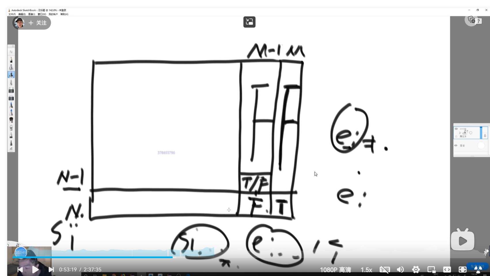
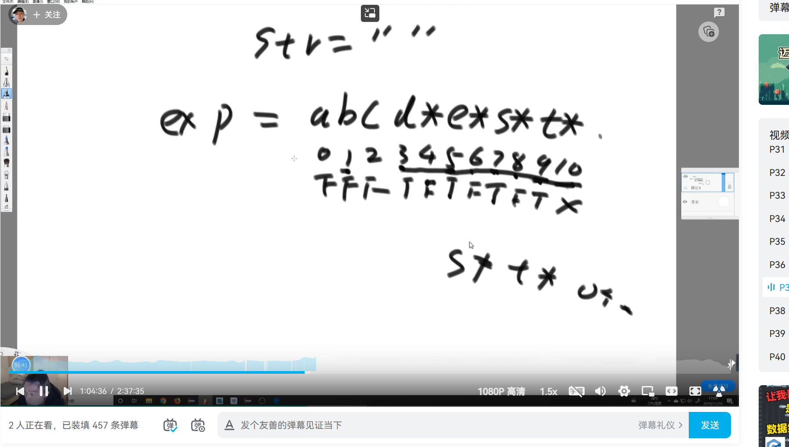

### 题目 1

判定一个由[a-z]字符构成的字符串和一个包含'?'和'\*'通配符的字符串是否匹配。

通配符'?'匹配任意单一字符,'\*'匹配任意多个字符包括 0 个字符。

字符串长度不会超过 100，字符串不为空。

输入描述：

字符串 str 和包含通配符的字符串 pattern。1 <= 字符串长度 <= 100

输出描述：

true 表示匹配，false 表示不匹配

**思路：**

1. process(str, exp, si, ei): boolean，str 表示被匹配的字符串，exp 表示表达式，递归过程表示 exp 从下标 ei 到结束能否匹配 str 从下标 si 到结束位置。
2. 必须保证 ei 位置不能为‘\*’。
3. 可能性一：当 ei+1 位置不为‘\*’时，str[si]必须等于 exp[ei]或 exp[ei]为‘?’，且后续能配上（process(str, exp, si+1, ei+1)为 true）才返回 true。
4. 可能性二：ei+1 为‘\*’；假设当前 str si~ 为 aaaab~，
    1. exp[ei] == 'a' 或者为‘?’，‘a*’尝试变成一个 a、两个 a、三个 a、四个 a，循环 process(str, exp, si+1, ei)。或者‘a*’变成空字符串，尝试 process(str, exp, si, ei+2);
    2. exp[ei] != 'a' 且不为‘?’，从 ei+2 开始尝试 process(str, exp, si, ei+2);

**思路：（改成 DP）**

缺乏 base case，根据依赖位置判断需要初始条件需要哪些，再根据题意自己算出初始条件。

dp 表中需要最后两列和最后一行位置，递归中 base case 只能推出最后一列，所以倒数第二列和最后一行需要根据题意自己算出。

倒数第二列

倒数最后一行，需要满足"...a*b*c*d*"这样的范式才返回 true，从右向左每隔两个判断是不是‘\*’，是填 true，不是前面的都填 false。

    注意 dp 表中任何一个地方，按照我们的递归想法，如过那个位置的 e 的字符是 *, 所以不需要考虑那个位置的 e 的字符是 * 的可能性，因为我们递归的想法是我们不考虑当前 ei 位置是 * 字符，注意那个 isValid 函数和 ei+2, 我们不关心

    就算 dp 表需要会到那些东西，我们递归如果不考虑的话，那就不用担心，因为不会被依赖

### 递归技巧

递归：大问题调用小问题，

大问题做决策 1 调用小问题 1 做决策 2 调用小问题 2 ……

保证大问题做的所有的决策的影响都体现在小问题的参数上

（无后效性的递归）

### 题目二

数组异或和的定义:把数组中所有的数异或起来得到的值给定一个整型数组 arr，其中可能有正、有负、有零，求其中子数组的最大异或和

【举例】

arr = {3}

数组只有 1 个数，所以只有一个子数组，就是这个数组本身，最大异或和为 3

arr = {3, -28, -29, 2}

子数组有很多，但是{-28, -29}这个子数组的异或和为 7，是所有子数组中最大的

**思路 1：暴力解**

1. 遍历数组，尝试以 i 为结尾的子数组的最大异或和。
2. 遍历 0~i-1，尝试以 j 开头 i 结尾的异或和。
3. 遍历 j~i 求出，子数组异或和。
4. 返回最大值。

**思路 2：优化第三重遍历**

$XOR_{j-i}=XOR_{0-i} \;  xor \; XOR_{0-j-1}$

预处理 0~j-1 的异或和数组，并用遍历 sum 记录 0~i 的异或和，省去第三重遍历。

**思路 3：前缀树，优化第二层遍历**
将 0~j-1 的异或和数组，变成前缀树。

贪心策略：先迎合高位

用 0~i 的异或和 sum，采用迎合高位的贪心策略（前缀树从头开始-高位，尽量变成 1，这样异或结果更大；符号位要变成 0），这样就可以获得 0~i 所有可能子数组中异或和最大的一个。
