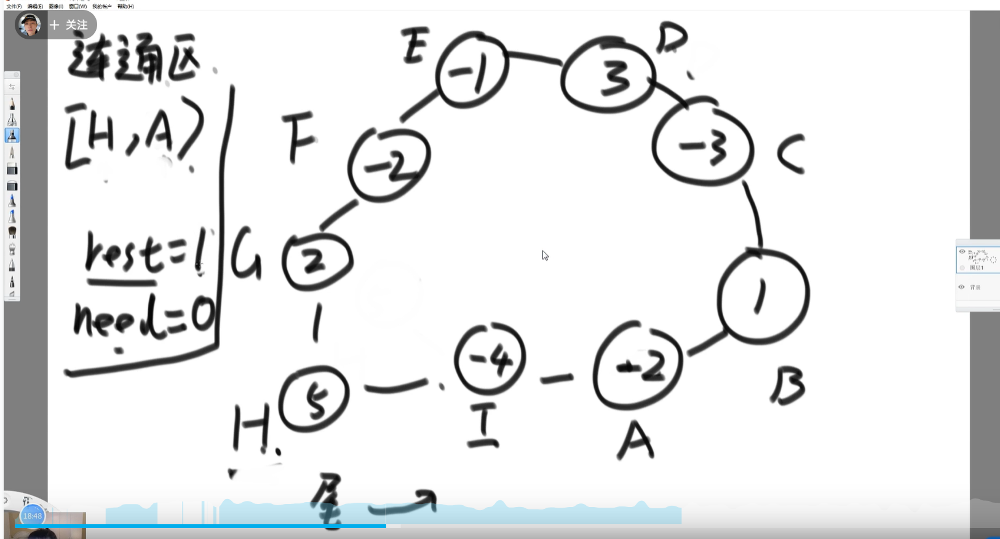
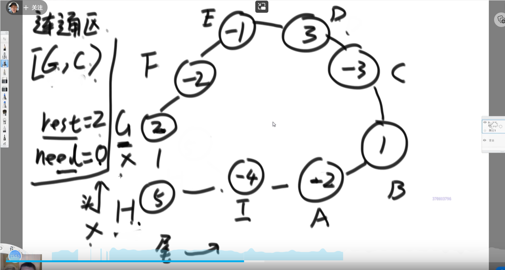
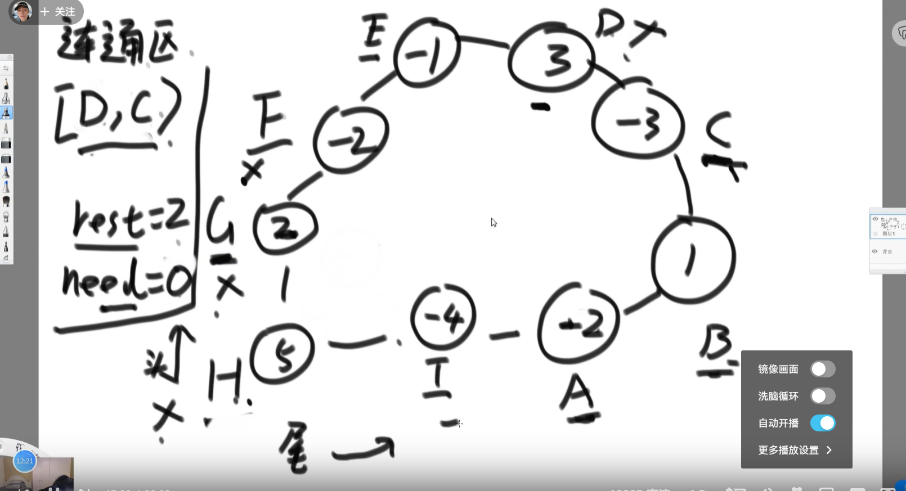

### 题目一(旋变字符串)

一个字符串可以分解成多种二叉树结构。如果str长度为 1，认为不可分解。如果str长度为N(N>1)，左部分长度可以为 1~N-1，剩下的为右部分的长度。左部分和右部分都可以按照同样的逻辑，继续分解。形成的所有结构都是str的二叉树结构。

比如，字符串"abcd"，可以分解成以下五种结构：


任何一个str的二叉树结构中，如果两个节点有共同的父节点，那么这两个节点可以交换位
置，这两个节点叫作一个交换组。

一个结构会有很多交换组，每个交换组都可以选择进行交换或者不交换，最终形成一个新的结构，这个新结构所代表的字符串叫作 str的**旋变字符串**。

比如， 在上面的结构五中，交换组有a和b、ab和c、abc和d。如果让a和b的组交换；让ab和c的组不交换；让abc和d的组交换，形成的结构如图
```
  ____dbac____
 /            \
d           __bac__
           /       \ 
        __ba__      c
       /      \
       b      a
```
这个新结构所代表的字符串为"dbac"，叫作"abcd"的旋变字符串。也就是说，一个字符串str的旋变字符串是非常多的，str 可以形成很多种结构，每一种结构都有很多交换组，每一个交换组都可以选择交换或者不交换，形成的每一个新的字符串都叫 str的旋变字符串。

给定两个字符串str1和str2，判断str2是不是str1的旋变字符串。

**思路：范围上尝试**

1. 过滤器： 字符种类一样，每种字符的个数一样，否则根本不可能是旋变字符串。
2. 范围上尝试str1[L1……]的K段和str2[L2……]的K段是否为旋变字符串。（str1[L1，R1]和str2[L2,R2]两者是否为旋变字符串，有四个可变参数，转为上述尝试自由三个可变参数）
3. 可能性分类：

    str1 ： a1a2a3a4a5

    str2：  b1b2b3b4b5

    K = 1 时候，判断是否相等

    K=5，第一种切法： a1做左部分，a2-a5做右部分

    a1和b1 && a2-a5 和 b2 - b5

    a1和b5 && a2-a5 和 b1 - b4

    俩个有一个成立互为旋变串

    俩都是false

    判断

    a1a2 和 b1b2 && a3-a5 和 b3-b5

    a1a2 和 b4b5 && a3-a5 和 b1- b3

    逐次递归，判断所有可能的第一次分法。

**思路：动态规划**

三维的动态规划表

同一层的位置不依赖

每一层只依赖下方层


### 题目二（滑动窗口）

给定字符串str1和str2，求str1的子串中含有str2所有字符的最小子串长度

【举例】

str1="abcde"，str2="ac" 因为"abc"包含 str2 所有的字符，并且在满足这一条件的str1的所有子串中，"abc"是
最短的，返回3。

str1="12345"，str2="344" 最小包含子串不存在，返回0

**思路：**

举例子：

    str2 = babac

    str1 =aaaabbcacbba  

根据str2记录一个欠债表 {a:2, b:2, c:1}， 总共字符all:5

str1中设立L和R指针，首先R指针向右移动，窗口扩张。遇到欠债表中字符时对应字符词频-1，all-1。当词频小于0时依旧减一但是all不减。

当all为0时，表明在L~R窗口中包含子串，然后停止R指针移动，L右移窗口缩，对应欠债表中记录增加，当词频大于0时表明当前窗口不包含子串，窗口停止缩，R指针移动。周而复始

### 题目三(LFU缓存替换算法)

一个缓存结构需要实现如下功能
```
void set(int key, int value)：加入或修改key对应的value
int get(int key)：查询key对应的value值
```
但是缓存中最多放K条记录，如果新的第K+1条记录要加入，就需要根据策略删掉一条记录，然后才能把新记录加入。

这个策略为：在缓存结构的K条记录中，哪一个key从进入缓存结构的时刻开始，被调用set或者get的次数最少，就删掉这个key的记录；如果调用次数最少的key有多个，上次调用发生最早的key被删除。这就是**LFU缓存替换算法**。实现这个结构，K作为参数给出。


**思路：**

我们有个桶，每个桶存那个词频出现的数据，比如说 A 出现一次我们把 A 和他的 value 包装成一个节点放进桶里面，之后要有其他节点也是词频 1 次，我们也存进去，只不过此时是双向链表结构
image-20220519164657535

这个桶记录着当前存着的双向链表的头和尾

我们还有个 map,key 比如说可以是 “A”,value 是那个 A 和他的 value 包装成的节点，我们可以获取到那个节点，然后获取到真正的 value (*这种用 map 让你 value 指向其他的结构中的存在的地址等这种操作很重要的！！！*)
比如上面我们可以用这个 map 找 B 的节点，hence 他的 value. 而不是需要去遍历那个双向链表

这么做之后要是有比如说词频为 2 的，我们需要给那个建个桶，然后让这个桶跟我们的第一个桶本身之前双向链表连接


每个桶是双向链表结构，每个桶里面的节点也是双向链表结构.

这么做的好处就是每次操作就是 O (1) 的，我们可以通过 map 快速获取到一个节点，然后检查当前有没有比他本身原来词频数大 1 的桶来装此时操作完的这个节点，如果没有就新建，如果有就加进去那里面的双向链表，还有如果当前存在的桶没有节点了，那就销毁。这些操作都是 O (1) 的

如果想要总共存满了，想要 add 新的数据，那么需要替换掉词频最小的，要是词频都一样的话那就替换时间最早的. 这不就是让当前头桶的_头_节点去除掉，然后把当前加的节点放进正确地方去吗

### 题目四

N个加油站组成一个环形，给定两个长度都是N的非负数组 oil和dis(N>1)，oil[i]代表第i个加油站存的油可以跑多少千米，dis[i]代表第i个加油站到环中下一个加油站相隔多少千米。

假设你有一辆油箱足够大的车，初始时车里没有油。如果车从第i个加油站出发，最终可以回到这个加油站，那么第i个加油站就算良好出发点，否则就不算。

请返回长度为N的boolean型数组res，res[i]代表第 i 个加油站是不是良好出发点

**思路：**

首先把油数组减去距离数组，获取每一个点出发，自己的油减去距离下一站的距离到了那个站之后剩下的多少油，这个数组叫做纯能数组
这么做我们就可以把问题变成沿途累加和是否小于 0
比如说我们获取到了


此时我们可以比如说

0 号位置出发，一开始就是 - 1, 所以不可能
1 号位置出发，一开始就是 1, 到下一站 - 2, 去和的结果变成 - 1, 所以不可能
2 号位置出发，一开始就是 - 2, 所以不可能
3 号位置出发，一开始 2, 下一站 3, 下一站 2, 下一站 3, 下一站 1 回到了出发点，所以可以，这个为 true
4 号位置出发，一开始 1, 下一站 0, 下一站 1, 下一站 - 1, 所以不可能
但是我们这么做每个节点都尝试出发，那就是 O (N2) 方法，如何做到 O (N)?


一开始选一个可能成功的点出发 (所以必不能是负数，如果都是负数那就都不可能直接返回), 例子选择 H 作为出发点

联通区代表，左闭右开，一开始是 [H,I), 左闭右开是因为一开始此时 H 只能到得了 H (还没走 yet)
rest 表示通过了联通区后，我们还剩多少油
need 代表如果当前的节点要接到联通区的头上，需要至少多少油，现在一开始我们就在 H 所以我们并不需要就等于 0
接着我们尝试往逆时针方向扩，此时和为 5-4=1, 可以扩，所以我们此时


此时再扩发现不行了，1-2=-1, 是负数，所以 H 不是良好的出发点，我们需要来到 H 的逆时针方向，也就是 G 点，我们尝试让他变成联通区存的头，因为 G 点是 2, 所以 need 还是 0 (只要那个变成头的节点存的不是负数那么 need 就是 0),rest 值也变了，此时就变成了



注意原本区域结尾什么的都还没变，我们还没扩到 A, 左闭右开！

接着我们尝试尾巴让下扩，发现 ok,rest 还是正数

就各种扩等等等… 直到



此时尝试扩 C 发现不行就知道 G 不是良好出发点，我们需要再次让头部变成左边的，也就是 F 点.

但是 F 不满足接到联通区头部的要求，因为他是负数，直接标记 F 为不良好出发点，然后 need 变成 2!!!

这个代表以后的节点想接到联通区的头部要求增加了，以为他要连 F, 然后 F 是 - 2, 你新头部需要承担 F 的这个负的代价，继续往左边扩，发现 E 也是 - 1, 不符合，标记不良好，然后 need 变成 - 3, 继续… 来到 D,D 满足要求，此时 need3-3=0,rest 保持不变因为 D 已经把他那个 3 给支付掉了作为 F 和 E 的代价，所以无法给到尾部用来扩。此时头部更新好了，尾部继续扩…



这个例子中哦我们最后头来到了 D 然后尾尝试扩到 C 但是失败，我们扩头也会碰到 C, 这个情况的话，就不需要再继续验了，C 和 B 和 A 和 I 肯定都是不良好的出发节点

证明:

https://www.bilibili.com/video/BV1W3411W7yi?p=50 [18:00 左右]

上面例子是都是不良好出发点，另外一个例子:


这个例子我们发现 H 是良好出发点，可以转一圈

我们接着就用他结束之后剩下的哪个 need 的值 (因为 H 是转了一圈的，良好出发点，所以 need 应该是 0), 我们接着就忘他左边去看，能不能接上那个 H 的头，只要他能接上头，那么那个也是个良好的出发点，最后联通区就是 [H,H)

不用关心尾了，只要能接上头就是良好出发点，能接上头到哪里都行

G 是 - 1, 不行，need 变成 1

F 导致 need 变成 0, 可以

E 导致 need 变成 - 1, 不可以

D 导致 need 变成 - 2, 不可以

C 导致 need 变成 0, 可以

B 导致 need 变成 - 4, 不可以

A 导致 need 变成 - 1, 不可以

当然要是这期间遇上之前我们一开始再找良好出发点的时候已经被标记为不良好出发点那就不用管了，直接设置完事

所以这个只是转了这个圈一圈，必然是 O (N)