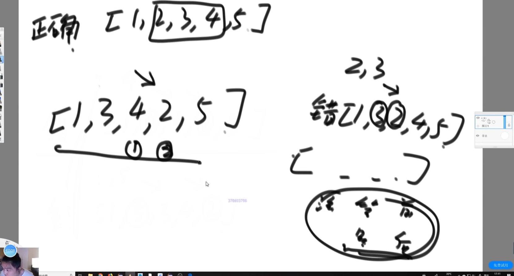
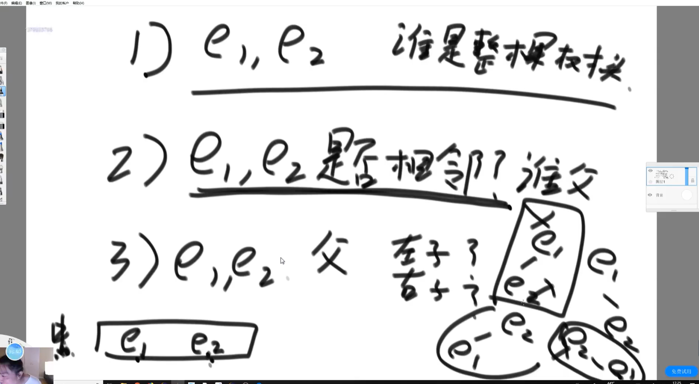
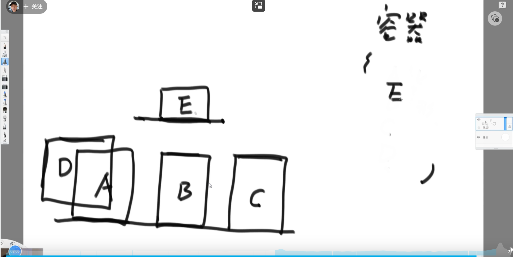
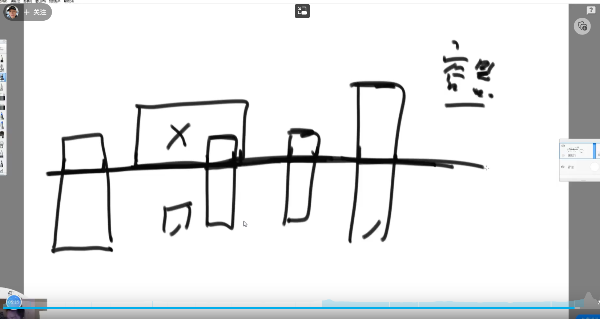

### 题目一

一棵二叉树原本是搜索二叉树，但是其中有两个节点调换了位置，使得这棵二叉树不再是搜索二叉树，请找到这两个错误节点并返回。

已知二叉树中所有节点的值都不一样，给定二叉树的头节点 head，返回一个长度为2的二叉树节点类型的数组errs，errs[0]表示一个错误节点， errs[1]表示另一个错误节点。

进阶:

如果在原问题中得到了这两个错误节点，我们当然可以通过交换两个节点的节点值的方式让整棵二叉树重新成为搜索二叉树。

但现在要求你不能这么做，而是在结构上完全交换两个节点的位置，请实现调整的函数。

**思路：**

正确的搜索二叉树中序遍历是严格升序的。中序遍历判断是否有降序的情况。

第一次降序的前一个节点和最后一次降序的后一个节点为错误节点。

有可能只有一次降序但是存在三个错误节点，所以找到两个错误节点后交换两者的位置，再产看是否还有降序。

**进阶：**
找到错误的节点后，不可直接交换值

考虑多种情况（14种）

### 题目二

平面内有n个矩形, 第i个矩形的左下角坐标为(x1[i], y1[i]), 右上角坐标为(x2[i],y2[i])。如果两个或者多个矩形有公共区域则认为它们是相互重叠的(不考虑边界和角落)。请你计算出平面内重叠矩形数量最多的地方,有多少个矩形相互重叠。

**思路：**

#### 首先需要了解线段问题
把开始位置排序

接着把数据放入有序表， 有序表按照结尾排序！！！
首先是 1 到 9, 需要把有序表所有小于或者等于 1 的数字丢出去 (没有扔，因为没有数), 然后放入 9, 此时有序表有一个数，就是处理 1 到 9 这个线段的答案，也就是 1

然后是 2 到 5, 需要把有序表所有小于或者等于 2 的数字丢出去 (没有扔，因为就一个 9), 然后放入 5, 此时有序表有两个数，就是处理 2 到 5 这个线段的答案，也就是 2

然后是 2 到 4, 需要把有序表所有小于或者等于 2 的数字丢出去 (没有扔，因为 9,5 都比 2 大), 然后放入 4, 此时有序表有三个数，就是处理 2 到 4 这个线段的答案，也就是 3

然后是 3 到 10, 需要把有序表所有小于或者等于 3 的数字丢出去 (没有扔，因为 9,5,4 都比 3 大), 然后放入 10, 此时有序表有四个数，就是处理 3 到 10 这个线段的答案，也就是 4 (最终答案)

然后是 6 到 8, 需要把有序表所有小于或者等于 6 的数字丢出去 (扔掉了 4 和 5), 然后放入 8, 此时有序表有三个数，就是处理 6 到 8 这个线段的答案，也就是 3

每个线段都有一个答案，最大的答案就是我们需要的答案

每个线段的答案的含义是我们重合区域必须以那个线段开头 (比如说 1 到 10 就是必须以 1 开头) 开头的情况下，我们目前处理完了的这些线段来说，最多盖几块

如果有 N 个线段，处理每一个线段代价 O (logN)<- 有序表的增删改查

所以解法总共是 O (NlogN)

#### 矩阵问题继续解答
任何重叠的区域一定是某一个矩形的底

所以我们可以首先把所有矩形按照矩形底边排序
先处理在最下面的矩形，往上一个一个处理
我们记录所有在当前矩形底部的一整个横线上
然后对于其他所有加的矩阵我们首先需要看谁的上边还没比到我们当前要加的低边高的矩阵，我们要把他们把那些从容器中都移出

这样对于每一个矩阵我们知道一共有多少个矩阵上面比当前矩阵底部高且比底部当前矩阵底部底

然后我们可以取出那些矩阵的 x 宽度，这些宽度相当于就是一个个线段，这样矩阵的问题被我们变成了一维线段问题，调用上面我们说的那个算法原型 (线段问题), 最后答案就出来了